# 探索移动平均线以在 Python 中构建趋势跟踪策略

> 原文：<https://towardsdatascience.com/exploring-moving-averages-to-build-trend-following-strategies-in-python-bd17595e3498?source=collection_archive---------9----------------------->

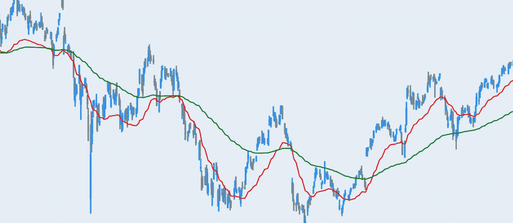

使用 Plotly 在 Python 中生成

## 移动平均线能提高投资组合相对于基准的表现吗？

“低买高卖”是金融界每个人都想实现的共同目标。然而，这比看起来更困难，因为我们不知道顶部或底部在哪里。我们只知道我们现在在哪里，以及我们去过哪里。许多投资者坐着等待下一次衰退，以获得一个良好的进场点，错过了牛市带来的巨大回报，而那些坐在指数中的投资者获得了牛市的好处，但也面临着熊市的严峻现实。

跟随趋势比预测顶部和底部更容易。因此，在这篇文章中，我们将介绍一些跟踪市场趋势的基本方法，并试图在牛市和熊市中获得稳定的回报。

# 简单移动平均线


100 天简单移动平均线

简单移动平均(SMA)是一种平滑函数，用于计算过去观察值的平均值。这是一个常用的技术指标，用来表示价格反转。

如果我们有 1000 天的每日定价数据，则 100 天移动平均值的计算方法是平均前 100 天，然后通过一次移动一天的范围，一次平均 100 天。

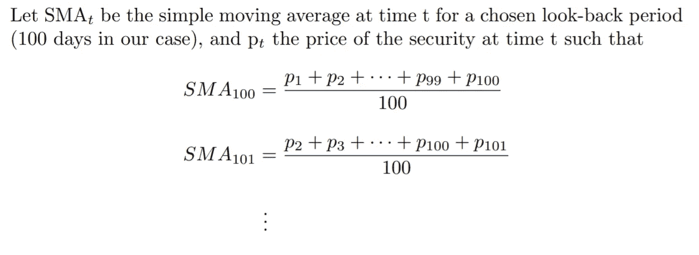

用乳胶写的

简单的基于移动平均线的策略是利用资产价格和移动平均线之间的关系来捕捉趋势。我们将使用价格和移动平均线的交叉点来确定我们的位置。

# 导入数据

我们可以从雅虎财经等网站下载数据，并将其加载到数据框架中，或者使用 API 直接从外部服务器读取数据到 Python 内存中。

```
import pandas as pd
df = pd.read_csv("your_data.csv")
```

Quandl 是一个在线金融数据数据库，有一个免费账户和一个付费账户。非用户的请求数量是有限的，而用户每 10 秒钟可以获得 300 个呼叫。基本使用绰绰有余。

我们使用我们最喜欢的股票 choice Apple，并下载 2009 年至 2018 年期间的价格数据。

```
myquandlkey = "myquandlkey"
import quandlaapl = quandl.get("WIKI/AAPL", start_date="2009-01-01", 
                  end_date="2018-12-31", api_key=myquandlkey)
```

另一个流行的选择是 pandas_datareader，这是这次将使用的一个。

```
import pandas_datareader as web
aapl = web.get_data_yahoo('AAPL', 
                          start=datetime.datetime(2009, 1, 1), 
                          end=datetime.datetime(2018, 12, 31))
```

# 数据准备

导入数据后，让我们看一下数据框，检查一下是否一切正常

```
aapl.head()
```

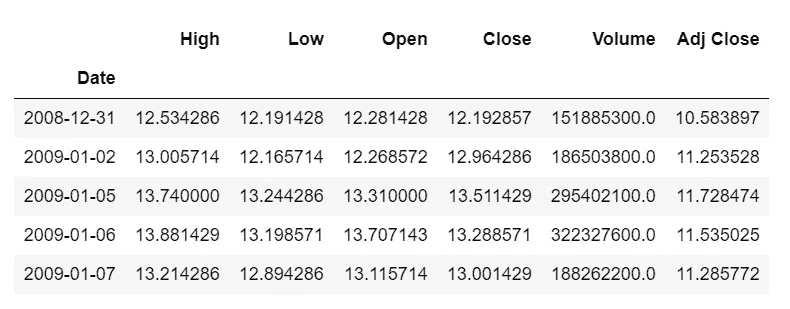

现在，只保持调整后的收盘，但在进一步的分析中可以有趣地看看成交量。删除第一行，因为我们不小心包括了 2008 年的除夕。

```
# New DataFrame only containing the Adj Close column
aapl = aapl[["Adj Close"]]# Rename the adjusted close column to Price
aapl.rename(columns={"Adj Close":"Price"}, inplace=True)# Remove the first row,
aapl = aapl.iloc[1:]aapl.head()
```

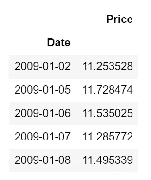

使用 pandas rolling 函数计算移动平均值，并将结果作为新列添加到 DataFrame 中。

```
aapl["100MA"] = aapl["Price"].rolling(window=100).mean()
aapl
```


前 99 个移动平均值显示为 NaN。这是因为我们需要前 100 个价格观察值来计算 MA。

# 绘制价格和移动平均线

```
# import plotting packages
import matplotlib.pyplot as plt
import matplotlib as mpl# Set color style
plt.style.use('seaborn-dark')
plt.style.use("tableau-colorblind10")fig = plt.figure(figsize=(20,12))
ax1 = plt.plot(aapl["Adj Close"])
ax1 = plt.plot(aapl["100MA"])
ax1 = plt.title("Apple daily ajusted close from 2009 through 2018", fontsize=22)
ax1 = plt.xlabel("Date", fontsize=18)
ax1 = plt.ylabel("Price", fontsize=18)
ax1 = plt.legend(["Price", "100 day SMA"],prop={"size":20}, loc="upper left")
plt.grid(True)
plt.show()
```

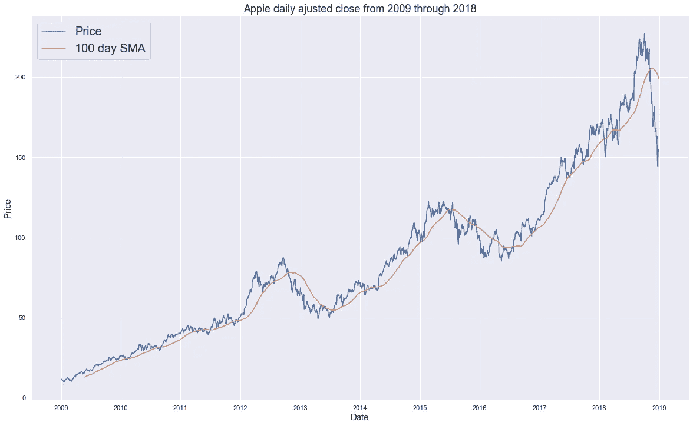

100 日均线是一种通过平滑价格来观察价格趋势的方法。由于它是一个滞后指标，它告诉我们过去发生了什么，尽管看一看它很有趣，但它本身可能不是一个好的策略。让我们探索一下，看看结果。

# 战略和实施

我们将使用两种不同的策略

1.  当价格超过移动平均线时买入，当价格低于移动平均线时卖空。
2.  作为一种替代方案，我们可以用现金头寸代替空头头寸，使策略只做多。

我们可以通过持有债券等低风险证券而不是现金来改进策略 2，波动性略有增加，但为了简单起见，现在现金为王。

我们希望在资产趋势上升时搭上顺风车，获得类似的回报。当它趋势向下时，选择卖出等待，或者卖空以从下跌中获利。

像这样一个简单的策略可能会有几个问题。如果趋势没有表现出来，而是给出了一个假阳性，我们的策略可能会以错误的方向买入或卖出而告终，从而亏损。短时间内的大量交叉会堆积交易成本。解决这个问题的方法是在交易前设定价格和移动平均线之间的最小距离，这可以在以后进一步探讨。

让我们按照策略 1 创建一个包含“Long”或“Short”的新列。

```
Position = []
for i in range(0,apple.shape[0]):
    if apple[“Adj Close”].iloc[i] > apple[“100MA”].iloc[i]:
        Position.append(“Long”)
    else:
        Position.append(“Short”)apple[“Position”] = Position
apple.head()
```


创建价格回报的新列，并将其添加到数据框架中

```
apple[“return”] = (apple[“Adj Close”] — apple[“Adj Close”].shift())/apple[“Adj Close”].shift()# The first return is defined from the 2\. row, so drop the first
apple.dropna(inplace=True)
apple.head()
```

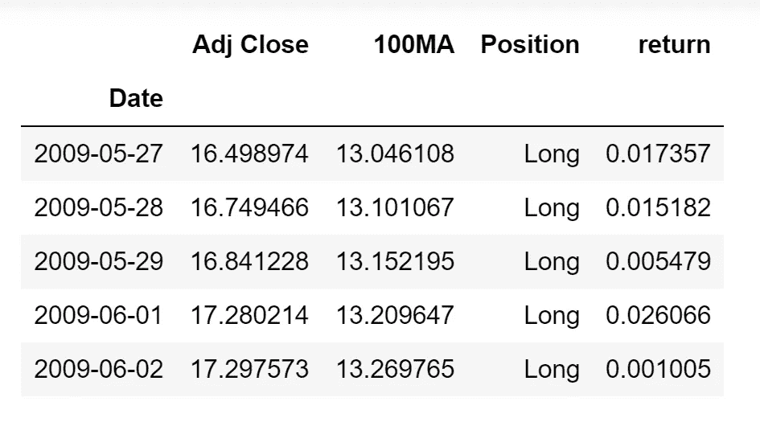

在第一天，设定每种策略的价值等于苹果的价格，这样就很容易比较策略的价值如何与苹果的价格相比较。将价格与移动平均线进行比较，建立“多头”或“空头”头寸。第 1 天的回报将使用第 0 天的百分比变化来设置。我们还不能建仓，因为我们只有每日收盘，需要等到明天。

在第 2 天，我们根据第 1 天的头寸做多或做空，因为我们没有增加或删除第 1 天到第 2 天的任何值，策略将具有与第 1 天相同的值。

在第 3 天，我们乘以收益，或者从第 2 天到第 3 天苹果价格的变化，这是第 nr 行的收益。3、按每种策略。

编辑:请记住，长期持有策略是持有现金的策略 2。更好的名字应该是朗凯什。

```
LongShort = [0]*apple.shape[0]
LongHold = [0]*apple.shape[0]LongShort[0] = apple[“Adj Close”].iloc[0]
LongShort[1] = apple[“Adj Close”].iloc[0]
LongHold[0] = apple[“Adj Close”].iloc[0] 
LongHold[1] = apple[“Adj Close”].iloc[0]for i in range(0, apple.shape[0]-2):
    if apple[“Position”].iloc[i] == “Long”:
    LongShort[i+2] = LongShort[i+1]*(1+apple[“return”][i+2])
    else:
        LongShort[i+2] = LongShort[i+1]/(1+apple[“return”][i+2])

for i in range(0, apple.shape[0]-2):
    if apple[“Position”].iloc[i] == “Long”:
        LongHold[i+2] = LongHold[i+1]*(1+apple[“return”][i+2])
    else:
        LongHold[i+2] = LongHold[i+1]apple[“LongShort”] = LongShort
apple[“LongHold”] = LongHold
apple.drop(apple.tail(1).index,inplace=True)
apple.head()
```

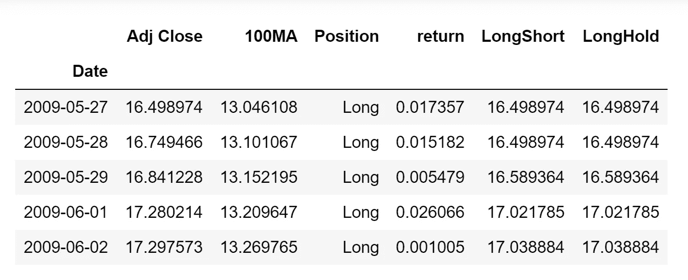

现在把策略和 100 天的 SMA 画在一起

```
fig = plt.figure(figsize=(20,12))
ax1 = plt.plot(apple[“Adj Close”])
ax1 = plt.plot(apple[“100MA”])
ax1 = plt.plot(apple[“LongShort”], color=”green”)
ax1 = plt.plot(apple[“LongHold”], color=”brown”)
ax1 = plt.title(“Apple daily ajusted close and strategy from 2009 through 2018”, fontsize=18)
ax1 = plt.xlabel(“Date”, fontsize=18)
ax1 = plt.ylabel(“Price”, fontsize=18)
ax1 = plt.legend([“Price”, “100 day SMA”, “SMA crossover long/short strategy”,
 “SMA crossover long/cash strategy”],prop={“size”:22}, loc=”upper left”)
plt.grid(True)
plt.show()
```


在过去的 10 年里，苹果经历了非常健康的增长。因为 SMA 是滞后的，所以空头最终会伤害我们。导致 SMA 交叉的轻微下跌很快变成急剧上涨，而 SMA 图形没有足够快地跟上，当资产价格上涨时，我们做空。可以看出，多空策略被价格过程碾压，而多空/持有策略停留在中间。

2012/2013 年，做空策略发挥了作用，在苹果价格下跌时增加了价值。价格平稳，容易体现趋势。在 2015/2016 年，该战略效果不佳。价格趋势本身并不明显，表现出高度的波动性。

# 指数移动平均线

代替 SMA，更合适的加权函数将给予更近的观察更高的投票。这种方法的一个流行版本是指数移动平均线(EMA)，它使用指数衰减权重。因为旧的观察很少有发言权，我们可以使用整个数据集作为回望期来计算均线。

该公式由下式给出


用乳胶写的

使用与前面相同的策略实施 EMA。简单地用均线而不是均线来比较价格。

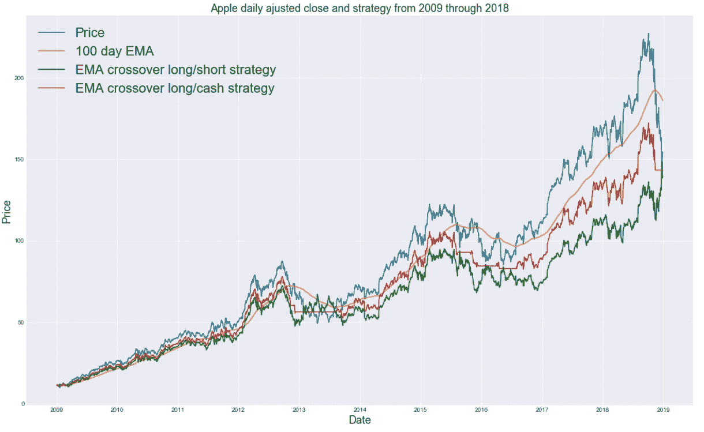

至少对苹果来说，均线表现比均线好。这可能是因为它对资产价格的突然变化反应更快。仅仅持有这种资产仍然不会表现过度。

# MACD

我们可以不用单一的均线，而是比较两个不同时间段的均线之间的关系。这就是所谓的移动平均收敛发散，或 MACD。

假设是根据 MACD 指标捕捉到的趋势买入或卖出资产。当短期移动平均超过长期移动平均时，我们做多，当长期移动平均超过短期移动平均时，我们做空。在这个分析中，我使用了 21 日均线和 126 日均线，代表一个月和六个月的交易日。由于回溯测试是在一个很长的时间范围内进行的，我尽量避免使用太短的回溯期。要写代码，计算 26 和 126 日均线，比较它们而不是和均线比较价格。

类似于均线，我们画出图来看结果

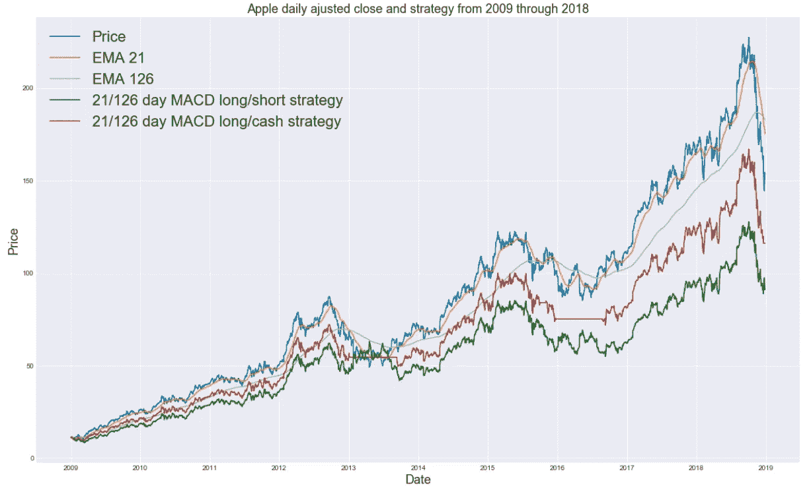

MACD 的这个特殊版本在这个数据上表现不佳。我们将很快研究各种数据集和时间框架上的所有策略，看看它们在不同情况下的表现。

# 结合一切

为了从上面的分析中进行归纳，我使用了函数来更容易地选择我们想要分析的数据，以及我们想要包含的模型。

我还加入了一个汇总统计脚本，以查看每个策略在最大提款、夏普、波动性和年化回报 VaR 等方面的表现。

现在编写一个将使用上述函数的主函数，以及一个绘制结果的函数。

让我们运行主函数 strategy()和绘图函数 plot_strategy()，并显示汇总统计表。我们计算并绘制 3 毫安变化以及所有的多头/空头和多头/持有。

# 2 个牛市案例

*   苹果从 2009 年到 2018 年，和之前一样
*   同一时期的标准普尔 500

```
start = datetime.date(2009, 1, 1)
end = datetime.date(2018, 12, 31)
ticker = “AAPL”
days = 100df, table, df_return_of_strategy, df_positions, df_price_of_strategy = strategy(ticker, start, end, days=days, MA=True, EMA=True, MACD=True, LongHold=True, LongShort=True)plot_strategy(ticker=ticker, start=str(start), end=str(end), df=df_price_of_strategy)
table
```

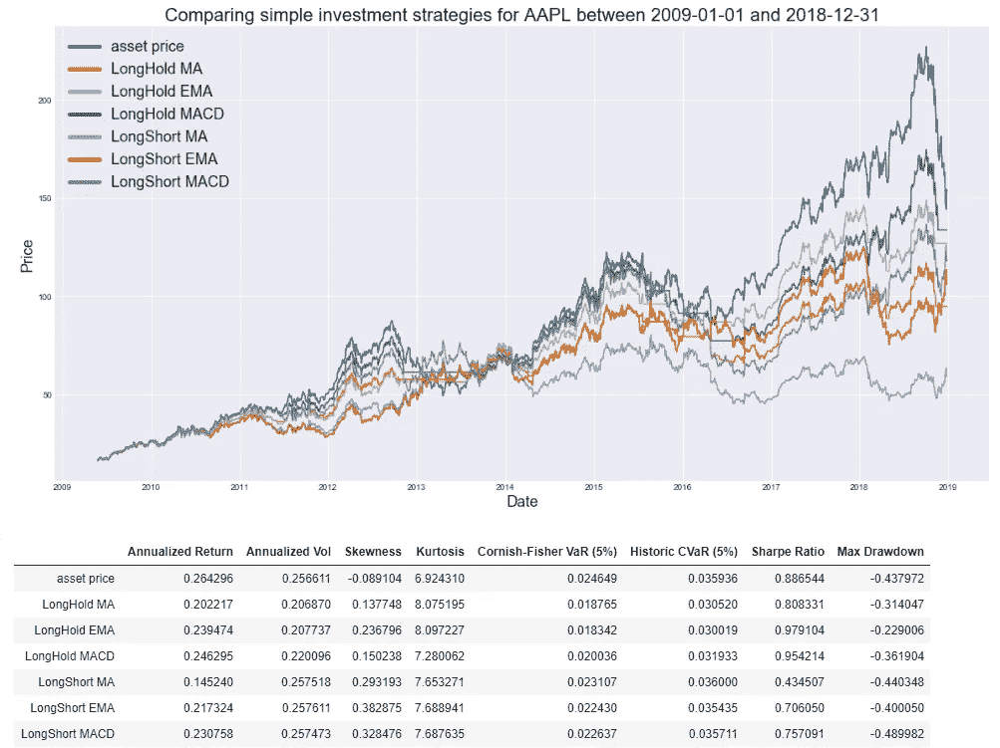

移动平均线策略在牛市中表现不佳。在市场上涨的时候做空，同时还能产生超额回报，这很难。正如我们所预期的那样，最大提款和波动性在现金投资组合中是最低的，这实际上给了苹果比在该期间持有股票更高的夏普比率。让我们来看看两次市场崩盘，分别发生在下跌前和下跌中。

# 3 熊案例

*   标准普尔 500 从 2006 年到 2010 年，“全球金融危机”
*   纳斯达克综合指数从 1998 年到 2001 年，“科技泡沫”
*   20 世纪 90 年代的日经 225 指数，“失去的十年”

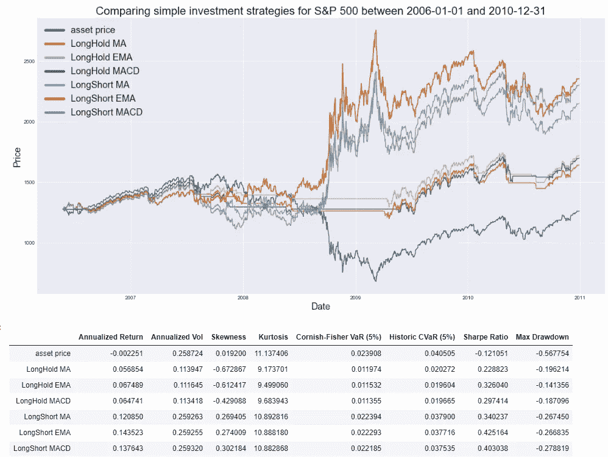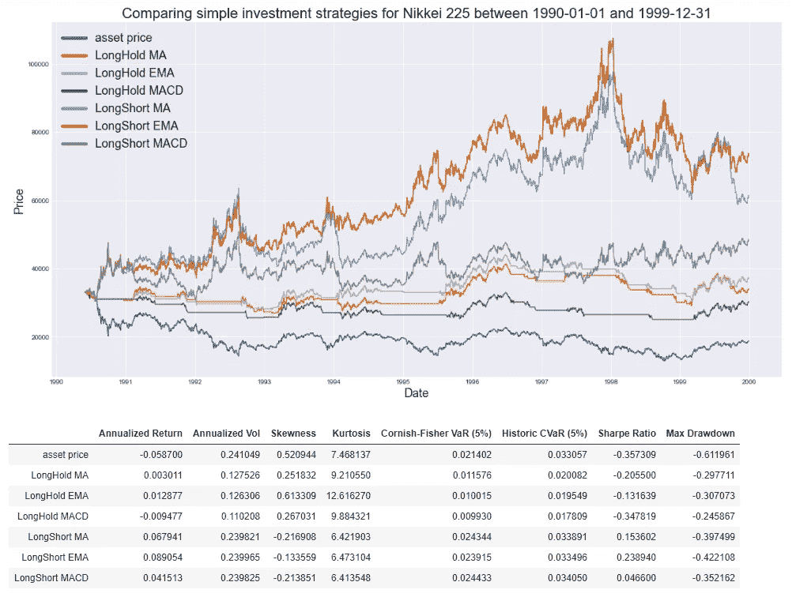

在熊市期间做空会产生好的结果，这并不奇怪，但我们在顶部之前很久就建仓了，这不会在上涨期间损害太多的回报。然而，在下跌过程中，空头头寸受益匪浅。这种策略的一个缺点是我们无法察觉价格的突然下跌。在 1987 年的“黑色星期五”，道琼斯工业平均指数下跌了 22.6%，标准普尔 500 下跌了 18%。这些策略不能保护我们免受这种跌倒，应该与其他方法结合使用。

# 2 横向资产

*   通用汽车从 2014 年到 2019 年
*   从 2002 年到 2017 年的微软

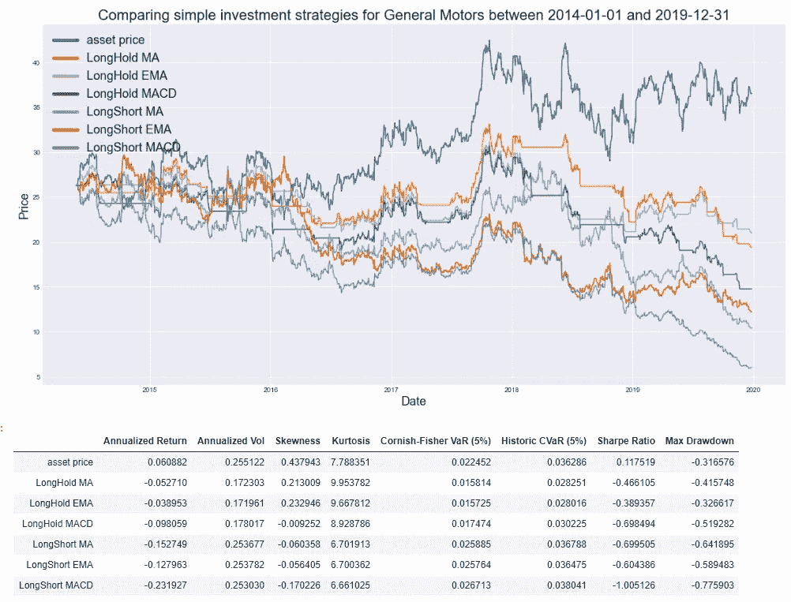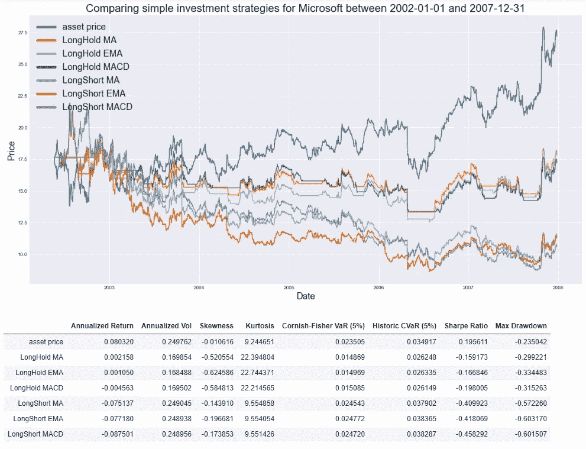

横盘从来不代表趋势，当落后的 MA 赶上价格时，已经太晚了。趋势太短，这表明较短的均线可能是更好的选择。需要注意的一点是，除了最后一张图，所有均线都有更高的回报，波动性相似或更低。这个版本的 MACD 不能给出很好的结果，尽管最常见的版本快速均线用 12 天，慢速均线用 26 天。

# 结论和进一步的工作

趋势跟踪的移动平均交叉策略是一种众所周知的简单方法，在测试期间和使用的数据中，在熊市中比牛市中表现更好。尽管高度不稳定和停滞的市场会损害其质量。

我们做了几个假设。没有滑点或交易费用。我们只使用调整后的每日收盘，并且只能在那时进行交易。我们不考虑分红或做空限制。

我们每天重新平衡，这对于一些必须转移大量资金的基金来说并不总是可行的。他们可能来不及参加聚会了。我们也简单地根据交叉来买卖，不考虑价格和 MA 在背离之前的高振荡。

为了进一步分析，比较各种具有相反行为的资产类别是很有趣的，例如，高波动性对低波动性。每天运行一组资产，查看价格和 MA 之间的百分比距离，看看交易那些距离较大的资产是否可以减少误报的数量，并更好地捕捉更可靠的趋势，这将是很有趣的。

使用适当的时间序列交叉验证方法进行更严格的回溯测试也是有用的。模型的稳定性非常重要。如果我们改变了一些参数，结果发生了巨大的变化，我们应该放弃这个模型，重新开始。回溯测试并不能证明什么，但是使用交叉验证和限制前瞻偏差可以提高我们的信心。

**免责声明:** *如果您发现任何错误，请告诉我。另外，请注意，这只是对一些历史数据的一些方法的探索。过去的表现不能保证未来的结果。*

**更新(19/02/2020):** *这是一个重写的版本。我已经修改了第一版的一个计算错误。*

**Github 库:**

[https://github.com/RunarOesthaug/MA-crossover_strategies](https://github.com/RunarOesthaug/MA-crossover_strategies)

感谢阅读！

***来自《走向数据科学》编辑的提示:*** *虽然我们允许独立作者根据我们的* [*规则和指导方针*](/questions-96667b06af5) *发表文章，但我们并不认可每个作者的贡献。你不应该在没有寻求专业建议的情况下依赖一个作者的作品。详见我们的* [*读者术语*](/readers-terms-b5d780a700a4) *。*