# 在 Python 中探索网飞数据

> 原文：<https://towardsdatascience.com/exploring-netflix-data-in-python-eb03e8f3944c?source=collection_archive---------13----------------------->

## 网飞数据的探索性数据分析


[来源](https://unsplash.com/photos/11SgH7U6TmI)

[Flixable](https://flixable.com/) 是一个视频流媒体服务搜索引擎，提供网飞电影和节目的完整列表。搜索引擎发布了*网飞电影和电视节目*数据集，其中包括 2019 年可用的电影和节目的完整列表。

在本帖中，我们将对*网飞电影和电视节目*数据集进行探索性数据分析。数据可以在[这里](https://www.kaggle.com/shivamb/netflix-shows)找到。

我们开始吧！

首先，让我们导入 Pandas 并将数据读入数据框:

```
import pandas as pd 
df = pd.read_csv("netflix_titles.csv")
```

接下来，让我们打印列的列表:

```
print(list(df.columns))
```

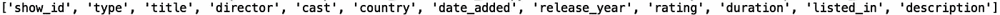

我们还可以看看数据中的行数:

```
print("Number of rows: ", len(df))
```

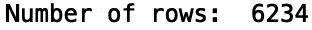

让我们打印前五行数据:

```
print(df.head())
```


我们可以看到有几个分类列。让我们定义一个将数据框、列名和限制作为输入的函数。当被调用时，它打印分类值的字典以及它们出现的频率:

```
def return_counter(data_frame, column_name, limit):
   from collections import Counter    print(dict(Counter(data_frame[column_name].values).most_common(limit)))
```

让我们将函数应用于“国家”列，并将结果限制为五个最常见的值:

```
return_counter(df, 'country', 5)
```

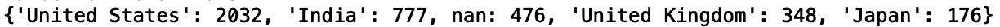

如我们所见，美国有 2，032 个标题，印度有 777 个，缺少 476 个国家值，英国有 348 个，日本有 176 个。

让我们将函数应用于“director”列，删除缺失的值:

```
df['director'].dropna(inplace = True)
return_counter(df, 'director', 5)
```

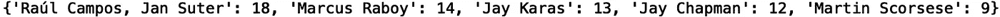

现在，让我们看看最常见的导演“劳尔·坎波斯”和“扬·苏特”的片名:

```
df_d1 = df[df['director'] =='Raúl Campos, Jan Suter']
print(set(df_d1['title']))
```

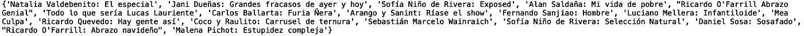

和国家:

```
print(set(df_d1['country']))
```

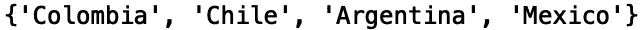

我们看到这些头衔来自哥伦比亚、智利、阿根廷和墨西哥。让我们为马库斯·雷波依做同样的事情:

```
df_d2 = df[df['director'] =='Marcus Raboy']
print(set(df_d2['title']))
```

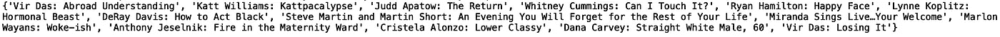

现在我们来分析电影时长。首先，我们需要过滤数据集，只包括电影标题:

```
df = df[df['type'] =='Movie']
```

接下来，让我们打印一组电影时长:

```
print(set(df['duration']))
```

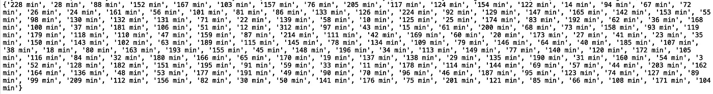

我们看到所有的值都以字符串的形式报告，持续时间以分钟为单位。让我们从字符串值中删除“min ”,并将结果转换为整数:

```
df['duration'] = df['duration'].map(lambda x: x.rstrip('min')).astype(int)
print(set(df['duration']))
```

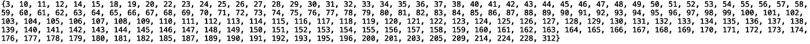

接下来，从像“持续时间”这样的数字列中生成汇总统计数据会很有用。让我们定义一个采用数据框、分类列和数字列的函数。每个类别的数字列的平均值和标准偏差存储在数据框中，并且数据框根据平均值以降序排序。如果您想要快速查看特定类别对于特定数字列是否具有更高或更低的平均值和/或标准偏差值，这将非常有用。

```
def return_statistics(data_frame, categorical_column, numerical_column):
    mean = []
    std = []
    field = []
    for i in set(list(data_frame[categorical_column].values)):
        new_data = data_frame[data_frame[categorical_column] == i]
        field.append(i)
        mean.append(new_data[numerical_column].mean())
        std.append(new_data[numerical_column].std())
    df = pd.DataFrame({'{}'.format(categorical_column): field, 'mean {}'.format(numerical_column): mean, 'std in {}'.format(numerical_column): std})
    df.sort_values('mean {}'.format(numerical_column), inplace = True, ascending = False)
    df.dropna(inplace = True)
    return df
```

让我们用分类列‘listed _ in’和数字列‘duration’来调用我们的函数:

```
stats = return_statistics(df, 'listed_in', 'duration')
print(stats.head(15))
```

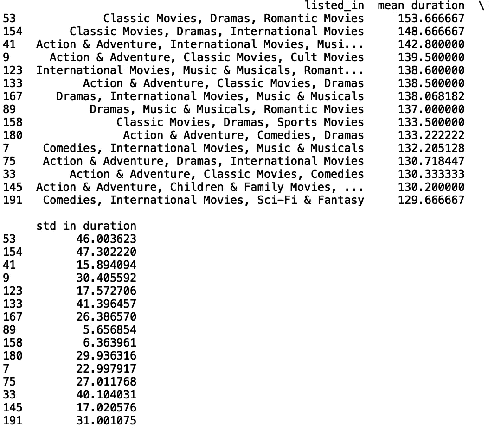

接下来，我们将使用箱线图来显示基于最小值、最大值、中值、第一个四分位数和第三个四分位数的数值分布。如果您对它们不熟悉，可以看看文章[了解 Boxplots](/understanding-boxplots-5e2df7bcbd51) 。

与汇总统计函数类似，此函数采用数据框、分类列和数值列，并根据限制显示最常见类别的箱线图:

```
def get_boxplot_of_categories(data_frame, categorical_column, numerical_column, limit):
    import seaborn as sns
    from collections import Counter
    keys = []
    for i in dict(Counter(df[categorical_column].values).most_common(limit)):
        keys.append(i)
    print(keys)
    df_new = df[df[categorical_column].isin(keys)]
    sns.set()
    sns.boxplot(x = df_new[categorical_column], y =      df_new[numerical_column])
```

让我们为 5 个最常见的“列出”类别中的“持续时间”生成箱线图:

```
get_boxplot_of_categories(df, 'listed_in', 'duration', 5)
```

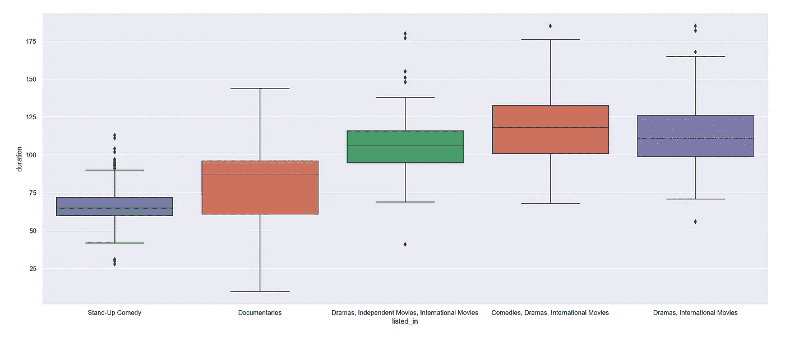

最后，让我们定义一个函数，它将一个数据框和一个数字列作为输入，并显示一个直方图:

```
def get_histogram(data_frame, numerical_column):
    df_new = data_frame
    df_new[numerical_column].hist(bins=100)
```

让我们用数据框调用函数，并从“持续时间”生成一个直方图:

```
get_histogram(df, 'duration')
```

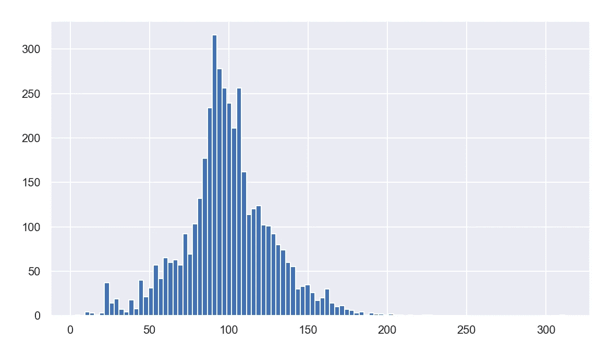

我就讲到这里，但是请随意处理数据并自己编码。

概括地说，我回顾了几种分析*网飞电影和电视节目*数据集的方法。这包括定义生成汇总统计数据的函数，比如平均值、标准差和分类值的计数。我们还定义了用箱线图和直方图可视化数据的函数。我希望这篇文章有趣。这篇文章的代码可以在 [GitHub](https://github.com/spierre91/medium_code/blob/master/netflix_eda.py) 上找到。感谢您的阅读！