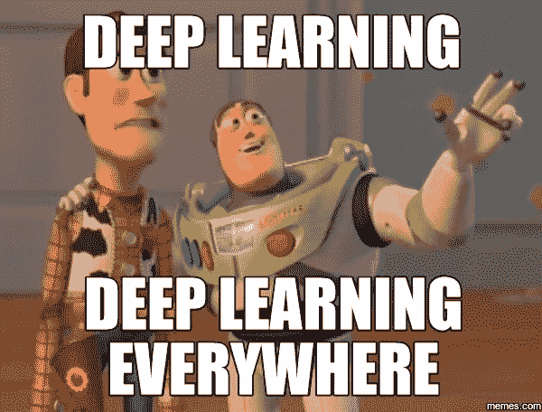
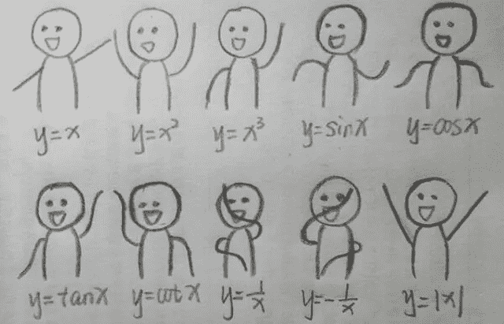
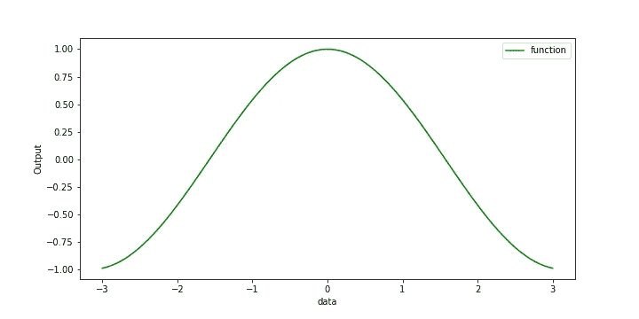
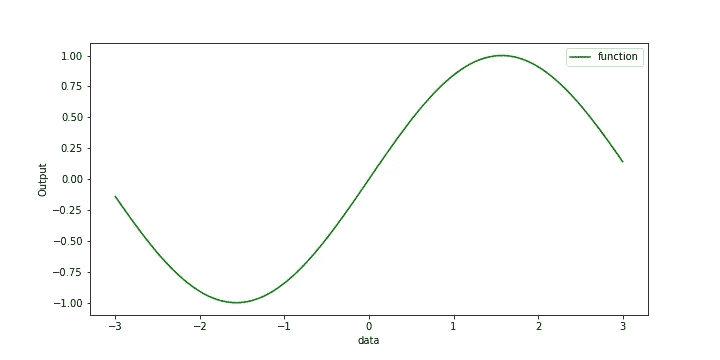
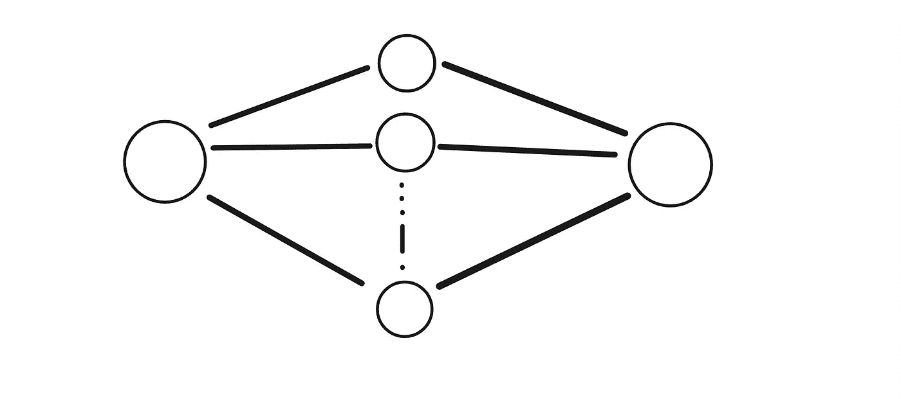
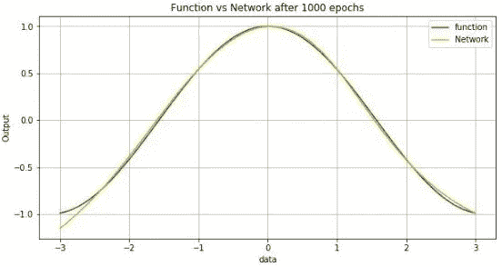
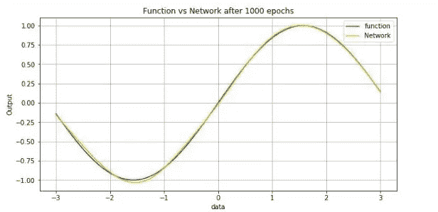
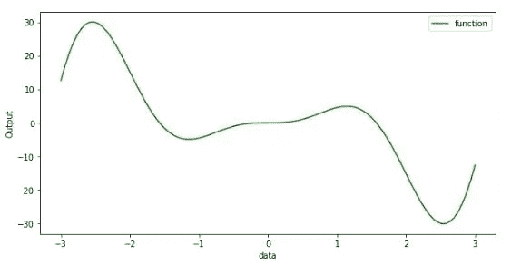
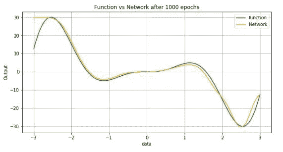

# 理解神经网络的近似能力

> 原文：<https://towardsdatascience.com/exploring-neural-networks-and-their-fascinating-effectiveness-81ebc054cb16?source=collection_archive---------37----------------------->

## [**里面的艾**](https://medium.com/towards-data-science/inside-ai/home)

## 探索神经网络有效性的基本概念。

照片由[布鲁克·拉克](https://unsplash.com/@brookelark?utm_source=medium&utm_medium=referral)在 [Unsplash](https://unsplash.com?utm_source=medium&utm_medium=referral) 拍摄

# 一切开始的地方。

这一切都始于理解大脑实际上是如何工作的想法。早在 20 世纪 40 年代，麦卡洛克和皮茨就引入了神经元[1]，20 世纪 50 年代，弗兰克·罗森博尔特推出了第一台感知机[2]。自 20 世纪 40 年代以来，神经网络就伴随着我们，但是，由于缺乏实际的实施，该领域面临着起伏。最近涉及各种神经网络架构的深度学习技术实践的增长是因为两个主要进步，第一，*(高性能 CPU 和 GPU)，第二， ***可用的数据量*** 。*

*[Geoff Hinton](https://en.wikipedia.org/wiki/Geoffrey_Hinton) 和他的两个研究生展示了如何使用深度学习将一个名为 [**ImageNet**](http://www.image-net.org/) 的非常大的数据集，包含 10000 个类别和 1000 万张图像，并将分类错误减少 20%。这发生在 2012 年的 NIPS 会议上，正如 Terrence Sejnowski 所说，*

> *传统上，在数据集(ImageNet)上，误差在一年内减少不到 1%。一年时间，绕过了 20 年的研究。这真的打开了闸门。——在《The Verge》的采访中。*

*这就是“*深度学习——嗡嗡声*”开始的时刻。人工智能就是从这一点发展起来的。*

**

# *神经网络有多神奇？*

*人工神经网络由大量简单的相互连接的处理元件组成。这些元件并行操作，其功能由网络结构、连接强度以及在计算元件或节点处执行的处理决定。对深度学习兴趣的增长部分是由于传统编程技术在“硬”任务中的失败，如机器视觉、连续语音识别和机器学习。*

*神经网络在视觉、语音、信号处理和机器人方面的能力已经得到了显著的证明。神经网络解决的各种问题令人印象深刻。最近在诸如图像分类、对象检测、文本生成、图像字幕、语言翻译、GANs 等任务中有了突破。*

*由于神经网络的有效性和高性能处理器(GPU、TPU)的可用性，神经网络的热门研究领域正在快速发展，并且范围很广。AWS、Google Cloud 等云技术的最新进展。也有助于更好的研究。但是深度学习往往面临*缩放、*和现实世界问题。(关于这些问题的讨论超出了本文的范围)*

# *函数逼近*

*函数逼近是通过简单函数的集合来描述复杂函数的行为。这些方法包括通过*高斯*、**级数展开**的**多项式逼近**，以计算工作点附近函数的近似值，如*泰勒级数、*等等。*

> *神经网络是在统计上实现泛化的函数逼近机器。*

**

*功能😋*

# *神经网络是通用逼近器*

*前馈神经网络提供了一个通用逼近框架，即**通用逼近定理**，*

> *通用逼近定理在其最一般的版本之一中说，如果我们仅考虑连续激活函数 **σ** ，那么具有一个隐藏层的标准前馈神经网络能够将任何连续多元函数 **f** 逼近到任何给定的逼近阈值 **ε** ，当且仅当 **σ** 是非多项式。[3]*

*前馈网络提供了一个表示函数的通用系统，在这个意义上，给定一个函数，存在一个逼近该函数的前馈网络。这表明存在一个接近所考虑的函数的大网络，但它没有回答，到底有多大？*

*简而言之，具有单个层的前馈神经网络是代表任何函数的 sufficient，但是该层可能相当大，并且可能不能正确概括。*

# *近似的例子*

*作为函数逼近的例子，我采用了众所周知的正弦、余弦函数和一个自定义函数。数据点的范围[-3，3]使得函数图看起来如下:*

1.  *余弦函数*

**

*余弦图(来源:笔记本)*

*2.正弦函数*

**

*正弦图(来源:笔记本)*

*用建筑的神经网络进一步逼近这些功能，*

> *图层:输入(1)-隐藏(100)-输出(1)*

**

*神经网络体系结构[in-hidden-out，1–100–1]*

*基于神经网络优化的近似函数的结果在函数图下面，*

1.  *余弦*

**

*2.正弦*

**

# *问题*

*上图显示，通过一组正确的参数，神经网络几乎符合原始函数。一切看起来都很完美，那么还会有什么地方出错呢？*

> *过度拟合*

*是的，我们的神经网络过度拟合了！训练集上的误差被驱动到非常小的值，但是当新数据呈现给网络时，误差很大。网络已经记住了训练的例子，但是还没有学会推广到新的情况。这必须避免。我们可以看看另一个具有相同神经网络结构的自定义函数。*

*功能，*

**

*10*(a )*sin(a)*cos(s)*

*关于函数逼近，*

**

*接近*

# *结论*

*这些是理解神经网络通用逼近能力的基础的一些尝试，这使得深度学习领域在广泛的任务上有效成为可能。最后，我们将上述内容总结如下:*

*   *根据数据训练神经网络近似于从输入到输出的未知的基本映射函数。*
*   *在训练神经网络时，过拟合等问题会阻碍新数据的结果(看不见)。*

*人们可以通过在笔记本上用代码进行实验来观察改变神经架构和参数对结果的影响，如上图[所示。](https://github.com/pr2tik1/universal-approximation)*

# *参考*

*[1]麦卡洛克，W. S .和皮茨，W. 1943。神经活动中固有观念的逻辑演算。*数学生物物理学通报*5:115–133。*

*[2]罗森布拉特，1957 年。感知机——一种感知和识别自动机。康奈尔航空实验室报告 85-460-1。*

*[3]进一步了解神经网络的近似能力，Kai Fong Ernest Chong。*

# *要签出的资源*

*   *【http://neuralnetworksanddeeplearning.com/chap4.html *
*   *[https://towards data science . com/the-approximation-power-of-neural-networks-with-python-codes-ddfc 250 BDB 58](/the-approximation-power-of-neural-networks-with-python-codes-ddfc250bdb58)*
*   *[https://machine learning mastery . com/neural-networks-are-function-approximators/](https://machinelearningmastery.com/neural-networks-are-function-approximators/)*

*谢谢你！在 LinkedIn 和我联系，*

* [## Pratik K. -作家-走向数据科学| LinkedIn

### 我是一名刚从泰国国立理工学院电子和通信工程专业毕业的学生

www.linkedin.com](https://www.linkedin.com/in/pratik-kumar04/) 

查看我的投资组合网页了解更多关于我的详细信息[在这里](https://pr2tik1.github.io/)。*