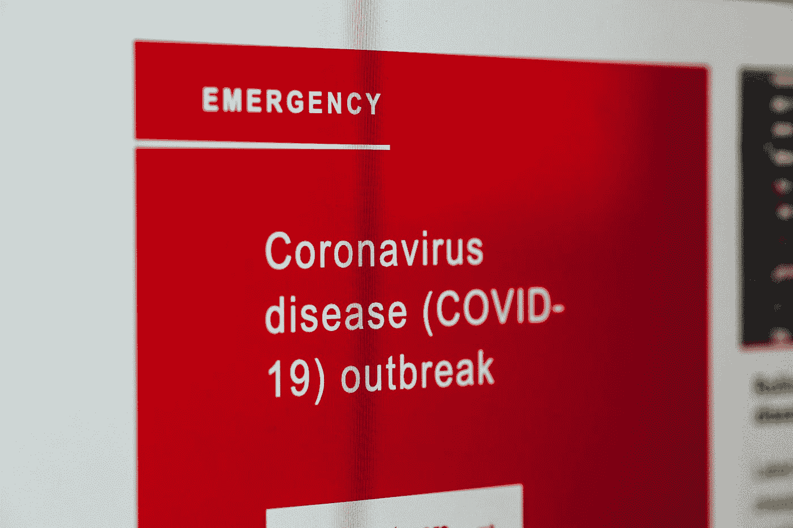
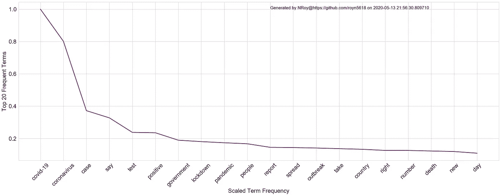
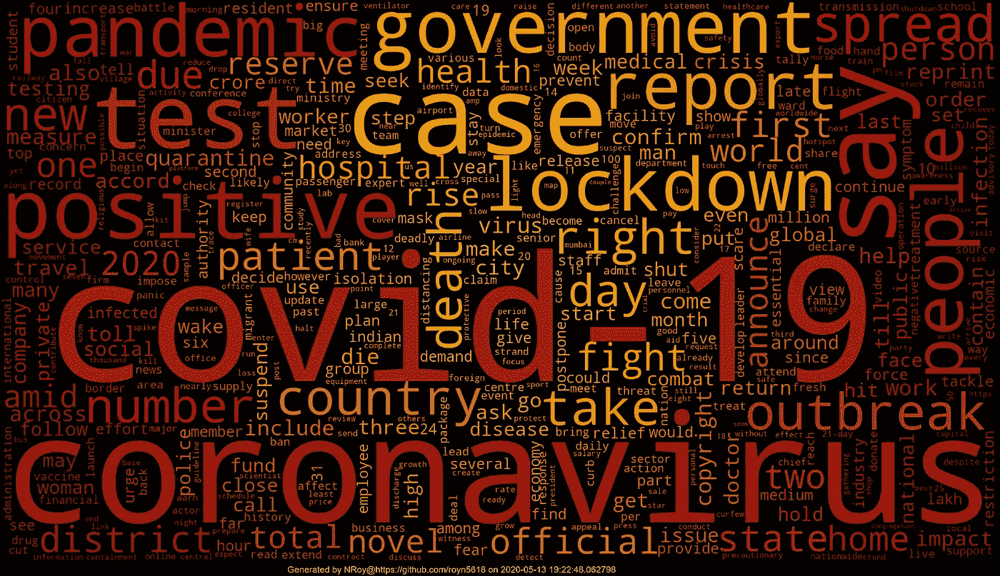

# 探索印度媒体中关于新冠肺炎的新闻| NLP| Wordcloud |新冠肺炎文章 1

> 原文：<https://towardsdatascience.com/exploring-news-about-covid-19-in-indian-media-nlp-wordcloud-covid-19-article-1-2bcbb127dfb3?source=collection_archive---------58----------------------->

## [新冠肺炎文字分析](https://towardsdatascience.com/tagged/covid-19-text-analysis)

***编者注:*** [*走向数据科学*](http://towardsdatascience.com/) *是一份以研究数据科学和机器学习为主的中型刊物。我们不是健康专家或流行病学家，本文的观点不应被解释为专业建议。想了解更多关于疫情冠状病毒的信息，可以点击* [*这里*](https://www.who.int/emergencies/diseases/novel-coronavirus-2019/situation-reports) *。*



马库斯·斯皮斯克在 [Unsplash](https://unsplash.com?utm_source=medium&utm_medium=referral) 上拍摄的照片

C 现在全球的流行词是冠状病毒、死亡、隔离和封锁。因此，在这篇博客中，我试图挖掘来自印度媒体的新闻文章，并使用词云可视化哪些词出现得最多。

> 对 wordcloud 的结果感兴趣吗？
> 
> 滚动到底部！

# 关于我的新冠肺炎新闻文章数据集:

我用过的新闻文章都是用 [**NewsAPI 的**](https://newsapi.org/) **开发者计划刮出来的。**因为，我几天前才决定这个用例，我的数据集的日期范围是**2020 年 3 月 10 日到 4 月 10 日**。因此，数据集将每月增长。此外，新闻文章的**内容**被限制在**260 个字符**以内，但是你知道他们说什么——如果读者对引言不感兴趣，他们可能不会读到第二段。所以我们只有很少但*重要的*信息。

**使用的新闻来源:**谷歌印度新闻、印度时报和印度教徒报


照片由 [Doran Erickson](https://unsplash.com/@doran_erickson?utm_source=medium&utm_medium=referral) 在 [Unsplash](https://unsplash.com?utm_source=medium&utm_medium=referral) 上拍摄

# **数据集预处理:**

我使用传统的 NLP 清洗流程:

1.  标记化、停用词删除、标点符号删除
2.  词性标注和生成词条

我使用 lambda 函数来遍历这些行，并将最终数据集存储到 pickle 文件中以备后用。

这很大程度上源于我之前的一篇博客，所以我将跳过细节。

**数据转换的一个例子:**

```
**Actual Content:**The spectre of COVID-19 has made its appearance in one of Indias most storied tiger reserves. The death of a 10-year-old ailing male tiger, in the Pench Tiger Reserve (PTR) the countrys most munificent reserve that succumbed to a respiratory illness last Satu… [+3272 chars]**Cleaned and Normalized Content:**[[number, covid-19, case, continue, rise, 6, 33, new, case, report, 12-hour, span, take, tally, positive, case, 781], [witness, 19, fresh, case, 11, report, fro]]
```

**Github 链接笔记本进行数据清理:**

[](https://github.com/royn5618/Medium_Blog_Codes/blob/master/Covid-Blog-Codes/Cleaning-Covid-Dataset-NLP.ipynb) [## royn5618/Medium_Blog_Codes

### permalink dissolve GitHub 是超过 5000 万开发人员的家园，他们一起工作来托管和审查代码，管理…

github.com](https://github.com/royn5618/Medium_Blog_Codes/blob/master/Covid-Blog-Codes/Cleaning-Covid-Dataset-NLP.ipynb) 

# 生成词频& Wordcloud:

我使用了独一无二的 [Wordcloud](https://pypi.org/project/wordcloud/) Python 库来创建这个 word-cloud。我自己生成了术语频率词典，并在下面一步一步地记录了这个过程:

***第一步:*** 我创建了一个令牌列表，如下所示:

```
temp_list = [k **for** i **in** list(df[col]) **if** i **for** j **in** i **for** k **in** j]
```

在笔记本中，我还根据结果单词云中出现的不需要的单词做了一些清理。

**步骤 2:** 我将唯一的单词作为*键*存储到*字典*中，并将它们的频率分配到各自的*值*中。

```
# Use *set* to get the unique elements of the list
unique_words = set(terms_list)# Iterate through the terms and store count of the indexed words to 
dict_terms_count = {}
**for** word **in** unique_words:
    dict_terms_count[word] = terms_list.count(word) 
```

**第三步:**现在，我从前面的字典中得到最大的词频，并根据最高的词频调整其他的词频。

```
max_tf = max(dict_term_count.values())
dict_tf_scaled = {}
**for** word, count **in** dict_term_count.items():
    dict_tf_scaled[word] = count/max_tf
sorted_dict_term_count = dict(sorted(dict_tf_scaled.items(),
                              key=**lambda** kv: kv[1], reverse=**True**))
```

在这种情况下，“新冠肺炎”一词的出现频率最高，为 7536 次。看看下面的情节。很明显，Covid 和冠状病毒占据了新闻，因为刮擦集中在具有这两个关键词的文章上。



第四步:生成词云。我在评论中加入了一些关于在单词云中生成颜色的解释。我使用了许多图片进行试验，并选择了最适合的一个。我用过的那个在我的 GitHub 回购上。说真的，很好玩！下载随机图像，使用 [ImageColorGenerator](https://amueller.github.io/word_cloud/generated/wordcloud.ImageColorGenerator.html) 生成本地化的彩色像素，并尝试匹配您的文字云。

```
# imports
from PIL import Image
import PIL.ImageOps
from wordcloud import ImageColorGenerator# Load the mask image
image_mask = np.array(Image.open(mask_image))# Generate the wc colours from the image pixels
# This method takes the average of a region of pixels and assigns 
# that colour to the texts in that regionimage_colors = ImageColorGenerator(image_mask)# Generate the Wordcloud object using the mask. 'mask' is to 
# generate the outline of the image you have chosen.
# For me it it rectangular - so no visible change
# Since I have passed custom frequencies, I have used
# 'generate_from_frequencies' methodstopwords = set(STOPWORDS)
wordcloud = WordCloud(width = 2000, height = 1200, 
                      max_words = 500, normalize_plurals = True,   
                      **mask=image_mask**, background_color =’black’, 
                      font_step = 1, relative_scaling = 0.5,
                      collocations = False, include_numbers = False,
                      stopwords =stopwords)
                      .generate_from_frequencies(dict_term_freq)# Some matplotlib settings plt.figure(figsize = (80, 50), facecolor = None)
plt.style.use(‘dark_background’)
plt.imshow(wordcloud.recolor(color_func=image_colors))
plt.text(xpos, ypos, custom_text, fontsize=font_size)
plt.axis(“off”)
plt.show()
```

# **云这个词在这里:**



# **意见和结论:**

在所有的词语中，*正面*和*战斗*比较有意思。这是因为“战斗”通常被认为是消极情绪*，而“积极”正如其名称所示，是积极情绪*。然而，形势显然已经发生了逆转。“拼”是正面情绪，“正面”是负面情绪在 2020 年疫情新冠肺炎的语境中。这清楚地表明了单词袋& tf-idf 作为文本表示模型的缺点、情感分析中的挑战以及我们为什么需要基于上下文/顺序的模型。**

**“说”的出现表明已经说了很多，众所周知，还有很多工作要做。这些话让我好奇，在下一次刮擦中，wordcloud 会有什么不同。我在云中找不到疫苗、解毒剂或治疗之类的词。**

**就像在 wordcloud 中一样，很自然地，许多负面情绪被表达了出来。这个数据集可能有助于发现与种群和社会经济因素的相互关系。但那是另一个博客讨论的问题！**

# **关于新冠肺炎文章系列:**

**我将会写更多关于探索和操作这个数据集的博客，这个数据集将会越来越大。如果您有兴趣了解这个数据集是如何形成的，请跟我来！**

## ****Github 链接到此数据集上的所有笔记本:****

**[](https://github.com/royn5618/Medium_Blog_Codes/tree/master/Covid-Blog-Codes) [## royn5618/Medium_Blog_Codes

### 此时您不能执行该操作。您已使用另一个标签页或窗口登录。您已在另一个选项卡中注销，或者…

github.com](https://github.com/royn5618/Medium_Blog_Codes/tree/master/Covid-Blog-Codes)** 

****我的链接:** [中](https://medium.com/@nroy0110)|[LinkedIn](https://www.linkedin.com/in/nabanita-roy/)|[GitHub](https://github.com/royn5618)**

*****感谢来访。我希望你喜欢阅读这篇博客。*****