# 用 Jupyter 笔记本探索正态分布

> 原文：<https://towardsdatascience.com/exploring-normal-distribution-with-jupyter-notebook-3645ec2d83f8?source=collection_archive---------4----------------------->

## 统计数字

## 使用 scipy 和 matplotlib 的正态分布初学者指南


卡洛斯·穆扎在 [Unsplash](https://unsplash.com?utm_source=medium&utm_medium=referral) 上的照片

```
**Table of Contents**[**Introduction**](#f050)1\. [Normal Distribution Probability Density Function](#053b)
2\. [Using random normal distribution values](#47c4)
3\. [A cumulative normal distribution function](#b23b)
4\. [Calculating the probability of normal distribution](#c5a1)
5\. [Interval between variables](#15d2)
6\. [Finding quantiles](#0adf)
7\. [Multivariate Normal Distribution](#cc27)
8\. [Standard normal distribution](#6f46)
9\. [Standardized normal variable](#dcf5)
10\. [Finding the standard normal value](#0921)[**Conclusion**](#72c4)
```

# 介绍

[正态分布](https://www.wikiwand.com/en/Normal_distribution)在自然科学和社会科学中常用来表示分布未知的实值随机变量。正态分布是一种连续的理论概率分布。在这篇文章中，我将使用 Jupyter 笔记本来探索正态分布。

让我们导入所有必需的库。

```
from scipy.stats import norm
import numpy as np
import matplotlib.pyplot as plt
```

# 正态分布概率密度函数

正态分布的概率密度函数(PDF)为:

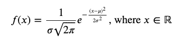

PDF 描述的随机变量 *𝑋* 是一个正态变量，服从具有均值和方差的正态分布。

正态分布符号是:

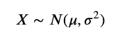

曲线下的面积等于 1。

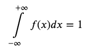

## `norm.pdf`值

`norm.pdf`返回一个 PDF 值。以下是 *𝑥* =1、 *𝜇* =0、 *𝜎* =1 时的 PDF 值。

```
norm.pdf(x=1.0, loc=0, scale=1)
```

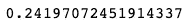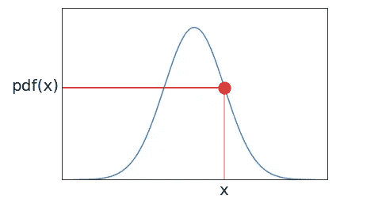

如果你想看上图的代码，请看[这个](https://nbviewer.jupyter.org/github/shinokada/python-for-ib-diploma-mathematics/blob/master/Normal_distribution.ipynb)。

由于`norm.pdf`返回一个 PDF 值，我们可以用这个函数来绘制正态分布函数。我们使用`scipy`、`numpy`和`matplotlib`绘制正态分布的 PDF。我们使用的域为 4 < *𝑥* < 4，范围为 0<*𝑓*(*𝑥*)<0.45，默认值为 *𝜇* =0 和 *𝜎* =1。`plot(x-values,y-values)`生成图表。

```
fig, ax = plt.subplots()
x= np.arange(-4,4,0.001)
ax.set_title('N(0,$1^2$)')
ax.set_xlabel('x')
ax.set_ylabel('f(x)')
ax.plot(x, norm.pdf(x))
ax.set_ylim(0,0.45)plt.show()
```

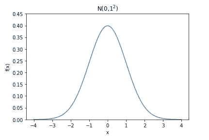

正常曲线是平滑的钟形。关于 *𝑥* = *𝜇* 对称，并且在 *𝑥* = *𝜇* 处具有最大点。

## 具有不同标准差的正态分布 PDF

让我们画出一个正态分布的概率分布函数，其中平均值有不同的标准差。

`scipy.norm.pdf`有关键字，`loc`和`scale`。location (loc)关键字指定平均值，scale (scale)关键字指定标准差。

```
fig, ax = plt.subplots()
x = np.linspace(-10,10,100)
stdvs = [1.0, 2.0, 3.0, 4.0]for s in stdvs:
    ax.plot(x, norm.pdf(x,scale=s), label='stdv=%.1f' % s)

ax.set_xlabel('x')
ax.set_ylabel('pdf(x)')
ax.set_title('Normal Distribution')
ax.legend(loc='best', frameon=True)
ax.set_ylim(0,0.45)
ax.grid(True)
```

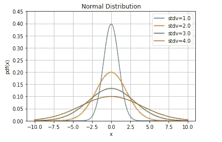

## 不同均值的正态分布 PDF

让我们画出标准偏差为 1 的正态分布和不同均值的概率分布函数。

```
fig, ax = plt.subplots()
x = np.linspace(-10,10,100)
means = [0.0, 1.0, 2.0, 5.0]for mean in means:
    ax.plot(x, norm.pdf(x,loc=mean), label='mean=%.1f' % mean)

ax.set_xlabel('x')
ax.set_ylabel('pdf(x)')
ax.set_title('Normal Distribution')
ax.legend(loc='best', frameon=True)
ax.set_ylim(0,0.45)
ax.grid(True)
```

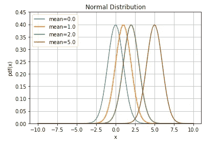

分布的平均值决定了图形中心的位置。正如你在上面的图表中看到的，图表的形状并没有因为改变平均值而改变，而是水平平移了图表。

[](/modeling-functions-78704936477a) [## 建模功能

### 从线性回归到逻辑回归

towardsdatascience.com](/modeling-functions-78704936477a) 

# 使用随机正态分布值

`norm.rvs`根据标准差`scale`、均值`loc`和大小生成随机正态分布数。我们为生成的数字创建一个直方图，并添加 PDF。

```
fig, ax = plt.subplots()
xs = norm.rvs(scale=2,size=1000)
x = np.linspace(-10,10,100)
p = norm.pdf(x,scale=2)
v = np.var(xs)
m = np.mean(xs)ax = fig.add_subplot(111)
ax.hist(xs, bins=10, alpha=0.5, density=True)
ax.plot(x,p, 'r-', lw=2)
ax.set_xlabel('x')
ax.set_ylabel('pdf(x)')
ax.set_title(f'mean={m:.2f}, var={v:.2f}')
ax.grid(True)
```

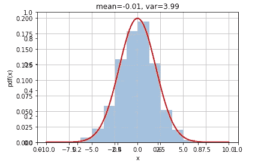

# 累积正态分布函数

随机变量 X 的累积分布函数(在 X 处计算)是 X 取值小于或等于 X 的概率。由于正态分布是连续分布，因此曲线的阴影区域表示 X 小于或等于 X 的概率。

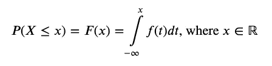

使用`fill_between(x, y1, y2=0)`，它将填充两条曲线`y1`和`y2`之间的区域，默认值为 0。

```
fig, ax = plt.subplots()
# for distribution curve
x= np.arange(-4,4,0.001)
ax.plot(x, norm.pdf(x))
ax.set_title("Cumulative normal distribution")
ax.set_xlabel('x')
ax.set_ylabel('pdf(x)')
ax.grid(True)# for fill_between
px=np.arange(-4,1,0.01)
ax.set_ylim(0,0.5)
ax.fill_between(px,norm.pdf(px),alpha=0.5, color='g')
# for text
ax.text(-1,0.1,"cdf(x)", fontsize=20)
plt.show()
```

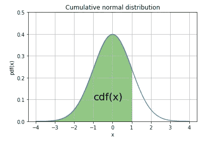

# 计算正态分布的概率

给定 3 的均值和 2 的标准差，我们可以求出 *𝑃* ( *𝑋* < 2)的概率。

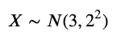

在`norm.cdf`中，location (loc)关键字指定平均值，scale (scale)关键字指定标准差。

```
from scipy.stats import normlessthan2=norm.cdf(x=2, loc=3, scale=2)
print(lessthan2)
```

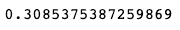

让我们画一张图表。

```
fig, ax = plt.subplots()# for distribution curve
x= np.arange(-4,10,0.001)
ax.plot(x, norm.pdf(x,loc=3,scale=2))
ax.set_title("N(3,$2^2$)")
ax.set_xlabel('x')
ax.set_ylabel('pdf(x)')
ax.grid(True)# for fill_between
px=np.arange(-4,2,0.01)
ax.set_ylim(0,0.25)
ax.fill_between(px,norm.pdf(px,loc=3,scale=2),alpha=0.5, color='g')# for text
ax.text(-0.5,0.02,round(lessthan2,2), fontsize=20)
plt.show()
```

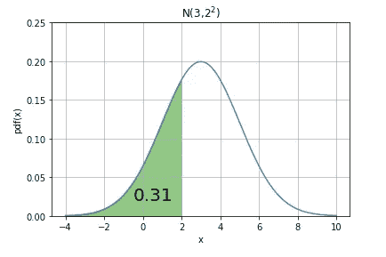

# 变量之间的间隔

要找出某些变量之间的间隔概率，需要从另一个`cdf`中减去`cdf`。我们来找*𝑃*(0.5<*𝑋*<2)均值为 1，标准差为 2。

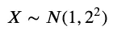

```
norm(1, 2).cdf(2) - norm(1,2).cdf(0.5)
```

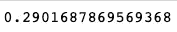

这是图表。

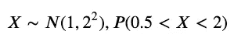

```
fig, ax = plt.subplots()# for distribution curve
x= np.arange(-6,8,0.001)
ax.plot(x, norm.pdf(x,loc=1,scale=2))
ax.set_title("N(1,$2^2$)")
ax.set_xlabel('x')
ax.set_ylabel('pdf(x)')
ax.grid(True)px=np.arange(0.5,2,0.01)
ax.set_ylim(0,0.25)
ax.fill_between(px,norm.pdf(px,loc=1,scale=2),alpha=0.5, color='g')pro=norm(1, 2).cdf(2) - norm(1,2).cdf(0.5)
ax.text(0.2,0.02,round(pro,2), fontsize=20)
plt.show()
```

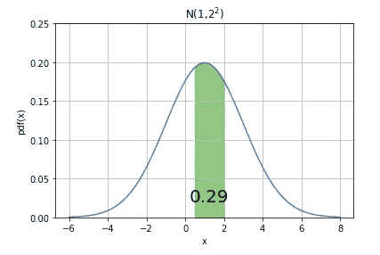

要找到 *𝑃* ( *𝑋* > 4)的概率，我们可以使用`sf`，它被称为生存函数，它返回`1-cdf`。例如，`norm.sf(x=4, loc=3, scale=2`返回当 *𝜇* =4， *𝜎* =2 时，大于 *𝑥* =4， *𝑃* ( *𝑋* > 4)的概率。

```
gr4sf=norm.sf(x=4, loc=3, scale=2)
gr4sf
```

让我们画一张图表。

```
fig, ax = plt.subplots()
x= np.arange(-4,10,0.001)
ax.plot(x, norm.pdf(x,loc=3,scale=2))
ax.set_title("N(3,$2^2$)")
ax.set_xlabel('x')
ax.set_ylabel('pdf(x)')
ax.grid(True)px=np.arange(4,10,0.01)
ax.set_ylim(0,0.25)
ax.fill_between(px,norm.pdf(px,loc=3,scale=2),alpha=0.5, color='g')ax.text(4.5,0.02,"sf(x) %.2f" %(gr4sf), fontsize=20)
plt.show()
```

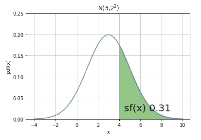

上图同 1*𝑃*(*𝑋*t51】4)。

```
gr4=norm.cdf(x=4, loc=3, scale=2)
gr14=1-gr4fig, ax = plt.subplots()
x= np.arange(-4,10,0.001)
ax.plot(x, norm.pdf(x,loc=3,scale=2))
ax.set_title("N(3,$2^2$)")
ax.set_xlabel('x')
ax.set_ylabel('pdf(x)')
ax.grid(True)px=np.arange(4,10,0.01)
ax.set_ylim(0,0.25)
ax.fill_between(px,norm.pdf(px,loc=3,scale=2),alpha=0.5, color='g')
px1=np.arange(-4,4,0.01)
ax.fill_between(px1,norm.pdf(px1,loc=3,scale=2),alpha=0.5, color='r')
ax.text(4.5,0.02,round(gr14,2), fontsize=20)
ax.text(1,0.02,round(gr4,2), fontsize=20)
plt.show()
```

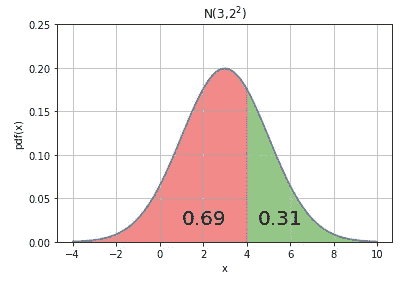[](/a-measure-of-linear-relationship-5dd4a995ee7e) [## 线性关系的度量

### 皮尔逊与 Jupyter 笔记本的积矩相关性

towardsdatascience.com](/a-measure-of-linear-relationship-5dd4a995ee7e) 

# 寻找分位数

*𝑘* 在*𝑃*(*𝑋*≤*𝑘*)= 0.95

被称为分位数，在这种情况下，95%的分位数。

## 百分点函数

`ppf`是`cdf`的倒数，称为百分点函数。给定均值 1，标准差 3，我们可以用`ppf`求出*𝑃*(*𝑋*<*𝑎*)= 0.506 的分位数`a`。

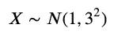

```
norm.ppf(q=0.506, loc=1, scale=3)
```

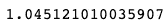

让我们画一张图表。

```
fig, ax = plt.subplots()
x= np.arange(-10,10,0.001)
ax.plot(x, norm.pdf(x,loc=1,scale=3))
ax.set_title("N(1,$3^2$)")
ax.set_xlabel('x')
ax.set_ylabel('pdf(x)')
ax.grid(True)xpoint=norm.ppf(q=0.506, loc=1, scale=3)
px=np.arange(-10,xpoint,0.01)
ax.set_ylim(0,0.15)
ax.fill_between(px,norm.pdf(px,loc=1,scale=3),alpha=0.5, color='g')ax.text(.8,0.02,"x= %.2f" %xpoint, fontsize=20)
ax.text(-5,0.05,"P(X)=0.506", fontsize=20)
plt.show()
```

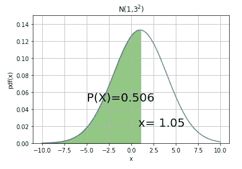

## 逆生存函数

同样的均值和标准差，我们可以利用逆生存函数`isf`求出*𝑃*(*𝑋*>*𝑏*)中的分位数`b`= 0.198。这与使用`ppf`和*𝑞*=(10.198)是一样的。

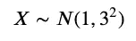

```
norm.isf(q=0.198, loc=1, scale=3)
```

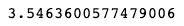

```
norm.ppf(q=(1-0.198), loc=1, scale=3)
```

## 平均值附近的区间

`norm.interval`返回包含分布的 alpha 百分比的范围的端点。例如，如果平均值为 0，标准差为 1，则求 95%的概率，`norm.interval`返回平均值周围的 x 值，在本例中， *𝜇* =0。

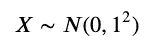

```
a,b = norm.interval(alpha=0.95, loc=0, scale=1)
print(a,b)
```

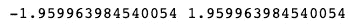

```
fig, ax = plt.subplots()
x= np.arange(-4,4,0.001)
ax.plot(x, norm.pdf(x))
ax.set_title("Interval")
ax.set_xlabel('x')
ax.set_ylabel('pdf(x)')
ax.grid(True)px=np.arange(a,b,0.01)
ax.set_ylim(0,0.5)
ax.fill_between(px,norm.pdf(px),alpha=0.5, color='g')ax.text(-0.5,0.1,"0.95", fontsize=20)
plt.show()
```

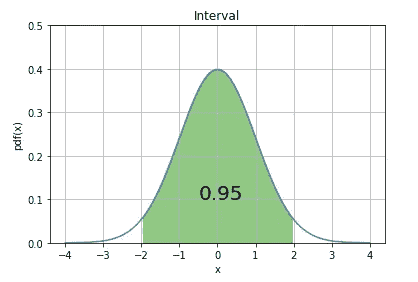

# 多元正态分布

多元正态分布通常用于描述任何一组相关的实值随机变量。

我们使用`multivariate_normal`，它需要均值和协方差矩阵的数组。为了简单起见，我们使用一个对角矩阵，其中所有非对角元素为零。

```
from scipy.stats import multivariate_normalx,y = np.meshgrid(np.linspace(-10,10,100),np.linspace(-10,10,100))
pos = np.dstack((x,y))
mean = np.array([1, 2])
cov  = np.array([[3,0],[0,15]])
rv = multivariate_normal(mean,cov)
z = rv.pdf(pos)fig = plt.figure()
ax = fig.add_subplot(111,aspect='equal')
ax.contourf(x,y,z)
ax.set_xlim(-10,10)
ax.set_ylim(-10,10)
ax.set_xlabel('x')
ax.set_ylabel('y')
ax.set_title('pdf')
```

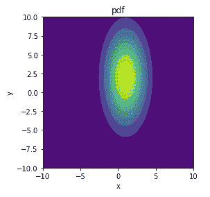

我们可以使用 matplotlib 的`[mpl_toolkits.mplot3d.Axes3D](https://matplotlib.org/api/_as_gen/mpl_toolkits.mplot3d.axes3d.Axes3D.html)`创建一个 3D 图形。我们也使用 [Scipy 冷冻 RV 对象](https://docs.scipy.org/doc/scipy/reference/tutorial/stats.html#freezing-a-distribution)。

```
import numpy as np
import matplotlib.pyplot as plt
from scipy.stats import multivariate_normal
from mpl_toolkits.mplot3d import Axes3D# Create grid and multivariate normal
x = np.linspace(-10,10,500)
y = np.linspace(-10,10,500)
X, Y = np.meshgrid(x,y)
pos = np.empty(X.shape + (2,))
pos[:, :, 0] = X 
pos[:, :, 1] = Y# Create a frozen RV object
mean = np.array([1, 2])
cov  = np.array([[3,0],[0,15]])
rv = multivariate_normal(mean,cov)# Make a 3D plot
fig = plt.figure()
ax = fig.gca(projection='3d')
ax.plot_surface(X, Y, rv.pdf(pos),cmap='viridis',linewidth=0)
ax.set_xlabel('X axis')
ax.set_ylabel('Y axis')
ax.set_zlabel('Z axis')
plt.show()
```

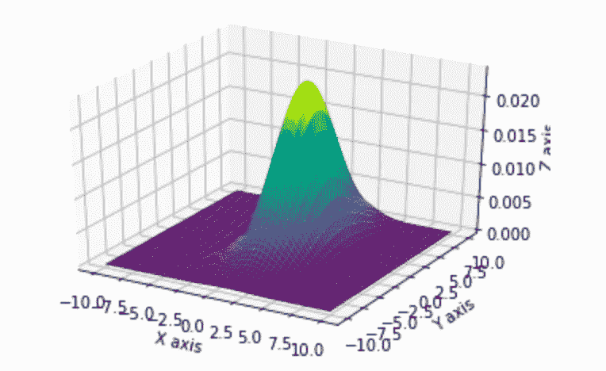

# 标准正态分布

当 *𝜇* =0，方差=1 时，称为标准正态分布。上述概率函数简化为:

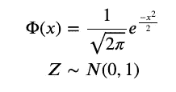

所有的正态曲线都与标准正态分布相关。

# 标准化正态变量

为了将随机变量标准化为标准化正态变量*𝑍*∽*𝑁*(0，1)我们使用变换:

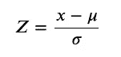

标准化值 Z 表示原始值低于或高于平均值多少个标准偏差。

# 寻找标准正常值

例如，当平均值为 2，标准偏差为 3 时，求 *𝑥* =1 的标准化值。

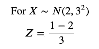

我们可以用`norm.cdf`求概率，用`norm.ppf`配 *𝜇* =0， *𝜎* =1 求标准化值。

```
norm.cdf(1, loc=2, scale=3)
```

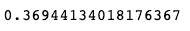

```
norm.ppf(q=norm.cdf(1, loc=2, scale=3))
```

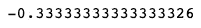

# 结论

[scipy.stats.norm](https://docs.scipy.org/doc/scipy/reference/generated/scipy.stats.norm.html) 为我们提供了参数`loc`和`scale`来指定标准偏差。它也有多种方法，本文中我们探讨了`rvs`、`cdf`、`sf`、`ppf`、`interval`、`isf`。

Matplotlib 为我们提供了简单而广泛的工具来改变包括 3D 在内的图形的微小细节。

**通过** [**成为**](https://blog.codewithshin.com/membership) **会员，可以完全访问媒体上的每个故事。**


[请订阅。](https://blog.codewithshin.com/subscribe)

# 关于 Jupyter 的更多文章

[](/how-to-run-jupyter-notebook-on-docker-7c9748ed209f) [## 如何在 Docker 上运行 Jupyter 笔记本

### 不再有 Python 环境和包更新

towardsdatascience.com](/how-to-run-jupyter-notebook-on-docker-7c9748ed209f) [](/introducing-basic-venn-diagram-python-package-vennfig-fa3f8e4dcb36) [## 维恩图 Python 包:Vennfig

### 在 Jupyter 或 Terminal 上用一行代码画一个维恩图

towardsdatascience.com](/introducing-basic-venn-diagram-python-package-vennfig-fa3f8e4dcb36) [](/a-measure-of-linear-relationship-5dd4a995ee7e) [## 线性关系的度量

### 皮尔逊与 Jupyter 笔记本的积矩相关性

towardsdatascience.com](/a-measure-of-linear-relationship-5dd4a995ee7e) [](/a-python-package-to-create-stats-figures-with-ease-503cf6ec0b26) [## 轻松创建统计数据的 Python 包

### Statsfig 可以用一行代码创建分布图和盒须图

towardsdatascience.com](/a-python-package-to-create-stats-figures-with-ease-503cf6ec0b26)