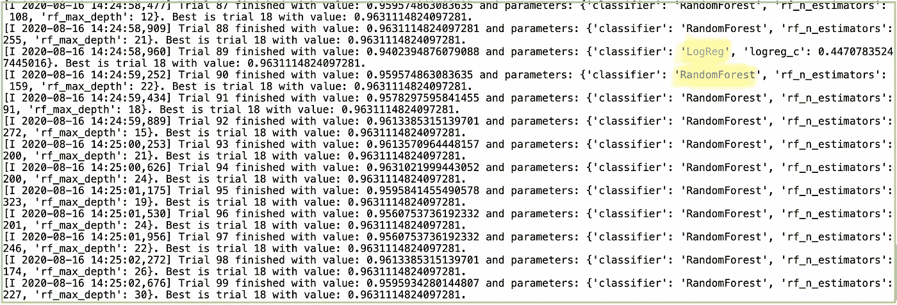
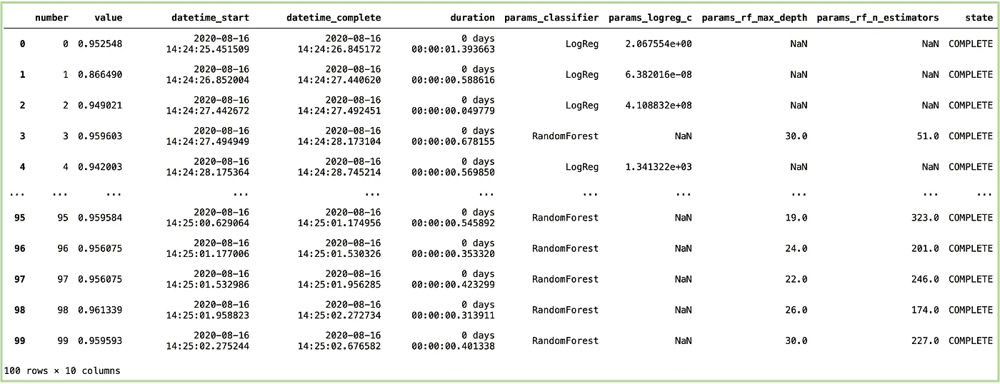
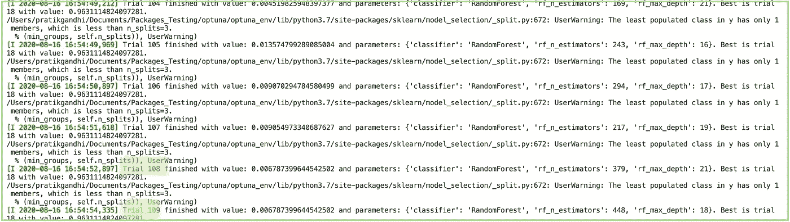
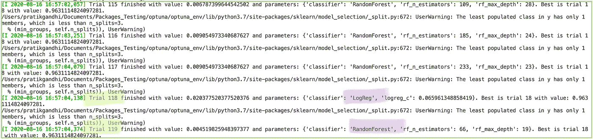
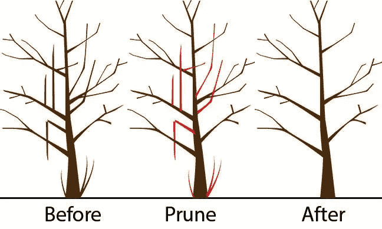
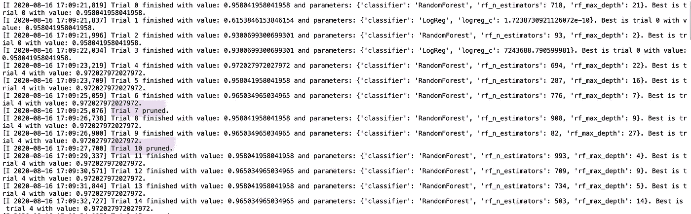
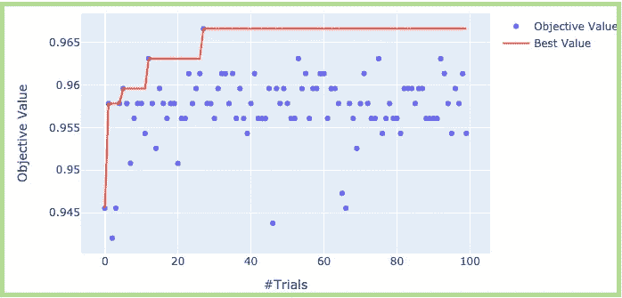
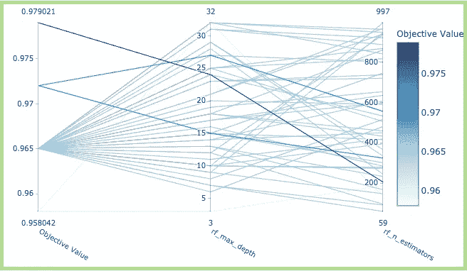
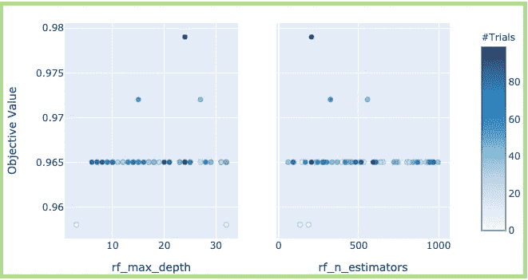

# 使用 Optuna 获得精确的 Scikit 学习模型:一个超参数框架

> 原文：<https://towardsdatascience.com/exploring-optuna-a-hyper-parameter-framework-using-logistic-regression-84bd622cd3a5?source=collection_archive---------10----------------------->

在过去的几个月里，超参数框架一直是讨论的热点。有几个软件包已经开发并仍在开发中，选择一个已经成为一个艰难的选择。这种框架不仅有助于拟合精确的模型，还可以帮助数据科学家将效率提高到一个新的水平。在这里，我展示了如何使用最近流行的 Optuna 框架来获得任何 Scikit-learn 模型的最佳参数。我只实现了*随机森林*和*逻辑回归*作为例子，但是其他算法也可以以这里所示的类似方式实现。

# 为什么是 Optuna？

如果整合到日常实验中，Optuna 可以成为工作马工具之一。当我使用 Optuna 以如此小的努力实现逻辑回归时，我被深深地打动了。以下是我喜欢 Optuna 的几个原因:

*   API 的易用性
*   出色的文档
*   适应任何算法的灵活性
*   像修剪和内置可视化模块这样的功能

**文件**:[https://optuna.readthedocs.io/en/stable/index.html](https://optuna.readthedocs.io/en/stable/index.html)

**Github**:[https://github.com/optuna/optuna](https://github.com/optuna/optuna)

在我们开始查看功能之前，我们需要确保我们已经安装了必备的软件包:

1.  奥普图纳
2.  Plotly
3.  熊猫
4.  sci kit-学习

# 基本参数和定义:

建立基本框架非常简单明了。它可以大致分为 4 个步骤:

1.  定义一个**目标函数**(步骤 1)
2.  定义一组**超参数**进行尝试(步骤 2)
3.  定义您想要优化的变量/指标(步骤 3)
4.  最后，**运行**功能。这里需要提一下:

*   您试图优化的*得分函数/变量* 将被**最大化或最小化**
*   您想要进行的试验次数。超参数的数量越多，定义的试验次数越多，计算成本就越高(除非你有一台强大的机器或 GPU！)

在 **Optuna** 世界中，术语**试验**是目标函数的单个调用，多个这样的试验一起被称为**研究。**

以下是 scikit-learn 包中**随机森林**和**逻辑回归**的基本实现:

当您运行上面的代码时，输出如下所示:

终端或笔记本电脑中的输出

正如我们在上面看到的，逻辑回归和随机森林的选择以及它们各自的参数在每次运行中都有所不同。每次试验可以是具有不同参数的不同算法。研究对象存储各种输出，可以按如下方式检索:

更详细的结果

正如我们在这里看到的， **21** 的**随机森林**和*n _ 估计量*为 **153** 和*最大深度*最适合这个数据集。

# 定义参数空间:

如果我们在步骤 2 (basic_optuna.py)中查看，我们将超参数 C 定义为具有浮点值的日志。类似地，对于随机森林，我们定义了 max_depth 和 n_estimators 作为要优化的参数。Optuna 支持五种定义参数的方式:

定义参数

# 历史研究:

由[坦纳·马迪斯](https://unsplash.com/@tannermardis?utm_source=medium&utm_medium=referral)在 [Unsplash](https://unsplash.com?utm_source=medium&utm_medium=referral) 上拍摄的照片

我觉得，数据科学家的一个基本需求是，他们希望跟踪所有的实验。这不仅有助于比较它们中的任意两个、三个或多个，而且有助于理解模型在超参数变化、添加新特征等情况下的行为。Optuna 内置了记录所有实验的功能。在访问旧实验之前，我们需要存储它们。下面的代码显示了如何执行这两个命令:

1.  您可以选择一个名称来创建实验
2.  存储为**关系数据库(RDB)** 形式。我这里用的是 *sqlite* 。其他选项是使用 *PostgreSQL，MySQL* 。您也可以使用 joblib 作为本地 pkl 文件来存储和加载**。**
3.  之后继续进行研究

这里的*存储*是一个额外的参数，如果您想使用 RDB 存储选项，需要在 *create_study* 函数中传递。此外，设置*load _ if _ exists =***True**将加载一个已经存在的检查。对于 joblib，它类似于如何存储和加载一个训练好的模型。再次运行将根据上次存储的试验开始优化试验次数。

如果我们使用以下方法，可以获得研究中所有试验的详细概览:

所有试验的结果

从上面的结果中可以看出，对于不适用于该算法的列/参数，有一个 *NaN* 值。除此之外，我们还可以计算每次试验所花费的总时间。有时，时间考虑是至关重要的，因为它提供了一种思路，即与其他参数相比，特定的参数集是否需要更长的时间来拟合。

# 分布式优化:

您可以在您的机器上运行多个作业，以实现超参数优化。使用 Optuna 运行分布式超参数优化非常简单。我认为使用 Optuna 作为超参数优化框架是有益的。考虑我们定义并存储为名为 optimize.py 的 python 文件的相同目标函数。参数建议将基于试验的历史，并在我们在多个终端中运行时进行更新:

在两个独立的终端中运行，输出如下所示:

端子 1 输出

端子 2 输出

比较终端 1 的输出和终端 2 的输出，我们可以看到随机森林和逻辑回归选择了不同的参数。在终端 1 中，我们看到所有试验都只选择了随机森林。在终端 2 中，仅选择了 1 个逻辑回归试验。您可以看到两个输出的试验号不同。此外，如果您使用 *n_jobs* 参数获得多个可用内核，您还可以**增加作业数量**，使其速度更快。

# 添加属性:

帕特里克·帕金斯在 [Unsplash](https://unsplash.com?utm_source=medium&utm_medium=referral) 上拍摄的照片

在评估历史实验时，为实验做一些笔记或属性会有很大帮助。用户可以使用 *set_user_attr* 方法为*试验*和*研究*添加键值对，如下所示:

用户可以在研究对象上使用 *user_attrs* 方法访问属性，如上面的代码所示。我认为这是使用 Optuna 时可用的附件。

# 修剪:

[https://Cornell farms . com/blogs/resources/pruning-fruit-trees](https://cornellfarms.com/blogs/resources/pruning-fruit-trees)

如图所示，修剪会删除树中不需要的或多余的分支。类似地，在机器学习算法的世界中，修剪是移除对分类器提供很少能力的部分的过程，并且有助于减少分类器的过度拟合，反过来提供更好的准确性。机器学习从业者必须精通术语“提前停止”,这类似于 Optuna 中修剪的工作方式。

运行 pruning.py 后的输出(上面的代码)

如上所示，对于特定的试验，如果结果不优于中间结果，试验被删除(这里是试验 7 和试验 10)。Optuna 中还提供其他类型的修剪程序，如 *MedianPruner、NopPruner、PercentilePruner* 、 *SuccessiveHalvingPruner* 等。你可以试着在这里得到更多的信息。

# 可视化:

除了上面显示的功能，Optuna 还提供了一些预先编写的可视化代码。这个可视化模块就像蛋糕上的樱桃，让我们更好地理解算法的适用性。我把其中的一些画在下面:

## 优化历史图:

优化历史图显示每次试验获得的目标值，并绘制最佳值。最佳值是一条直线，直到达到下一个最佳值，如下图所示:

优化历史图

## 平行坐标图:

平行坐标图有助于理解研究中的高维参数关系。这里我们只选择随机森林，我们将 x 轴视为参数 *max_depth* 和*n _ estimators*v/s y 轴上的目标值。我们可以看到，最佳优化值的试验是 max_depth ~ 23 和 n_estimators ~ 200。

平行坐标图

## 切片图:

该图有助于绘制传递给优化的所有参数之间的关系。切片图类似于上面显示的平行坐标图。

切片图

这里显示的所有可视化只是针对两个参数。如果使用多个参数，会发现它非常有用。这些图变得更加密集，可以提供参数之间关系的清晰图像。还有许多其他实现的可视化可以在[这里](https://optuna.readthedocs.io/en/stable/reference/visualization.html)找到。

# 结论:

Optuna 不仅限于用于 scikit-learn 算法。或许，TensorFlow、Keras 之类的神经网络，XGBoost、LightGBM 之类的梯度增强算法以及许多其他算法也可以使用这个奇妙的框架进行优化。Optuna 贡献者的一些例子已经可以在[这里](https://github.com/optuna/optuna/tree/master/examples)找到了。Optuna 是我遇到的最好的通用框架之一。正如我之前提到的，与众不同的是**优秀的文档**，**支持**几乎所有的**算法**，**根据需要修改的灵活性**等等。除此之外，Optuna 社区已经在框架的顶部构建了许多包装器，并且还在增长，负责许多繁重的工作。总的来说，Optuna 是一个巨大的超参数框架，可以作为数据科学工具包的一部分，我强烈推荐给任何数据科学家。