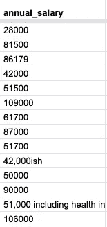
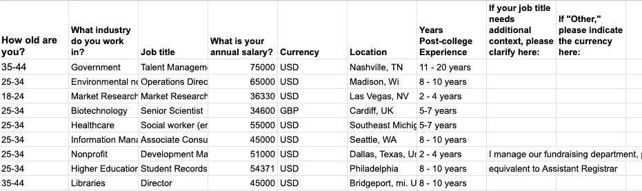
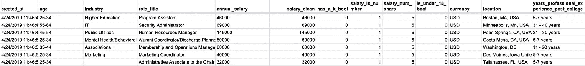
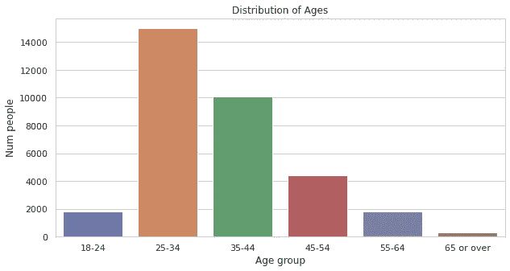
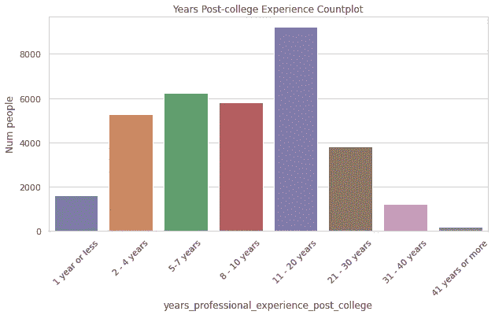

# 探索 Excel 和 Python 中的工资数据趋势

> 原文：<https://towardsdatascience.com/exploring-salary-data-trends-in-excel-and-python-34b2bc7142a7?source=collection_archive---------49----------------------->


图为[亚历山大·米尔斯](https://unsplash.com/@alexandermils?utm_source=unsplash&utm_medium=referral&utm_content=creditCopyText)在 [Unsplash](https://unsplash.com/s/photos/salary?utm_source=unsplash&utm_medium=referral&utm_content=creditCopyText)

最近有人告诉我关于自我报告的匿名工资信息，所以我很想分析这些数据，看看会出现什么样的模式。

公开分享这些信息提高了透明度，有利于理解和避免妇女和有色人种经历的薪酬不平等。通过这些数据可以找到一个人的年龄组，经验水平和类似的角色，看看他们可以期望什么样的薪酬水平。人们可以利用这些信息来确定他们是否报酬过低，或者选择最值得从事的职业。

在本文中，我将完成数据科学管道的第一步，即数据清理，并以几个可视化的例子来结束，以便更好地理解这些数据。最后，我将介绍这些数据的未来发展方向。

# 数据采集和数据清理

## 数据集

该数据集通过谷歌表格填充，并在互联网上各种关于女性和少数族裔在工作场所薪酬不平等的博客帖子中被引用。你可以在这里阅读这份自报工资的趋势[，在这里](https://www.forbes.com/sites/erinspencer1/2019/11/22/women-and-minorities-are-vying-for-industry-pay-transparency-via-google-sheets/#4a71155c78af)查看原始数据集[。](https://docs.google.com/spreadsheets/d/1rGCKXIKt-7l5gX06NAwO3pjqEHh-oPXtB8ihkp0vGWo/edit#gid=382484678)

## 数据清理

虽然到目前为止已经记录了如此多的回复(在撰写本文时有 34，000 个)，但该表单没有针对薪水的数据验证。这意味着是时候着手数据清理工作了。

## 要清理的正则表达式

正则表达式(Regex)是描述文本中要匹配的模式，然后执行某些操作(如匹配、替换或提取匹配的文本)的方法。Excel/Google 工作表有正则表达式函数(`REGEXMATCH`、`REGEXREPLACE`和`REGEXEXTRACT`)，它们执行上述功能。

打扫卫生时，你首先要找出你最大的问题是什么，从你能看到/想到的更一般的问题到更具体的问题。一旦你知道要修复什么，你就实现它，测试它的准确性，然后在必要的时候改进它。在这种情况下，我看到有些工资含有文字。这不是我们所有的工资只是数字。我们希望最终将它们转换为整数数据类型。



不干净工资的例子

我的下一个问题是，有多少薪水不仅仅是数字。我创建了一个新列来创建一个二进制标志，如果`annual_salary`中的单元格包含字母 A-Z(不区分大小写)，则该标志返回 TRUE。如果是，打印 TRUE，否则打印 FALSE。

```
=IF(REGEXMATCH(E34166, “[A-Za-z]+”), TRUE, FALSE)
```

我在一个名为`how many salaries have just numbers?`的新列中为每个薪水单元格运行了这个，在该列中，我看到 96%的薪水只是数字，这是个好消息。我注意到，在这 4%的脏数据中，50%只是因为人们用“K”或“K”缩写了千位，例如:62K 或 51k。

看到这一点，我添加了另一个 flag 列，以便只匹配 salary 中只有一个大写或小写“k”的情况，我还添加了另一个列，以便能够对此进行筛选:

```
=IF(REGEXMATCH(E2, "[Kk]{1}"), TRUE, FALSE)
```

作为所有可能问题中最大的一个，我创建了一个修复程序来检查`has_a_k_bool`列中的 1。如果那一列有一个 1，这意味着薪水是用 k 缩写的，所以我只提取了数字，然后乘以 1000，否则，我只提取了数字，因为它们被认为是干净的。这是我用的公式:

```
=IF( G209=1, VALUE(REGEXEXTRACT(E209,"[0-9]+"))*1000, VALUE(REGEXEXTRACT(E209,"[0-9]+")))
```

我还注意到，那些自称“18 岁以下”的人报告的大部分工资要么是时薪，要么低得多(异常值)。因为这个数据集主要是为大学以外的人准备的，所以我添加了一个标志来将他们从最终的数据集中移除。

```
=IF(B197="Under 18", 1, 0)
```

为了执行我的数据清理，我遵循了一个具有循环依赖的过程。第一步是观察原始数据中的错误。其次，我实现了一个标志，通过这个标志进行过滤来找出问题的大小。然后，我测试了一个问题的修复，看我能在多大程度上减少原来的问题。然后，如果需要，我改进了我的方法，并再次测试了实现的性能。

在一个新的选项卡上，我使用 FILTER 函数用一些附加的标准查询了原始的 raw data 选项卡。这将接受一个数据范围和一些标准，返回该范围的过滤视图。

```
=FILTER('Raw Data'!B:P,'Raw Data'!G:G = 1)
```

G 栏是我检查他们是否在 18 岁以下的标志。



原始数据格式

虽然我们可以而且应该进一步清理，因为工资取决于位置和其他因素，但这超出了本文的范围。

以下是我的数据的最终格式:



干净的数据集

# 一些可视化

此时，由于内存的使用，建议退出 Google Sheets。我下载了 CSV 并开始用 Python 在 Jupyter 笔记本上工作。

我将分享我所做的一些高层次的探索。当然，还有很多值得探索的地方！

不幸的是，Excel 数据类型不是很合适，我们的薪水本应该是类型`number`的，但当它们进入 Python 时就不合适了。在将数据集从 CSV 加载到 Pandas 数据框架后，我的第一步是将每一列强制转换为它们应有的数据类型:

数据类型强制

为了便于参考和节省输入，我为我查看的每一列分配了一个变量:

列分配

我怀疑这些数据可能偏向于中级专业人士(25-34 岁年龄段)，所以我通过计数图验证了这一点。这是为该信息生成绘图的代码:

年龄分布图

和结果图:



年龄分布

这证实了我的假设，即数据集中的大多数值都在 25-34 岁的年龄范围内，高级专业人员占了剩余部分(35-44 岁)的大部分。

然后，我观察了大学毕业后经历的年数分布，以了解人们的经历程度:

经验分布图代码

下面是由上面的代码生成的图:



经验分布图

上图显示了大致相同的信息，就是大部分人 22 岁毕业开始工作。这意味着 25-34 岁年龄组中的大多数人将有 2 到 12 年的工作经验。这看起来就在上图的右边。

# 结论

## 结果

在 Google Sheets 的数据清理步骤之后，人们可以简单地过滤数据集，以显示他们的年龄组、经验水平组和位置。然后他们会开始大致了解你应该得到多少报酬。另一个有价值的结果可能是通过职位看到你期望得到什么，这可以帮助你决定你潜在的职业道路！

## 未来的步骤

薪资信息是相对的，并且各不相同，取决于地点、行业和职位/类型。因此，需要 NLP 来标准化这些字段。这是因为，在工业的拼写上，即使看似很小的差异也会使电脑失灵。例如:“高等教育”、“高等教育”、“edu”、“教育”和“教育”对人类来说显然都是教育行业，但对计算机来说是不同的行业，因为这些值是不等价的！这就是我们今后将这篇文章引向的地方。

感谢阅读和快乐编码！我也很乐意与人交流。在 [GitHub](http://github.com/rileypredum) 和 [LinkedIn](http://linkedin.com/in/rileypredum) 上找到我。

奢侈的生活