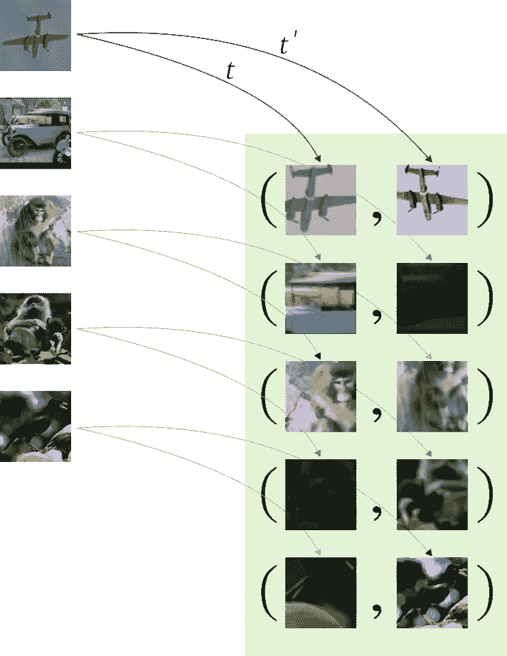

# 探索 SimCLR:视觉表征对比学习的简单框架

> 原文：<https://towardsdatascience.com/exploring-simclr-a-simple-framework-for-contrastive-learning-of-visual-representations-158c30601e7e?source=collection_archive---------10----------------------->

## 从头开始用一个 [PyTorch 实现 SimCLR](https://github.com/sthalles/SimCLR)

# 介绍

很长一段时间以来，我们知道迁移学习在计算机视觉(CV)应用中的好处。如今，预训练的深度卷积神经网络(DCNNs)是学习新任务的第一个首选预解决方案。这些大型模型是在巨大的监督语料库上训练的，比如 ImageNet。最重要的是，它们的特点是能很好地适应新问题。

当缺少带注释的训练数据时，这一点尤其有趣。在这种情况下，我们采用模型的预训练权重，在其上添加一个新的分类器层，并重新训练网络。这被称为**迁移学习**，是 CV 中使用最多的技术之一。除了在执行**微调**时的一些技巧(如果是这样的话)，已经(多次)表明:

> 如果为一项新任务进行训练，用预训练权重初始化的模型往往比使用随机初始化从零开始训练的模型学习得更快、更准确。

然而，正如人们可能猜测的那样，在这个过程中存在一个瓶颈。目前大多数迁移学习方法依赖于在监督语料库上训练的模型。但是问题是注释数据并不便宜。

如果我们环顾四周，数据，以一种无人监管的方式，是丰富的。因此，使用未标记的数据来学习表示是有意义的，这些表示可以用作训练更好的监督模型的代理。**事实上，这是一个长期存在的问题，正如我们将看到的，当前对无监督表示学习的研究终于赶上了有监督的方法。**

# 无监督表示学习

无监督表示学习关注于解决以下问题:

> 我们如何从未标记的数据中学习好的表示？

除了什么是好的表示的问题之外，从未标记的数据中学习也有很大的潜力。它可以开启许多当前迁移学习无法解决的应用。然而，从历史上看，无监督的表示学习比有监督的表示学习要困难得多。

作为一个简单的例子，让我们考虑乳腺癌检测的任务。目前，所有最佳解决方案都使用 ImageNet 预训练模型作为优化流程的起点。有趣的是，尽管乳腺癌幻灯片图像和常规 ImageNet 样本之间存在显著差异，但迁移学习假设在某种程度上仍然成立。

大致来说，大多数用于乳腺癌检测的监督数据集，如[camelion 数据集](https://camelyon17.grand-challenge.org/)，在大小和可变性方面都无法与常见的计算机视觉监督数据集相比。另一方面，我们有大量未加注释的乳腺癌幻灯片图像。因此，如果我们可以从无监督的(大得多的语料库)中学习良好的表示，这肯定会有助于学习更多特定的下游任务，这些任务具有有限的注释数据。

幸运的是，视觉无监督表示学习已经显示出巨大的前景。更具体地说，使用基于对比的技术学习的视觉表现现在达到了通过监督方法学习的水平——在一些自我监督的基准测试中*。*

*让我们探索一下无监督的对比学习是如何工作的，并仔细看看该领域的一项主要工作。*

# *对比学习*

> *对比法的目的是通过强制相似元素相等而不相似元素不同来学习表征。*

*最近几个月，我们看到了基于这些原则的无监督深度学习方法的爆炸式增长。事实上，在线性分类基准中，一些自我监督的基于对比的表示已经匹配基于监督的特征。*

*对比学习的核心是噪声对比估计(NCE)损失。*

**

*上式中，可以把 ***x+*** 看作类似于输入 ***x*** 的数据点。换句话说，观察值 ***x*** 和 ***x+*** 是相关的，并且一对 ***(x，x+)*** 代表一个**正例**。通常情况下， ***x+*** 是对 ***x*** 进行某种变换的结果。这可以是旨在改变 ***x*** 的大小、形状或方向的几何变换，或者任何类型的数据增强技术。一些例子包括*旋转、透明、调整大小、剪切等等*。*

*另一方面， ***x-*** 是与 ***x*** 不同的例子。对 ***(x，x-)*** 形成了一个**反例**，它们应该是不相关的。在这里，NCE 损失将迫使他们不同于积极的一对。**注意，对于每个正对 *(x，x+)* 我们有一组 K 个负对**。事实上，经验结果表明，需要大量的否定才能获得良好的表象。*

****sim(。*)**函数是一个相似性(距离)度量。它负责最小化阳性之间的差异，同时最大化阳性和阴性之间的差异。 ***经常，sim(。)*** 用**点积**或**余弦相似度**来定义。*

*最后， ***g(。*)**是一种卷积神经网络编码器。具体来说，最近的对比学习架构使用暹罗网络来学习正面和负面示例的嵌入。这些嵌入然后作为输入传递给对比损失。*

*简单地说，我们可以把对比任务看作是试图在一堆否定中找出肯定的例子。*

# *视觉表征对比学习的简单框架——sim clr*

*SimCLR 使用上述对比学习的相同原则。在本文中，该方法在自监督和半监督学习基准中实现了 SOTA。它引入了一个简单的框架来学习基于大量数据扩充的无标签图像的表示。**简单来说，SimCLR 使用对比学习来最大化同一图像的两个增强版本之间的一致性**。*

**

**学分:* [*视觉表征对比学习的简单框架*](https://sthalles.github.io/simple-self-supervised-learning/#1)*

*为了理解 SimCLR，让我们探索一下它是如何建立在对比学习框架的核心组件之上的。*

*给定一个输入图像，我们通过应用两个独立的数据扩充操作符来创建它的两个相关副本。这些变换包括(1) *随机裁剪和调整大小* , (2) *随机颜色扭曲*,( 3)*随机高斯模糊*。*

*操作的顺序是固定的，但是由于每个操作都有自己的不确定性，这使得结果视图在视觉上有所不同。**请注意，由于我们在同一幅图像上应用了 2 个不同的增强函数，如果我们对 5 幅图像进行采样，我们最终会得到批次**中的*2**×****5 = 10*个增强观察值。参见下面的视觉概念。***

**

*为了最大化底片的数量，想法是将批中的每个图像(索引为 ***i*** )与所有其他图像(索引为 ***j*** )配对。**注意，我们避免将观察 *i* 与其自身以及其扩充版本**配对。结果，对于批中的每个图像，我们得到 ***2 ×(N-1)*** 负对— *，其中 N 是批大小*。*

**

*注意，同样的方法适用于给定观测的两个扩充版本。这样，负对的数量增加得更多。*

*而且通过这种方式排列否定样本， **SimCLR 的优点是不需要额外的逻辑来挖掘否定。为了有一个概念，最近的实现像 PIRL T21 和 MOCO 分别使用一个存储体和一个队列来存储和采样大批量的底片。***

*事实上，在最初的实现中，SimCLR 的批处理大小为 8192。按照这些想法，这个批量产生每个正样本对 16382 个负样本。此外，作者还表明，更大的批次(因此更多的阴性)往往会产生更好的结果。*

**

*SimCLR 使用 [ResNet-50](https://arxiv.org/abs/1512.03385) 作为主要的 ConvNet 主干。ResNet 接收形状为 **(224，224，3)** 的增强图像，并输出 2048 维嵌入向量 ***h*** 。然后，一个投影头**g*(。)*** 应用于嵌入向量*产生最终表示 ***z = g(h)*** 。**投影头 *g(。)*** 是一个有 2 个密集层的多层感知器(MLP)。两层都有 2048 个单位，隐藏层具有非线性(ReLU)激活功能。**

**对于相似度函数，作者使用余弦相似度。它测量 d 维空间中两个非零向量之间角度的余弦值。如果两个向量之间的角度为 0 度，则余弦相似度为 1。否则，它输出一个小于 1 一直到-1 的数。注意，对比学习损失作用于投影头 ***g(.)***—****z****嵌入向量*。***

**一旦系统被训练好，我们就可以通过把投影头**g*(。)*** 并使用表象 ***h*** (直接来自 ResNet)来学习新的下游任务。**

****

# **培训和评估**

**一旦对比学习目标的组成部分就位，系统的训练就简单了。你可以在这里看一下我的[实现](https://github.com/sthalles/SimCLR)。**

**为了训练模型，我使用了 STL-10 数据集。它包含 10 个不同的类，每个类有合理的少量观察值。最重要的是，它包含一个更大的无监督集，其中有 *100000* 个未标记的图像——这是用于训练的大部分图像。**

**对于这个实现，我使用 ResNet-18 作为 ConvNet 主干。它接收形状为 **(96，96，3)** 、常规 STL-10 尺寸的图像，并输出尺寸为 **512** 的矢量表示。**投影头 *g(。)*** 有 2 个全连通层。每层有 512 个单元，产生最终的 64 维特征表示 ***z*** 。**

**为了训练 SimCLR，我采用了数据集的 ***训练+未标记的*** 部分— *，总共给出了 105000 个图像*。**

**在训练之后，我们需要一种方法来评估 SimCLR 所学习的表示的质量。一种标准方法是使用**线性评估协议*。*****

**想法是在来自 SimCLR 编码器的固定表示上训练线性分类器。为此，我们获取训练数据，将其传递给预训练的 SimCLR 模型，并存储输出表示。注意，此时，我们不需要投影头 ***g(。)*再也没有**了。**

**这些固定的表示然后被用于使用训练标签作为目标来训练逻辑回归模型。然后，我们可以测量测试的准确性，并使用它作为特性质量的度量。**

**这个 [Jupyter 笔记本](https://github.com/sthalles/SimCLR)显示了评估协议。使用 SimCLR 固定表示作为训练信号，我们达到了 64%的测试精度。有一个想法，对训练数据执行 PCA 并保留最重要的主成分，我们得到的测试精度只有 36%。这强调了 SimCLR 所学习的特征的质量。**

# **一些最后的评论**

**最初的 SimCLR 论文还提供了其他有趣的结果。其中包括:**

*   ***非监督对比特征学习在半监督基准上的结果；***
*   ***向投影头添加非线性层的实验和益处；***
*   ***使用大批量的实验和好处；***
*   ***用对比目标训练大型模型的结果；***
*   ***对比学习中使用多种强数据扩充方法的消融研究；***
*   ***标准化嵌入对训练基于对比学习的模型的好处；***

**我鼓励你看看这篇文章，了解更多的细节。**

****感谢阅读！****

# ****参考文献****

**陈，丁等，“视觉表征对比学习的一个简单框架”arXiv 预印本 arXiv:2002.05709 (2020)。**

**米斯拉、伊山和劳伦斯·范德马腾。"借口不变表征的自我监督学习."arXiv 预印本 arXiv:1912.01991 (2019)。**

**何，，等，“无监督视觉表征学习中的动量对比”arXiv 预印本 arXiv:1911.05722 (2019)。**

***-何，，等，“深度残差学习在图像识别中的应用”IEEE 计算机视觉和模式识别会议录。2016.***

***原载于*[*https://sthalles . github . io*](https://sthalles.github.io/simple-self-supervised-learning/)*。***