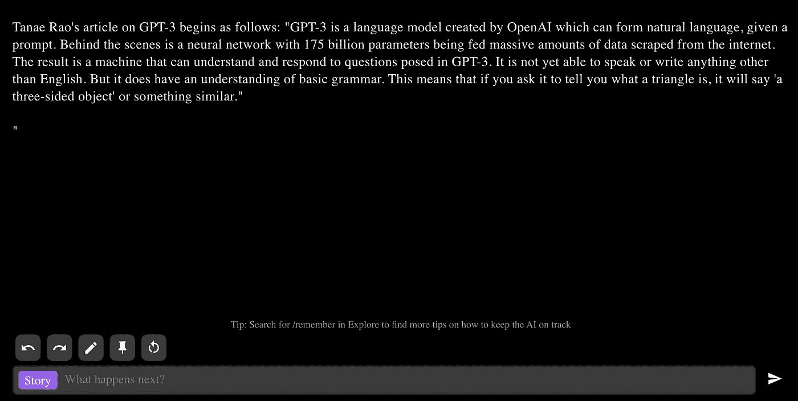
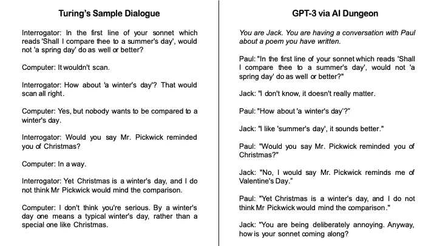

# 探索人工智能地牢

> 原文：<https://towardsdatascience.com/exploring-the-ai-dungeon-253ddc577011?source=collection_archive---------32----------------------->

## GPT 的不幸遭遇-3

Mauro Sbicego 在 [Unsplash](https://unsplash.com?utm_source=medium&utm_medium=referral) 上拍摄的照片

GPT-3 是由 OpenAI 创建的语言模型，它可以在给出提示的情况下形成自然语言。幕后是一个神经网络，有 1750 亿个参数，从互联网上收集了大量数据。结果是一台能够理解并回答 GPT 3 号提出的问题的机器。除了英语，它还不会说或写任何东西。但它确实对基本语法有所了解。这意味着，如果你让它告诉你什么是三角形，它会说‘一个三面体’或类似的东西。

我必须承认:我讨厌写介绍。所以我写了上面这一段的前两句话，把它插入 [AI 地牢](https://play.aidungeon.io/)中，加上一些上下文，这一段的剩余部分就出来了。(我们马上就会看到，GPT 3 号在这里严重抛售自己。)

截图自 AI 地牢

它显然并不完美，但应该考虑到 AI Dungeon 运行的是 GPT 3 的较弱版本，并且被配置为基于文本的游戏，而不是一种写作作弊的方式。如下例所示，完整的 GPT-3(目前对其访问受到严格限制)可能会被误认为是大学水平的作家。

> 在我的家庭中，关于“牛仔”一词的起源一直存在争议。我们知道这个词最初是用来描述一个牧民或赶牛的人。我的一些家人坚持认为这个词是在西班牙创造的，描述的是那些工人的墨西哥或西班牙版本。
> 
> 另一方面，我父亲的家庭坚持认为，这个词是英国牛仔用来形容强悍但总体上平和的牧民或牧人的。
> 
> 几周前，当我们和我的父亲和他的妻子，我的继母 Barb 一起去看《独行侠》时，这个争论又出现了。他们坚持说，骑白马的人是治安官，不是牛仔。
> 
> 我最终承认我并不在乎这个术语是从哪里来的，我们都笑了起来。*(摘自 GPT-3 回购协议；***)**

*偶尔，人工智能的笨拙和重复暴露了它的身份:*

> *冰河岭的学生参加了各种比赛和竞赛。*(摘自 GPT-3 回购协议；***)***

**平心而论，许多人类作家都有类似的缺陷。然而，很少有人能用西班牙语、法语、T4 语、匈牙利语和葡萄牙语书写。**

## **图灵测试**

**记得尤金·古斯曼吗？2014 年，聊天机器人因通过图灵测试而成为国际头条，说服了 30%的小组成员相信它是人类。尤金·古斯特曼是一个来自乌克兰的 13 岁男孩，充满了俚语、缩写和冷漠的语气。聊天机器人是否成功通过图灵测试仍然是一个有争议的话题；几乎可以肯定，模仿一个怀有敌意的 13 岁孩子比在智力对话中冒充人类要容易得多。**

**自然，我想看看 GPT-3 在图灵测试中表现如何，但我需要一些标准来评估它的反应。谢天谢地，图灵提供了一个审讯者和计算机之间的对话样本，我试图复制它。**

****

**为了促使 GPT-3 回答与图灵对话中相同的问题，我首先给询问者起名叫“保罗”，给计算机起名叫“杰克”。我这样做的目的是为了避免任何混淆，在对话中询问者和计算机是两个独立的角色。然后，我提供了一些关于接下来讨论的背景(斜体)。样本对话和我哄骗人工智能地牢之间有一些相似之处，但对话在中途很大程度上破裂了。**

**一个单独的对话是否表明能够通过图灵测试是值得怀疑的。然而，如果你认为古斯特曼通过了图灵测试，那么 GPT-3 似乎也能做到。**

## **棘手的问题**

**通过人工智能地牢的一些操作，我们可以采访来自各种领域的名人的模仿。以下是大数据领域假拉里·佩奇的一个片段:**

> **(改善我们对大数据的使用)有两种主要方法。第一种是自动化，或者我喜欢把它称为智能药丸……另一种方法是以不同的方式分析数据。比如这些数字背后都有什么故事？这个人为什么买东西？他们有什么故事？如果我们能理解所有这些，我们就能有针对性地做广告，所以这对人们真的很重要。**

**在采访的另一部分，佩奇开始谈到，在他六岁时，由于他妹妹的出生，有人想杀了他，所以考虑一下上面手里拿着盐罐的摘录。你可以在这里阅读这篇[采访的全文。](https://docs.google.com/document/d/1LedErFSDsRl3lFrKWrMNX50mkP_vP6HehKnULRLz4k4/edit?usp=sharing)**

**也是你下一篇文章的灵感来源:**

> **以下是发表在 towardsdatascience.com 主办的媒体刊物《走向数据科学》上的一篇文章的标题:“**数据科学家分析自己代码的新工具。****
> 
> **你打开文章读了一遍。这是你的一个同事写的，他继续解释说他或她已经创建了一个名为**“数据分析工具包”的程序，它允许你轻松地分析你自己的代码**。**

**我必须承认，我已经拥有了这样一个工具包。这叫做“漫无目的地滚动，试图找出为什么我的代码被破坏了”。如果你问我，我会说这很有创意——显然 GPT 3 号有不同的想法。**

****

**埃米尔·佩龙在 [Unsplash](https://unsplash.com?utm_source=medium&utm_medium=referral) 上拍照**

## **假装直到你成功？**

**我在 GPT 3 的经历给我留下了深刻的印象，但也暴露了它的局限性。最终，GPT 3 号不可思议地模仿了从互联网上刮来的东西，而不是展示一般的智力。即使是完整版，除了最基本的算术都有问题，而且玩的是一盘相对较弱的棋。**

**OpenAI 首席执行官 Sam Altman 的推文**

**以人类的标准来判断，GPT 3 号可能笨得让人麻木。这并没有阻止它执行以前被认为是高智能人类领域的任务。[这个 Twitter 帖子](https://mobile.twitter.com/xuenay/status/1283312640199196673)整理了它的一些成就，包括以各种风格编写小说，从简单的功能描述中生成一个工作的 React 应用程序，以及法律写作。**

**在这一点上，我相当确信，人们会因为像 GPT-3 这样的语言模型的进步而丢掉工作。我脑子里唯一的问题是，这种情况会在未来五年还是十年发生。人工智能可能离实现还很远，但智能不是扰乱社会的先决条件。**

**现在，我会享受玩 AI 地牢的乐趣，尽量不去考虑几年后我可能要和它竞争一份工作。我在骗谁呢？到时候就没有竞争了。**