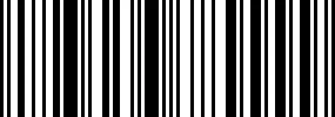
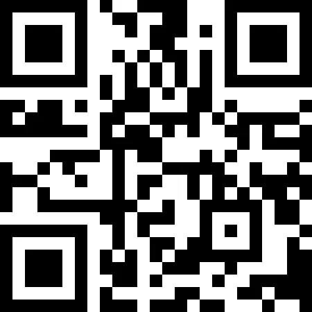
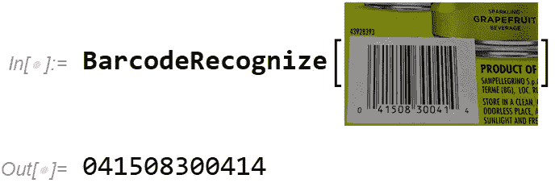

# 探索条形码世界

> 原文：<https://towardsdatascience.com/exploring-the-barcode-universe-6c80dbebb356?source=collection_archive---------50----------------------->

## 用 Wolfram 语言编写的计算思维故事


Johannes Plenio 在 [Unsplash](https://unsplash.com/s/photos/forest?utm_source=unsplash&utm_medium=referral&utm_content=creditCopyText) 上拍摄的照片

人类无法理解，但对电脑和手机来说却是小菜一碟:条形码无处不在。每一件产品，每一个包装，每一个货架上都有大量的细菌。黑白图案，通常是线，有时是点，为我们的硅朋友提供了一个小数字，概括了这个物体的所有内容。

像 barcodelookup.com[这样的在线服务提供了拥有数百万商品的数据库，将这些小数字转化为丰富的信息，如产品名称、产品类别和特定供应商的信息。](https://www.barcodelookup.com/)

在 Wolfram 语言中，您可以读取条形码，也可以创建条形码图像。它没有内置的服务来解释条形码，但在这个故事中，我将向您展示如何从 BarcodeLookup 服务连接到 API。

先从自己生成条形码说起。这里使用的函数叫做 [BarcodeImage](https://reference.wolfram.com/language/ref/BarcodeImage.html) 。它可以生成最常见类型的条形码。例如，这会生成一个 UPC 条形码图像:

```
BarcodeImage["123456789999", "UPC"]
```



(图片由作者提供)

这是一个二维码的例子。大多数智能手机会在你将摄像头对准网页时打开网页:

```
BarcodeImage["https://www.wolfram.com", "QR"]
```



(图片由作者提供)

自动识别条形码是通过[条形码识别](https://reference.wolfram.com/language/ref/BarcodeRecognize.html)功能完成的。即使条形码只是图像的一部分，它也能工作，尽管它偶尔会拾取一个“偏离的”条形码。在这种情况下，结果是正确的:



(图片由作者提供)

接下来，为了解释代码“04150800414 ”,我编写了一个简单的 Wolfram 语言函数，它绑定到条形码查找服务的 API。

 [## 条形码查找

### 在线查找条形码

www.wolframcloud.com](https://www.wolframcloud.com/obj/arnoudb/DeployedResources/Function/BarcodeLookup) 

可以通过其名称来访问它:

```
BarcodeLookup = ResourceFunction[
 "user:arnoudb/DeployedResources/Function/BarcodeLookup"
]
```

现在我们可以查找产品信息了。“密钥”是一个由[条形码查找服务 API](https://www.barcodelookup.com/api) 要求并提供的小型字母数字字符串。

```
product = BarcodeLookup["041508300414",key]
```


例如，您可以通过编程方式向下钻取产品名称:

```
In[]:= product["products", 1, "product_name"]Out[]= "San Pellegrino Pompelmo Grapefruit Sparkling Fruit Beverage, 11.15 Fl. Oz., 6 Count"
```

这里的应用可能性几乎是无限的。有了这些功能，构建跟踪库存、生成报告和自动重新进货程序的应用程序变得很容易。