# 探索冠状病毒数据集

> 原文：<https://towardsdatascience.com/exploring-the-corona-virus-dataset-781de3a636e2?source=collection_archive---------12----------------------->

## 新型冠状病毒 2019 数据集的探索性数据分析


马库斯·斯皮斯克在[的照片](https://www.pexels.com/photo/coronavirus-statistics-3970327/)

在本帖中，我们将对新型冠状病毒 2019 数据集进行简单的探索性数据分析。数据集可以在 [Kaggle](https://www.kaggle.com/sudalairajkumar/novel-corona-virus-2019-dataset) 上找到。该数据包含 2019 年病例数、死亡数和恢复数的每日信息。数据集“covid_19_data.csv”包含以下各列:

1.  Sno —序列号
2.  观察日期—观察的日期，以年/月/日为单位
3.  省/州—观察的省或州
4.  国家/地区—观察国
5.  上次更新时间-以 UTC 表示的给定省或县的行更新时间
6.  已确认—截至该日期的累计已确认病例数
7.  死亡人数——截至该日期的累计死亡人数
8.  已恢复—到该日期为止已恢复案例的累计数量

让我们将数据读入熊猫数据框:

```
import pandas as pddf = pd.read_csv("covid_19_data.csv")
```

让我们打印前五行数据:

```
print(df.head())
```

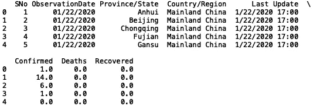

我们可以做的第一件事是在“Confirmed”列上生成一些统计数据。让我们来看看确诊病例的均值和标准差:

```
print("Mean: ", df['Confirmed'].mean())
print("Standard Deviation: ", df['Confirmed'].std())
```

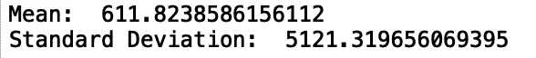

我们还可以生成已确认累积病例的直方图:

```
import seaborn as sns 
import matplotlib.pyplot as plt
sns.set()
plt.title("Confimed Cases Histogram")
df['Confirmed'].hist(bins = 10)
```

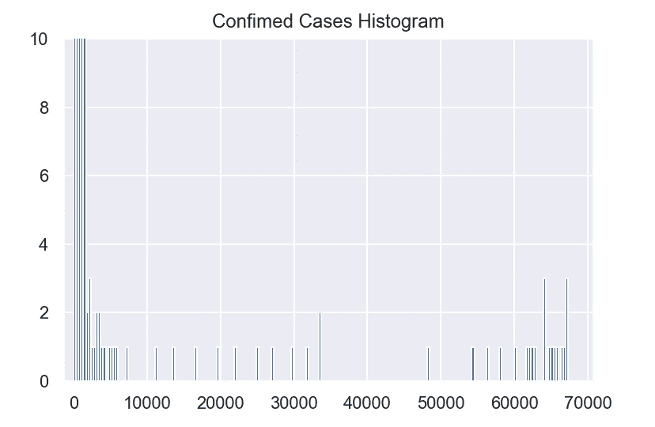

我们可以为恢复的案例生成类似的统计数据:

```
print("Mean: ", df['Recovered'].mean())
print("Standard Deviation: ", df['Recovered'].std())
```


并绘制直方图:

```
plt.title("Recovered Cases Histogram")
sns.set()
df['Recovered'].hist(bins = 200)
```

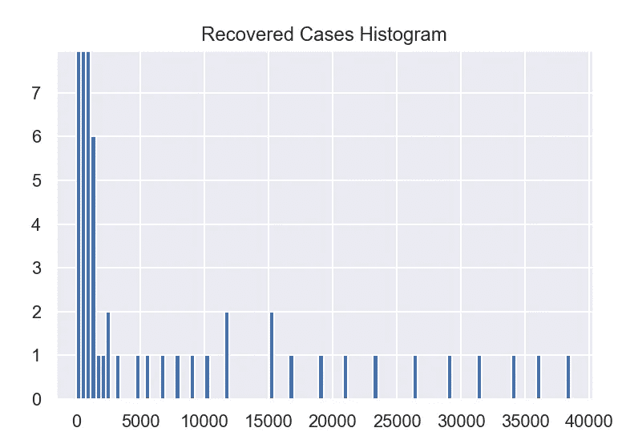

最后，我们可以看看死亡的统计数据:

```
print("Mean: ", df['Deaths'].mean())
print("Standard Deviation: ", df['Deaths'].std())
```


以及直方图:

```
plt.title("Deaths Histogram")
sns.set()
df['Deaths'].hist(bins = 200)
```

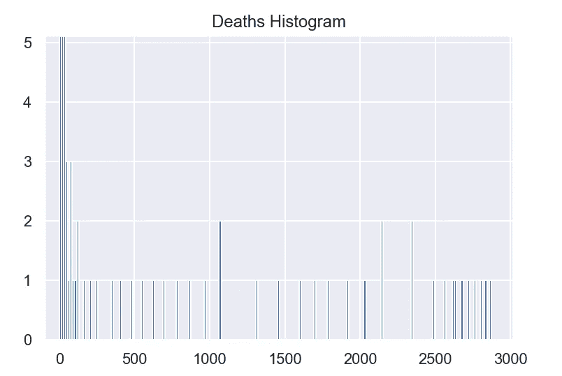

我们还可以使用 collections 模块中的“Counter”方法查看省/州的频率:

```
from collections import Counter
print(Counter(df['Province/State'].values))
```

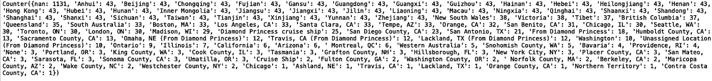

让我们删除缺失的值，并将计数器限制为仅输出五个最常见的省份:

```
df.dropna(inplace=True)
print(Counter(df['Province/State'].values).most_common(5))
```

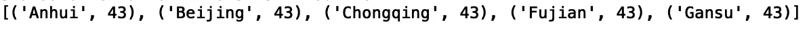

我们还可以使用盒状图来显示基于最小值、最大值、中值、第一个四分位数和第三个四分位数的数值分布。如果你对它们不熟悉，可以看看文章[了解盒图](/understanding-boxplots-5e2df7bcbd51)。

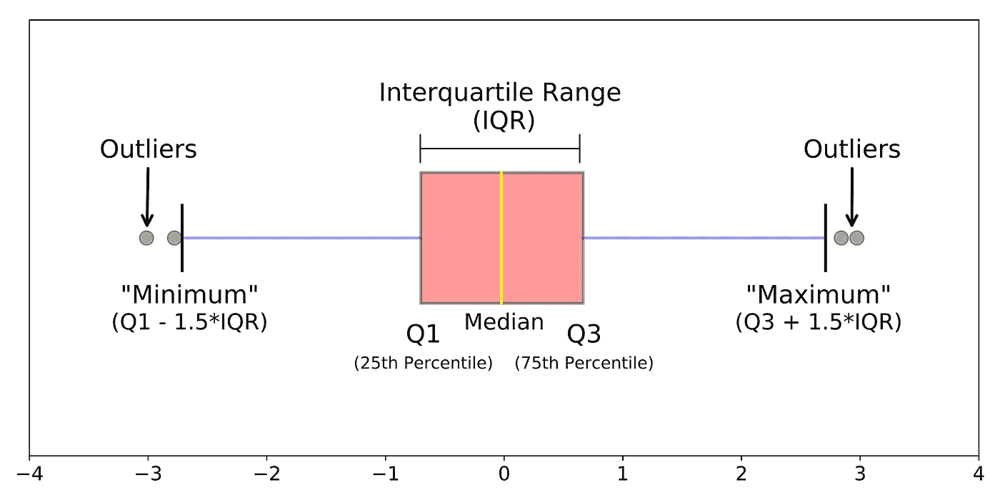

[来源](/understanding-boxplots-5e2df7bcbd51)

例如，让我们绘制“安徽”、“北京”和“重庆”确诊病例的分布图:

```
df = df[df['Province/State'].isin(['Anhui', 'Beijing', 'Chongqing'])]
sns.boxplot(x= df['Province/State'], y = df['Confirmed'])
plt.show()
```

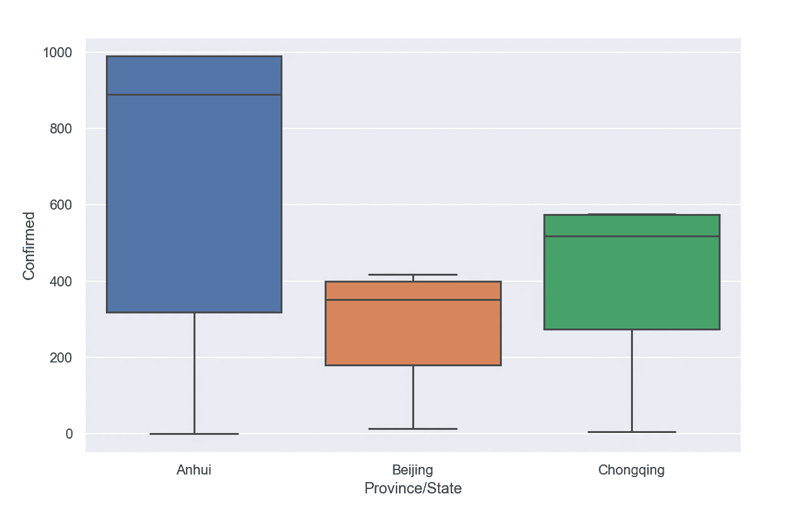

我们可以对恢复的案例做同样的事情:

```
df = df[df['Province/State'].isin(['Anhui', 'Beijing', 'Chongqing'])]
sns.boxplot(x= df['Province/State'], y = df['Recovered'])
plt.show()
```

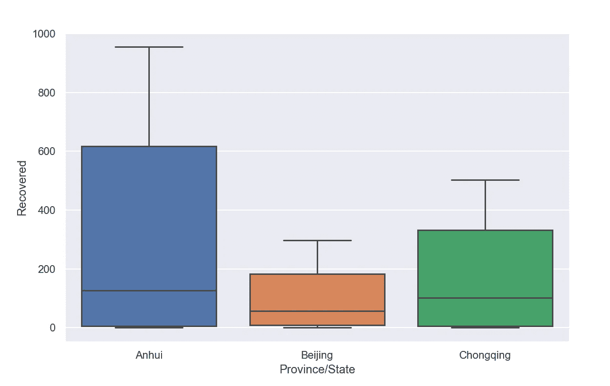

对于死亡:

```
df = df[df['Province/State'].isin(['Anhui', 'Beijing', 'Chongqing'])]
sns.boxplot(x= df['Province/State'], y = df['Deaths'])
plt.show()
```

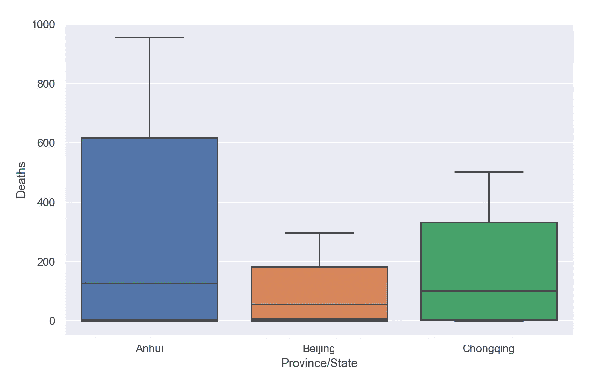

我就讲到这里，但是您可以随意使用数据并自己编码。这篇文章的代码可以在 GitHub 上找到。感谢您的阅读！