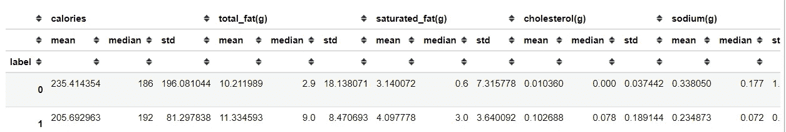

# 探索数据:从食物营养中学习

> 原文：<https://towardsdatascience.com/exploring-the-data-learn-from-the-food-nutrition-a4ea2110522a?source=collection_archive---------18----------------------->

## 在没有明确目标的情况下，我们可以尝试从数据中探索什么


布鲁克·拉克在 [Unsplash](https://unsplash.com?utm_source=medium&utm_medium=referral) 拍摄的照片

我喜欢探索我的数据，并从中发现意想不到的模式。作为一名数据科学家，在我个人看来，我们需要具备这种好奇心特质，才能在这个领域取得成功。探索数据的方法不仅限于诸如可视化数据和获得统计数字的基本技术，一种方法是实现机器学习。

机器学习也是一种探索数据的技术，而不仅仅是人们经常喜欢宣传的预测目的。这就是为什么我经常专注于理解模型的概念，以了解我的数据是如何处理的；更好地了解我们的数据发生了什么变化。

在本文中，我想介绍通过无监督学习来探索数据，我们可以从统计数字和数据挖掘技术中获得什么信息。在这里，因为我的爱好之一是烹饪，我将使用来自 Kaggle 的关于普通食物和产品的食物营养价值的[数据集](https://www.kaggle.com/trolukovich/nutritional-values-for-common-foods-and-products)。我想探究这些数据，既是为了学习，也是为了满足自己的好奇心。这意味着，我在这里的目标只是知道我的数据中发生了什么，以及我可以获得什么样的信息，而没有任何特定的目标。让我们开始吧。

# 探索数据

## 数据清理

首先，我们需要阅读我们的数据，了解我们的数据如何。这是重要的第一步。

```
import pandas as pd
import matplotlib.pyplot as plt
import seaborn as snsdata = pd.read_csv('nutrition.csv')
data.head()
```


```
data.info()
```


我们实际上有 76 列，我没有在这里全部显示(这将是一个很长的列表)，数据示例如上表所示。

我们的大部分数据是由营养值(卡路里、脂肪、糖、碳水化合物等)组成的。)与美食名。营养值栏有不同的度量单位，如克(克)、毫克(毫克)和微克(微克)。在这种情况下，我们还可以忽略功能 serving_size，因为除了所有数据都基于 100 克食物之外，它不提供任何其他信息。一些列还包含一个 NaN 值，我相信这个 Null 值意味着有等于 0 的值。现在，让我们做一些数据清理。

```
#Drop the serving_size column
data.drop('serving_size', axis = 1, inplace = True)#Fill the NaN value with 0
data.fillna(0, inplace = True)
```

在这种情况下，我希望除了 name 特性之外的所有特性都变成数字列。这意味着，我们需要删除数据中所有的非数字文本。我还想转换除卡路里以外的所有数字数据，使其具有相同的度量(克)。让我们开始吧。

```
#I would use Regular Expression Module to help me clean the data
import re#Looping in each non-numerical features except the name feature 
for col in data.drop('name',axis = 1).select_dtypes(exclude = 'number').columns:
    for i in data[col]:
        if i == '0' or i == 0:
            pass
        else:
            point = re.findall('[a-zA-Z]+',i)[0]
            replace = []
            if point == 'mg':
                for j in data[col]:
                    if j == '0' or j == 0:
                        replace.append(float(j))
                    else:
                        replace.append(float(re.sub('[a-zA-Z]','',j))/1000)
            elif point == 'mcg':
                for j in data[col]:
                    if j == '0' or j == 0:
                        replace.append(float(j))
                    else:
                        replace.append(float(re.sub('[a-zA-Z]','',j))/1000000)  
            else:
                 for j in data[col]:
                    if j == '0' or j == 0:
                        replace.append(float(j))
                    else:       
                        replace.append(float(re.sub('[a-zA-Z]','',j)))

            data[col] = replace    
            data.rename({col:col+'(g)'}, axis =1, inplace = True)
            break
```

这是我的数据的最终结果，我将进一步探索。请注意，我知道除了卡路里之外，所有数据现在都是以克为单位，但只是为了学习，我将它添加到我的列名中，这样我们就不会忘记它。


我还创建了另一个名为 food_categories 特性，因为当仔细检查这个命名特性时，逗号前面的第一个单词就是 food。

```
data['food_categories'] = data['name'].apply(lambda x: x.split(',')[0])
```

## 数字统计

如果我们试图一个接一个地可视化这些列，这将是巨大的并且有点重复，因为它不会给我们提供太多的信息。如果你愿意，你可以试试。我可以给你下面的代码。

```
for i in data.select_dtypes('number').columns:
    sns.distplot(data[i])
    plt.title(i)
    plt.show()
```

有时候，在这种情况下，如果我们真的只是想探索数据，通过数字而不是可视化来看会更直观(毕竟我是一个更注重数字的人，因为我相信有时可视化是有偏见的)。

```
pd.set_option('display.max_columns', None)
data.agg(['mean', 'median', 'std', 'skew', 'kurtosis'])
```


例如，在这里，我使用。数据帧的 agg 方法，用于获取关于每列的平均值、中值、标准差、偏斜度和峰度的信息。这就是数字比形象更有说服力的地方。

众所周知，平均值是数据的平均值。多个要素可能具有相同的平均值，但它们在平均值周围的分布方式不同，这通过标准差(std)来表示。有一个规则叫做经验规则，我们可以通过标准差得到数据扩散的概率。经验法则表明:

*   68%的数据低于平均值 1 *标准差
*   我们 95%的数据低于平均值 2 *标准差
*   我们 99.7%的数据都低于平均值 3 *标准差

经验法则或者也有人说 68–95–99.7 法则经常被用来分析数据异常值。这种统计的主要问题是，它们会受到异常值或极值的影响，并经常导致数据失真。我用一张图片向你展示什么是扭曲的数据。


以上是 total_fat(g)特性图。它向右倾斜，因为尾巴在右边。但是，偏斜度有多大呢？这就是不对称统计的目的。我们可以记住关于**偏斜度**的一些规则是:

*   如果偏斜度在-0.5 和 0.5 之间，数据是相当对称的
*   如果偏斜度介于-1 和-0.5 之间或介于 0.5 和 1 之间，则数据是中度偏斜的
*   如果偏斜度小于-1 或大于 1，则数据是高度偏斜的

所以我们可以看到，如果我们上面的数据是高度倾斜的，实际上你会遇到的大多数数据都是这样的。那么峰度呢？这个统计数字告诉我们什么？**峰度**是衡量数据相对于正态分布是重尾还是轻尾的指标。这一分析可总结如下:

*   如果峰度接近于 0，那么通常假设正态分布。这些被称为中 kurtic 分布。
*   如果峰度小于 0，则该分布是轻尾的，称为宽峰分布。
*   如果峰度大于 0，那么该分布具有较重的尾部，称为细峰分布。

如果我们把它形象化，它看起来会像下面的图片。


过度峰度取自[booglehead.com](https://www.bogleheads.org/wiki/Excess_kurtosis)

准确地说，我们之前的数据被称为**过度峰度**，其中正态分布以峰度为 0 来衡量。如果我们只讨论峰度，正态分布将等于 3，这就是为什么在过度峰度中，我们将峰度减去 3。

我们的大部分数据都是不准确的。扭曲的数据实际上非常有趣，因为你可以尝试用它来探索。例如，基于卡路里，什么食物被认为是异常值。

由于我们的数据是足够偏斜的，我不会依靠平均值来发现异常值；相反，我会应用基于中位数的 **IQR** 方法。

IQR 或四分位距是基于数据位置的。例如，如果我们描述“卡路里”特征，我们将得到下面的描述。

```
data['calories'].describe()
```


IQR 将基于 25%的位置或 Q1 和 75%的位置或第三季度。我们也可以通过用 Q1 减去 Q3 得到 IQR 值(Q3-Q1)。使用 IQR 方法，我们可以根据上限或下限来决定哪些数据被视为异常值:

**下限**= Q1–1.5 * IQR

**上限=** Q3 + 1.5 * IQR

任何高于或低于此限值的数据都将被视为异常值。让我们试着实现这个方法，看看什么样的食物被认为是基于卡路里的异常值。

```
#Specifying the limit
cal_Q1 = data.describe()['calories']['25%']
cal_Q3 = data.describe()['calories']['75%']
cal_IQR = cal_Q3 - cal_Q1data[(data['calories'] < 1.5 * (cal_Q1 - cal_IQR)) | (data['calories'] > 1.5 * (cal_Q3 + cal_IQR)) ]['food_categories'].value_counts()
```


事实证明，大部分高热量食物是油，这并不奇怪。

## 无监督学习

上面我向你展示了一种从数字上探索数据的方法，现在我想向你展示一个机器学习如何帮助我们探索数据的例子。

无监督学习是一种机器学习，我们没有任何特定的学习目标。一个例子是聚类分析，我们向模型提供数据，输出是一个数据聚类，其中最接近的数据被视为一个聚类。

我喜欢做的是，如果我们没有任何探索数据的特定目标，我们可以让机器学习来为我们学习。使用无监督学习，我们可以获得以前没有意识到的新视角。让我们用我最喜欢的聚类分析算法举例说明。

我最喜欢的聚类算法是**凝聚聚类**分析，你可以在这里详细阅读[。基本上，该分析将每一个数据点分配为一个单独的聚类，并通过合并每个聚类来进行，因此我们只剩下一个聚类。](/breaking-down-the-agglomerative-clustering-process-1c367f74c7c2)

现在，在我们进行分析之前，我们需要准备数据。聚类分析取决于数据之间的距离。数据的距离会受到其比例的影响，这就是为什么我们还需要转换所有的要素，使其具有相同的比例。如果你还记得，我们已经在我们的功能中的每一个单独的列都是以克为单位的，但是有一个“卡路里”列不是在同一个刻度上。这就是为什么我们仍然需要转换数据。通常我们会将数据转换为遵循标准分布，这就是我们要做的。

```
#Importing the transformer
from sklearn.preprocessing import StandardScaler#Transforming the data, I drop the name feature as we only need the numerical columnscaler = StandardScaler()
training = pd.DataFrame(scaler.fit_transform(data.drop('name', axis =1)), columns = data.drop('name', axis =1).columns)
```


这就是我们最终得到的，一个每个要素都具有相同比例的数据集。现在，让我们尝试通过聚集聚类来对数据进行聚类。首先，我们想象集群最终会如何。

```
from scipy.cluster.hierarchy import linkage, dendrogram#Ward is the most common linkage method
Z = linkage(training,method = 'ward')
dendrogram(Z, truncate_mode = 'lastp')
plt.xticks(rotation = 90, fontsize = 10)
plt.ylabel('Distance')
plt.xlabel('Cluster')
plt.title('Agglomerative Clustering')
```


上面是凝聚聚类生成的树。它只显示最后 30 个合并事件，因为如果我们在这里全部显示，它会被挤满。正如我们所看到的，数据似乎可以分为两类；当然，如果你想更保守一点，它可以分为 3 个集群，因为在上面的可视化中有证据表明它可能是这样的。尽管如此，我现在会把它保持为两个集群。

让我们回到之前的数据，将凝聚聚类结果输入到我们的数据中。

```
from sklearn.cluster import AgglomerativeClustering#I specify n_clusters to be 2 based on our previous analysis
ach = AgglomerativeClustering(n_clusters = 2)
ach.fit(training)#Input the label result to the data
data['label'] = ach.labels_
```

现在，通过无监督学习，我们实际上可以尝试将多维数据可视化成两个轴。有几种方法可以做到这一点，但我会向你展示一种叫做 t-SNE 的技术。

```
from sklearn.manifold import TSNE#t-SNE is based on a stochastic (random) process, that is why I set the random_state so we could repeat the resulttsne = TSNE(random_state=0)
tsne_results = tsne.fit_transform(training) 
tsne_results=pd.DataFrame(tsne_results, columns=['tsne1', 'tsne2'])#Visualize the data
tsne_results['label'] = data['label']
sns.scatterplot(data = tsne_results, x = 'tsne1', y = 'tsne2', hue='label')
plt.show()
```


现在，我们的多维数据已经被可视化，并且凝聚聚类方法清楚地将我们的数据分成一条清晰的线。好吧，到底是什么让他们分开的？是我们需要分析的。没有简单的方法，除了再次弄脏数字。当然，可视化在这里会有所帮助。我会给出下面每一列的分布代码。

```
for i in data.select_dtypes('number').columns:
    sns.distplot(data[data['label'] == 0][i], label = 'label 0')
    sns.distplot(data[data['label'] == 1][i], label = 'label 1')
    plt.title(i)
    plt.legend()
    plt.show()
```


上面是每一列的循环分布图，但是如果你喜欢用像我这样的数字；我们可以使用 DataFrame 对象中的 groupby 方法。

```
data.groupby('label').agg(['mean', 'median', 'std'])
```



结果会是上面的样子。我做了一些分析，使他们分开。以下是我的总结:

*   标签 0 表示蛋白质少、糖和碳水化合物多、纤维多、脂肪和胆固醇少的食物，热量除了 200 卡左右都是分散的。
*   标签 1 表示蛋白质多、糖和碳水化合物少、纤维少、脂肪和胆固醇多的食物，热量只分摊到 200 卡左右。

我们也可以从上面的标签看到我们有什么样的食物。

```
#Food label 0
data[data['label'] == 0]['food_categories'].value_counts()
```


标签为 0 的食品前 5 名是饮料、谷类食品、婴儿食品、汤和小吃，这是一种不含太多蛋白质和脂肪的食品。

```
#Food label 1
data[data['label'] == 1]['food_categories'].value_counts()
```


在标签 1 中，排名前 5 的食物都是肉类。这并不奇怪，因为与标签 1 相比，这个标签是针对含有更高脂肪和蛋白质的食物的。

# 结论

在这里，我只是试着摆弄数据，试着从数据中得到我能得到的模式。除了深入了解我的数据能为我提供什么，我没有任何具体的目标。

我们可以看到，与可视化相比，有时数字可以告诉我们更多的信息，机器学习并不总是用于预测，但也可以用于分析。

# 如果您喜欢我的内容，并希望获得更多关于数据或数据科学家日常生活的深入知识，请考虑在此订阅我的[简讯。](https://cornellius.substack.com/welcome)

> 如果您没有订阅为中等会员，请考虑通过[我的介绍](https://cornelliusyudhawijaya.medium.com/membership)订阅。