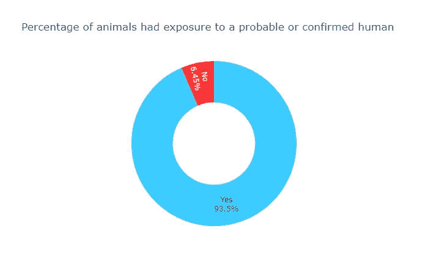
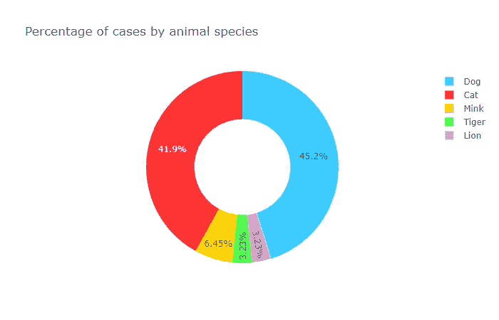
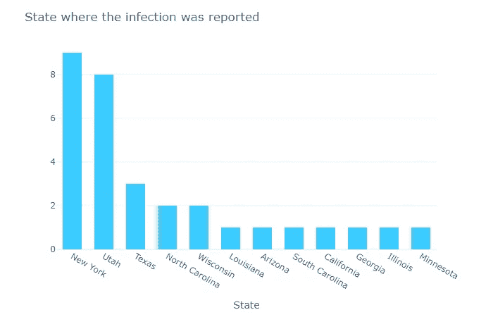
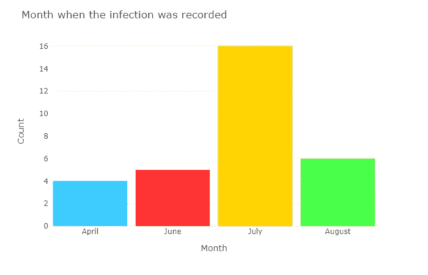
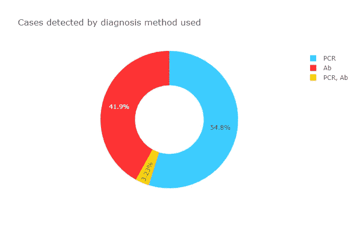

# 探索感染新冠肺炎病毒动物的数据

> 原文：<https://towardsdatascience.com/exploring-the-data-of-animals-infected-with-covid-19-50ce1ed16edd?source=collection_archive---------66----------------------->

## 美国农业部提供的数据分析

克里斯塔·曼古松在 [Unsplash](https://unsplash.com?utm_source=medium&utm_medium=referral) 上的照片

## 数据

随着病例数每天稳步上升，新冠肺炎几乎成了人们所知的每份报纸的头条新闻。尽管受到了大量的关注，但主流媒体几乎没有触及的一个话题(一些例外是农场和家养动物被感染的报道)是动物是如何受到该疾病的影响的。引用加拿大[政府](https://www.canada.ca/en/public-health/services/diseases/2019-novel-coronavirus-infection/prevention-risks/animals-covid-19.html)提供的信息，“目前关于动物和新冠肺炎的信息有限，尤其是关于动物被感染后是否会传播病毒的信息。”

科学界为了解病毒如何在动物和人类宿主中发展做出了令人钦佩的努力，关于它的研究与日俱增。然而，关于动物感染的公开数据并不容易找到。

为此，世界动物卫生组织经常在本页发布世界各地动物新病例的报告[。然而，从这个来源汇编信息是一项艰巨的工作，并不是每个人都愿意/有时间从每个语句中提取数据，并从中制作一个数据集。少数向公众开放的数据来源之一是美国农业部网站。该表列出了经美国农业部国家兽医服务实验室确认的动物中的 SAR-CoV-2(导致人类感染新冠肺炎的病毒)病例。尽管在每种情况下，只有在某个机构或家庭中报告的第一种动物出现在餐桌上，因此，这是对美国有多少动物携带病毒的粗略估计。](https://www.oie.int/en/scientific-expertise/specific-information-and-recommendations/questions-and-answers-on-2019novel-coronavirus/events-in-animals/)

尽管每个病例的规模很小(约 30 个数据点)，但该表记录了受感染动物的类型、感染的时间和地点、检测病毒的方法以及是否与受感染的人有过接触。该表不可下载，但如果您需要，可以很容易地复制或抓取。为了让事情变得更有趣，我决定废弃它，而不是使用以下代码将其复制到 Excel 文件中:

来源:作者编写的代码从美国农业部的门户网站上删除数据。

诚然，就其预期目的而言，这是一段相当长的代码，但它完成了自己的工作，并生成了一个表，如果您愿意，可以使用 Python 来处理这个表。当然，它的可用性取决于表在添加案例时保持原样(我怀疑这是否会发生，因为随着更多数据的进入，表的大小和复杂性应该会增加)。如果你想更仔细地看看准备过程，欢迎你访问我的 [Github 页面](https://github.com/danifernandes-hub/Projects/blob/master/Animals%20and%20COVID-19/Analyzing%20data%20from%20animals%20infected%20with%20COVID-19%20.ipynb)和主持整个过程的 [NBViewer](https://nbviewer.jupyter.org/github/danifernandes-hub/Projects/blob/master/Animals%20and%20COVID-19/Analyzing%20data%20from%20animals%20infected%20with%20COVID-19%20.ipynb) 。

## 分析

来源:作者使用美国农业部截至 8 月 17 日的动物新冠肺炎病例数据制作的图表

到目前为止，数据中的大多数动物(超过 90%)都接触过确诊或可能感染的人类。然而，根据[⁴:疾控中心官网](https://www.cdc.gov/coronavirus/2019-ncov/daily-life-coping/animals.html)公布的信息

> “导致新冠肺炎的病毒主要通过咳嗽、打喷嚏和说话时产生的呼吸道飞沫在人与人之间传播。最近的研究表明，被感染但没有症状的人也可能在新冠肺炎的传播中发挥作用。目前，没有证据表明动物在传播导致新冠肺炎的病毒中发挥了重要作用。根据迄今掌握的有限信息，动物将新冠肺炎病毒传播给人类的风险被认为很低”。

此外，疾病预防控制中心在同一份报告中继续补充说:

> “我们仍在了解这种病毒，但它似乎可以在某些情况下从人传播到动物，特别是在与新冠肺炎病患者密切接触后”。

因此，数据中的案例极有可能有这个来源，尽管这不是唯一可能的解释，也可能有其他的来源。

从可能的来源转移到感染疾病的动物，受感染的动物种类相对较少，如下图所示:

来源:作者使用美国农业部截至 8 月 17 日的动物新冠肺炎病例数据制作的图表

除了几个例外(特别是在⁵布朗克斯动物园感染了这种疾病的老虎和狮子以及几只水貂)，绝大多数记录在案的病例都属于猫和狗。同样，美国的病例分布仅限于少数几个州，迄今为止，50 个州中只有 12 个州报告了病例。

来源:作者使用美国农业部截至 8 月 17 日的动物新冠肺炎病例数据制作的图表

纽约州有 9 例，犹他州有 8 例，是迄今为止报道病例最多的州，其次是德克萨斯州，有 3 例。其他九个州各只有一个传染病。

来源:作者使用美国农业部截至 8 月 17 日的动物新冠肺炎病例数据制作的图表

到目前为止，7 月份是报告感染人数最多的月份，尽管尚未结束，但本月是第二个相对接近的月份，这使得上升趋势可能会继续下去。最后，值得注意的是迄今为止用于疾病诊断的方法，如下图所示:

来源:作者使用美国农业部截至 8 月 17 日的动物新冠肺炎病例数据制作的图表

大多数情况都是使用 PCR-test 来识别的，该测试由⁶FDA 授权[，用于测试是否存在活性冠状病毒感染。另一种测试最常见的是检测免疫系统产生的抗体(Ab ),以阻止疾病。](https://www.fda.gov/consumers/consumer-updates/coronavirus-testing-basics)

## 结论

虽然目前还没有什么数据可以说是决定性的，但有几个趋势值得关注:

*   在长达三个月的时间里，动物感染新冠肺炎的病例一直在稳步上升，到目前为止，8 月份的病例数量表明，这种情况可能会继续下去。
*   虽然能够感染这种病毒的物种的完整名单仍然未知，但科学界一直在不间断地工作，以了解农场动物是否也能感染这种疾病。到目前为止，[根据这个来源](https://www.canada.ca/en/public-health/services/diseases/2019-novel-coronavirus-infection/prevention-risks/animals-covid-19.html)，鸭、鸡、猪对病毒有抵抗力。
*   接受测试的动物中有很大一部分在过去感染过这种病毒，并产生了抗体来对抗它。

这些信息的大部分取决于不久的将来会发生什么，所列出的趋势要么可以逆转，要么被证明是正确的。

[1]:加拿大政府，[冠状病毒疾病(新冠肺炎)>预防与风险](https://www.canada.ca/en/public-health/services/diseases/2019-novel-coronavirus-infection/prevention-risks/animals-covid-19.html)，(2020)

[2]:世界动物卫生组织，[动物事件](https://www.oie.int/en/scientific-expertise/specific-information-and-recommendations/questions-and-answers-on-2019novel-coronavirus/events-in-animals/)，(2020)

[3]:美国农业部(USDA)，[美国动物中的新型冠状病毒确诊病例](https://www.aphis.usda.gov/aphis/ourfocus/animalhealth/sa_one_health/sars-cov-2-animals-us)，(2020)

[4]:美国疾病控制和预防中心(CDC)，[新冠肺炎和动物](https://www.cdc.gov/coronavirus/2019-ncov/daily-life-coping/animals.html)，(2020)

[5]: N. Daly，[布朗克斯动物园又有七只大型猫科动物冠状病毒检测呈阳性，国家地理](https://www.nationalgeographic.com/animals/2020/04/tiger-coronavirus-covid19-positive-test-bronx-zoo/)，(2020)

[6]:美国食品和药物管理局(FDA)，[冠状病毒检测基础知识](https://www.fda.gov/consumers/consumer-updates/coronavirus-testing-basics)，(2020)