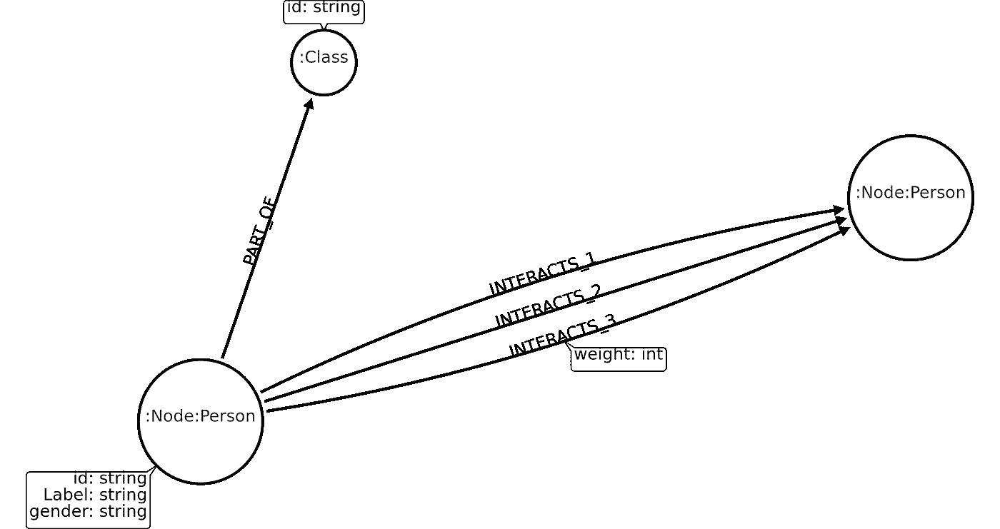
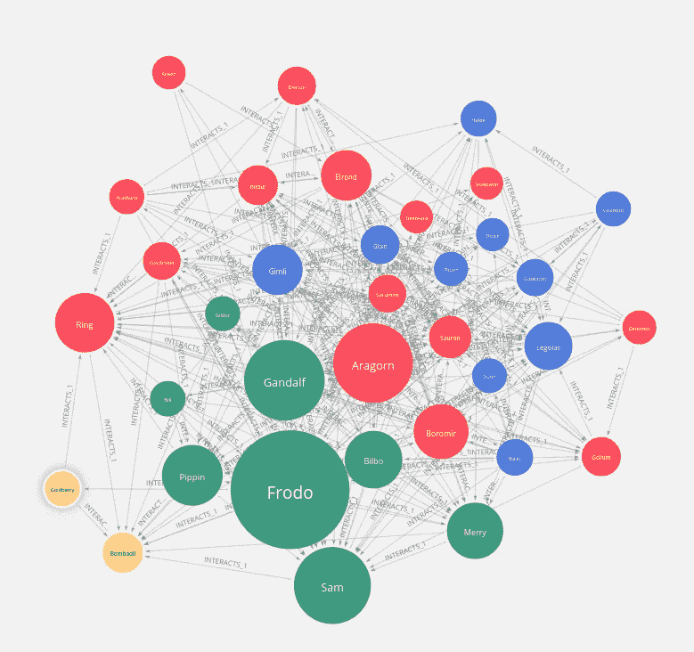

# 探索指环王数据集上 Neo4j 图表数据科学插件的图表目录功能

> 原文：<https://towardsdatascience.com/exploring-the-graph-catalog-feature-of-neo4j-graph-data-science-plugin-on-a-lord-of-the-rings-d2de0d0a023?source=collection_archive---------27----------------------->

## 了解 Neo4j 图形数据科学插件的基础知识，以及如何将图形投影到内存中

为了继续介绍 [Neo4j 图形数据科学插件](https://github.com/neo4j/graph-data-science)，我们将回顾基础知识，并查看该库的图形管理部分。这是库的一部分，负责将存储的 Neo4j 图形投影到内存中，从而允许更快地执行图形算法。图表管理部分的一个重要部分是图表目录功能。到底是什么？让我们看看[的官方文件](https://neo4j.com/docs/graph-data-science/1.0/management-ops/graph-catalog-ops/)。

> *图形算法在图形数据模型上运行，图形数据模型是 Neo4j 属性图形数据模型的*投影*。图形投影可视为存储图形的视图，仅包含分析相关的、潜在聚合的拓扑和属性信息。图形投影使用针对拓扑和属性查找操作优化的压缩数据结构完全存储在内存中。*
> 
> *图形目录是 GDS 库中的一个概念，允许通过名称管理多个图形投影。使用该名称，创建的图形可以在分析工作流中多次使用。*

有两个不同的选项可以将存储的图形投影到内存中:

*   [本机投影](https://neo4j.com/docs/graph-data-science/1.0/management-ops/native-projection/)通过读取 Neo4j 存储文件提供最佳性能。
*   [Cypher projection](https://neo4j.com/docs/graph-data-science/1.0/management-ops/cypher-projection/) ，更灵活、更富表现力的方法，较少关注性能

在这篇博文中，我们将深入探讨图表目录的原生投影选项。

# 图形模型

我已经记不清使用 GoT 数据集的次数了，所以我决定探索互联网，搜索新的令人兴奋的图表。我偶然发现了这个[指环王数据集](https://github.com/morethanbooks/projects/tree/master/LotR)由 [José Calvo](http://www.morethanbooks.eu/) 提供，我们将在这篇博文中使用。



数据集描述了人、地点、群体和事物(环)之间的相互作用。在选择如何对此数据集进行建模时，我决定让“主”节点具有两个标签，主标签为“节点”,辅助标签为以下之一:

*   人
*   地方
*   组
*   东西

上图中，出于清晰起见，我只添加了“人”作为二级标签。我们将每本书的交互存储为一个单独的关系，这意味着第一本书的交互将被保存为**交互 _1** 关系，第二本书的交互将被保存为**交互 _2** ，以此类推。请记住，我们将把交互关系视为无向和加权的。这些“主”节点也可以是一个职业的一部分，比如兽人、精灵、人类等等。

# 输入数据

如前所述，数据集在 [GitHub](https://github.com/morethanbooks/projects/tree/master/LotR) 上可用，我们可以用`LOAD CSV`语句轻松获取它。

# 导入节点

```
LOAD CSV WITH HEADERS FROM 
"https://raw.githubusercontent.com/morethanbooks/projects/master/LotR/ontologies/ontology.csv" as row FIELDTERMINATOR "\t"
WITH row, CASE row.type WHEN 'per' THEN 'Person'
                        WHEN 'gro' THEN 'Group'
                        WHEN 'thin' THEN 'Thing'
                        WHEN 'pla' THEN 'Place' END as label
CALL apoc.create.nodes(['Node',label], [apoc.map.clean(row,['type','subtype'],[null,""])]) YIELD node
WITH node, row.subtype as class
MERGE (c:Class{id:class})
MERGE (node)-[:PART_OF]->(c)
```

我们向“主”节点添加两个标签的主要原因是为了优化交互关系的导入。现在，你可能会说优化是不必要的，因为我们的数据集很小，我同意，但让我们假设我们可能要处理数百万个节点。我们从定义标签“节点”的唯一约束开始。

```
CREATE CONSTRAINT ON (n:Node) ASSERT n.id IS UNIQUE
```

# 导入关系

既然我们已经设置了 unique 约束，cypher query planner 将使用它来更快地匹配我们现有的节点。

```
UNWIND ['1','2','3'] as book
LOAD CSV WITH HEADERS FROM "https://raw.githubusercontent.com/morethanbooks/projects/master/LotR/tables/networks-id-volume" + book + ".csv" AS row
MATCH (source:Node{id:coalesce(row.IdSource,row.Source)})
MATCH (target:Node{id:coalesce(row.IdTarget,row.Target)})
CALL apoc.create.relationship(source, "INTERACTS_" + book,
         {weight:toInteger(row.Weight)}, target) YIELD rel
RETURN distinct true
```

# GDS 图表目录

在图形目录中创建命名图形的语法是:

```
CALL gds.graph.create(graph name, node label, relationship type).
```

## 描述我们想要投影的节点

一般来说，对于本机投影变体，有三个选项来描述我们想要投影到内存中的节点:

*   使用字符串投影单个节点标签:

```
'Label' ('*' is a wildcard operator that projects all nodes)
```

*   使用数组投影多个节点标签:

```
['Label1', 'Label2', 'Label3']
```

*   使用配置图投影多个节点标签及其属性:

```
{ Label: { label: 'Label', 
           properties: ['property1', 'property2']}, 
  Label2:{ label: 'Label2', 
           properties: ['foo', 'bar']}
}
```

关于投影节点标签，有一点需要注意:

> *在内存图中，所有投影的节点标签合并成一个标签。与关系投影不同，当前无法在投影标签上指定过滤器。如果该图用作算法的输入，则将考虑所有节点。*

虽然我们可以过滤我们想要投影到内存中图形的节点标签，但是当前不支持在执行图形算法时额外过滤节点。

## 描述我们想要表达的关系

描述我们想要投影的关系的语法非常类似于节点的语法。

*   使用字符串投影单个关系类型:

```
'TYPE' ('*' is a wildcard that projects all relationship-types)
```

*   使用数组投影多个关系类型:

```
['TYPE1','TYPE2']
```

*   使用配置图投射更多关系类型及其属性:

```
{ALIAS_OF_TYPE: {type:'RELATIONSHIP_TYPE', 
                 orientation: 'NATURAL', 
                 aggregation: 'DEFAULT', 
                 properties:['property1','property2']}
```

配置图中的方向参数定义了我们想要投射的关系的方向。可能的值有:

*   “自然”->每种关系的投影方式与其在 Neo4j 中的存储方式相同
*   反向'-->在图形投影过程中，每个关系都是反向的
*   “无向”->每个关系都以自然和相反的方向投射

需要注意的重要一点是，GDS 库支持在一个[多重图](https://en.wikipedia.org/wiki/Multigraph)上运行图算法。当我们想要将一个多图转换成一个单图(不是多图)时，聚合参数是很方便的，但是我们将在另一篇博客文章中进一步研究这个问题。

现在我们来看一些实际的例子。

# 整个图表

让我们首先对节点和关系使用通配符操作符，将整个图形投影到内存中。

```
CALL gds.graph.create('whole_graph','*', '*')
```

大多数情况下，我们通过运行(弱)连通分量算法来开始图表分析，以了解我们的图表实际上是如何(不)连通的。

```
CALL gds.wcc.stream('whole_graph') YIELD nodeId, componentId
RETURN componentId, count(*) as size
ORDER BY size DESC LIMIT 10
```

## 结果

该图作为一个整体由一个单独的部分组成。通常，您将从真实世界的数据中获得的是单个超级组件(所有节点的 85%以上)和一些小的不连接组件。

## 从目录中删除投影图

每次分析后，我们将从内存中释放投影图。

```
CALL gds.graph.drop('whole_graph');
```

# 交互图

下一步，我们想忽略关系中的**部分，只关注**交互 X** 关系。我们将使用一个数组来描述关系类型，以考虑所有三个**interactions _ X**关系。**

```
CALL gds.graph.create('all_interacts','Node',
     ['INTERACTS_1', 'INTERACTS_2', 'INTERACTS_3'])
```

让我们在新的投影图上运行弱连通分量算法。

```
CALL gds.wcc.stream('all_interacts') YIELD nodeId, componentId
RETURN componentId, count(*) as size, 
       collect(gds.util.asNode(nodeId).Label) as ids
ORDER BY size DESC LIMIT 10
```

## 结果

我们的新图由三部分组成。我们有一个超级组件和两个仅由一个节点组成的小组件。我们可以推断出地点“幽暗密林”和“旧森林”没有**相互作用 _X** 关系。

让我们使用同样的投影图，只看第一本书中的交互。我们可以使用 **relationshipTypes** 参数过滤图表算法应该考虑哪些关系类型。

```
CALL gds.wcc.stream('all_interacts', 
    {relationshipTypes:['INTERACTS_1']})
YIELD nodeId, componentId
RETURN componentId, count(*) as size, 
       collect(gds.util.asNode(nodeId).Label) as ids
ORDER BY size DESC LIMIT 10
```

## 结果

如果我们只考虑第一本书中的相互作用，我们会得到更多不相关的部分。这是有意义的，因为一些角色/地点在第一本书中还没有介绍，所以他们没有**交互 _1** 关系。

## 从目录中删除投影图

```
CALL gds.graph.drop('all_interacts');
```

# 无向加权交互图

在最后一个例子中，我们将展示如何投影一个无向加权图。我们将只考虑标记为 **Person** 和 **Thing，**的节点，对于关系，我们将投影所有的**interactions _ X**关系及其权重属性，它们将被视为无向图。

```
CALL gds.graph.create('undirected_weighted',['Person', 'Thing'],
    {INTERACTS_1:{type: 'INTERACTS_1',
                  orientation: 'UNDIRECTED',
                  properties:['weight']},
    INTERACTS_2:{type:'INTERACTS_2',
                 orientation: 'UNDIRECTED',
                 properties:['weight']},
    INTERACTS_3: {type:'INTERACTS_3',
                  orientation:'UNDIRECTED',
                  properties:['weight']}});
```

## 未加权 pageRank

为了在我们的投影图上运行未加权的 pageRank，我们不需要指定任何额外的配置。

```
CALL gds.pageRank.stream('undirected_weighted')
YIELD nodeId, score
RETURN gds.util.asNode(nodeId).Label as name, score
ORDER BY score DESC LIMIT 5
```

## 结果

## 加权网页排名

为了让算法知道它应该考虑关系权重，我们需要使用**关系权重属性**参数。

```
CALL gds.pageRank.stream('undirected_weighted', 
   {relationshipWeightProperty:'weight'})
YIELD nodeId, score 
RETURN gds.util.asNode(nodeId).Label as name, score 
ORDER BY score DESC 
LIMIT 5
```

## 结果

由于弗罗多与其他角色有更多的互动(定义为重量)，他在 pageRank 的加权变量中名列前茅。

# 第一本书的图形分析:

写完这篇博文，我们来分析一下第一本书的网络。我们首先只对第一本书的交互关系进行加权 pageRank。

```
CALL gds.pageRank.stream('undirected_weighted', 
    {relationshipWeightProperty:'weight', 
     relationshipTypes:['INTERACTS_1']})
YIELD nodeId, score 
RETURN gds.util.asNode(nodeId).Label as name, score 
ORDER BY score DESC 
LIMIT 5
```

## 结果

标准嫌疑人在最上面。佛罗多是目前最重要的角色，其次是甘道夫、阿拉贡和山姆，从排名的中心性来看，他们的重要性差不多。戒指也出现在最重要角色的前五名。

## 基于 Louvain 算法的社区发现

我们也对网络的社区结构感兴趣。我们将使用 [Louvain](https://neo4j.com/docs/graph-data-science/1.0/algorithms/louvain/) 模块化算法来确定社区结构。

```
CALL gds.louvain.stream('undirected_weighted',
   {relationshipWeightProperty:'weight', 
    relationshipTypes:['INTERACTS_1']})
YIELD nodeId, communityId
RETURN communityId,
       collect(gds.util.asNode(nodeId).Label) as members 
ORDER BY length(members) DESC LIMIT 5
```

## 结果

## 放下投影图

```
CALL gds.graph.drop('undirected_weighted');
```

# 使用 Neo4j Bloom 进行可视化

由于一张图胜过千言万语，我们就把第一本书的网络形象化。PageRank 用于确定节点的大小，community 用于确定节点的颜色。

第一次，我将使用 [Neo4j Bloom](https://neo4j.com/bloom/) 来可视化网络，因为最新版本(1.2)增加了对可视化的基于规则的样式的支持。



我们可以观察到阿拉贡和索伦、萨鲁曼是一个群体。这与实际的社区检测算法无关，但它显示了从作为共现图的文本中提取信息的弱点。我想下一步是从书中获取知识，比如朋友、敌人或其他人的关系。

# 结论

我希望读完这篇博客后，你能更好地理解如何用[图形数据科学库](https://github.com/neo4j/graph-data-science)来投影图形。请继续关注，因为我们仍然需要通过图表管理部分的 [Cypher projection](https://neo4j.com/docs/graph-data-science/1.0/management-ops/cypher-projection/) 部分。

和往常一样，代码可以在 [GitHub](https://github.com/tomasonjo/blogs/tree/master/lotr_graph_data_science_catalog) 上获得。