# 探索 R 中的 gt(表格语法)包

> 原文：<https://towardsdatascience.com/exploring-the-gt-grammar-of-tables-package-in-r-7fff9d0b40cd?source=collection_archive---------12----------------------->

## 轻松创建演示就绪的显示表格

我喜欢[米格里特的](https://cran.r-project.org/web/packages/magrittr/index.html)前向管道`%>%`操作员。在我看来，它是所有编程中最合适、最有用、最自然、几乎像反射一样的操作符之一。过去，它曾将 [tidyverse](https://www.tidyverse.org/) 推上了数据争论的超级明星之路，现在，它正冒险进入让表格变得极其简单的任务。

gt 包是最新的雄心勃勃的条目，使 R 中的表格更容易访问、修改和复制。它的目标是成为餐桌的焦点(用哈德利的话来说，不是我的),考虑到前者对 R 即的巨大影响，这款套装肩负着巨大的压力。

这是 gt 包架构的示意图—

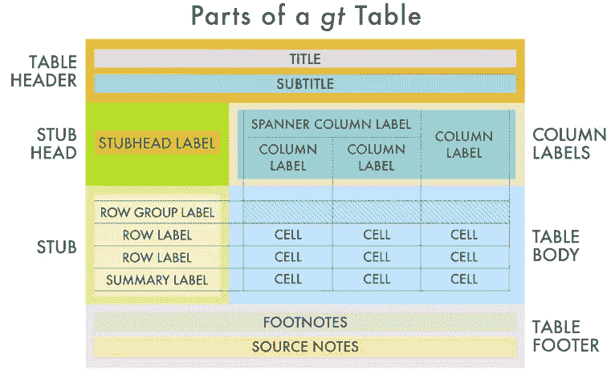

表格布局的语法。来源— GT 文档，R Studio

我们将使用帕尔默企鹅数据，这是现在臭名昭著的虹膜数据集的替代物。你可以在这里下载数据！

在执行基本的 tidyverse 动词后，我们调用`gt()`命令并指定所需的行，以便按照所需的形状对数据进行过滤和分组。

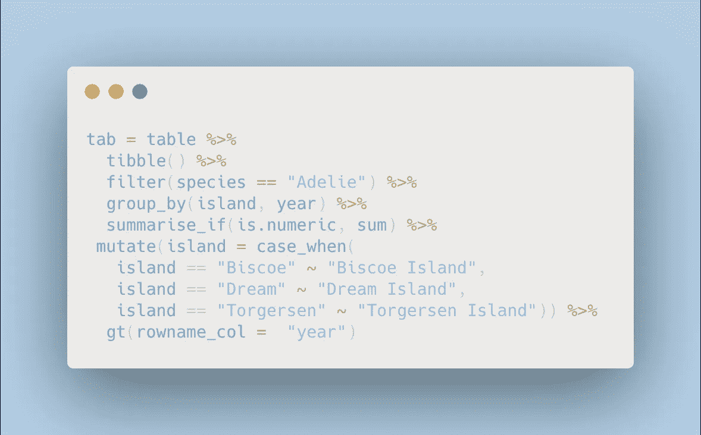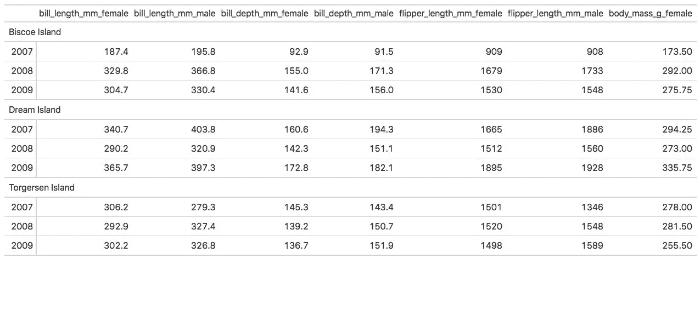

**添加柱扳手**

显然，以上数据是创建的最简单、最原始的数据表。我们现在开始格式化它。我们首先添加列扳手，将公列和母列放入各自的罩中，并定制它们的字体和对齐方式。

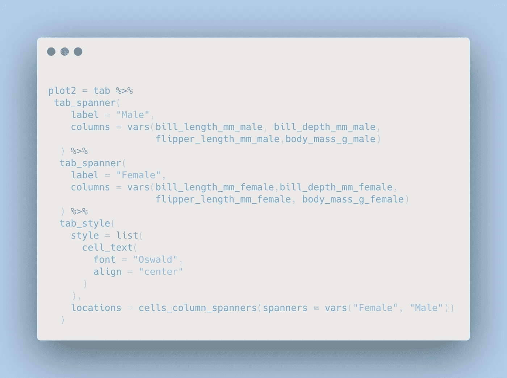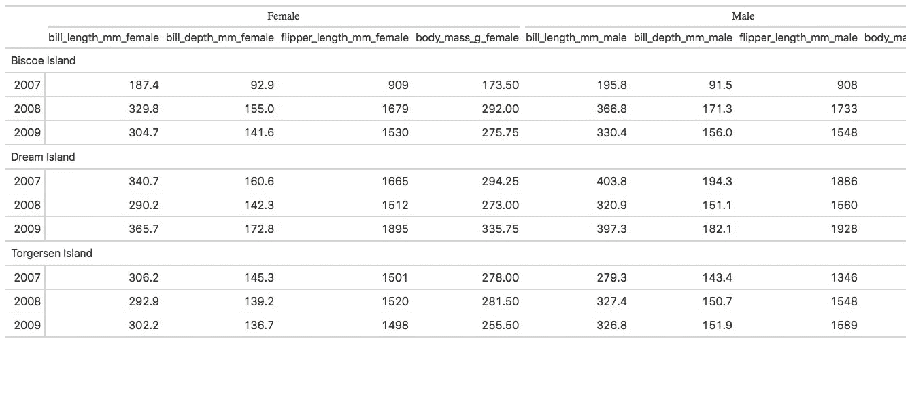

**创建行汇总统计&格式数据**

我们还可以添加一个描述性统计，指定表中每个指标的平均值或总数。这可以实现相对比较，并可以产生丰富的见解。在这里，我计算了每个岛屿的年平均喙长、喙深和鳍状肢，并将数字格式化为不含小数。

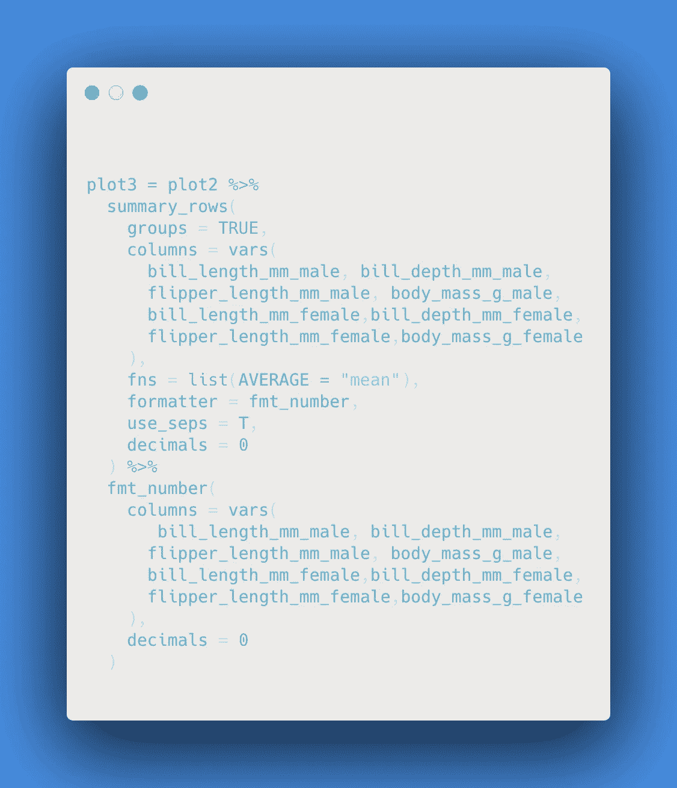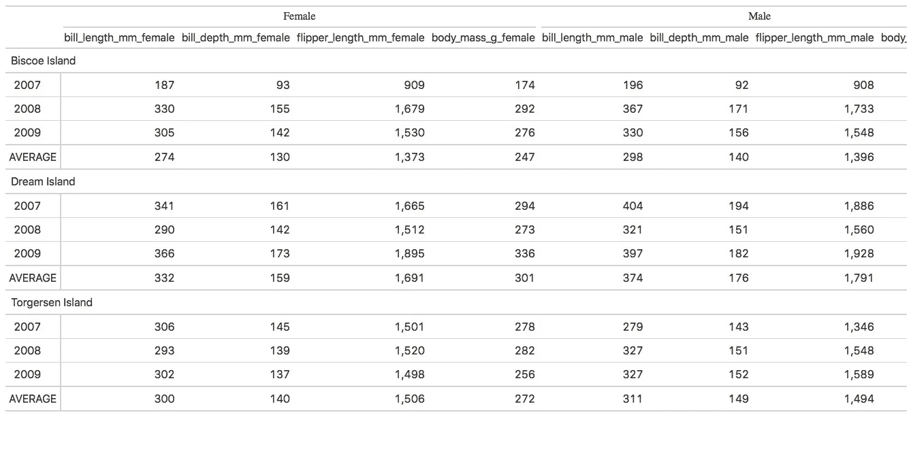

**添加颜色&脚注**

现在有趣的部分是，我使用了通过`palatteer`包提供的众多调色板中的一个，并根据表格所代表的单元格的数值对表格进行了有条件的着色。gt 包还提供了一个为表格添加脚注的功能。我在这里用它来说明测量喙长、喙深、鳍长和身体质量的标准。

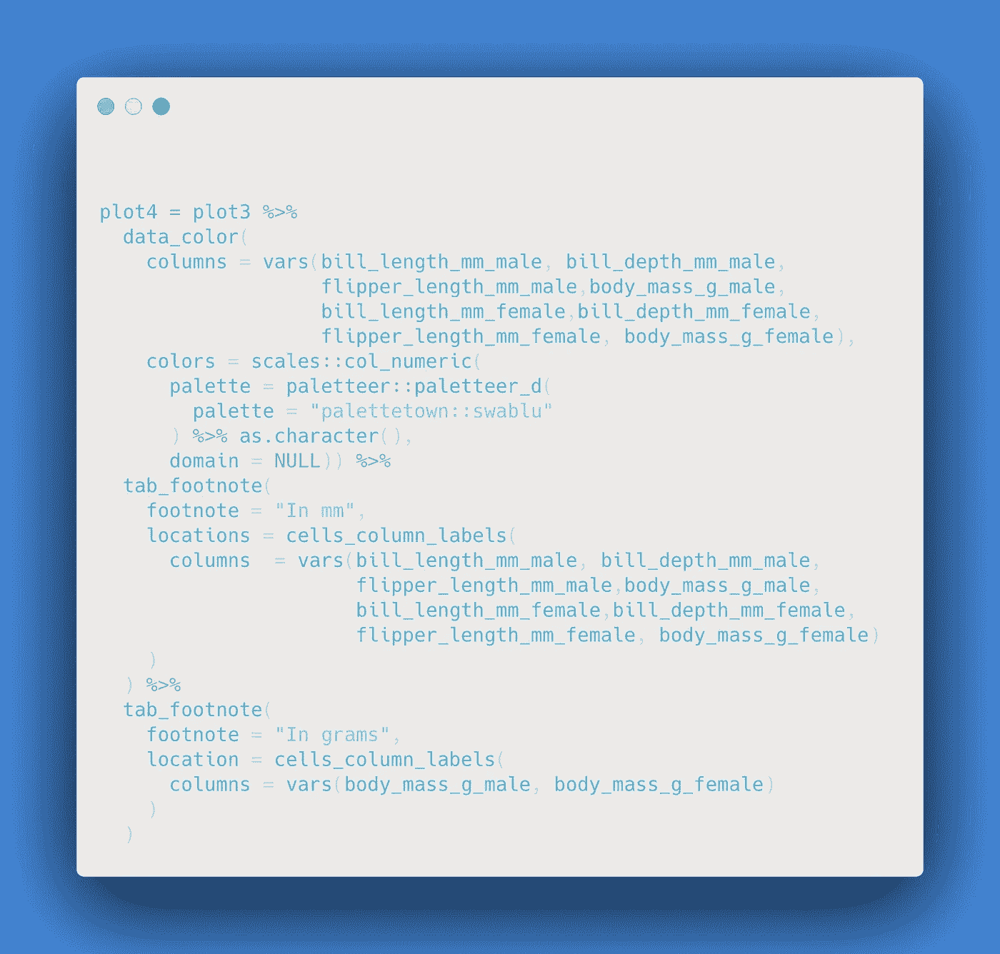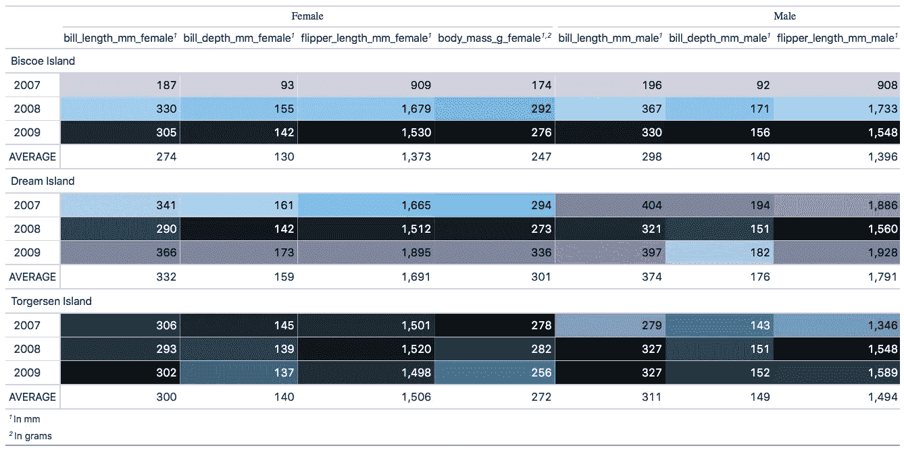

**添加表格标题，子标题&更改列标签**

虽然颜色给桌子带来了浮力，但标题还是很有必要的。该软件包还支持在标题/副标题中使用降价文本。这里我使用了`emo::ji` 包在我的标题中添加了可爱的小企鹅表情符号。由于列标签仍然混乱，我还将&格式的列表重命名为一个更短、更易读的标题。

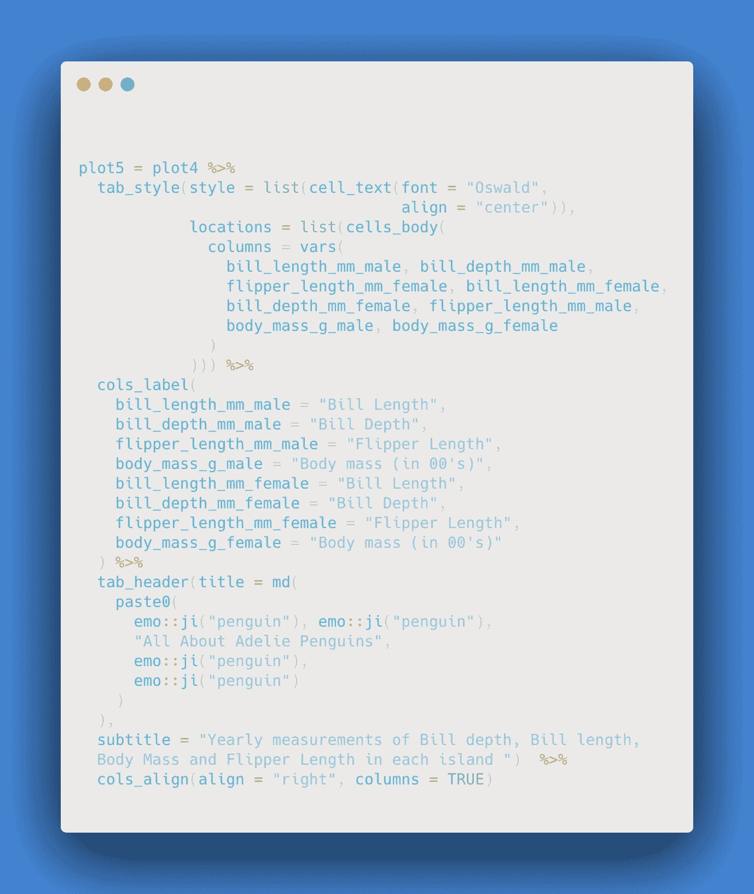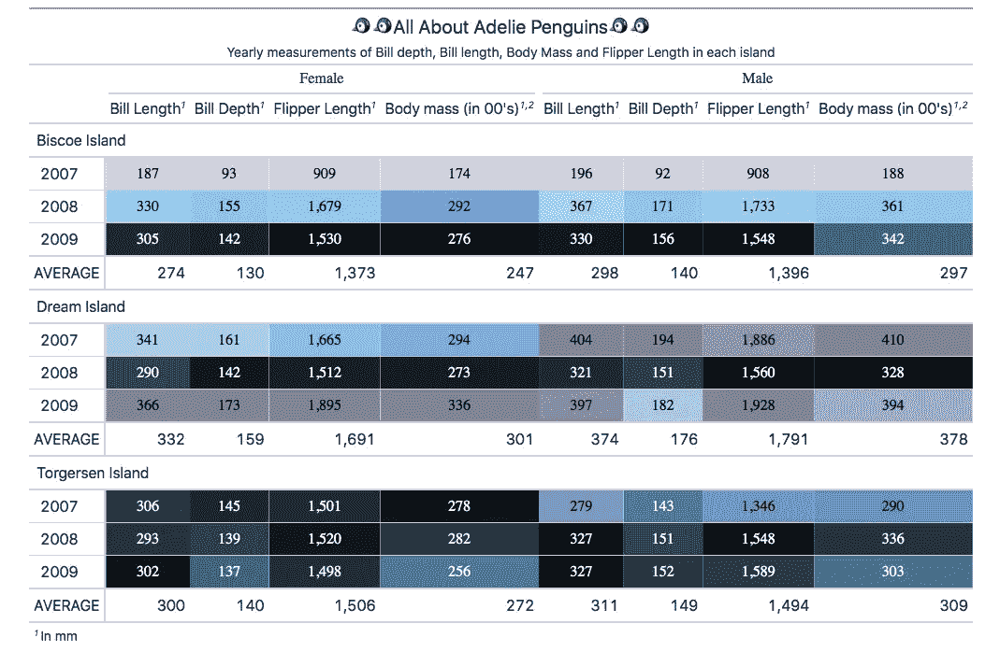

**添加背景颜色&格式边框**

我知道继续添加自定义颜色到剩余的空白，即标题，副标题，行平均和脚注。我已经指定了所需的十六进制代码，参考[这款](https://colorbrewer2.org/#type=sequential&scheme=Purples&n=3)彩色啤酒，以获得美学建议。我还为年份行添加了虚线边框，并沿岛屿行加厚了边框，以增强区分度和可读性。

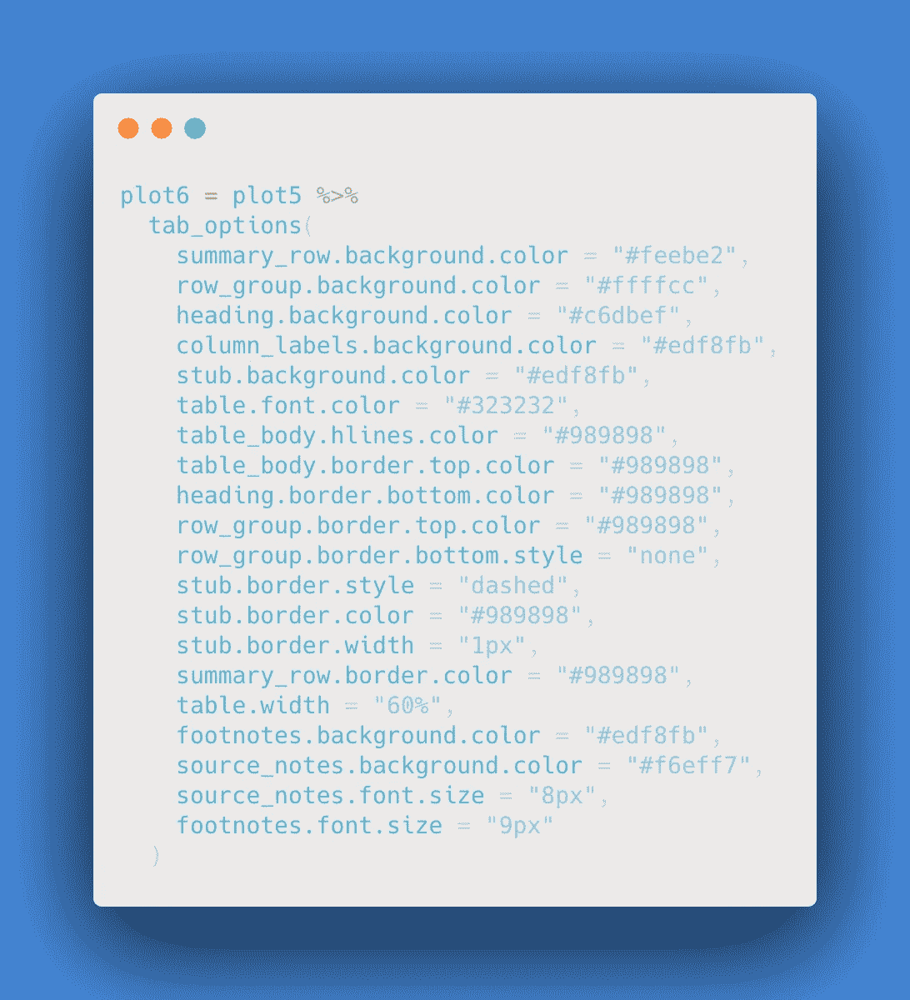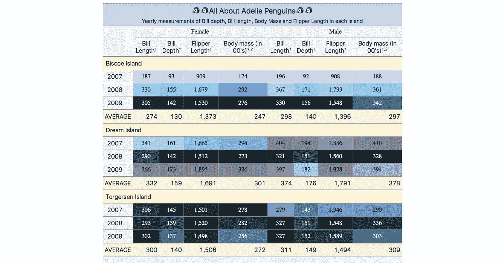

**调整字体，对齐&添加源注释**

作为最后的点睛之笔，为了确保字体的一致性，我在表格上使用了 Oswald 字体，并使每个单元格居中对齐。最后，在脚注下面，我添加了一个 source-note 来说明数据来源。

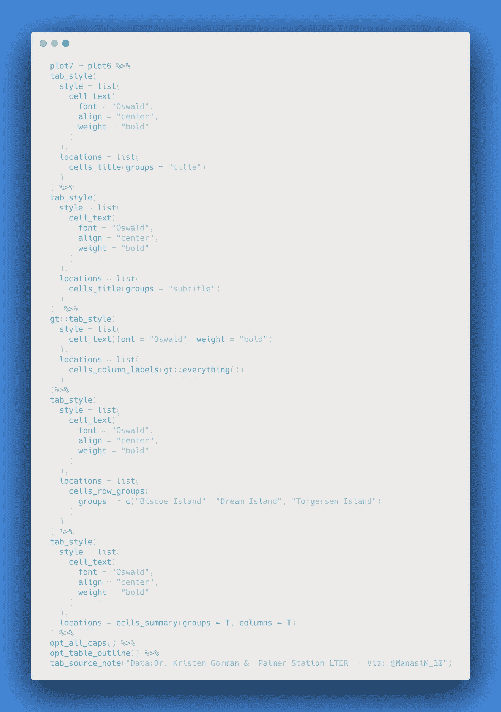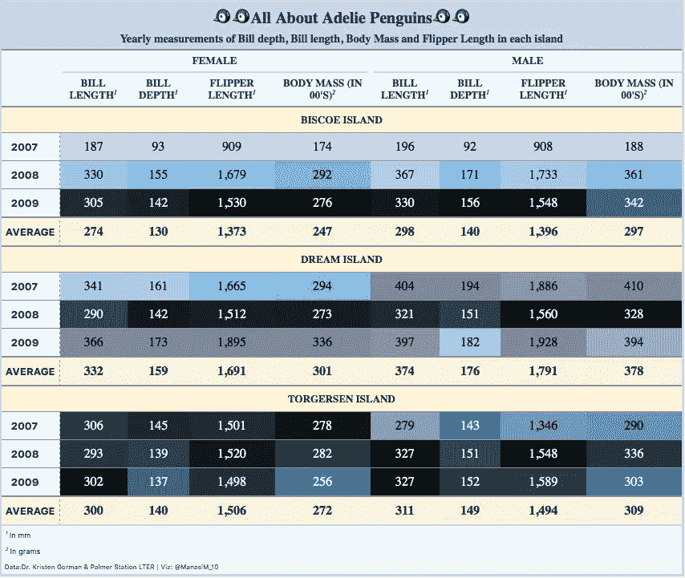

这就是最后的杰作！:D

希望你喜欢阅读。可以联系我[这里](https://twitter.com/marvelsmanasi) & [这里](https://www.linkedin.com/in/manasi-mahadik-a66b26146/)！