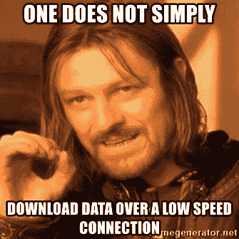
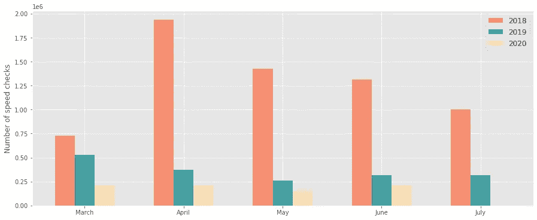
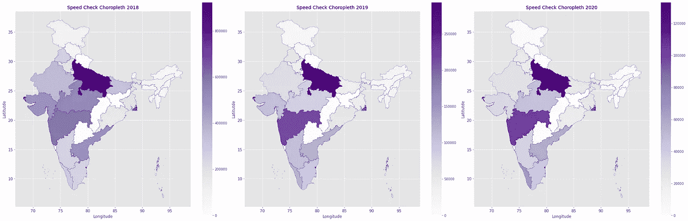
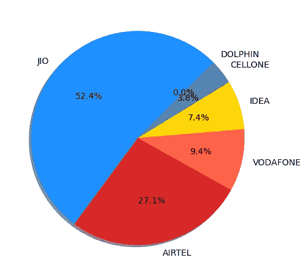
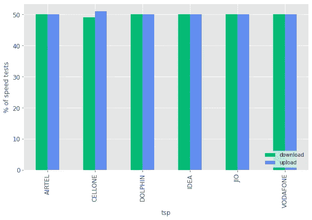
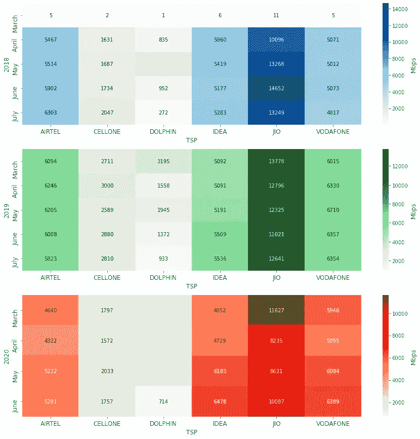
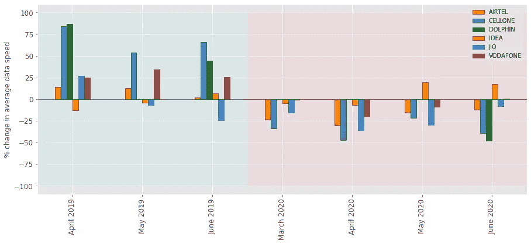
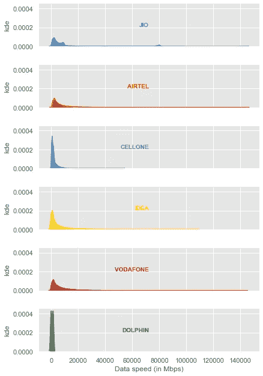
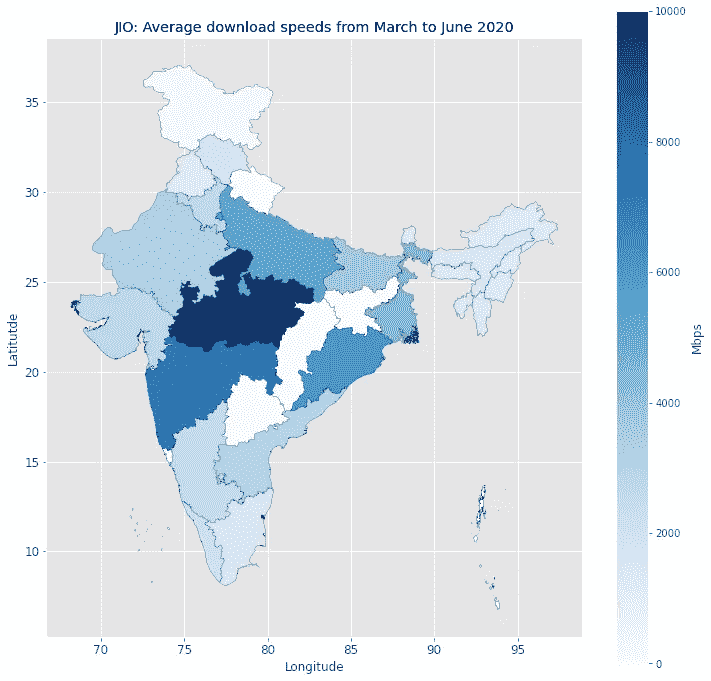
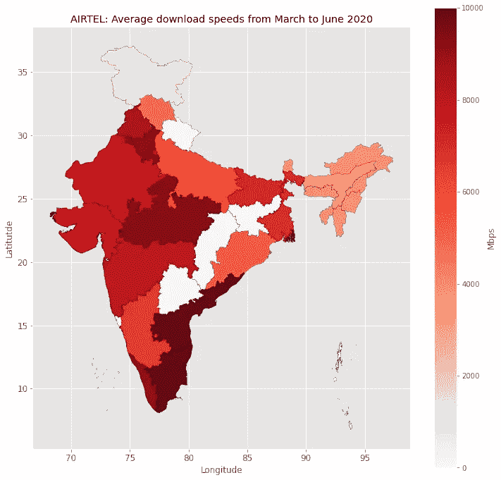

# 探索锁定对移动数据速度的影响

> 原文：<https://towardsdatascience.com/exploring-the-impact-of-lockdown-on-mobile-data-speeds-664beb7ef685?source=collection_archive---------56----------------------->


保罗·史密斯在 Unsplash[上的照片](https://unsplash.com?utm_source=medium&utm_medium=referral)

印度新冠肺炎疫情封锁期间不同服务提供商的移动互联网速度的数据可视化。

# 前言

第五天(*还是第六天？我失去了联系*新冠肺炎一级防范禁闭在我的城市孟买，突然停电了，我的无线网络也断开了。我正在看《网飞王国》的一集，我真的很想看完最后几分钟。

所以我打开了我的移动数据，希望获得和一分钟前一样的无缝高清质量。相反，我得到的是颗粒状，高度像素化的垃圾，需要 15 分钟来缓冲。

*这个。插曲。有过。只有。5.分钟。向左。*

这让我想到了一般的移动数据速度，尤其是我的下载速度。我真的不记得上一次我遇到如此糟糕的低速数据是什么时候了。

# 动机

我很想知道全国移动数据使用的封锁和突然激增是否对平均数据速度产生了负面影响。我的假设是，我的服务提供商，Airtel，比其他公司更难处理高速数据。！为了测试这一点，我进行了这个小项目。

# 数据源

通过谷歌快速搜索，我找到了 TRAI 电信管理局的网站和他们的 MySpeed 门户网站。MySpeed 是 TRAI 开发的一款应用程序，允许用户监控其服务提供商(又称电信服务提供商或 TSP)的下载和上传速度。

该网站拥有 2018 年 3 月以来的州级和技术级(3G/4G)历史数据，并涵盖了该国所有主要的 tsp。他们也有一份写得很好的关于无线数据速度测量的白皮书，这是一份有趣的读物(*只要你不像我一样在午餐后阅读*)。

我下载了三年(2018 年至 2020 年)3 月、4 月、5 月和 6 月的数据，因为这几个月是今年全国封锁的关键月份(*至今！*)。

整个项目可以在我的 [GitHub](https://github.com/ani-rudra-chan/Lockdown-Mobile-Speed-Project.git) repo 上找到。



PC: memegenerator

# 数据预处理

数据分布在不同的。csv 文件，我将它们聚合成一个数据帧。有趣的特征是—

*   `month_year` —数据的月份和年份
*   `tsp` —服务提供商的名称
*   `tech` — 3G 或 4G
*   `test_type` —下载或上传速度测试
*   `data_speed` —以 Mbps(兆比特每秒)为单位的数据速度
*   `lsa` —特许服务区，基本上是地区或州或市。

然后，我继续清理每个特征中的虚假值数据，并重新格式化数字特征中的数据类型。如你所见，数据集非常大，占用了将近 550 MB 的内存！

```
<class 'pandas.core.frame.DataFrame'>
RangeIndex: 8985844 entries, 0 to 8985843
Data columns (total 8 columns):
 #   Column           Dtype  
---  ------           -----  
 0   tsp              object 
 1   tech             object 
 2   test_type        object 
 3   data_speed       float64
 4   signal_strength  float64
 5   lsa              object 
 6   year             int64  
 7   month            object 
dtypes: float64(2), int64(1), object(5)
memory usage: 548.5+ MB
```

## 需要记住的几件事…

*   数据集中的每一个数据本质上都是用户通过 MySpeed 应用程序进行速度测试的记录，并被自愿发送到 TRAI 进行质量控制和分析。
*   速度测试代表短时间上传和下载速度。
*   这些数据是众包的，反映了在给定的一个月内使用 MySpeed 应用程序测试数据速度的次数。

# 探索性数据分析

## **速度测试次数**

Q1:一段时间内进行了多少次速度测试？

速度测试的数量在 2018 年比 2020 年最多。月环比显示，除了从 4 月到 6 月的速度测试下降之外，这三年没有明显的趋势。



整个印度和所有 tsp 的速度测试总数(图片来源:作者)

Q2:在哪里进行的速度测试最多？

纵观各邦，很明显，在所有三年中，北方邦在速度测试的数量上领先全国，其次是马哈拉施特拉邦。这种反差在疫情期间尤为突出，尽管人数少于前几年。



描绘 2018 年至 2020 年印度各地速度测试数量变化的 Choropleth 地图

***Q3:谁做的速度测试最多？***

在封锁期间(*3 月-2020*6 月)，超过 50%的速度测试是由**Jio**(Reliance Jio Infocomm)的用户完成的，而**Airtel**(Bharati Airtel Limited)远远落后于第二名。这种巨大的差距是由于国内更多的用户造成的。( ***Jio*** *无线用户市场份额为 33.47%，其次是****Airtel****为 28.31%* )



封锁期间 tsp 之间的速度测试份额(2020 年)(图片来源:作者)

***Q4:做了哪些速度测试？***

在封锁的几个月里，在所有的 tsp 中，速度测试在上传和下载速度测试之间几乎平分秋色，但这是意料之中的，因为应用程序会自动执行双速度测试。



两种测试中锁定期间总速度测试的份额(图片来源:作者)

## 数据速度的变化

***问题 5:参赛选手的平均速度有什么不同？***

查看三年来的平均数据速度(以 Mbps 为单位),可以发现 **Jio** 用户一直享受着极高的数据速度，几乎是其他 tsp 的两倍。

数据速度的绝对值表明，与竞争对手相比， **Jio** 和 **Airtel** 用户在 2020 年的最初几个月面临着速度的大幅下降。这可能是由于它们的用户基数大，因此负载较高。



平均数据速度随时间和 tsp 的变化(图片来源:作者)

***Q6:锁定期间数据速度真的下降了吗？***

月平均数据速度的同比变化(*将某一年的值与其前一年的值进行比较)*绘制为条形图。显而易见，在封锁的前四个月，所有主要 tsp 的平均速度都下降了。2019 年 4 月数据速度增幅最大的 Cellone ，2020 年 4 月数据速度降幅最大。

对于大多数 tsp，在 2020 年 4 月观察到最低的数据速度，之后似乎有一些小的缓解。令人惊讶的是， **Idea** 和**沃达丰**是仅有的两家在封锁的后两个月数据速度有所提升的公司。



不同 tsp 的月平均数据速度的同比趋势(图片来源:作者)

***问题 7:各服务提供商的数据传输速度有何不同？***

对数据速度分布的观察显示， **Jio** 、 **Airtel** 和**沃达丰**在锁定期间提供了超过 10 Gbps 的速度，尽管不一致。大多数 tsp 最常观察到的数据速度约为 2 Gbps，而 **Jio** 用户一直享受着更高的速度(从其分布的双峰特性来看*)。*



锁定期间 tsp 之间的数据速度分布(图片来源:作者)

***Q8:全国各地的平均数据速度如何变化？***

为了回答这个问题，我只查看了前两个 tsp—**Jio**和 **Airtel** 。**中央邦的用户在封锁期间享受了最高的平均数据速度，其次是马哈拉施特拉邦。在马哈拉施特拉邦(孟买是其首都)，平均下载速度在 6-7 Gbps 之间。**



锁定期间 Jio 用户的州平均下载速度(图片来源:作者)

泰米尔纳德邦和安得拉邦的 Airtel 用户享有最高的下载速度，其次是中央邦和哈里亚纳邦。在封锁期间，马哈拉施特拉邦的用户体验到了 7 到 8 Gbps 的速度。



锁定期间 Airtel 用户的州平均下载速度(图片来源:作者)

# 结论

在这个项目结束时，我明白了—

*   在印度封锁的最初几个月，所有服务提供商的下载和上传数据速度都大幅下降。
*   **Jio** 用户远多于全国 **Airtel** 用户。
*   尽管存在这种差异，Jio 和 Airtel 在封锁期间提供了相当的平均下载速度。
*   在封锁的几个月里，中央邦的人们享受着两大服务提供商的高平均下载速度

我想我最初的假设是正确的！

*一些有趣的链接*

[](https://myspeed.trai.gov.in/) [## 德赖

### 注意:您可能找不到 TSP/ State 中提到的速度，这是因为您选择的样本不足。TSPs

myspeed.trai.gov.in](https://myspeed.trai.gov.in/) [](https://www.wilsonamplifiers.com/blog/what-is-dbm-and-how-does-it-affect-your-cell-signal/) [## 什么是 dBm，它如何影响您的手机信号？

### 想知道如何获得手机信号强度的最佳测量结果吗？那些我们梦寐以求的信号棒…

www.wilsonamplifiers.com](https://www.wilsonamplifiers.com/blog/what-is-dbm-and-how-does-it-affect-your-cell-signal/) 

希望你喜欢这篇文章。

再见！