# 使用 PageRank 探索印度超级联赛

> 原文：<https://towardsdatascience.com/exploring-the-indian-premier-league-using-pagerank-9569e971ceb7?source=collection_archive---------26----------------------->


奇拉尤·特里韦迪在 [Unsplash](https://unsplash.com?utm_source=medium&utm_medium=referral) 上的照片

## 体育分析

## 关于 PageRank 算法的简短教程

> [这项](/exploring-the-indian-premier-league-using-pagerank-9569e971ceb7?source=friends_link&sk=a69f60b3a2dc3ba54e65b69b5581879c)工作的总体目标是探索**面向板球分析的网络科学**算法。本文涵盖了这个目标的一部分。IPL 数据用于此目的，特别关注 **PageRank** 算法。介绍了几种建立图形网络的方法，以及提取一些有趣见解的方法。更重要的是，还包括一个关于 PageRank 算法的简短教程。使用 PageRank 对 IPL 中最突出的两支队伍和米进行比较。

印度超级联赛是世界上最受欢迎的体育联赛之一；它的第十三版正在进行中。这是收视率最高的板球联赛。随着疫情给世界上所有体育活动蒙上阴影，特别是在印度，这被吹捧为获得前所未有的收视率。

八支队伍参加了这项一年一度的赛事，每支队伍都要面对对方两次，一次在各自的主场。在 cricsheet.org 可以免费获得 IPL 历史上每场比赛的数据。他们的网站不仅提供了 IPL 的数据，还提供了所有主要的男女板球比赛的数据。

这项工作主要处理图表，并使用它们进行可视化以及分析。让我们先湿湿我们的嘴，获得一些基本的直觉，为板球分析建立一些图表。然后我们就可以进入代码了。

## 构建图表

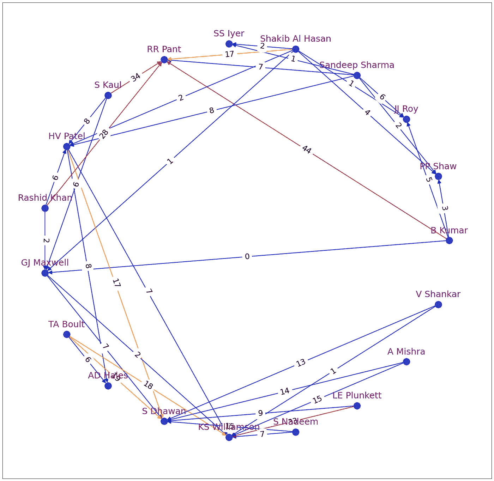

**图 A.** 这是**投球手-击球手网络**的一幅图，带有太阳升起者海德拉巴和德里夜魔侠之间的[比赛的投球手和击球手之间的边缘。Rishabh Pant 是野蛮的，因为他击中了一吨，但他们的团队仍然由于 Dhawan 的攻击而失败。两个玩家都有连接到高重量保龄球手的边缘——适当的颜色。来源:作者图片](https://www.espncricinfo.com/series/8048/scorecard/1136602/delhi-daredevils-vs-sunrisers-hyderabad-42nd-match-indian-premier-league-2018)

探索 IPL 数据的一种有趣方式是通过生成节点和边，其中节点可以是玩家，而边表示游戏中的特定活动。

例如，上图 A 所示的击球手-投球手网络由击球手和投球手组成，作为节点，他们之间的有向加权边代表击球手从投球手得分的**回合**。权重较高的边用橙色和红色着色。

例如，Rishabh Pant 在 Bhuvaneshwar Kumar 上得了 44 分，由从节点 **B Kumar** 到 **RR Pant** 的边表示，权重为 **44** 。特别是这场比赛，在太阳升起者海得拉巴和德里夜魔侠之间，里沙布·潘特打进了一个世纪，然而他的球队输掉了比赛。

下面的图 B 显示了一个大得多但不太有用并且有点压倒性的击球手-投球手网络，它覆盖了 IPL(直到 IPL-12)中的每一个投球。这个情节确实展示了大卫·华纳的爆炸性。

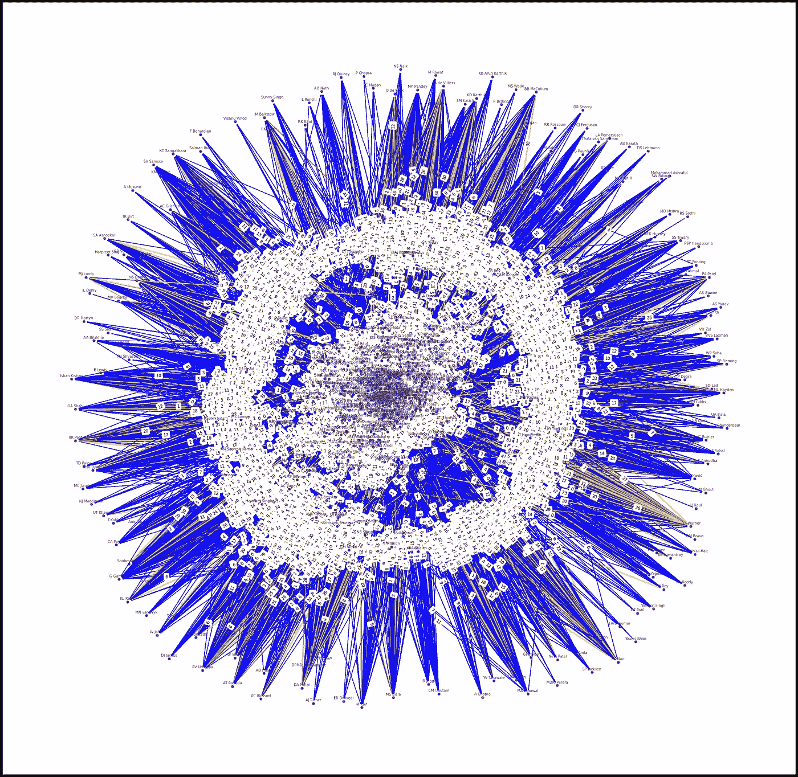

**图 B.** 该图以投球手和击球手为节点，以投球手到击球手的有向边为边权重，以总失球数为边权重。几乎 IPL 历史上的每一个投球都被计算在内。边缘根据重量着色。更多产的击球手有**黄色到红色**的彩色边缘。东南部的大卫·华纳就是这样一个脱颖而出的击球手。来源:图片由作者生成

类似地，另一种可以利用这些数据建立的网络是投球手的解雇或 T21。另一个经常被研究的网络是 batsmen 伙伴关系网络，它已经被证明在较长的格式中特别有用。

此外，请注意，在高层次上，这种分析属于*网络科学*的范畴。

> [**网络科学**](https://en.wikipedia.org/wiki/Network_science) 是研究电信网络、计算机网络、生物网络、认知和语义网络、社交网络等复杂网络的学术领域，将由*节点*(或*顶点*)表示的不同元素或行动者以及元素或行动者之间的连接视为*链接*(或*边*)。—维基百科

在深入研究网络科学算法，尤其是 PageRank 之前，让我们先接触一些编码。第一个任务是准备数据。

# **数据准备**

第一步是准备数据，这些数据以 YAML 文件的形式提供。每个 YAML 文件对应一个匹配项。并且对于每一场比赛，数据都以一个球的描述的形式给出。所以我们需要准备这些数据来形成节点和边。

以下方法用于准备使用 *networkx* 生成图形所需的数据。

该方法将输入作为比赛和回合，并返回一个格式为:**(投球手、击球手、跑垒者)的元组列表。**每个投球的数据汇总在*31–37*行中。然后在第*41–44 行*中生成元组。

下面的方法将元组转换为图的边。

第 16–17 行聚集击球手和投球手对元组的运行，以创建边权重，而击球手和投球手形成节点。*d*[*efaultdict*](https://docs.python.org/2/library/collections.html#defaultdict-objects)在这里挺合适的。

现在，让我们看看图 A 中的网络及其图形是如何产生的。使用的主库是 *networkx* 和 *matplotlib* 。这相当简单。

# 图形生成

下面给出了生成图 A 中图形的代码。

第 5 行分配绘图参数，第*14–22*行根据运行次数给边缘分配颜色(如注释中所述)。线*24–28*决定图形的布局以及节点和边的位置。第 30–37 行给出了标签。

第 38 行，最后画出图形。

当我写这篇文章的时候，钦奈超级国王队和孟买印度人队的首场比赛已经结束了，作为一名 CSK 球迷，我迫不及待地想为这场比赛创建一个网络，以获得想要的结果。

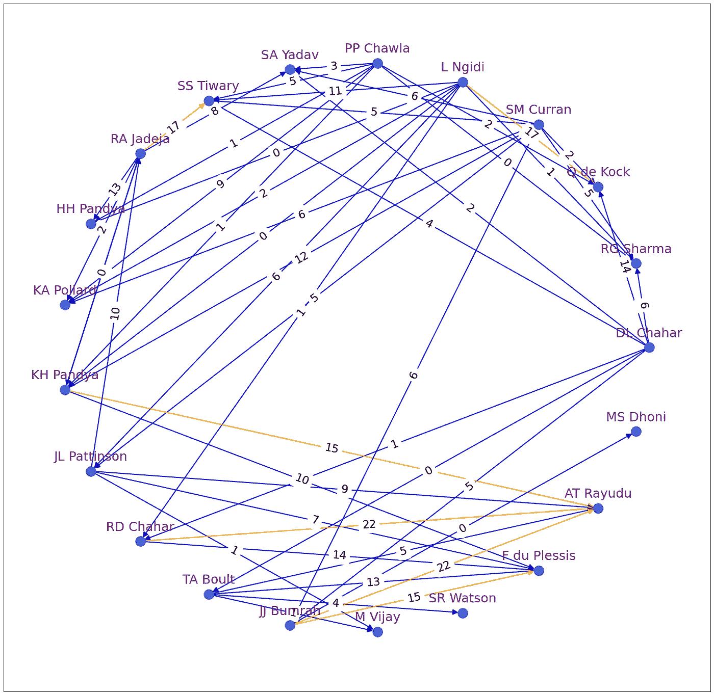

**图 c .**2020 年 9 月 19 日，击球手-投球手-运行 CSK 和密歇根州之间的首场比赛网络。Rayudu 为**爆破 bum rah 22**是养眼！！再次证明印度通过掉 Rayudu 掉了 WC-2019。来源:图片由作者生成

既然我们已经能够使用一个或一组匹配的数据来生成网络并将其可视化，我们就可以考虑分析图表的算法了。

PageRank 是网络科学中流行的算法之一，也是本文研究的重点。下面是一个关于 PageRank 的简短教程。

# PageRank 算法教程

著名的谷歌搜索引擎下的同名 PageRank 算法，在它的基本框架上出奇的简单。大多数算法，当它们在实践中工作时，都要经历无数微小的改变才能有效，这些对 PageRank 的修改超出了本文的范围。

说句题外话，去年(即 2019 年)这个时候左右，所有与 PageRank 相关的专利都到期了。

另外，请注意，我使用了参考文献 [*更深入的 PageRank*](https://galton.uchicago.edu/~lekheng/meetings/mathofranking/ref/langville.pdf) 作者 *Langville 等人。艾尔。*对于本教程以及其他一些教程。还参考了伦敦帝国理工学院的线性代数课程。

现在让我们来看看 PageRank 算法。PageRank 的目标是对网站进行排名，并决定它们在搜索结果中的显示顺序。潜在的假设是，一个网站的重要性取决于它与其他网站的链接。

下面是一个互联网的迷你模型，四个*网页相互链接，如箭头所示。*

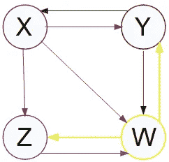

互联网的迷你模型。在[本](https://www.coursera.org/learn/linear-algebra-machine-learning)课程中使用了类似的表述。网页 **X** 有 **Y** 、 **Z** 和 **W** 的链接。 **Y** 与 **X** 和 **W** 连接。 **Z** 和 **W** 相互链接，同时 **W** 也指向 **Y** 。来源:图片由作者生成

这 4 个网页中哪一个最相关？

为了确定这一点，每个页面都由基于它们之间的链接的链接向量来表示，通过链接的总数来标准化。例如，对于网页 X，向量将如下:

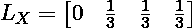

**X** 连接到 **Y** 、 **W** 和 **Z** ，连接总数为 **3** 。这导致概率矩阵 **P** 的生成，通过组合所有网页的向量，如下所示(注意转置)。

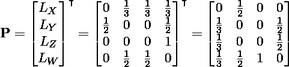

互联网上的用户最终到达 **X** 的概率取决于 **Y** 。在 **Y** 上着陆的概率取决于 **X** 和 **W** 。诸如此类。这个问题显然是自我参照的。

现在为了计算页面 **X** 的排名，我们需要 **X** 所连接的每个网页的排名以及链接概率向量。

这体现在下面的总结中。网页的排名 **X** 是 **X** 与其他具有该排名的页面的链接概率的乘积。

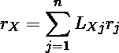

这对于整个互联网来说将采取如下形式:


计算上述等式中的 **r** 的有效方法是使用迭代法。一种是从初始猜测的 **r** 开始，并将其乘以 **P** 以获得更新的**r。**这再次乘以 **r** ，等等，直到 **r** 停止变化。

[*雅可比法*](https://en.wikipedia.org/wiki/Jacobi_method) 就是这种迭代方法的一个正式例子。

我从维基百科上复制了一个例子来看看 Jacobi 方法的应用。

> 假设给我们下列线性系统:

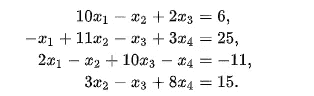

> 如果我们选择(0，0，0，0)作为初始近似值，则第一个近似解由下式给出

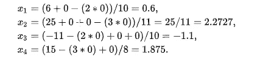

> 使用获得的近似值，重复迭代过程，直到达到期望的精度。以下是五次迭代后的近似解。

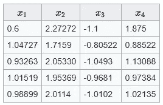

> 该系统的精确解为(1，2，1，1)。

正如您可以推断的那样，同样的方法可以应用于求解上面描述的秩方程。在*十次*迭代之后，在我们的情况下获得的秩向量是，

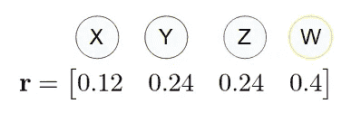

*雅可比法*本质上是矩阵对角化的算法。那么对角化和这个问题有什么关系呢？矩阵的对角化为我们提供了它的特征向量。让我试着更清楚地把这些点联系起来。

[矩阵](https://en.wikipedia.org/wiki/Transformation_matrix)通过旋转、缩放、剪切或正交投影中的一种线性变换矢量(还有更多！).**特征向量**是那些向量的集合，对应于一个变换矩阵，在变换下它们的方向不变。尽管这些向量的方向保持不变，但它们确实会按照由**特征值**决定的因子进行缩放。

用数学形式写出这个定义如下。


这里 **A** 是矩阵 **v** 是特征向量 **λ** 是特征值。 **I** 是与 **A** 维数相同的单位矩阵。左手边的矩阵 **A** 对矢量 **v** 进行变换，矢量**v**等于右手边的项，由矢量 **v** 以因子 **λ缩放表示。**

这个等式类似于我们为确定上面的等级而写的等式。如果特征值等于 1，这将是完全相同的。

换句话说，确定秩实质上是在特征值等于 1 时确定特征向量。

现在，矩阵的[对角化无非是求其特征向量。这就是雅可比方法的基本原理。所以 PageRank 从根本上来说是一种计算概率矩阵特征向量的方法。请注意，有许多更有效的方法可以做到这一点。例如更适合互联网规模的幂法。](https://mathworld.wolfram.com/MatrixDiagonalization.html)

总之，反过来，本教程简要解释了特征向量的概念，并指出矩阵对角化可以用来确定它们。显示了迭代方法的应用，如 Jacobi 方法，其本质上是矩阵对角化的工具。这就导致了网页的排名确定从根本上来说就是特征向量的计算。

你有希望了解整个情况。现在让我们将 PageRank 应用于 IPL 数据。

# 板球分析 PageRank

让我们从 PageRank 的一个非常简单的应用开始，确定比赛的玩家。从下面的代码可以看出，使用 *networkx* 计算 PageRank 算法非常简单。

## 确定“最佳球员”

考虑图 A 和 c 中所示的两个匹配的示例。对于德里和海德拉巴之间的高得分匹配，PageRank 算法的输出如下:

```
 ('**S Dhawan**', 0.16706747134453998),
 ('RR Pant', 0.12847147719416976),
 ('KS Williamson', 0.11339938336161924),
 ('HV Patel', 0.054508466219623325),
 ('AD Hales', 0.04907687103359096),
 ('JJ Roy', 0.043984250939231515),
 ('PP Shaw', 0.04121692739936753),
 ('GJ Maxwell', 0.039109987886062),
 ('SS Iyer', 0.036112054051209354),
 ('B Kumar', 0.032705311057058616),
 ('Sandeep Sharma', 0.032705311057058616),
 ('Shakib Al Hasan', 0.032705311057058616),
 ('S Kaul', 0.032705311057058616),
 ('Rashid Khan', 0.032705311057058616),
 ('TA Boult', 0.032705311057058616),
 ('S Nadeem', 0.032705311057058616),
 ('LE Plunkett', 0.032705311057058616),
 ('A Mishra', 0.032705311057058616),
 ('V Shankar', 0.032705311057058616)
```

达万的确是这场比赛的*选手，同时也被*的* PageRank *排在首位。*紧跟喘气。在最近和米的比赛中，Rayudu 被评为最佳击球手。但这其实微不足道，不足为奇。更有用的是比较整个 IPL 中两个队的击球手。*

让我们来分析一下锦标赛历史上最突出的两支队伍: **CSK** 和**米**。


来源:维基百科

## **钦奈超级国王** — vs — **孟买印度人(击球手)**

两队在印度超级联赛中已经交锋 29 次，孟买赢得了其中的 17 次,最近的一次交锋属于金奈。

在图 D 中，该网络涵盖了 IPL 历史上迄今为止(2020 年 9 月 21 日)两支球队之间的每一场比赛。这确实是一个密集的情节，不是很清楚。

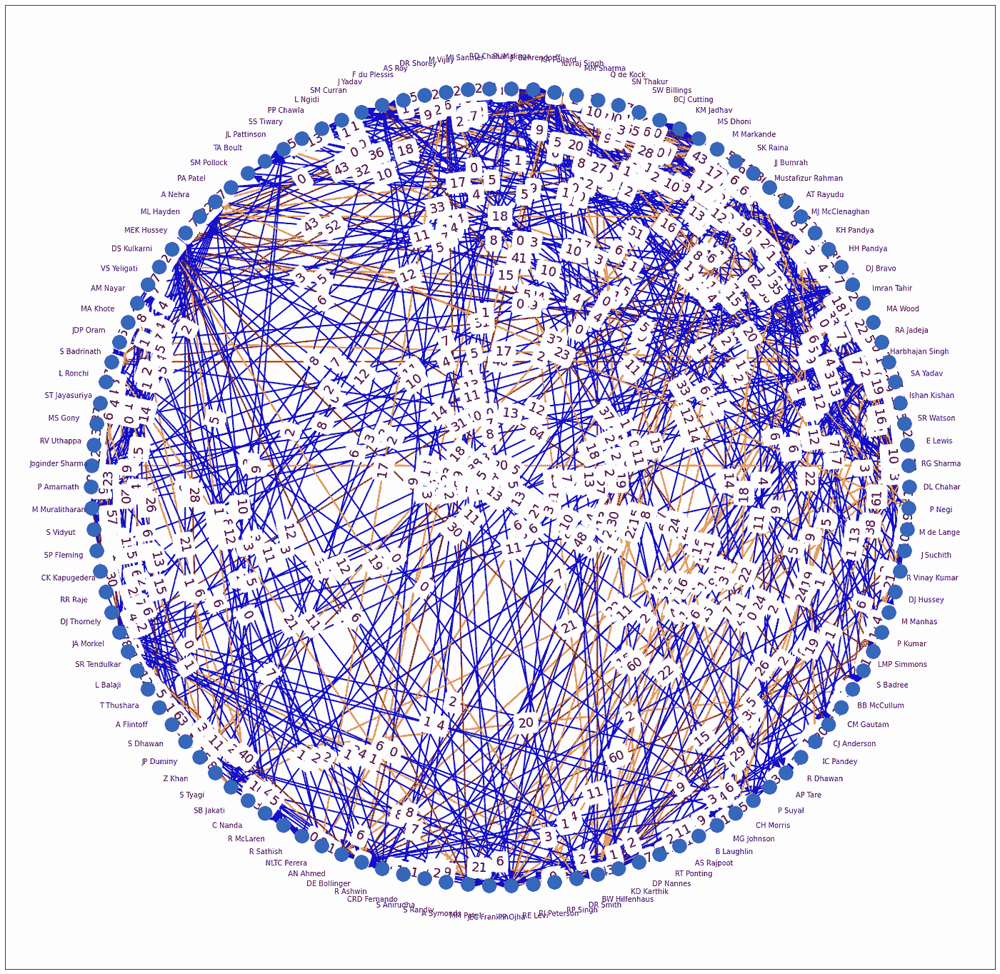

**图 D** 。击球手-投球手-运行 IPL 历史上所有 CSK vs MI 比赛的网络，直到 2021 年 9 月 21 日。来源:图片由作者生成

更有趣的是 PageRank 算法的输出。有趣的是，顶级击球手的名单被 CSK 占据了。更有趣的是，排在第一位的是巴德里纳特，他在 2013 年(或大约在那个时候)被 CSK 放弃。

```
 ('**S Badrinath**', 0.05421395478976649),
 ('**SK Raina**', 0.053135571284977624),
 ('**RG Sharma**', 0.041368536612979664),
 ('**MS Dhoni**', 0.04038317373144958),
 ('**AT Rayudu**', 0.03464112279515003),
 ('**ML Hayden**', 0.0330266349697345),
 ('**SR Tendulkar**', 0.02418058298782965),
 ('**DJ Bravo**', 0.021503060692972184),
 ('**F du Plessis**', 0.021390681834730786),
 ('**KA Pollard**', 0.021321303236989133),
 ('**MEK Hussey**', 0.021042740963540033),
 ('**DR Smith**', 0.01890655407121474),
```

为了让事情变得更有趣，也为了让剧情看起来更有意义，让我们将分析限制在金奈从禁令中回来后的几年——对其热情的粉丝来说，这是一个令人沮丧的时期。

在下面的图 E 中，显示了最近几个版本的匹配网络。让我们注意一些观察。

1.  **Suryakumar Yadav** 和 **Rohit Sharma** 爱打击 **Imran Tahir，**看着他们之间突出的红色边缘。
2.  无论是**多尼**还是**刘冰**这几年都相对沉寂。而 Rayudu 做得非常出色，即使是面对像 bum rah 这样的顶级保龄球手。
3.  沃森惩罚了**马林加**很多次。而**杜普莱西**则掠夺了**克鲁纳尔潘迪亚**。而且 **Q de Kock** 喜欢打击**迪帕克查哈尔**。


**图 E** 。CSK **禁令**结束后，CSK 的击球手-投球手网络 vs . MI 进行 IPL 比赛。来源:图片由作者生成

应用 PageRank 算法的结果如下。Rayudu 近年来在 IPL 中表现出色，是最好的击球手(在两队之间的决斗中),而许多 MI 球员也名列前茅。

```
 ('**AT Rayudu**', 0.0583995180647374),**CSK**
 ('**SA Yadav**', 0.05791406258909479),**MI**
 ('**RG Sharma**', 0.05623336818791069),**MI**
 ('**SK Raina**', 0.04320529341604707),**CSK**
 ('**HH Pandya**', 0.038683990832774545),**MI**
 ('**KH Pandya**', 0.03657684830688639),**MI**
 ('**SR Watson**', 0.034829476630529085),**CSK**
 ('**F du Plessis**', 0.03473325010829539),**CSK**
 ('**KA Pollard**', 0.03220709886860807),**MI**
 ('**MS Dhoni**', 0.031817576009506396),**CSK**
```

考虑到 CSK 在过去 5 场比赛中只赢过一次，这个结果很有意义。多尼女士刚刚进入前 10 名。

总的来说，毫无疑问，这两支球队相互之间竞争激烈，作为一名 CSK 球迷，我希望多尼在下一届 IPL 结束时进入前五名，这可能是他的最后一次。

# 接下来呢？

目前的焦点(为了防止文章变得太大)只集中在击球手身上。有许多网络可以用来进行分析。例如，投球手-击球手-解雇网络或击球手伙伴关系网络，如前所述。

此外，本文中考虑的 PageRank 是最基本的。多年来，它经历了许多变化，这些变化可以应用于这种分析，以获得有趣的见解。

然后，整个工作可以扩展到测试比赛和 ODI，这可以提供许多用于分析和更好地理解的指标，而不是保龄球和击球率等当前数据。去吧。

一旦用类似的网络科学算法获得了更多有趣的见解，我希望能发表一篇后续文章。

🔵在 [Linkedin](https://www.linkedin.com/in/deepak-karunakaran/) 或 [Twitter](https://twitter.com/deepakKarunakrn) 找到我🔵

另外，看看我的其他文章。

 [## 我的数据科学文章列表

### 2020 年 9 月 1 日更新

medium.com](https://medium.com/@dyaus/list-of-my-data-science-articles-edd8866029e8)