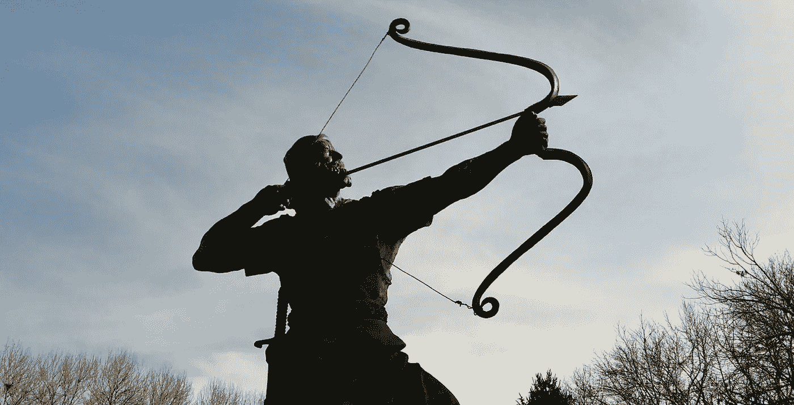
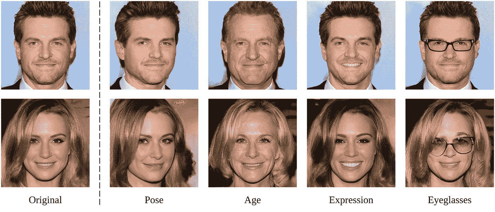
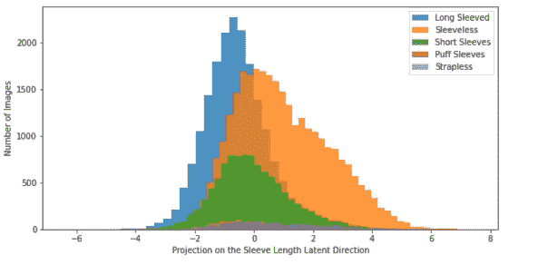
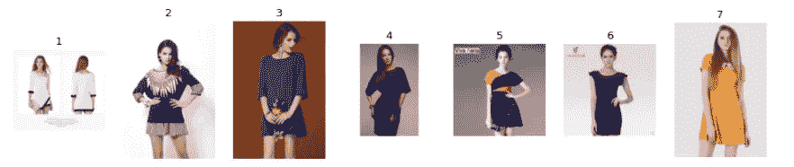
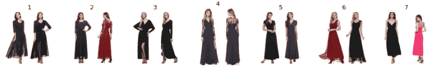
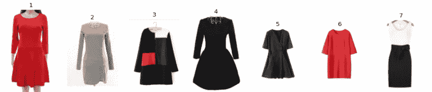
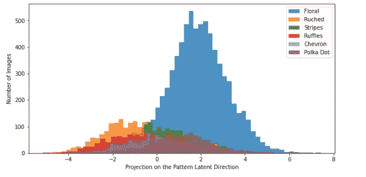
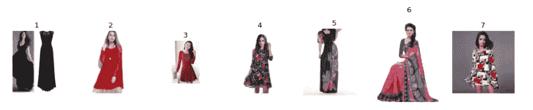
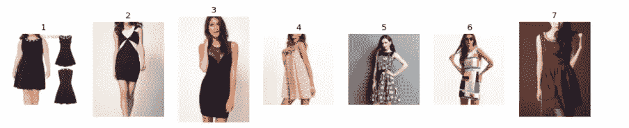
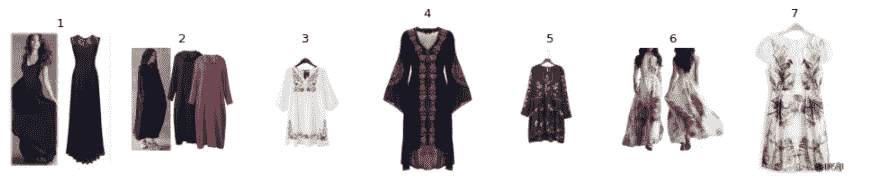

# 探索 ConvNet 图像分类器的潜在空间

> 原文：<https://towardsdatascience.com/exploring-the-latent-space-of-your-convnet-classifier-b6eb862e9e55?source=collection_archive---------45----------------------->

## 隐藏层的潜在空间中的线性！



[阿里雷扎](https://unsplash.com/@alirzasahb)在 [Unsplash](http://unsplash.com/photos/Bc5LK1XqbCc) 上的照片

神经网络，尤其是卷积神经网络的一个迷人之处在于，在网络的最后几层中，各层是完全连接的，每一层都可以被视为一个向量空间。ConvNet 从图像中提取的所有有用的和需要的信息都以特征向量的形式存储在最终层的**压缩版本**中。当这最后一层被当作一个向量空间并服从向量代数时，它开始产生一些非常有趣和有用的性质。

我在 Kaggle 的[imate rialist Challenge(Fashion)](https://www.kaggle.com/c/imaterialist-challenge-fashion-2018)数据集上训练了一个 Resnet50 分类器。这里的挑战是将每一幅服装图像分类成合适的属性，如图案、领口、袖长、款式等。我使用了预训练的 Resnet 模型，并在这个数据集上应用了迁移学习，为每个标签添加了层。一旦模型得到训练，我希望看看最后一层的向量空间，并搜索模式。

# 潜在空间方向

Resnet50 的最后一个 FC 层的长度为 1000。在对时尚数据集进行迁移学习后，我在这一层应用主成分分析，将维度减少到 50，保留了 98%以上的方差。

潜在空间方向的概念在 GANs 和变分自动编码器中很流行，其中输入是矢量，输出是图像，观察到通过在某个方向上平移输入矢量，输出图像的某个属性改变。下面的例子来自 NVIDIA 训练的 StyleGAN，你可以看看这个[网站](http://thispersondoesnotexist.com)，在这里，每当你刷新页面时，一个假脸就会从一个随机向量中生成。



图片来自[界面 GAN Github](https://github.com/genforce/interfacegan) |姿势、年龄、表情和眼镜等属性可以通过在各自的潜在方向上平移输入向量来调整。

> 这太令人兴奋了！对输入向量的简单线性运算会在输出图像中产生如此复杂的变换。这些潜在的方向就像旋钮，你可以调整以获得输出图像所需的效果。难以置信！

在我们的图像分类器中，我们做的正好与 GAN 相反。在分类器中，我们获取一个图像，并在 FC 层中获得一个长度为 1000 的向量，通过 PCA 变换，我们将其维数降低到 50。我们想要探索的想法是，我们为其训练模型的图像属性是否在 FC 层和 PCA 之后的层的向量空间中以线性方式排列。答案确实是肯定的！

iMaterialist 挑战赛的任务之一是确定袖子长度，分为五种类型:长袖、短袖、泡泡袖、无袖和露肩。这五种中，三种占多数:长袖、短袖和无袖。现在我们想看看是否存在一个潜在的方向，沿着这个方向，这三个袖长等级被分离。如果是二元分类，我们可以使用逻辑回归，系数向量会给出潜在方向，但在我们的情况下，我们有多个类别。

在多类问题中获得潜在方向的一种方法是建立一个神经网络，其中我们**迫使输入层通过单个单元中间层，输入层的权重向量为我们提供潜在方向**。下面给出了这个分类器的代码片段，其中我的输入是长度为 50 的 PCA 层，它通过一个单元层，经过几层后，我得到了我的最后 5 个类。迫使它通过单个单元层背后的想法是约束网络学习线性潜在方向。这个单一单位层的值本质上给了我输入到学习的潜在方向上的投影。

```
**class latent_model(nn.Module):**
  **def __init__(self):**
    super(latent_model, self).__init__()
    self.layer1 = nn.Sequential(nn.Linear(50, 1), nn.Linear(1,10), nn.ReLU(),nn.Linear(10,10), nn.ReLU(), nn.Linear(10,5) , nn.Softmax()) **def forward(self, ip):**
    x = self.layer1(ip)
    return x

lm=latent_model()
*#####Train the Classifier#####
#######################
##The latent direction##*
latent_direction=lm.layer1[0].weight[0].cpu().detach().numpy()
```

# iMaterialist ConvNet 模型的结果

让我们看看训练完这个小分类器后得到了什么！
下图显示了不同袖型沿潜在方向的分布，我们可以看到三大类:短款、长款和无袖款沿潜在方向分离。



作者的图表:袖长沿潜在方向的分布。

> 神经网络是复杂的非线性模型，但隐藏层中隐藏着线性！

现在，我拍摄一幅裙子的图像，从该图像的 PCA 向量空间中的点开始，沿着袖子长度的潜在方向画一条线，并从训练数据集中检索最接近这条线的图像。下面是一些这样的例子。值得注意的一件有趣的事情是，虽然袖子长度沿着从长袖到短袖再到无袖的方向变化，但裙子的其他特征，如领口、裙子长度和整体风格往往保持不变。



来自 [Kaggle 数据集](http://kaggle.com/c/imaterialist-challenge-furniture-2018/data) **的图像|示例 1:** 从#3 开始，检索在不同点最接近该线的其他图像。



来自 [Kaggle 数据集](http://kaggle.com/c/imaterialist-challenge-furniture-2018/data)**|示例 2:** 从#1 开始，检索在不同点最接近该线的其他图像。



来自 [Kaggle 数据集](http://kaggle.com/c/imaterialist-challenge-furniture-2018/data) **的图像|示例 3:** 从#4 开始，检索在不同点最接近直线的其他图像。

在第二个示例中，所有检索到的图像都是长裙，并且在一个图像中有两个姿势，而在第三个示例中，大多数图像都没有模特。唯一显著的变化是袖长。

> 从上面的结果来看，看起来训练数据集图像已经在 PCA 层的潜在空间中以原始的顺序排列了！

对模式进行类似的分析会得到以下结果



不同模式类型沿已发现模式潜在方向的分布。(作者配图)

从上面的图表中，我们看到花型连衣裙从更坚实的类型沿着潜在的方向分离。看几个例子证实了这一观察。



来自 [Kaggle 数据集](http://kaggle.com/c/imaterialist-challenge-furniture-2018/data) **的图像|示例 5:** 从#6 开始，检索在不同点最接近直线的其他图像。



来自 [Kaggle 数据集](http://kaggle.com/c/imaterialist-challenge-furniture-2018/data)**|示例 5:** 从#2 开始，检索在不同点上最接近该线的其他图像。



来自 [Kaggle 数据集](http://kaggle.com/c/imaterialist-challenge-furniture-2018/data) **的图像|示例 6:** 从#4 开始，检索在不同点最接近该线的其他图像。

在上面的例子中，图案沿着发现的方向慢慢地从纯色到条纹到花卉到格子，并且检索到的图像在整体风格方面倾向于类似于初始图像。

# 结论

着眼于特征向量的潜在空间是我们对神经网络工作的理解向前迈进了一步。从上面的分析中，我们可以得出一个结论:卷积神经网络以图像的形式接收复杂数据，随着输入通过后续层，从这些图像中提取的信息变得越来越有组织。我们发现，在网络最后一层的潜在空间中，我们的训练数据集图像以有序的方式进行排序和分离，以至于我们可以发现感兴趣的某个属性变化的线性方向。
阅读更多博客[此处](https://smodi93.wixsite.com/msachin/blogs)。