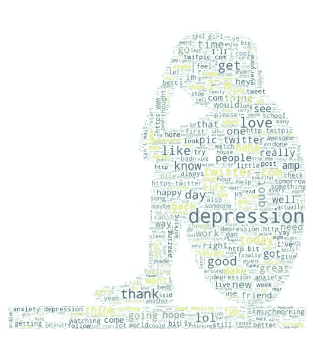
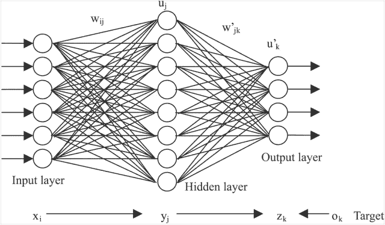
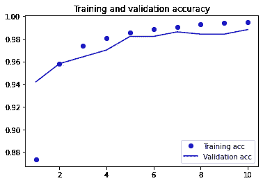
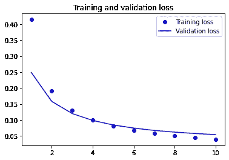
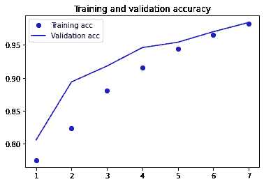
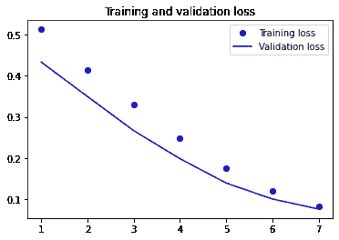
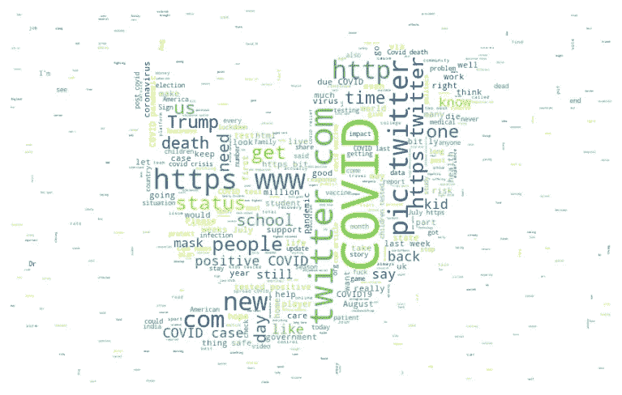

# 用神经网络探索新冠肺炎和抑郁症之间的联系

> 原文：<https://towardsdatascience.com/exploring-the-link-between-covid-19-and-depression-using-neural-networks-469030112d3d?source=collection_archive---------30----------------------->

## [变更数据](https://towardsdatascience.com/tagged/data-for-change)

## 对新冠肺炎相关推文进行情感分析，研究抑郁症和疫情之间的相关性。

代表形象。鸣谢:伊斯托克照片

我们生活方式的巨大变化，加上为抗击冠状病毒爆发而引入的限制、隔离和社会距离措施，导致世界各地精神健康问题的惊人增加。社交媒体是人们在特定地点和时间的精神状态的有力指示器。为了研究冠状病毒疫情和普通人群中抑郁和焦虑加速之间的联系，我决定探索与冠状病毒相关的推文。

## 这个博客是如何组织的？

在这篇博文中，我将首先使用 keras 训练一个神经网络来识别抑郁的推文。为此，我将使用 10，314 条推文的数据集，分为抑郁推文(标记为 1)和非抑郁推文(标记为 0)。这个数据集是由维里戴安娜·罗梅罗·马丁内斯制作的。以下是她的 github 个人资料的链接:【https://github.com/viritaromero

一旦我训练好了网络，我会用它来测试从 twitter 上抓取的推文。为了建立新冠肺炎和抑郁症之间的联系，我将获得两组不同的数据。第一个数据集将由与冠状病毒相关的关键词组成，如“新冠肺炎”、“隔离”、“疫情”和“病毒”。第二个数据集将由使用中性关键字搜索的随机推文组成，如“and”、“I”、“The”等。第二个数据集将作为对照，检查随机样本推文中抑郁推文的百分比。这将使我们能够测量随机样本和新冠肺炎特定推文中抑郁推文百分比的差异。

# 预处理数据

图片来源:【https://xaltius.tech/why-is-data-cleaning-important/ 

在我们开始训练神经网络之前，我们需要收集和清理数据。

## 导入库

为了开始这个项目，我们首先需要导入所有必要的库和模块。

一旦我们准备好了所有的库，我们就需要获取数据并对其进行预处理。你可以从这个链接下载数据集:[https://github . com/viritaro Mero/Detecting-Depression-in-Tweets/blob/master/情操 _tweets3.csv](https://github.com/viritaromero/Detecting-Depression-in-Tweets/blob/master/sentiment_tweets3.csv)

## 数据的快速检查

我们可以通过将数据集读入 pandas 数据框来快速检查数据集的结构。

现在，我们将把推文的文本存储到一个名为 text 的数组中。tweets 的相应标签将被存储到一个名为 labels 的单独数组中。代码如下:

很抱歉打印出一个相当大的数据集，但我这样做是为了让我们可以快速检查整体结构。我注意到的第一件事是，在标签数组中，0 比 1 多得多。这意味着在数据集中，我们的非抑郁推文大约是抑郁推文的 3.5 倍。在理想情况下，我希望在抑郁和非抑郁推特数量相等的数据集上训练我的神经网络。然而，为了获得同等数量的抑郁和非抑郁推文，我将不得不大幅删减我的数据。我认为较大且不平衡的数据集比非常小且平衡的数据集要好，因此，我将继续使用原始状态的数据集。

## 清理数据

你会注意到的第二件事是，推文中包含了很多所谓的“停用词”，如“a”、“The”、“and”等。这些词对于将一条推文归类为抑郁或非抑郁并不重要，因此我们将删除这些词。我们还需要删除标点符号，因为这也是不必要的，只会降低我们的神经网络的性能。

我决定使用令人惊叹的 wordCloud 库对清理后的数据进行快速可视化，结果如下。毫不奇怪，抑郁推文中最常见的词是抑郁。

使用 WordCloud 可视化推文

## 数据的符号化

标记化到底是什么？

基本上，神经网络不像我们人类那样理解原始文本。因此，为了使文本更容易被我们的神经网络接受，我们将它转换成一系列的 1 和 0。

图片来源:inboundhow.com

为了在 keras 中标记文本，我们导入了 tokenizer 类。这个类基本上是在字典中查找整个文本中一定数量的独特单词。然后使用字典查找，keras 允许我们创建向量，用字典查找中的索引值替换单词。

我们还继续填充较短的 tweetss 并截断较大的 tweet，使每个向量的最大长度等于 100。

你可能会想，“嗯，我们只把单词转换成数字，而不是 1 和 0！”你是对的。有两种方法可以做到这一点:要么我们可以将数字转换成一个热编码向量，要么创建一个嵌入矩阵。一位热编码向量通常是非常高维和稀疏的，而矩阵是较低维和密集的。如果你感兴趣，你可以在 Francois Chollet 的《用 Python 进行深度学习》一书中了解更多。在这篇博客中，我将使用矩阵，但是在我们初始化它们之前，我们需要先处理一些其他的事情。

## 打乱数据

图片由 [Sergi Viladesau](https://unsplash.com/@svi_designs) 在 unsplah 上提供

数据的另一个问题，你可能早就发现了，文本数组首先包含所有非抑郁的推文，然后是所有抑郁的推文。因此，我们需要重组数据，让随机的推文样本进入训练、验证和测试集。

## 拆分数据

现在我们需要将数据分成训练集、验证集和测试集。

唷！终于完成了所有的数据管理！

# 制造一个神经网络

图片来源:extremetech.com

现在我们可以开始制作模型架构了。

我将尝试两种不同的模型:一种是预训练单词嵌入层，另一种是可训练单词嵌入层。

为了定义神经网络架构，您需要了解单词嵌入是如何工作的。网上有大量关于单词嵌入的信息。这篇博文是我的最爱之一:

[https://towards data science . com/introduction-to-word-embedding-and-word 2 vec-652 d0c 2060 fa](/introduction-to-word-embedding-and-word2vec-652d0c2060fa)

既然您已经对嵌入层的功能有所了解，我将继续用代码创建它。

## 第一个模型

对于第一个模型，该架构由预训练的单词嵌入层和两个密集层组成。为模型定型的代码如下:

图:模型 1 中训练集和验证集的准确性和损失

这里我们可以看到，该模型在测试集上表现非常好，准确率为 98 %。过度拟合可能不是问题，因为验证精度和损失几乎与训练精度和损失相同。

## 第二种模式

对于第二个模型，我决定排除预先训练的嵌入层。代码如下。

图:模型 2 中训练集和验证集的准确性和损失

在测试集上，两个模型的精度都一样好。然而，由于第二个模型不太复杂，我将用它来预测一条推文是否抑郁。

# 从 twitter 获取新冠肺炎相关推文的数据

为了获得我的推文数据集，我使用了 twint，这是一个了不起的 twitter 网络抓取工具。我准备了两组不同的数据集，每组 1000 条推文。第一个由包含 corona 相关关键词的推文组成，如“新冠肺炎”、“隔离”和“疫情”。

现在，为了获得一个对照样本进行比较，我搜索了包含中性关键词的推文，如“the”、“a”、“and”等。利用这个样本中的 1000 条推文，我组成了第二个控制数据集。

COVID 相关推文的 WordCloud

我使用与清理训练集相似的过程来清理数据集。在清理数据后，我将其输入我的神经网络，以预测抑郁推特的百分比。我得到的结果令人惊讶。

下面显示了代码的一次运行，我用不同批次的数据重复了一次运行，这些数据是使用与上述相同的过程获得的，并计算了平均结果。

我的模型预测，平均而言，在使用中性关键词获得的一组推文中，35 %是抑郁推文，65 %是非抑郁推文。在随机获得的样本中，35%的抑郁推文是一个惊人的高数字。然而，带有 COVID 相关关键词的抑郁推文数量甚至更高:55 %抑郁对 45 %非抑郁。抑郁推特增加了 57 %!

这导致了一个结论，即新冠肺炎和推特上的抑郁情绪之间确实存在相关性。

# 结论

我希望这篇文章能帮助你学习更多关于使用机器学习进行情感分析的知识，我希望你也能尝试类似的项目。

编码快乐！

演职员表:吉菲的斯莱特