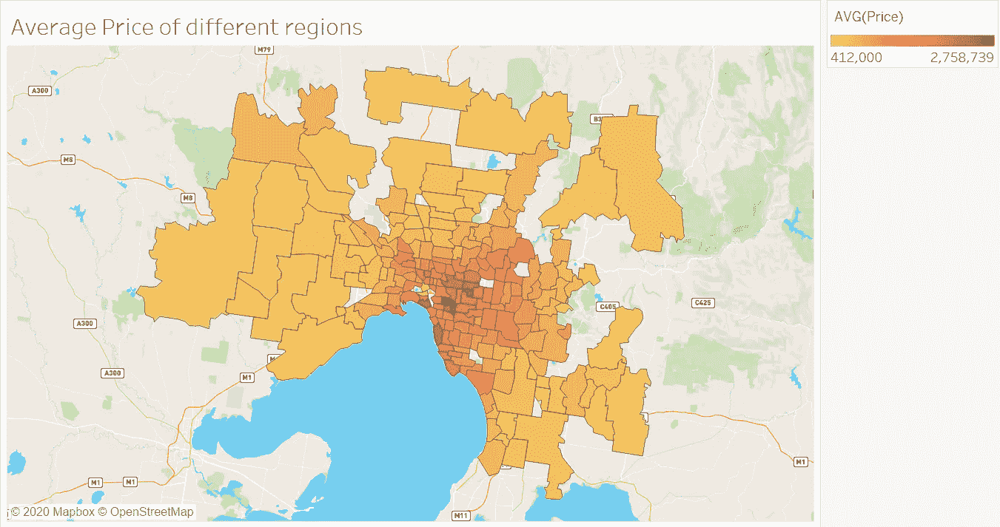
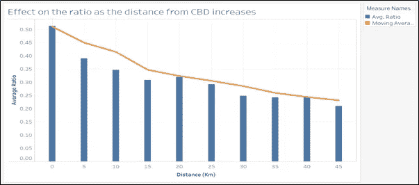
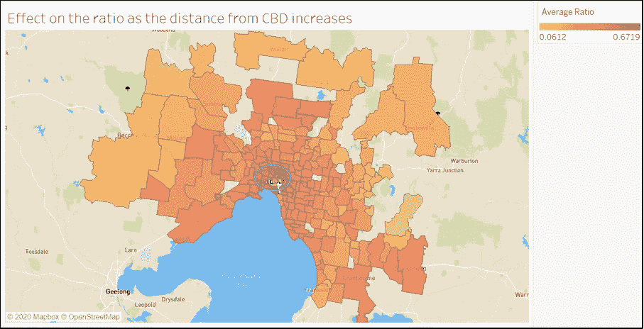
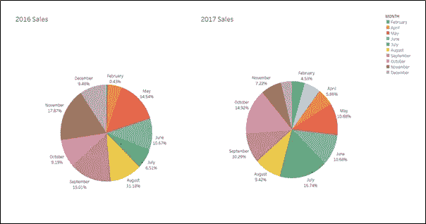
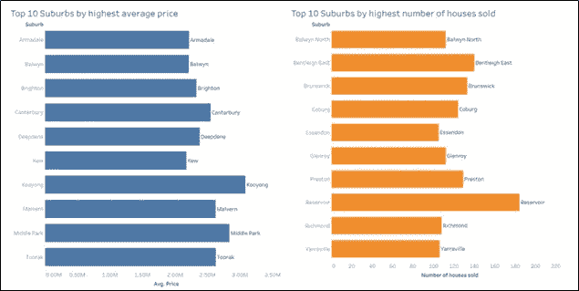
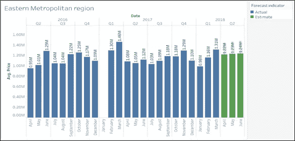
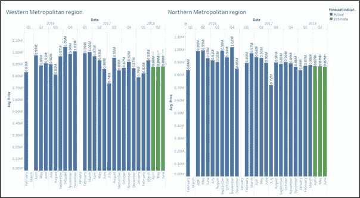
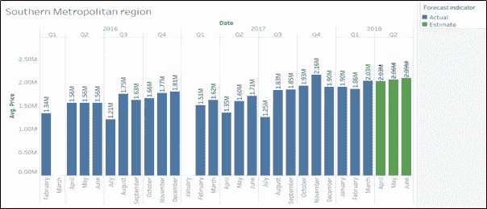
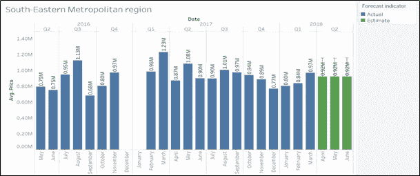

# 使用 Tableau 探索墨尔本房地产市场

> 原文：<https://towardsdatascience.com/exploring-the-melbourne-real-estate-market-using-tableau-914d63659f8e?source=collection_archive---------17----------------------->

## Tableau 中的数据可视化介绍

# 介绍

墨尔本作为世界上最适宜居住的城市之一，吸引了全球各地的许多人。他们中的许多人梦想把这个美丽的地方作为他们的家。我在数据科学领域的旅程始于我搬到墨尔本，因此我决定对该市的房地产市场进行全面分析。我一直对这个行业很着迷。因此，在这篇文章中，我将采取一种全面的方法来识别驱动因素，并帮助潜在买家进行数据驱动的决策。因为这个分析是使用 Tableau 完成的，所以我也将为您提供一些仪表板技巧。

有趣的事实——我在出租房子的时候确实使用了这个分析。因此，如果你刚到墨尔本或者打算在这里买房，这可能会很有用。”

由[丹尼斯·简斯](https://unsplash.com/@dmjdenise?utm_source=medium&utm_medium=referral)在 [Unsplash](https://unsplash.com?utm_source=medium&utm_medium=referral) 上拍摄的照片

## 关于 Tableau

Tableau 是一个功能强大且发展迅速的数据可视化工具，被大多数精通数据的组织所使用。自我智能和将数据转化为令人惊讶的商业洞察力的众多功能使 Tableau 成为最佳的 BI 工具之一。

## 数据描述

本项目使用的[数据集](https://www.kaggle.com/anthonypino/notebook)是托尼·皮诺(Tony Pino)在 Kaggle 上发布的 2016 年 1 月至 2018 年 10 月期间墨尔本出售的房屋数据，这些数据来自 Domain.com.au 每周发布的公开结果。一些数据字段包括日期、价格、郊区、地区名称、土地大小、建筑大小、与中央商务区的距离等。(卡格尔)

## 假设和关键问题

1.随着我们越来越靠近 CBD 区域，建筑规模与土地规模的比率会产生什么影响？这个比例会影响房价吗？

2.2018 年第二季度墨尔本不同大都市地区的房屋均价会是多少？

3.墨尔本哪个月卖的房子多？

4.墨尔本房价和最大卖房数排名前 10 的郊区有哪些？

# 数据处理

为了分析建筑与土地的比例及其与城市距离的关系，在数据中添加了一个虚拟列(比例)。我们的探索围绕着价格、与 CBD 的距离、郊区、区域类型以及建筑与土地的比例。区域列中的空值是使用郊区信息估算的。使用 Excel 中合适的过滤器删除了剩余的空值记录。对显示建筑面积与土地面积之比大于 1 的房产数据进行质量检查。此类记录已从分析中剔除。

# 探索性分析

为了开始分析，我首先绘制了一张 choropleth 地图，显示了墨尔本不同地区房屋的平均价格。

**Choropleth 地图:**

地图是一种专题地图，其中地图中的不同区域按照代表地理特征汇总的统计变量的比例进行着色或图案化。(维基百科)

图一。不同地区住房平均价格的变化。快照取自作者开发的 Tableau 仪表板。

上面的可视化显示，位于中央商务区和东部沿海地区的房价比其他地区的房价要高。

我感兴趣的是分析房子的位置对建筑面积与土地面积比率的影响。房子离 CBD 的距离被用作位置的维度。我绘制了一个二元组合图，它由“距 CBD 的距离”和“平均比率”之间的条形图和线图组成。线形图显示了比率的移动平均值，以平滑结果。为了更好的理解，这个距离被形象化为 5 公里的范围。

图二。与城市的距离相对于建筑与土地面积比率的变化。快照取自作者开发的 Tableau 仪表板。

为了清楚地了解比率随位置的变化，我还绘制了墨尔本的 choropleth 地图，显示了不同郊区的平均比率，如下图所示。

图 3。不同地区平均建筑面积与土地面积之比的变化。快照取自作者开发的 Tableau 仪表板。

以上形象化的描述让我们了解到，随着我们越来越靠近 CBD 和沿海地区，建筑面积与土地面积的比例也在增加。可以推断，与位于城市和靠近沿海地区的房屋相比，位于远离城市的房屋在前院和后院有更多未被占用的土地空间。造成这种情况的主要原因可以认为是 CBD 地区缺乏空间和房价高。

现在让我们来看看墨尔本房屋销售的月度趋势。我绘制了房屋销售的年度饼状图来观察月度趋势，如下图所示。由于 2018 年的完整数据不可用，我们将可视化 2016 年和 2017 年的结果。

图 4。2011 年和 2017 年的月度销售分布。快照取自作者开发的 Tableau 仪表板。

可以观察到，2016 年的最大销售额在 11 月，而 2017 年的最大销售额在 7 月。在这两年中，据观察，大多数房屋都是在 5 月至 11 月期间出售的。由此可以推断，房子在冬季卖得更多。

为了找出平均价格最高和售出房屋数量最多的前 10 个郊区，我绘制了两个条形图，如下图所示。

图 5。最高均价和最高销售量的十大郊区。快照取自作者开发的 Tableau 仪表板。

上面的图像显示，库永是最昂贵的郊区，水库是最受欢迎的郊区。

**使用 Tableau 的预测模型预测未来平均价格:**

绘制了一个显示一年中不同月份平均价格的条形图。该图已针对不同区域进行了过滤。我已经用 Tableau 的预测模型预测了 2018 年第二季度的房价。该模型根据季度和月份的价格变化趋势来确定预测价格。

图 6。东部大都市地区的预测。快照取自作者开发的 Tableau 仪表板。

根据上述可视化，东部地区 2018 年 4 月、5 月和 6 月的预测平均价格分别为 122 万美元、123 万美元和 124 万美元。随着我们从 2018 年第一季度跳到第二季度，预测遵循价格下降的趋势。此外，模型平均出 2016 年和 2017 年从 4 月到 5 月和 5 月到 6 月的变化，并提供 5 月和 6 月的价格向上增长。

图 7。西部和北部大都市地区的预测。快照取自作者开发的 Tableau 仪表板。

在西部大都市和北部大都市地区，随着我们从 2017 年第 1 季度进入第 2 季度，该模型再次遵循价格下降的趋势。从四月到五月和五月到六月的价格变化被平均化，并且预测第二季度的所有三个月对于两个区域具有相似的趋势。

图 8。南部大都市地区的预测。快照取自作者开发的 Tableau 仪表板。

对于南部大都市地区，2016 年和 2017 年第一季度的数据都缺失。因此，系统无法跟踪季度变化趋势，并预测 2018 年 4 月的平均价格与 2018 年 3 月相同。此外，根据上一年 4 月至 5 月和 5 月至 6 月的平均变化，2018 年 5 月和 6 月有所上升。

图 9。南部大都市地区的预测。快照取自作者开发的 Tableau 仪表板。

在东南大都市地区，2016 年和 2017 年第一季度的数据都缺失。此外，2016 年第二季度的数据也缺失。因此，该模型无法提供准确的预测，并显示 2018 年第二季度所有三个月的固定值为 92 万美元。

# 结论

这种数据探索和可视化帮助我们为有抱负的买家收集了一些关于墨尔本房地产市场的有用见解。

据观察，随着我们越来越靠近城市地区，建筑面积与土地面积的比率变化很大。城市的高价格和更少的空间鼓励人们利用全部土地来建造房屋。

除了南部大都市地区，预测模型显示，随着我们从 2018 年第一季度到第二季度，房价将会下降。此外，冬季被认为是买家购买房屋的最佳季节。

# 参考

1.  t .皮诺(2018 年)。墨尔本住房市场。从[https://www.kaggle.com/anthonypino/data](https://www.kaggle.com/anthonypino/data)取回
2.  Choropleth 地图。从 https://en.wikipedia.org/wiki/Choropleth_map[取回](https://en.wikipedia.org/wiki/Choropleth_map)

# 包装

感谢阅读👍。希望你觉得这篇文章很有见地。如果是，请在您最喜欢的社交媒体平台上分享。我希望提出一些更高级的数据可视化。

我目前正在墨尔本莫纳什大学攻读数据科学硕士学位。要提供任何反馈或建议，请发电子邮件至 rishabharora268@gmail.com。你也可以在 [Linkedin](https://www.linkedin.com/in/rishabh-arora-609969141) 或[脸书](https://www.facebook.com/profile.php?id=100047957205445)上联系我。

继续摆桌子！