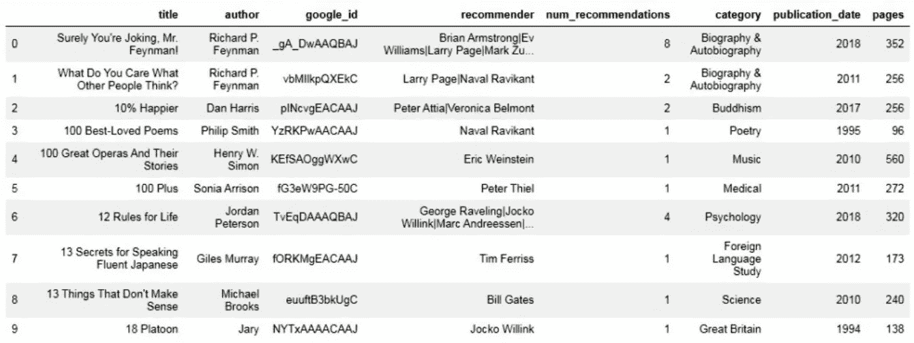
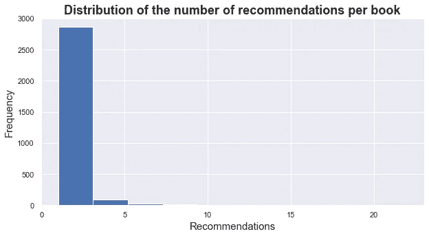
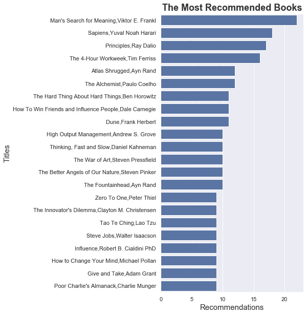
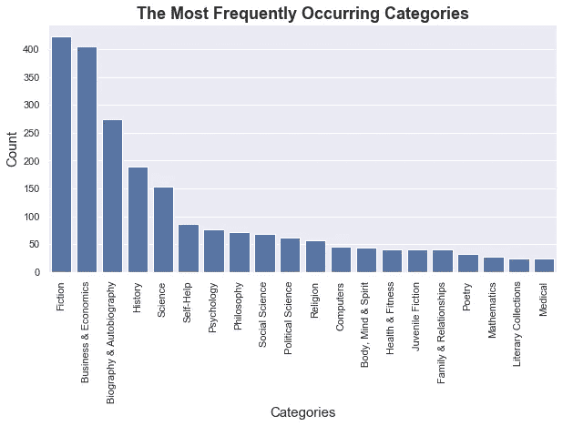
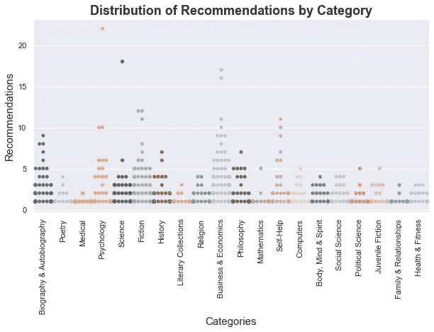
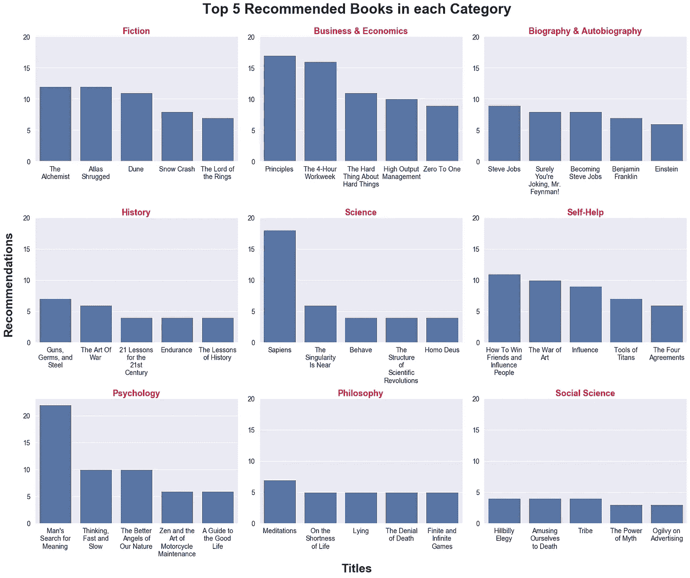
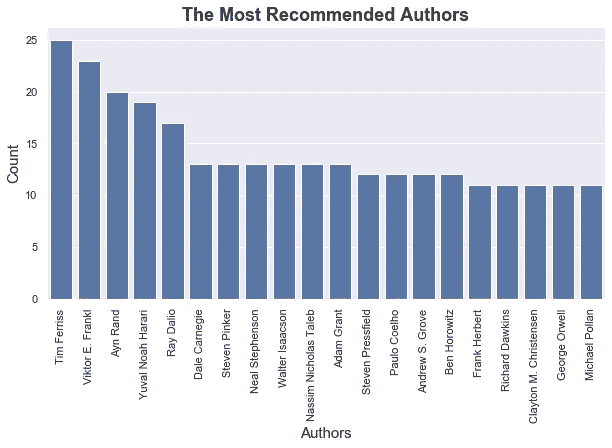

# 使用 Python 查找要阅读的新书

> 原文：<https://towardsdatascience.com/exploring-the-most-recommended-books-using-python-e5bf7291fe59?source=collection_archive---------28----------------------->

## 搜罗探索最值得推荐的书籍


保罗·斯查费在 [Unsplash](https://unsplash.com/@paul__schafer?utm_source=unsplash&utm_medium=referral&utm_content=creditCopyText) 上的照片

有成千上万的书，但并不是所有的都值得一读。引用*华氏 451 度*中老费伯的话，最好的书是那些“展示生活面孔上的毛孔”的书

那么，面对铺天盖地的书籍，你如何找到最好的呢？

一种方法是去专门的图书网站(比如亚马逊或者 Goodreads)。它们提供过滤工具来优化搜索结果，并显示用户的评论和平均评级，以帮助缩小选择范围。

或者，你可以向他们的朋友或熟人寻求推荐。

这两种方法无疑是有效的。

但是还有第三种方法可以获得很好的结果:**看看那些知名人士的推荐，他们说他们读过的书对他们的成就起了很大的作用。**

这就是这个神奇的网站[Mostrecommendedbooks.com](https://www.mostrecommendedbooks.com/)发挥作用的地方。

# MostRecommendedBooks.com

[这个网站](https://www.mostrecommendedbooks.com/)几乎展示了*“世界级人物”*推荐的所有书籍。与同行相比，它真的是遥遥领先。

所以，我决定检索它所有的书名 [](#503b) ，心中有两个目的:

1.  把所有这些书放在一个数据框架里，给我的书友们
2.  使用 Python 可视化库深入了解这一宝贵财富。

我还使用了 [Google Books API](https://developers.google.com/books) 来获取页数、出版日期和类别。我选择 Google Books API 是因为:

*   它提供了大量图书的各种信息。
*   文档简明易懂。
*   有多个查询参数(标题、作者、ISBN 等。).
*   公共数据，比如我们想要访问的数据，不需要授权。您只需要提供 API 密钥 [](#a8bb) 。

***(我的***[***Github***](https://github.com/teb86/Scraping-and-investigating-the-most-recommended-books)***上有抓取数据和构建数据集的代码)。数据集也可以在*** [***中找到【卡格尔】***](https://www.kaggle.com/abdelhamidtebba/booksrecommendedbyworldfamouspersonnalities)***)***

在开始之前，让我们导入将要使用的 Python 库。

```
import pandas as pd
import numpy as np
import matplotlib.pyplot as plt
import seaborn as sb
import textwrap%matplotlib inline
```

# 加载数据集

```
books_df = pd.read_csv('books_clean.csv')
books_df.head(10)
```



这是我们的数据集的样子。让我们看看这里有多少本书:

```
books_df.shape
```

(3003, 8)

如你所见，我们有 3003 个书名。

我们还有其他功能，如推荐数量、类别、出版日期和页数。

对于任何可能感兴趣的人，我还确保包括 Google books IDs，以方便相同书籍的数据抓取。

# 探索数据集

让我们从绘制推荐/书籍数量的分布图开始:

```
***#Histogram:***
plt.figure(figsize=[10,5])
plt.hist(data=books_df, x='num_recommendations')
plt.title('Distribution of the number of recommendations per book', size=18, fontweight='bold')
plt.xlabel('Recommendations', size=15)
plt.ylabel('Frequency', size=15)
```



这种分布是右偏的，许多书的推荐数量少于 2 本。

**那么，这份榜单内最值得推荐的书有哪些呢？**

要回答这个问题，我们不能按降序排列所有 3003 本书，因为这将产生一个不美观的图表，不能简明地传达信息。

因此，我将(任意地)将“num_recommendations”唯一值的中值作为最受推荐书籍的最小阈值:

```
***#Fixing the threshold:***
threshold=np.median(books_df['num_recommendations'].value_counts().index)***#Subset of the dataset based on the threshold:***
data=books_df.loc[books_df.num_recommendations >= threshold] ***#Combining titles and authors:*** 
data['title_y']=[','.join(i) for i in list(zip(data['title'],data['author']))]***#Barplot:*** 
plt.figure(figsize = [5,10])
color_base = sb.color_palette()[0]sb.barplot(data = data.sort_values(by = 'num_recommendations', ascending = False), x = 'recommender_count', y = 'title_y', color = color_base)plt.title('The Most Recommended Books', size = 18)
plt.xlabel('Recommendations', fontweight = 'bold', size = 15)
plt.ylabel('Titles', size = 15);
```



在这里，我们有 22 本书在我们的数据框架的绝对顶点。

正如你所看到的,《人类对意义的探索》( Victor Frankl)在 20 多条建议中名列榜首，其次是《智人》(尤瓦尔·赫拉利),然后是雷伊·达里奥的《原则》( T31)。

然而，似乎这个情节包含许多商业和自助书籍。我们几乎看不到一本小说，更别说哲学或其他特定类别的书了。

深入挖掘数据框架中的类别肯定会完善我们的发现，并带来有意义的信息，帮助我们选择最好的书籍。

但是首先，我们需要知道在我们的数据集中最常出现的类别。

为了简单起见，我将只列出前 20 名:

```
***#Plotting the 20 most frequently occurring categories:***plt.figure(figsize = [10,5])
color_base = sb.color_palette()[0]sb.barplot(books_df.category.value_counts().head(20).index, books_df.category.value_counts().head(20).values, color=color_base)plt.xticks(rotation = 'vertical')
plt.title('The Most Frequently Occurring Categories', fontweight = 'bold', size = 18)
plt.xlabel('Categories', size = 15)
plt.ylabel('Count', size = 15)
```



不出所料，**小说**和**商业**书籍最受欢迎，各有超过 400 本。**传记**书籍排在第三位，接下来是**历史**和**科学**。

在一个给定的类别中有很多书并不意味着这个类别是最值得推荐的，也不意味着这个类别中的书是所有书中最值得推荐的。品味是无法解释的。有些人喜欢小说，而有些人对经济学更感兴趣。

出于这个原因，查看建议在每个类别中的分布**是合理的。**

这将让我们了解异常值，并帮助我们发现每个类别中最值得推荐的书籍:

```
cat = books_df.category.value_counts().head(20).indexfig, ax = plt.subplots(figsize = [10,5])sb.swarmplot(data = books_df[books_df.category.isin(cat)], x = 'category', y = 'num_recommendations', palette = 'tab20')ax.set_xticklabels(ax.get_xticklabels(), rotation = 90)
ax.set_title('Distribution of Recommendations by Category', fontweight = 'bold', size = 18)
ax.set_xlabel('Categories',  size = 15)
ax.set_ylabel('Recommendations',  fontsize = 15)
```



我们看到大多数类别都有 1-5 本推荐范围内的书籍。

同时，一些类别有超过 5 人推荐的书籍，而另一些类别有超过 10 人推荐的书籍。传记、商业和经济、小说、心理学和自助都有许多书籍，有许多推荐。

现在，让我们找出**每一类**中的必读书籍。

我将只考虑 9 个类别，并根据推荐数量绘制前 5 个类别。但是请注意，使用以下代码可以添加更多类别或扩大图书列表:

```
***#Defining the categories:***
categories = books_df.category.value_counts().head(9).index.tolist()***#Defining a function to select a subset of data:*
def** selection(cat):
    data = books_df[books_df['category'] == cat].sort_values(by =  'num_recommendations', ascending = False).head()
    **return** datafig, ax = plt.subplots(nrows = 3, ncols = 3,figsize = [20,15])
plt.suptitle('Top 5 Recommended Books in each Category', size = 30, y = 1.05, fontweight = 'bold')
fig.tight_layout(h_pad = 8)
fig.text(-0.02, 0.5, 'Recommendations', va = 'center', rotation='vertical', fontweight='bold', fontsize=25)
fig.text(0.5, -0.06, 'Titles', va = 'center', ha = 'center', fontweight = 'bold', fontsize=25)
ax = ax.flatten()
color_base = sb.color_palette()[0]y = sorted(books_df['num_recommendations'].unique())
i=0
**for** cat **in** categories:
    sb.barplot(data = selection(cat), x='title', y = 'num_recommendations', ax = ax[i], color = color_base)
    ax[i].set_title(cat, fontweight = 'bold', fontsize = 18, color = 'crimson')
    ax[i].set_ylabel('')
    ax[i].set_xlabel('')
    ax[i].set_xticklabels((textwrap.fill(x.get_text(), width=11) **for** x **in** ax[i].get_xticklabels()), fontsize = 14)
    ax[i].set_yticks(np.arange(0, max(y)+1, 5))
    ax[i].set_yticklabels(labels = ax[i].get_yticks(), fontsize =14)
    i += 1
```



现在我们有**各种各样的书，我们可以根据自己喜欢的类型从中选择。**

当然，如前所述，有可能情节超过五本书。这只是一个说明，展示它是如何呈现的。

最后，我们可以更进一步，从另一个角度来看我们的数据集。

一个作者可以有多本书，如果一些书获得了很多喜欢，一些作者可能同样比其他人拥有更多的粉丝。

换句话说，我们来看看**“谁是** **最值得推荐的作者”:**

```
***#Grouping by 'recommender' and 'author' to get the unique values of #authors per each recommender:*** 
data = recommended_books.groupby(['recommender', 'author']).count().reset_index(level=1)***#Plotting the 20 most recommended authors:*** 
plt.figure(figsize=[10,5])
color_base = sb.color_palette()[0]sb.barplot(data['author'].value_counts().head(20).index, data['author'].value_counts().head(20).values, color=color_base)plt.xticks(rotation = 'vertical')
plt.title('The Most Recommended Authors', fontweight = 'bold', size = 18)
plt.xlabel('Authors', size = 15)
plt.ylabel('Count', size = 15)
```



这是一个很棒的条形图，有很多名字出现在第一个图的[中。](#ef49)

不过顺序不太一样，有些名字是新的。

换句话说，即使一些书被高度推荐，我们也不要忽视作者，因为他们同样重要。

# 最终想法:

说名人的推荐是“有史以来最好的”，不是我的目的。当然还有许多其他令人惊讶的书没有被注意到(或者没有被翻译成英文)。

简单的建议**创造推动我们选择的社会证据**。一本书的评论或推荐数量越多，想要阅读它的人就越多。当这些评论或建议来自我们当中最成功的人时，社会证明往往会增加。推荐就像一个指南针，在我们迷失的时候给我们指明正确的方向。

我要感谢[mostrecommendedbooks.com](https://www.mostrecommendedbooks.com/)的联合创始人[理查德·赖斯](https://twitter.com/richardreeze)和[阿努拉格·拉姆达桑](https://twitter.com/anuragwho)，他们允许我使用他们的网站作为主要的信息来源。

通过 Google books API 访问公共数据甚至可以在没有 API 键的情况下完成。我试过带钥匙和不带钥匙，两种情况下都有效。