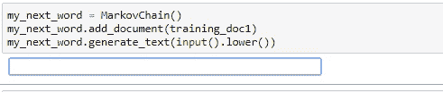
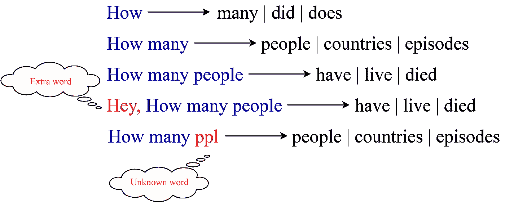
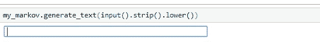
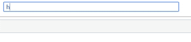

# 探索下一个单词预测器！

> 原文：<https://towardsdatascience.com/exploring-the-next-word-predictor-5e22aeb85d8f?source=collection_archive---------5----------------------->

## 深度学习|自然语言处理

## 构建下一个单词预测器的不同方法


[自由股票](https://unsplash.com/@freestocks?utm_source=medium&utm_medium=referral)在 [Unsplash](https://unsplash.com?utm_source=medium&utm_medium=referral) 上的照片

# 语言预测导论

你手机上的键盘怎么知道你下一步想输入什么？语言预测是一个自然语言处理 NLP 应用程序，涉及预测前面文本中给出的文本。自动完成或建议的回答是语言预测的流行类型。语言预测的第一步是选择语言模型。本文展示了在 Whatsapp 或任何其他消息应用程序中构建下一个单词预测器可以采用的不同方法。

通常有两种模型可以用来开发下一个单词的建议者/预测者:1) N-grams 模型或 2)长短期记忆(LSTM)。我们将仔细检查每种型号，并得出哪个型号更好的结论。

# n 元语法方法

如果你沿着 *n-grams* 这条路走下去，你需要关注“马尔可夫链”来根据训练语料库预测每个后续单词或字符的可能性。下面是这种方法的代码片段。在这种方法中，一的序列长度被用来预测下一个字。这意味着我们将预测前一个单词中给出的下一个单词。

导入必要的模块:[*word _ tokenize*](https://www.kite.com/python/docs/nltk.word_tokenize)*，*[*default dict*](https://docs.python.org/2/library/collections.html#collections.defaultdict)*，* [*计数器*](https://docs.python.org/2/library/collections.html#collections.Counter)

```
import re
from nltk.tokenize import word_tokenize
from collections import defaultdict, Counter
```

创建包含方法的类 *MarkovChain* :

```
class MarkovChain:
  def __init__(self):
    self.lookup_dict = defaultdict(list)def _preprocess(self, string):
    cleaned = re.sub(r’\W+’, ' ', string).lower()
    tokenized = word_tokenize(cleaned)
    return tokenizeddef add_document(self, string):
    preprocessed_list = self._preprocess(string)
    pairs = self.__generate_tuple_keys(preprocessed_list)
    for pair in pairs:
      self.lookup_dict[pair[0]].append(pair[1])def __generate_tuple_keys(self, data):
    if len(data) < 1:
      return
    for i in range(len(data) - 1):
      yield [ data[i], data[i + 1] ]

  def generate_text(self, string):
    if len(self.lookup_dict) > 0:
      print("Next word suggestions:", Counter(self.lookup_dict[string]).most_common()[:3])
    return
```

当我们创建上述类的一个实例时，一个默认的字典被初始化。有一种方法可以对我们通过*添加的训练语料进行预处理。add_document()* 方法。当我们在*的帮助下添加文档时。add_document()* 方法，为每个唯一的单词创建对。让我们用一个例子来理解这一点:如果我们的训练语料库是“你好吗？从我们上次见面到现在有多少天了？你父母好吗？”在预处理和添加文档之后，我们的查找字典应该是:

```
{ 'how': ['are', 'many', 'are'], 'are': ['you', 'your'],
  'you': ['how'], 'many': ['days'], 'days': ['since'],
  'since': ['we'], 'we': ['last'], 'last': ['met'], 'met': ['how'],
  'your': ['parents']}
```

每一个唯一的单词作为一个键和它后面的单词列表作为一个值被添加到我们的查找字典 *lookup_dict 中。*

当我们输入一个单词时，它会在字典中查找，并在下面的单词列表中给出最常用的单词。这里，单词建议的最大数量是三个，就像我们在键盘上一样。下面是序列长度为 1 的这种方法的运行示例。输出包含建议的单词及其在列表中各自的出现频率。当我们输入单词“how”时，会在字典中查找它，并从下面的单词列表中选择最常用的三个单词。这里，“许多”单词出现了 1531 次，这意味着单词序列“多少”在训练语料库中出现了 1531 次。



n 元模型的输出(序列长度为 1)

# 在 n 元语法方法中:

此外，在上述方法中，我们可以具有 2 或 3 或更长的序列长度。为此，我们将不得不改变上面的一些代码。

```
class MarkovChain:
  """ 
  Previous code continued
  """
  def add_document(self, string):
    preprocessed_list = self._preprocess(string)
    pairs = self.__generate_tuple_keys(preprocessed_list)
    for pair in pairs:
      self.lookup_dict[pair[0]].append(pair[1])
    pairs2 = self.__generate_2tuple_keys(preprocessed_list)
    for pair in pairs2:
      self.lookup_dict[tuple([pair[0], pair[1]])].append(pair[2])
    pairs3 = self.__generate_3tuple_keys(preprocessed_list)
    for pair in pairs3:
      self.lookup_dict[tuple([pair[0], pair[1], pair[2]])].append(pair[3])

   def __generate_tuple_keys(self, data):
    if len(data) < 1:
      return 
    for i in range(len(data) - 1):
      yield [ data[i], data[i + 1] ]

  #to add two words tuple as key and the next word as value
  def __generate_2tuple_keys(self, data):
    if len(data) < 2:
      return
    for i in range(len(data) - 2):
      yield [ data[i], data[i + 1], data[i+2] ]

  #to add three words tuple as key and the next word as value 
  def __generate_3tuple_keys(self, data):
    if len(data) < 3:
      return
    for i in range(len(data) - 3):
      yield [ data[i], data[i + 1], data[i+2], data[i+3] ]

  def oneword(self, string):
    return Counter(self.lookup_dict[string]).most_common()[:3]def twowords(self, string):
        suggest = Counter(self.lookup_dict[tuple(string)]).most_common()[:3]
        if len(suggest)==0:
            return self.oneword(string[-1])
        return suggestdef threewords(self, string):
        suggest = Counter(self.lookup_dict[tuple(string)]).most_common()[:3]
        if len(suggest)==0:
            return self.twowords(string[-2:])
        return suggest

  def morewords(self, string):
        return self.threewords(string[-3:])def generate_text(self, string):
    if len(self.lookup_dict) > 0:
        tokens = string.split(" ")
        if len(tokens)==1:
            print("Next word suggestions:", self.oneword(string))
        elif len(tokens)==2:
            print("Next word suggestions:", self.twowords(string.split(" ")))
        elif len(tokens)==3:
            print("Next word suggestions:", self.threewords(string.split(" ")))
        elif len(tokens)>3:
            print("Next word suggestions:", self.morewords(string.split(" ")))
    return
```

我们来破解密码。方法*。__generate_2tuple_keys()* 和*。__generate_3tuple_keys()* 用于分别存储长度为 2 和 3 的序列及其后续单词列表。现在，我们的代码有能力根据之前的三个单词来预测单词。让我们看看我们新的查找字典 *lookup_dict* 的例子:“你好吗？从我们上次见面到现在有多少天了？你父母好吗？”

```
{ 
  """
  Same as before
  """
  ('how', 'are'): ['you', 'your'],
  ...
  ('how', 'many'): ['days'],
  ('many', 'days'): ['since'],
  ...
  ('how', 'are', 'you'): ['how'],
  ...
  ('how', 'many', 'days'): ['since'],
  ...
}
```

与前一对相比，新对被添加到字典中。我们上面创建的类 *MarkovChain* 处理我们输入的任意长度的序列。如果我们输入一个单词，那么方法' *oneword'* '将被调用，这将与前一个相同。对于长度为 2 或 3 的输入，将分别调用方法'*两个字*和'*三个字*'。这些方法的作用是在给定输入单词的情况下，从查找字典中查找最常见的三个单词。当输入单词多于四个时，将处理最后三个。当遇到未知单词时，该单词将被忽略，字符串的其余部分将被处理。看看下面的图来澄清任何疑问。这个数字是基于不同的训练语料库。左侧显示输入，右侧显示输出。



我们的 n-grams 模型的各种输入情况

下面是这种方法的运行输出:



n 元模型的输出(序列长度超过 1)

上面的输出是基于用于这种方法的一个不同的更大的数据集。GitHub 对于这种方式的链接是 [this](https://github.com/jackfrost1411/next_word_suggestor/tree/master/n-grams) 。你可以在那里找到上面的代码。

## 局限性:

马尔可夫链没有记忆。采用这种方法有许多限制。举个例子，“我吃了这么多烤……”下一个单词“三明治”将基于“烤三明治”在训练数据中一起出现的次数来预测。因为我们得到的建议只是基于频率，所以在很多情况下这种方法可能会失败。

# 长短期记忆(LSTM)方法:

使用神经语言模型的更高级的方法是使用长短期记忆(LSTM)。LSTM 模型使用深度学习和管理记忆的人工“细胞”网络，使它们比传统的神经网络和其他模型更适合文本预测。

> “草总是…”
> 
> 下一个词是简单的“绿色”，可以被大多数模型和网络预测。
> 
> 但是对于句子“现在是冬天，阳光很少，草总是……”，我们需要知道句子更后面的上下文来预测下一个单词“棕色”。

当上下文和要预测的单词之间的差距增大时，标准 RNNs 和其他语言模型变得不太准确。这就是 LSTM 被用来解决长期依赖问题的时候，因为它有记忆细胞来记住以前的上下文。你可以在这里了解更多关于 LSTM 网络的信息。

让我们开始编码并定义我们的 LSTM 模型。在构建我们的模型时，首先，使用一个嵌入层，两个各有 50 个单位的堆叠 LSTM 层。

Keras 提供了一个嵌入层，可用于文本数据上的神经网络。嵌入层用随机权重初始化，并学习训练数据集中所有单词的嵌入。它需要整数编码形式的输入数据。这个数据准备步骤可以在同样由 Keras 提供的 [Tokenizer API](https://keras.io/preprocessing/text/#tokenizer) 的帮助下执行。点击了解更多关于嵌入层[的信息。](https://keras.io/layers/embeddings/#embedding)

两个 LSTM 层之后是两个完全连接的或密集的层。第一层有 50 个单元，第二个密集层是我们的输出(softmax)层，其单元数量等于词汇表大小。对于每个输入，模型将根据概率从我们的词汇中预测下一个单词。分类交叉熵被用作损失函数。

## 数据预处理:

对于嵌入层的输入，我们首先必须使用来自 *keras.processing.text* 的 Tokenizer 来编码我们的输入字符串。我们在预处理中所做的很简单:我们首先创建特征字典的*序列。然后我们在记号赋予器的帮助下把它编码成整数形式。*

```
from keras.preprocessing.text import Tokenizer
import nltk
from nltk.tokenize import word_tokenize
import numpy as np
import re
from keras.utils import to_categorical
from doc3 import training_doc3cleaned = re.sub(r'\W+', ' ', training_doc3).lower()
tokens = word_tokenize(cleaned)
train_len = 4
text_sequences = []for i in range(train_len,len(tokens)):
  seq = tokens[i-train_len:i]
  text_sequences.append(seq)sequences = {}
count = 1for i in range(len(tokens)):
  if tokens[i] not in sequences:
    sequences[tokens[i]] = count
    count += 1tokenizer = Tokenizer()
tokenizer.fit_on_texts(text_sequences)
sequences = tokenizer.texts_to_sequences(text_sequences)#vocabulary size increased by 1 for the cause of padding
vocabulary_size = len(tokenizer.word_counts)+1
n_sequences = np.empty([len(sequences),train_len], dtype='int32')for i in range(len(sequences)):
  n_sequences[i] = sequences[i]train_inputs = n_sequences[:,:-1]
train_targets = n_sequences[:,-1]
train_targets = to_categorical(train_targets, num_classes=vocabulary_size)
seq_len = train_inputs.shape[1]
```

让我们用一个例子来理解上面的代码中发生了什么:“你好吗？从我们上次见面到现在有多少天了？你父母好吗？”。我们首先清理我们的语料库，并借助 nltk 库中的*正则表达式、*和 *word_tokenize* 对其进行标记。*【序列】*字典是做什么的？下面是使用记号赋予器之前的*‘sequences’*字典。

```
{'how': 1, 'are': 2, 'you': 3, 'many': 4, 'days': 5, 'since': 6, 'we': 7, 'last': 8, 'met': 9, 'your': 10, 'parents': 11}
```

我们的*‘text _ sequences’*列表保存了我们训练语料库中的所有序列，它将是:

```
[['how', 'are', 'you', 'how'], ['are', 'you', 'how', 'many'], ['you', 'how', 'many', 'days'], ['how', 'many', 'days', 'since'], ['many', 'days', 'since', 'we'], ['days', 'since', 'we', 'last'], ['since', 'we', 'last', 'met'], ['we', 'last', 'met', 'how'], ['last', 'met', 'how', 'are'], ['met', 'how', 'are', 'your']]
```

使用 tokenizer 后，我们得到了编码形式的上述序列。这些数字只不过是重新分配前'*序列'*字典中相应单词的索引。

```
[[1, 2, 9, 1], [2, 9, 1, 3], [9, 1, 3, 4], [1, 3, 4, 5], [3, 4, 5, 6], [4, 5, 6, 7], [5, 6, 7, 8], [6, 7, 8, 1], [7, 8, 1, 2], [8, 1, 2, 10]]
```

一旦我们有了编码形式的序列，通过将序列分成输入和输出标签来定义训练数据和目标数据。对于此示例，我们将基于前三个单词预测下一个单词，因此在训练中，我们使用前三个单词作为输入，最后一个单词作为将由模型预测的标签。我们的'T12 培训 _ 输入'T13 现在应该是:

```
[[1 2 9]  [2 9 1]  [9 1 3]  [1 3 4]  [3 4 5]  [4 5 6]  [5 6 7]  [6 7 8]  [7 8 1]  [8 1 2]]
```

然后，我们将输出标签转换成一个热点向量，即 0 和 1 的组合。' *train_targets'* 中的单热点向量看起来像:

```
[[0\. 1\. 0\. 0\. 0\. 0\. 0\. 0\. 0\. 0\. 0.] 
 ...
 [0\. 0\. 0\. 0\. 0\. 0\. 0\. 0\. 0\. 0\. 1.]]
```

对于第一个目标标签“how ”,序列字典中的索引是“1 ”,因此在编码形式中，您会在' *train_targets'* 的第一个独热向量中的索引 1 处看到“1”。

*注意:以上代码是针对文本“你好吗？从我们上次见面到现在有多少天了？你父母好吗？”为了更简单的解释。但实际上，使用了更大的数据集。*

## 构建模型:

现在我们训练我们的*序列*模型，它有 5 层:一个嵌入层、两个 LSTM 层和两个密集层。在我们的模型的输入层，即嵌入层中，输入长度被设置为序列的大小，在这个例子中是 3。*(注意:我们将训练输入和训练目标的数据分割为 3 比 1，因此当我们为预测模型提供输入时，我们必须提供 3 个长度向量。)*

```
from keras.models import Sequential
from keras.layers import Dense
from keras.layers import LSTM
from keras.layers import Embedding
model = Sequential()
model.add(Embedding(vocabulary_size, seq_len, input_length=seq_len))
model.add(LSTM(50,return_sequences=True))
model.add(LSTM(50))
model.add(Dense(50,activation='relu'))
model.add(Dense(vocabulary_size, activation='softmax'))# compiling the network
model.compile(loss='categorical_crossentropy', optimizer='adam', metrics=['accuracy'])
model.fit(train_inputs,train_targets,epochs=500,verbose=1)
```

## 预测单词:

在我们的模型被训练后，我们可以以编码的形式给出输入，并从 *softmax* 函数中得到三个最可能的单词，如下所示。

```
from keras.preprocessing.sequence import pad_sequencesinput_text = input().strip().lower()
encoded_text = tokenizer.texts_to_sequences([input_text])[0]
pad_encoded = pad_sequences([encoded_text], maxlen=seq_len, truncating='pre')
print(encoded_text, pad_encoded)for i in (model.predict(pad_encoded)[0]).argsort()[-3:][::-1]:
  pred_word = tokenizer.index_word[i]
  print("Next word suggestion:",pred_word)
```

在上面的代码中，我们使用填充，因为我们在长度为 3 的序列上训练我们的模型，所以当我们输入 5 个单词时，填充将确保最后三个单词作为我们模型的输入。当我们输入少于 3 个单词时会发生什么？我们不会得到最好的结果！当我们输入一个未知的单词时，也会发生同样的情况，因为在这个单词的索引中，一键向量将包含 0。我们将来可以做的是，将长度为 2(输入)的序列添加到 1(目标标签)中，将长度为 1(输入)的序列添加到 1(目标标签)中，就像我们在这里将长度为 3(输入)的序列添加到 1(目标标签)中一样，以获得最佳结果。

下面是我们的模型根据前面的单词预测接下来的 3 个单词的最终输出。



LSTM 模型的输出

上面的输出显示了输入的向量形式以及建议的单词。[6，4，3]是*'编码 _ 文本'*，[[6，4，3]]是'*填充 _ 编码'*。

*注意:这里我们将数据分为 3(输入)比 1(目标标签)。所以，一定要输入三个字。*

GitHub 上面代码的链接是[这个](https://github.com/jackfrost1411/next_word_suggestor/tree/master/LSTM)。你可以在那里找到 LSTM 方法的代码。

# 结论:

上面，我们看到 n-grams 方法不如 LSTM 方法，因为 lstm 具有从文本语料库中更远的地方记住上下文的记忆。在开始一个新项目时，您可能希望通过在互联网上寻找开源实现来考虑一个现有的预训练框架。这样，您就不必从头开始，也不需要担心训练过程或超参数。


乔希·里默尔在 [Unsplash](https://unsplash.com?utm_source=medium&utm_medium=referral) 上拍摄的照片

自然语言处理领域的许多最新工作包括开发和训练神经模型，以模拟人类大脑对语言的作用方式。这种深度学习方法使计算机能够以更有效的方式模仿人类语言。