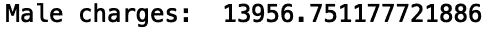

# 探索 Python 熊猫图书馆

> 原文：<https://towardsdatascience.com/exploring-the-python-pandas-library-67243960271e?source=collection_archive---------40----------------------->

## Python 熊猫图书馆


[来源](https://www.pexels.com/photo/marketing-iphone-smartphone-notebook-97078/)

Pandas 是一个 python 库，用于从数据中分析、转换和生成统计数据。在本帖中，我们将讨论 Pandas 中用于数据争论和探索的几种有用的方法。出于我们的目的，我们将使用来自 [Kaggle](https://www.kaggle.com/mirichoi0218/insurance) 的*医疗费用个人数据集*数据。

我们开始吧！

# **读取数据**

首先，让我们导入 pandas 库:

```
import pandas as pd
```

接下来，让我们读入熊猫数据框。Pandas 数据框基本上是一个由行和列组成的类似于表格数组的数据结构。为了读入数据，我们可以使用。read_csv()'方法:

```
df = pd.read_csv("insurance.csv")
```

接下来，我们可以使用。head()'和'。tail()'方法分别查看第一行和最后五行数据:

```
print(df.head())
```


```
print(df.tail())
```


我们还可以查看列名:

```
print(df.columns)
```


这对于包含大量列的数据集尤其有用。

# **清洗数据**

很多时候，当使用真实数据时，我们必须处理数据列中缺失的值。使用 pandas，我们可以很快了解数据有多稀疏。isnull()”方法:

```
print(df.isnull().sum())
```


我们看到该数据不包含任何缺失值。让我们人为地为“儿童”和“地区”列添加缺失的值，以演示我们如何删除这些值:

```
df.loc[df.region == 'southwest', 'region'] = np.nan
df.loc[df.children == 1, 'children'] = np.nan
```

现在让我们计算一下我们添加的缺失值的数量:

```
print(df.isnull().sum())
```


我们可以使用。“dropna()”方法来移除这些缺少的值。这既可以就地完成，也可以返回一个值，存储在一个新的变量中。为了适当地删除丢失的值，我们执行以下操作:

```
df.dropna(inplace=True)
print(df.isnull().sum())
```

这里，df 变量已经被修改。或者，我们可以执行以下操作:

```
df = df.dropna()
```

让我们再次打印缺失的值:

```
print(df.isnull().sum())
```


我们可以在丢失值之前和之后检查数据帧的长度:

```
print("Length Before:", len(df))
df.dropna(inplace=True)
print("Length After:", len(df))
```


此外，如果想要填充数据框中缺失的值，可以使用。fillna()”方法。要做到这一点:

```
df.fillna(0, inplace=True)
```

或者:

```
df = df.fillna(0)
```

由于我们输入的是缺失值，因此数据帧的长度不应改变:

```
print("Length Before:", len(df))
df.fillna(0, inplace=True)
print("Length After:", len(df))
```


# **过滤数据**

我们可以根据列值轻松过滤数据帧。例如，如果我们想要对应于 30 岁以下患者的记录，我们可以写:

```
df = df[df['age'] < 30]
print(df.head())
```


如果我们想要与超过 10，000 美元的费用相对应的记录，我们可以写:

```
df = df[df['charges'] > 10000]
print(df.head())
```


我们还可以过滤数据框，仅包含吸烟者:

```
df = df[df['smoker'] == 'yes']
```

让我们打印前五行:

```
print(df.head())
```


请注意，在删除数据后，索引已经被修改。我们可以通过使用“reset_index”方法来解决这个问题:

```
df.reset_index(inplace=True)
del df['index']
print(df.head())
```


我们也可以使用多个条件进行过滤。假设我们想要提取与女性吸烟者相对应的数据。我们可以使用。loc[]'方法如下:

```
df = df.loc[(df.sex == 'female') & (df.smoker == 'yes')]
df.reset_index(inplace=True)
del df['index']
print(df.head())
```


我们甚至可以添加两个以上的条件。让我们过滤 50 岁以上的女性吸烟者:

```
df = df.loc[(df.sex == 'female') & (df.smoker == 'yes') & (df.age >= 50)]
df.reset_index(inplace=True)
del df['index']
print(df.head())
```


# **选择行和列**

现在我们将讨论如何使用。iloc[]'方法来选择索引。为了选择数据集中的第一个、第二个和最后一个索引，我们执行以下操作:

```
print(df.head())
print("---------------------First---------------------")
print(df.iloc[0])
print("---------------------Second---------------------") 
print(df.iloc[1])
print("---------------------Last---------------------")
print(df.iloc[-1])
```


你可以用'做类似的事情。特定列的 loc[]。要选择第一行和第二行，我们执行以下操作:

```
print("---------------------First---------------------")
print(df.loc[0, 'sex'])
print("---------------------Second---------------------") 
print(df.loc[1, 'sex'])
```


我们也可以在一列中选择多行:

```
print("---------------------First---------------------")
print(df.loc[0:3, 'sex'])
print("---------------------Second---------------------") 
print(df.loc[3:6, 'sex'])
```


# **汇总数据&生成统计数据**

现在，我们将讨论如何从数据框中的数据生成统计数据。我们可以为特定类别创建单独的数据框，并从结果数据框中生成统计数据。让我们为男性和女性记录创建单独的数据框:

```
df_female = df[df['sex'] == 'female']
df_male = df[df['sex'] == 'male']
```

让我们看看女性的平均费用:

```
print("Female charges: ", df_female['charges'].mean())
```


让我们看看男性的平均费用:

```
print("Male charges: ", df_male['charges'].mean())
```



我们还可以使用'找到任何数字列的最大值。max()”方法。让我们对完整的数据集这样做:

```
print("Maximum Value: ", df['charges'].max())
```


我们还可以找到最小值:

```
print("Minimum Value: ", df['charges'].min())
```


我们可以将这些方法应用于其他数值列。让我们对“年龄”列也这样做:

```
print("Maximum Value: ", df['age'].max())
print("Minimum Value: ", df['age'].min())
```


让我们对“bmi”列进行同样的操作:

```
print("Maximum Value: ", df['bmi'].max())
print("Minimum Value: ", df['bmi'].min())
```


另一个有用的方法是。可用于聚合数据的“groupby()”方法。假设我们想知道男性和女性吸烟者的数量:

```
df_yes = df[df['smoker'] == 'yes']
df_yes  = df_yes.groupby(['sex'])['smoker'].count()
print(df_yes.head())
```


我们看到男性吸烟者的数量大于女性吸烟者的数量。我们也可以看看非吸烟者的分组统计数据:

```
df_no = df[df['smoker'] == 'no']
df_no  = df_no.groupby(['sex'])['smoker'].count()
print(df_no.head())
```


我们也可以使用。“groupby()”方法来获取不同类别类型的平均医疗费用。之前我们看了男性和女性的平均医疗费用。我们可以用'再次生成那些统计数据。groupby()':

```
df  = df.groupby(['sex'])['charges'].mean()
print(df.head())
```


我们还可以为每个区域组生成这些统计数据:

```
df  = df.groupby(['region'])['charges'].mean()
print(df.head())
```


看看每个吸烟者群体的平均医疗费用也是很有趣的:

```
df  = df.groupby(['smoker'])['charges'].mean()
print(df.head())
```


正如我们所料，吸烟者的医疗费用明显高于不吸烟者。我们也可以按吸烟者和性别分组:

```
df  = df.groupby(['smoker', 'sex'])['charges'].mean()
print(df.head())
```


我们还可以查看其他统计数据，如跨类别收费的标准偏差。标准差衡量一组值的离差量。在这种情况下，我们将考虑电荷的标准偏差，它对应于电荷数据的分散。让我们来看看不同性别间电荷的标准差:

```
df  = df.groupby(['sex'])['charges'].std()
print(df.head())
```


我们还可以查看不同地区的收费标准偏差:

```
df  = df.groupby(['region'])['charges'].std()
print(df.head())
```


或者我们可以应用。跨多列的“groupby()”。让我们计算跨地区/性别组的费用标准偏差:

```
df  = df.groupby(['region', 'sex'])['charges'].std()
print(df.head())
```


接下来，让我们计算不同吸烟者/性别群体的标准偏差:

```
df  = df.groupby(['smoker', 'sex'])['charges'].std()
print(df.head())
```


# **迭代数据帧**

接下来，我们将讨论如何迭代数据框行。我们可以使用一种叫做。iterrows()'，这将允许我们对行和索引值进行迭代:

```
for index, rows in df.iterrows():
    print(index, rows)
```

下面是一些输出值的屏幕截图:


我们还可以为我们的迭代选择特定的行。让我们对“性别”、“费用”和“吸烟者”栏也这样做:

```
for index, rows in df.iterrows():
    print('sex:', rows['sex'], 'charges:', rows['charges'], 'smoker:', rows['smoker'])
```


我们还可以根据其他列的值创建新列。假设我们想要创建一个新列来指定一个记录是否对应于一个女性吸烟者。我们可以使用。iterrows()'和'。用布尔值标记女性吸烟者的 at[]'方法:

```
for index, rows in df.iterrows():
    if (rows.sex == 'female') and (rows.smoker == 'yes'): 
        df.at[index, 'female_smoker'] = True
    else:
        df.at[index, 'female_smoker'] = False
```

让我们打印修改后的数据框的前五行:

```
print(df.head())
```


我们可以用'执行更复杂的标记。iterrows()'和'。位于[]'。假设我们要创建一列布尔值，对应于 50 岁以上有孩子的男性吸烟者:

```
for index, rows in df.iterrows():
    if (rows.sex == 'male') and (rows.smoker == 'yes') and (rows.age > 50) and (rows.children > 0): 
        df.at[index, 'male_smoker_with_children'] = True
    else:
        df.at[index, 'male_smoker_with_children'] = False
```

让我们打印结果数据框的前五行:

```
print(df.head())
```


我们可以做的另一件事是使用 collections 模块中的“Counter”方法来了解新列的布尔值分布。让我们将“计数器”方法应用于“女性吸烟者”列:

```
from collections import Counter
print(Counter(df['female_smoker']))
```


这对应于 115 个女性吸烟者的记录。让我们将“计数器”应用于 50 岁以上有孩子的男性吸烟者一栏:

```
print(Counter(df['male_smoker_with_children']))
```


这相当于 21 个 50 岁以上有孩子的男性吸烟者的记录。

# **写入文件**

最后，如果我们对数据框进行了足够的修改，以至于我们希望将其保存到一个单独的文件中，那么我们可以使用。“to_csv()”方法:

```
df.to_csv("insurance_edit.csv")
```

# 结论

总之，在这篇文章中，我们讨论了熊猫的几种方法。我们讨论了如何使用 Pandas 方法读取、清理和过滤数据。我们还讨论了如何生成聚合统计数据、迭代数据帧以及将数据写入新文件。我希望这有所帮助。这篇文章中的代码可以在 [GitHub](https://github.com/spierre91/saturncloud_blog/blob/master/pandas_tuorials/pandas_methods.py) 上找到。感谢您的阅读！