# 探索 Softmax 函数

> 原文：<https://towardsdatascience.com/exploring-the-softmax-function-578c8b0fb15?source=collection_archive---------52----------------------->

## 用 Wolfram 语言发展直觉


卡伦·艾姆斯利在 [Unsplash](https://unsplash.com/s/photos/exploring?utm_source=unsplash&utm_medium=referral&utm_content=creditCopyText) 上的照片

在机器学习中，分类问题通常用神经网络来解决，神经网络给出它被训练识别的每个类别或类型的概率。一个典型的例子是图像分类，其中神经网络的输入是图像，输出是图像用概率表示的可能事物的列表。

Wolfram 语言(WL)带有一个大型的预训练神经网络库，包括解决[分类问题](https://resources.wolframcloud.com/NeuralNetRepository/tasktype/Classification/)的网络。例如，内置的系统功能 [ImageIdentify](https://reference.wolfram.com/language/ref/ImageIdentify.html) 使用了一个[预训练的网络](https://resources.wolframcloud.com/NeuralNetRepository/resources/Wolfram-ImageIdentify-Net-V1)，它可以识别图像中的 4000 多个对象。

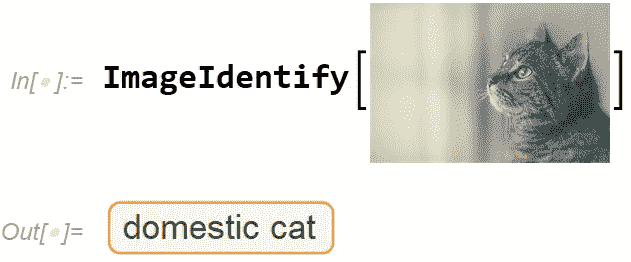

作者在 [Unsplash](https://unsplash.com/s/photos/cat?utm_source=unsplash&utm_medium=referral&utm_content=creditCopyText) 上使用了[詹姆斯·萨顿](https://unsplash.com/@jamessutton_photography?utm_source=unsplash&utm_medium=referral&utm_content=creditCopyText)的照片

*边注:由于 Wolfram notebook 界面独特的排版功能(例如将代码与图像混合)，所有代码都用屏幕截图显示。在这个故事的结尾有一个笔记本，里面有完整的代码。*

您可以直接使用底层神经网络来访问 4000 多个可能对象中每一个的概率。显然，“家猫”在这种情况下以几乎 1 的概率轻松获胜。其他类型的猫以较低的概率紧随其后。“浴帘”的结果可能是因为图像的背景。将所有 4，000+个概率相加得出数字 1.0。

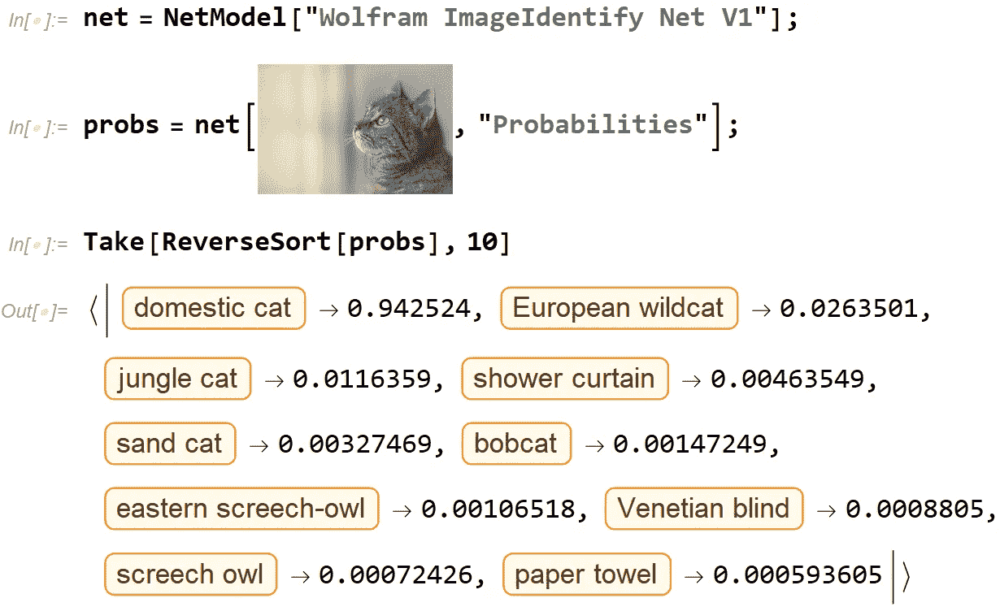

作者在 [Unsplash](https://unsplash.com/s/photos/cat?utm_source=unsplash&utm_medium=referral&utm_content=creditCopyText) 上使用了[詹姆斯·萨顿](https://unsplash.com/@jamessutton_photography?utm_source=unsplash&utm_medium=referral&utm_content=creditCopyText)的照片

当你详细检查神经网络并查看它的组成层时，你会注意到最后一层是一种叫做 [SoftmaxLayer](https://reference.wolfram.com/language/ref/SoftmaxLayer.html) 的东西。这一层在神经网络中非常常用，用于将一系列概率分配给一系列对象。

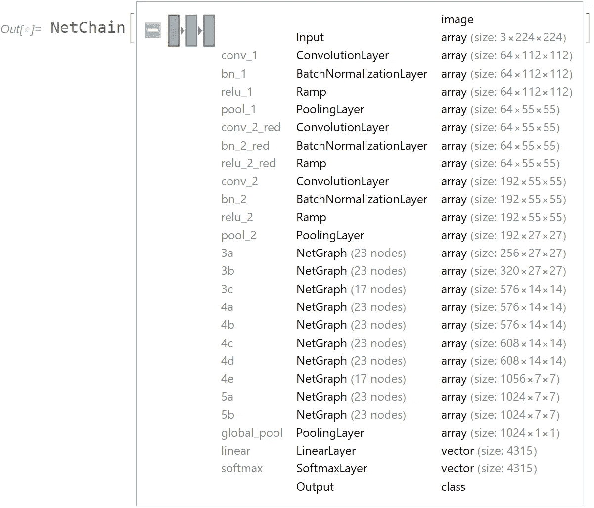

(图片由作者提供)

SoftmaxLayer 使用 softmax 函数，该函数将一个数字列表作为输入，并将一个规范化的数字列表作为输出。更具体地说，输入列表中的每个元素都被取幂并除以或归一化为所有取幂元素的总和。

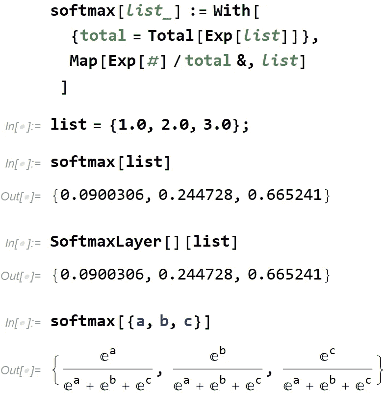

(图片由作者提供)

从函数定义中可以清楚地看出，输出元素的总和总是 1。原因是输出中的每个元素都是一个分数，其中分母是所有分子的总和。不太清楚的是任意输入列表如何与输出列表相关，因为 softmax 函数是非线性的。

为了对此有所帮助并获得直觉，我编写了一个 WL 函数来理解 softmax 函数的输入和输出。它简单地创建了两个条形图，一个绘制输入列表，一个绘制输出列表。

```
understand[list_List] := Row[{
 BarChart[list], 
 Style[" \[Rule] ", 32],
 BarChart[SoftmaxLayer[][list]]
}]
```

让我们从三个零的简单输入开始。在这种情况下，输出也有三个相等的元素，因为它们的总和是 1，所以它们都是 0.333…

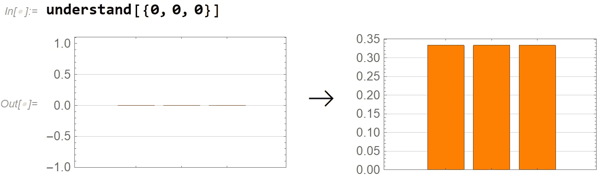

(图片由作者提供)

这适用于所有元素都相同的任何列表。例如，7 的四元素列表将产生所有元素都为 0.25 的结果:

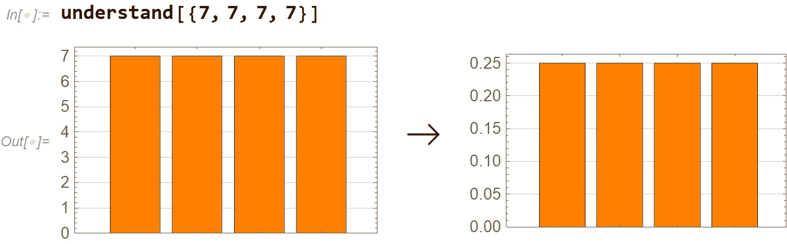

(图片由作者提供)

当输入元素不完全相等时，事情变得更加有趣。让我们从线性增加的元素列表开始。输出是指数函数的缩小版本。

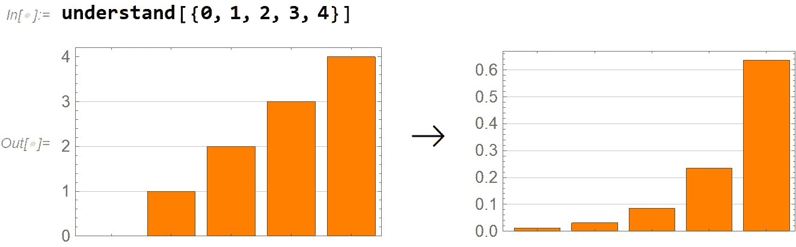

(图片由作者提供)

类似地，线性递减元素的列表产生递减的指数函数:

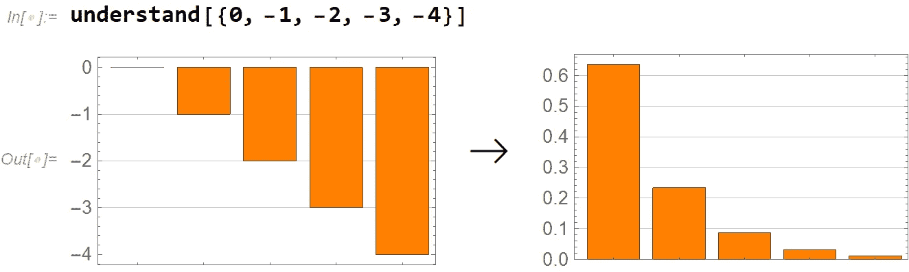

(图片由作者提供)

一个向下开口的抛物线会产生一条看起来像正态分布的输出“曲线”(可能正是如此？).

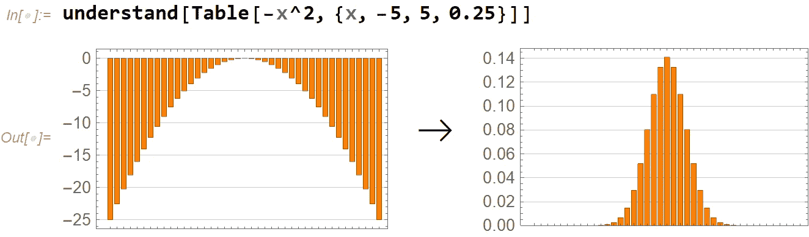

(图片由作者提供)

向上开口的抛物线给出更极端的输出，端点值占主导地位。

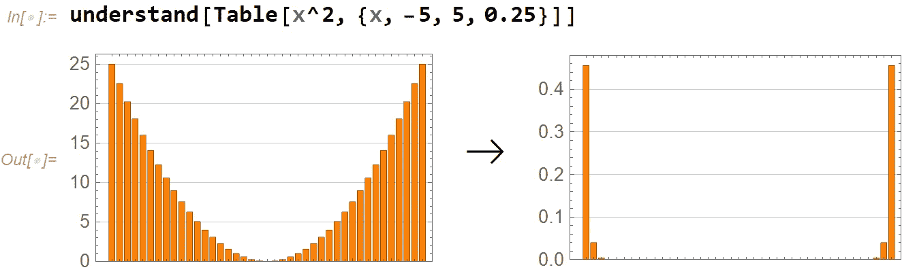

(图片由作者提供)

最后，主要是为了好玩，周期函数以某种重新调整的形式保持其周期性:

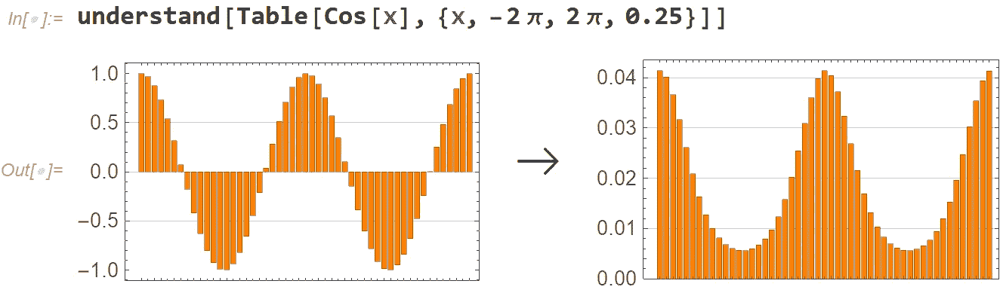

(图片由作者提供)

在笔记本中探索这一点和更多内容是非常有教育意义的。理解 softmax 函数如何工作有助于理解神经网络如何计算它们的最终分类概率分配。如果你想亲自体验更多，请从 Wolfram Cloud 下载[这款笔记本](https://www.wolframcloud.com/obj/arnoudb/Published/softmax-01.nb)。如果你对 WL 完全陌生，我推荐你阅读我最近的一篇名为“[学习 Wolfram:从零到英雄](/learning-wolfram-from-zero-to-hero-2ac4fd6914d9)”的文章。