# 用 NLTK 探索 Trump Twitter 档案

> 原文：<https://towardsdatascience.com/exploring-the-trump-twitter-archive-6242e5100a74?source=collection_archive---------39----------------------->

## [探索特朗普](https://towardsdatascience.com/tagged/exploring-trump)

## 适合喜欢冒险的 NLP 初学者。


由[尼古拉斯·托马斯](https://unsplash.com/@nicolasthomas?utm_source=unsplash&utm_medium=referral&utm_content=creditCopyText)在 [Unsplash](https://unsplash.com/s/photos/dark-phone?utm_source=unsplash&utm_medium=referral&utm_content=creditCopyText) 上拍摄的照片

*在本帖中，我们将探索由* [*特朗普推特档案*](http://www.trumptwitterarchive.com/archive) *提供的数据集。这是* [*探索王牌*](https://towardsdatascience.com/tagged/exploring-trump) *系列的一部分。*

对于这个项目，我们将使用 pandas 和 numpy 进行数据操作，使用 matplotlib 进行可视化，使用 datetime 处理时间戳，使用 unicodedata 和 regex 处理字符串，最后使用 nltk 进行自然语言处理。

让我们从启动 Jupyter 笔记本开始吧！

# 环境

我们将导入 pandas 和 matplotlib，并为 Jupyter 设置显示选项，以便行和列不会被截断。

```
# for manipulating data
import pandas as pd
import numpy as np# for visualizations
%matplotlib inline
import matplotlib.pyplot as plt# to print out all the outputs
from IPython.core.interactiveshell import InteractiveShell
InteractiveShell.ast_node_interactivity = "all"# set display options
pd.set_option('display.max_columns', None)
pd.set_option('display.max_rows', None)
pd.set_option('display.max_colwidth', -1)
```

# 获取数据

让我们把数据读入数据帧。如果你想跟进，你可以在这里下载数据集[。这个数据集包含特朗普总统从 2017 年 1 月 20 日上任到 2020 年 5 月 30 日的推文。](https://github.com/ecdedios/into-heart-of-darkness)

```
df = pd.read_csv('trump_20200530.csv')
```

让我们看看前五行，看看记录(行)和字段(列)的数量。

```
df.head()
df.shape
```

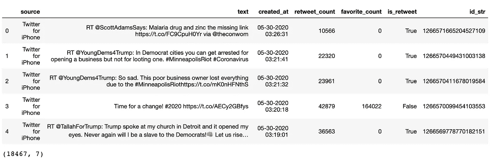

让我们对这些列进行一个快速的重命名，以便于以后使用。

```
df.columns=['source', 'tweet', 'date_time', 'retweets', 'favorites', 'is_retweet', 'id']
```

让我们删除 id 列，因为它现在并不真正相关。

```
df = df.drop(columns=['id'])
```

让我们做一个快速的健全性检查，这次我们还要检查列的 dtypes。

```
df.head()
df.info()
```

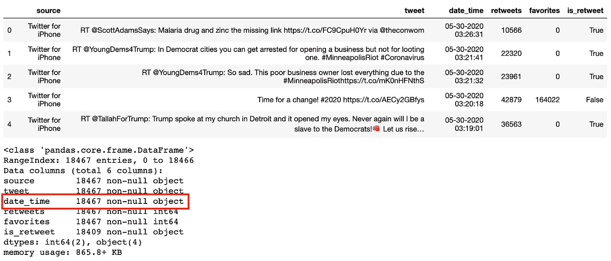

# 使用时间戳

我们可以从前面的截图中看到,' date_time '列是一个字符串。让我们把它解析成一个时间戳。

```
# for working with timestamps
from datetime import datetime
from dateutil.parser import parsedt = []
for ts in df.date_time:
  dt.append(parse(ts))
dt[:5]
```

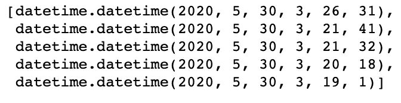

让我们添加一个包含时间戳信息的“datetime”列。

```
df['datetime'] = df.apply(lambda row: parse(row.date_time), axis=1)
```

让我们仔细检查数据集的数据范围。

```
df.datetime.min()
df.datetime.max()
```

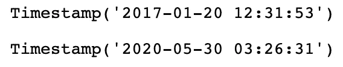

# 修整数据

让我们看看这些推文有多少来源。

```
df.source.value_counts()
```

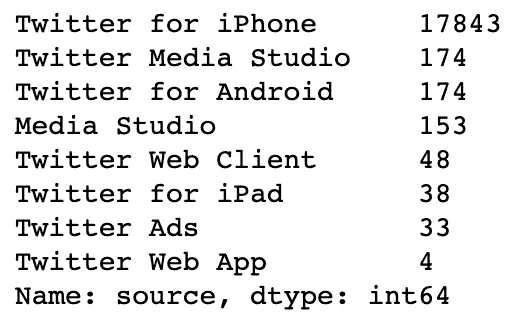

让我们只保留那些使用“iPhone 版 Twitter”应用程序制作的。

```
df = df.loc[df.source == 'Twitter for iPhone']
```

我们应该删除旧的“date_time”列和“source”列。

```
df = df.drop(columns=['date_time', 'source'])
```

# 分离转发

看看有多少是转发。

```
df.is_retweet.value_counts()
```

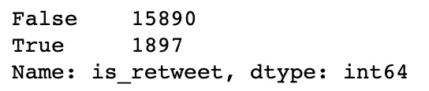

让我们创建另一个只包含 retweets 的 dataframe，并删除“is_retweet”列。

```
df_retweets = df.loc[df.is_retweet == True]
df_retweets = df_retweets.drop(columns=['is_retweet'])
```

健全性检查:

```
df_retweets.head()
df_retweets.shape
```

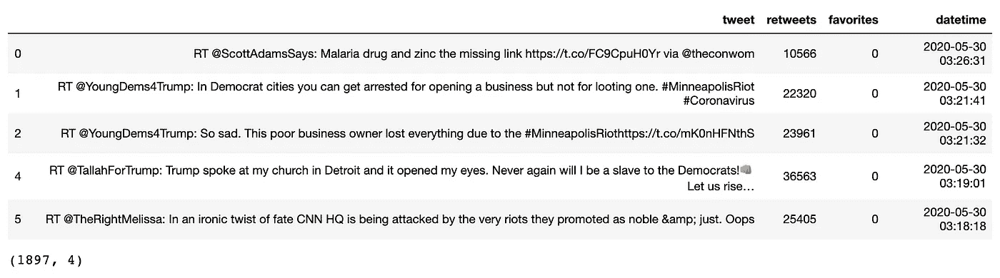

回到原始数据帧，让我们从数据集中删除 retweets，并完全删除“is_retweet”列。

```
df = df.loc[df.is_retweet == False]
df = df.drop(columns=['is_retweet'])
```

另一个健全性检查:

```
df.head()
df.shape
```

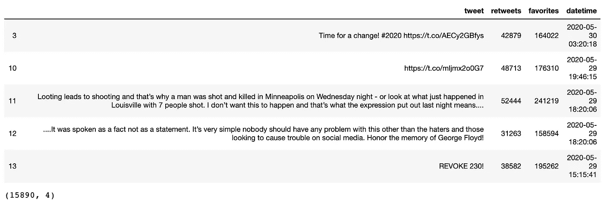

# 探索数据

让我们探索这两个数据框架，并回答几个问题。

## 总统什么时候发微博最多？他什么时候发微博最少？

*下图显示，总统在下午 12 点左右最常发推文。他也最少在早上 8 点左右发微博。*

```
title = 'Number of Tweets by Hour'
df.tweet.groupby(df.datetime.dt.hour).count().plot(figsize=(12,8), fontsize=14, kind='bar', rot=0, title=title)
plt.xlabel('Hour')
plt.ylabel('Number of Tweets')
```

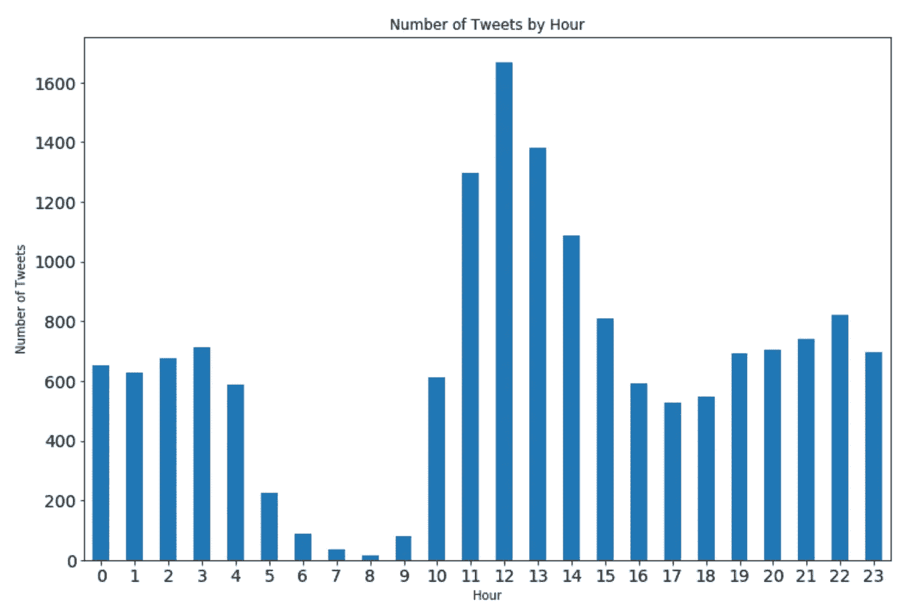

## 总统哪一天发推特最多？他哪天发的微博最少？

*下图显示了总统在周三最常发推文。他周四发的微博也最少。*

```
title = 'Number of Tweets by Day of the Week'
df.tweet.groupby(df.datetime.dt.dayofweek).count().plot(figsize=(12,8), fontsize=14, kind='bar', rot=0, title=title)
plt.xlabel('Day of the Week')
plt.ylabel('Number of Tweets')
plt.xticks(np.arange(7),['Mon', 'Tue', 'Wed', 'Thu', 'Fri', 'Sat', 'Sun'])
```

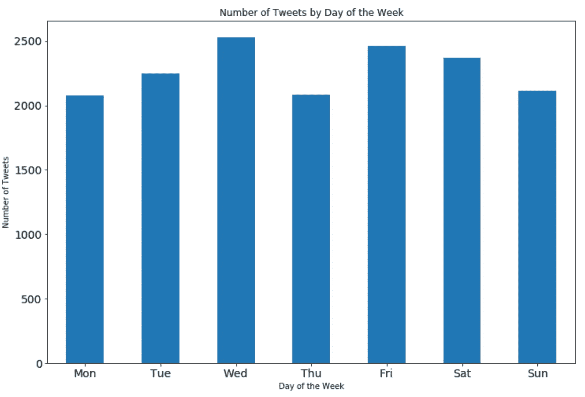

## 从转发中分离 Twitter 句柄

让我们导入正则表达式，这样我们就可以用它来解析文本并分离出原始推文的 Twitter 句柄。在下面的代码中，我们添加了另一个包含 Twitter 句柄的列。

```
import repattern = re.compile('(?<=RT @).*?(?=:)')
df_retweets['original'] = [re.search(pattern, tweet).group(0) for tweet in df_retweets.tweet]
```

让我们创建另一个数据帧，它将只包含最初的 Twitter 句柄及其相关的转发次数。

```
df_originals = df_retweets.groupby(['original']).sum().sort_values('retweets').reset_index().sort_values('retweets', ascending=False)
```

让我们快速检查一下数据:

```
df_originals.head()
df_originals.shape
```

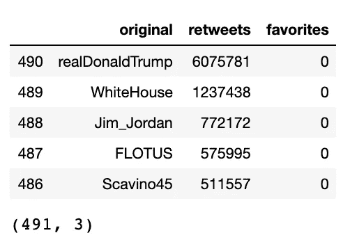

让我们快速地将结果可视化，这样我们就可以知道数据是否不成比例。

```
df_originals = df_retweets.groupby(['original']).sum().sort_values('retweets').reset_index().sort_values('retweets', ascending=False)[:10].sort_values('retweets')
df_originals.plot.barh(x='original', y='retweets', figsize=(16,10), fontsize=16)
plt.xlabel("Originating Tweet's Username")
plt.xticks([])
```

## 总统最喜欢转推哪个推特用户？

*下图显示总统喜欢转发来自“@realDonaldTrump”的推文。*

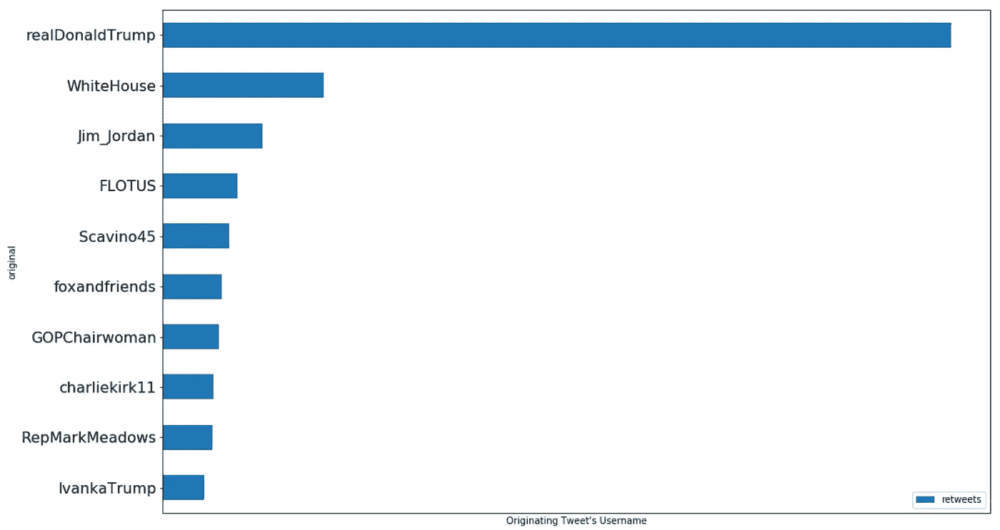

## 转发量前 5 名

让我们来看看根据最初的 Twitter 句柄被其他人转发最多的前 5 条推文。

先说带“@realDonaldTrump”的。

```
df_retweets.loc[df_retweets.original == 'realDonaldTrump'].sort_values('retweets', ascending=False)[:5]
```

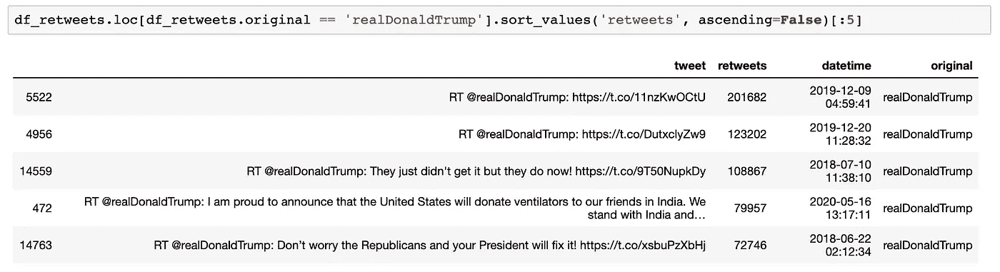

还有一个是“@charliekirk11”。

```
df_retweets.loc[df_retweets.original == 'charliekirk11'].sort_values('retweets', ascending=False)[:5]
```

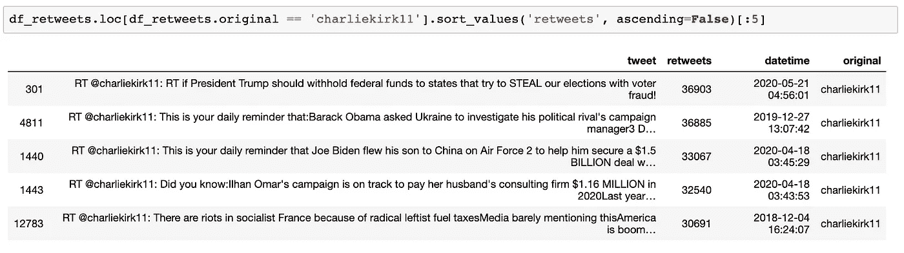

# 检查转发的收藏夹数

让我们看看有多少转发被其他人喜欢。

```
df_retweets.favorites.value_counts()
```

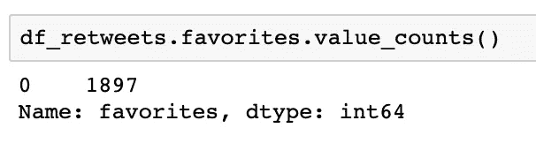

令人惊讶的是，没有一条转发似乎受到了任何人的喜爱。奇怪。

我们应该放弃它。

# 计算 N-Grams

要做一些 n 元排序，我们需要导入 unicodedata 和 nltk。我们还需要指定可能需要从分析中排除的附加停用词。

```
# for cleaning and natural language processing
import unicodedata
import nltk# add appropriate words that will be ignored in the analysis
ADDITIONAL_STOPWORDS = ['rt'] 
```

以下是我最喜欢的几个自然语言处理函数:

让我们使用“tweet”栏来看看`df`数据框架中的前 10 个二元模型。

```
get_bigrams(df, 'tweet')
```

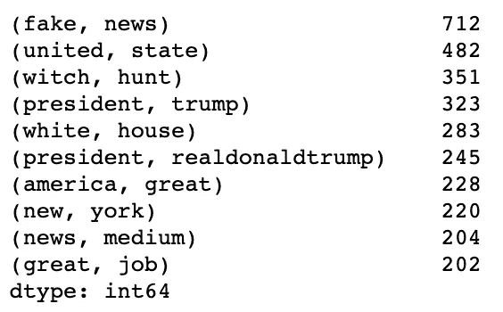

现在，对于前 10 个三元模型:

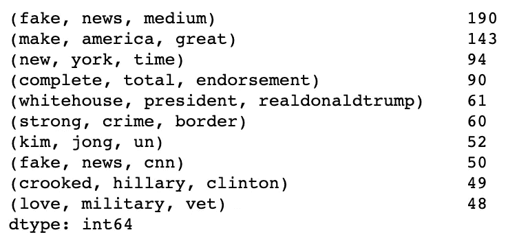

让我们使用`viz_bigrams()`函数并可视化二元模型。

```
viz_bigrams(df, ‘tweet’)
```

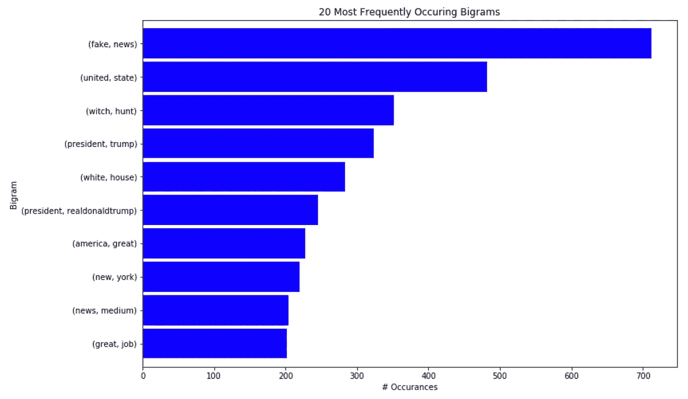

类似地，让我们使用`viz_trigrams()`函数并可视化三元模型。

```
viz_trigrams(df, 'tweet')
```

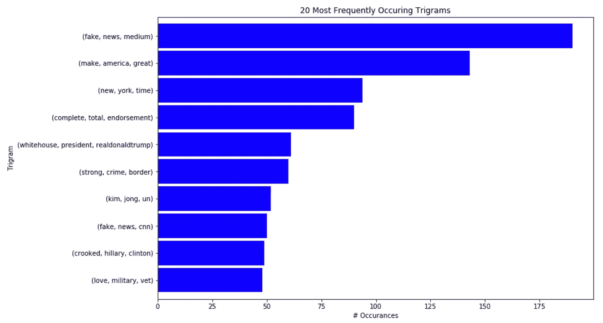

我们做到了！

# 结论

使用基本的 Python 和 nltk 库，我们探索了来自 [Trump Twitter 存档](http://www.trumptwitterarchive.com/archive)的数据集，并对其进行了一些 n 元排序。

感谢您的阅读！探索性数据分析使用了很多技术，我们在这篇文章中只探讨了其中的一些。我鼓励你坚持练习，并使用其他技术从数据中获得洞察力。

*在下一篇*[](/exploring-the-trump-twitter-archive-with-spacy-fe557810717c)**中，我们将继续我们的旅程，进入 Trump Twitter 存档，并* [*使用 spaCy 从同一数据集中提取命名实体*](/exploring-the-trump-twitter-archive-with-spacy-fe557810717c) *。**

**如果你想了解更多关于我从懒鬼到数据科学家的旅程，请查看下面的文章:**

*[](/from-slacker-to-data-scientist-b4f34aa10ea1) [## 从懒鬼到数据科学家

### 我的无学位数据科学之旅。

towardsdatascience.com](/from-slacker-to-data-scientist-b4f34aa10ea1) 

*敬请期待！*

你可以在推特[或 LinkedIn](https://twitter.com/ecdedios) 上找到我。*