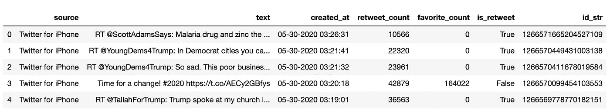
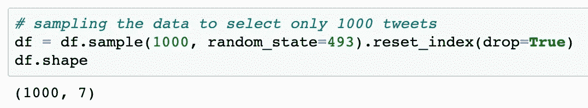
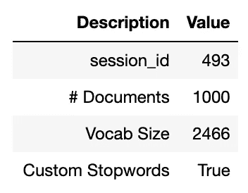
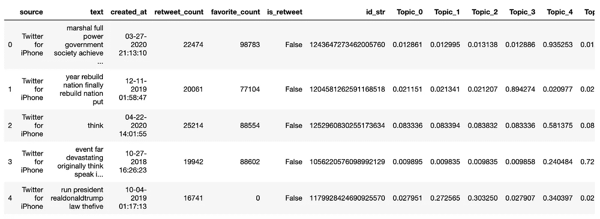
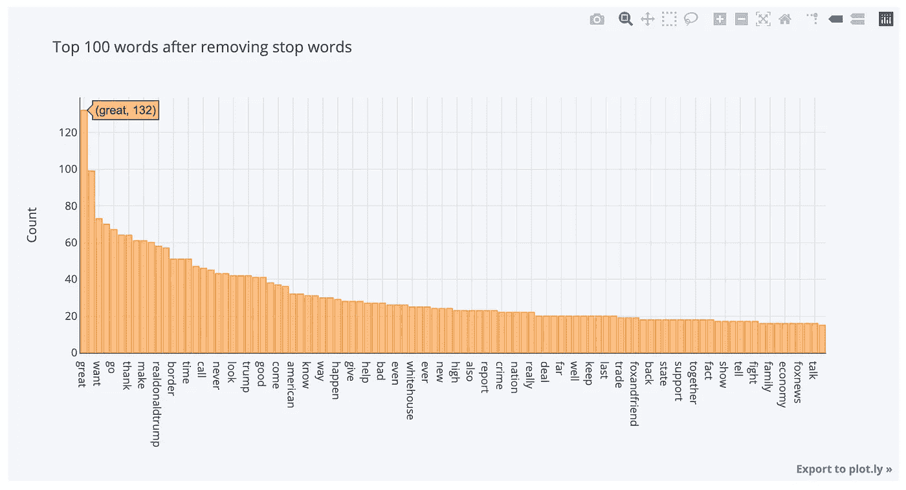
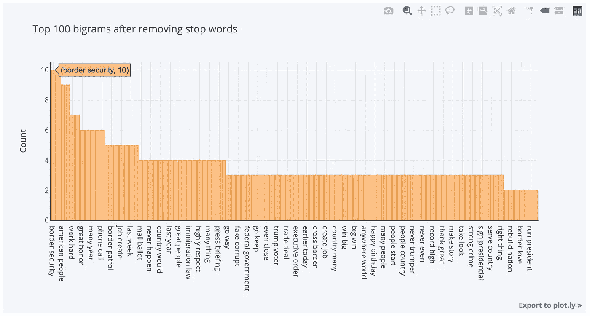
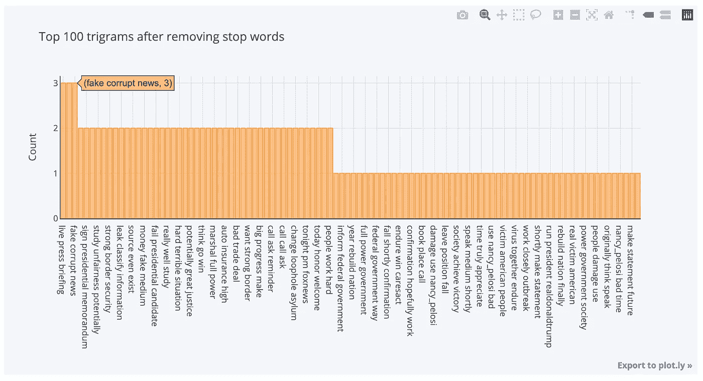
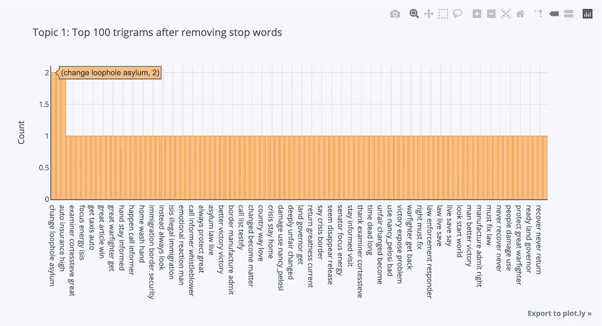
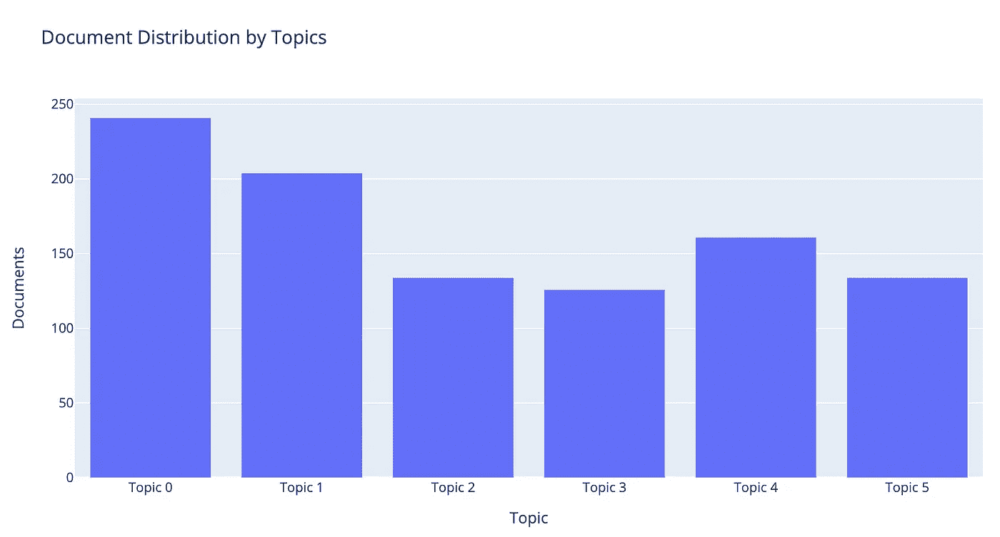

# 用 PyCaret 探索 Trump Twitter 档案

> 原文：<https://towardsdatascience.com/exploring-the-trump-twitter-archive-with-pycaret-5c9e065acd6f?source=collection_archive---------52----------------------->

## [探索川普](https://towardsdatascience.com/tagged/exploring-trump)

## 适合喜欢冒险的 NLP 初学者。


[洛伦佐·瑞](https://unsplash.com/@lorenzorui?utm_source=unsplash&utm_medium=referral&utm_content=creditCopyText)在 [Unsplash](https://unsplash.com/s/photos/iphone?utm_source=unsplash&utm_medium=referral&utm_content=creditCopyText) 上拍照

*在之前的帖子中，我们开始探索由* [*特朗普推特档案*](http://www.trumptwitterarchive.com/archive) *提供的数据集。这是* [*探索王牌*](https://towardsdatascience.com/tagged/exploring-trump) *系列的第三部。*

*在这篇文章中，我们将继续我们的旅程，但这次我们将使用 PyCaret。*

对于这个项目，我们将使用 [PyCaret](https://pycaret.org/) :

> PyCaret 是一个开源的，Python 中的低代码机器学习库，允许您在几秒钟内从准备数据到在您选择的笔记本环境中部署您的模型。

PyCaret 做的比 NLP 多得多。它还进行一系列有监督和无监督的 ML，包括分类、回归、聚类、异常检测和关联规则挖掘。

要了解更多信息，请查看 Moez Ali 的公告:

[](/announcing-pycaret-an-open-source-low-code-machine-learning-library-in-python-4a1f1aad8d46) [## 宣布 PyCaret:一个用 Python 编写的开源低代码机器学习库

### Python 中的开源低代码机器学习库。

towardsdatascience.com](/announcing-pycaret-an-open-source-low-code-machine-learning-library-in-python-4a1f1aad8d46) 

# 家政

让我们从安装 PyCaret 开始。只要做`pip install pycaret`我们就可以出发了！注意:PyCaret 是一个很大的库，所以你可能想在等待它安装的时候喝杯咖啡。

此外，我们需要下载英语语言模型，因为它不是用 PyCaret 自动下载的:

```
python -m spacy download en_core_web_sm
python -m textblob.download_corpora
```

# 获取数据

让我们把数据读入数据帧。如果你想跟进，你可以在这里下载数据集。这个数据集包含了特朗普从 2017 年 1 月 20 日上任那一刻到 2020 年 5 月 30 日的推文。

```
import pandas as pd
from pycaret.nlp import *df = pd.read_csv('trump_20200530.csv')
```

让我们先检查一下数据的形状:

```
df.shape
```

让我们快速看一下:

```
df.head()
```



为了方便起见，我们只对 1000 条推文进行采样。

```
# sampling the data to select only 1000 tweets
df = df.sample(1000, random_state=493).reset_index(drop=True)
df.shape
```



# 主题建模

有趣的部分！

```
nlp = setup(data = df, target = 'text', session_id = 493,
      customI _stopwords = [ 'rt', 'https', 'http', 'co', 'amp'])
```

PyCaret 的`setup()`函数执行以下文本处理步骤:

1.  移除数字字符
2.  删除特殊字符
3.  单词标记化
4.  停用词删除
5.  二元模型提取
6.  三元模型提取
7.  词汇化
8.  自定义停用词

所有这些都在一行代码中！

它接受两个参数:在`data`中的 dataframe 和我们想要在`target`中传递的文本列的名称。在我们的例子中，我们还使用可选参数`session_id`来获得再现性，使用`custom_stopwords`来减少来自 tweets 的噪音。

说了这么多，做了这么多，我们会得到类似这样的结果:



下一步，我们将创建模型，并使用`‘lda’`:

```
lda = create_model('lda', num_topics = 6, multi_core = True)
```

上面，我们创建了一个`‘lda’`模型，并将主题数量作为`6`传入，并对其进行设置，以便 LDA 将使用所有可用的 CPU 内核来并行化和加速训练。

最后，我们将使用`assign_model()`为数据集的其余部分分配主题比例。

```
lda_results = assign_model(lda)
lda_results.head()
```



# 可视化结果

让我们绘制整个语料库的总体频率分布图:

```
plot_model()
```



现在让我们提取整个语料库的二元模型和三元模型:

```
plot_model(plot = 'bigram')
plot_model(plot = 'trigram')
```



但是如果我们只想从特定主题中提取 n 元语法呢？简单，我们只要传入`topic_num`参数。

```
plot_model(lda, plot = 'trigram', topic_num = 'Topic 1')
```



如果我们想要主题的分布，我们将简单地改变它并在`plot`参数中指定它。

```
plot_model(lda, plot = 'topic_distribution')
```



就是这样！

自上任以来，我们已经成功地对特朗普总统的推文进行了主题建模。

# 奖金回合

[Moez Ali](https://medium.com/u/fba05660b60f?source=post_page-----5c9e065acd6f--------------------------------) 写了一篇关于在 Power BI 中使用 PyCaret 的很棒的教程。看看这个:

[](/topic-modeling-in-power-bi-using-pycaret-54422b4e36d6) [## 基于 PyCaret 的 Power BI 主题建模

### 在 Power BI 中实现主题模型的分步指南

towardsdatascience.com](/topic-modeling-in-power-bi-using-pycaret-54422b4e36d6) 

感谢您的阅读！探索性数据分析使用了很多技术，我们在这篇文章中只探讨了其中的一些。我鼓励你坚持练习，并使用其他技术从数据中获得洞察力。

在下一篇文章中，我将为 pycaret 的自然语言处理模块做一个初学者指南。

*感谢您的阅读。如果你想了解更多关于我从懒鬼到数据科学家的旅程，请查看下面的文章:*

[](/from-slacker-to-data-scientist-b4f34aa10ea1) [## 从懒鬼到数据科学家

### 我的无学位数据科学之旅。

towardsdatascience.com](/from-slacker-to-data-scientist-b4f34aa10ea1) 

*如果你正在考虑改变方向，进入数据科学领域，现在就开始考虑重塑品牌:*

[](/the-slackers-guide-to-rebranding-yourself-as-a-data-scientist-b34424d45540) [## 懒鬼将自己重塑为数据科学家指南

### 给我们其他人的固执己见的建议。热爱数学，选修。

towardsdatascience.com](/the-slackers-guide-to-rebranding-yourself-as-a-data-scientist-b34424d45540) 

*敬请期待！*

你可以通过[推特](https://twitter.com/ecdedios)或 [LinkedIn](https://www.linkedin.com/in/ednalyn-de-dios/) 联系我。

[1] PyCaret。(2020 年 6 月 4 日)。*为什么是 PyCaret* 。[https://pycaret.org/](https://pycaret.org/)