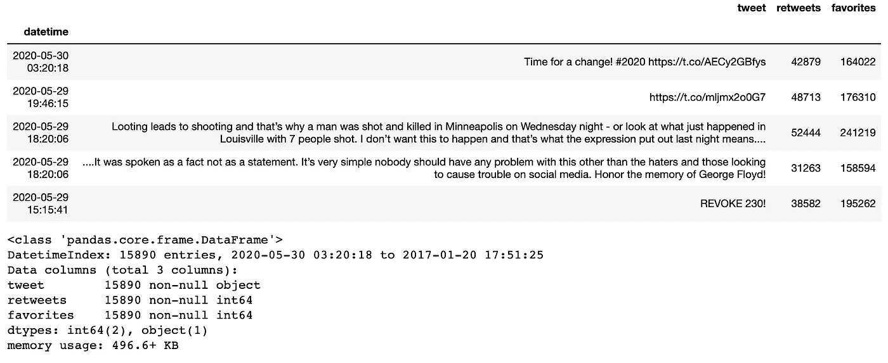
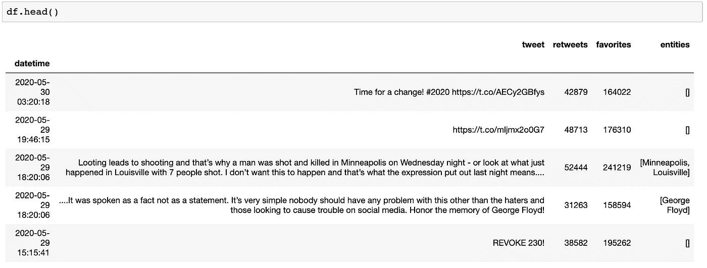
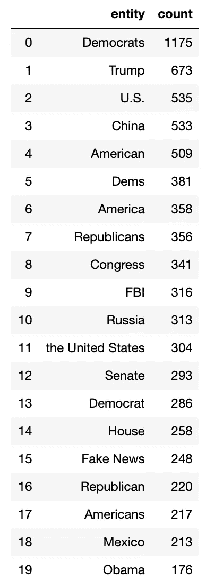
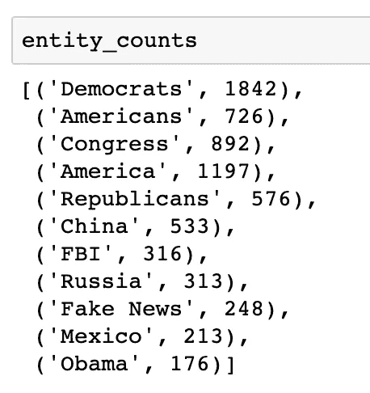
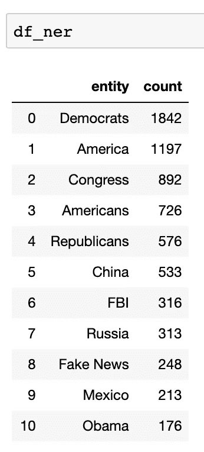

# 用 SpaCy 探索特朗普推特档案

> 原文：<https://towardsdatascience.com/exploring-the-trump-twitter-archive-with-spacy-fe557810717c?source=collection_archive---------56----------------------->

## [探索川普](https://towardsdatascience.com/tagged/exploring-trump)

## 适合喜欢冒险的 NLP 初学者。


莱昂·塞伯特在 [Unsplash](https://unsplash.com/s/photos/dark-iphone?utm_source=unsplash&utm_medium=referral&utm_content=creditCopyText) 上的照片

*在前一篇* [*的帖子*](/exploring-the-trump-twitter-archive-6242e5100a74) *中，我们着手探索* [*Trump Twitter 提供的数据集*](http://www.trumptwitterarchive.com/archive) *。这是* [*探索王牌*](https://towardsdatascience.com/tagged/exploring-trump) *系列的第二部。*

在这篇文章中，我们将继续我们的旅程，但这次我们将使用 spaCy。

对于这个项目，我们将使用 pandas 进行数据操作，使用 spaCy 进行自然语言处理，使用 joblib 加快速度。

让我们从启动 Jupyter 笔记本开始吧！

# 家政

让我们导入熊猫并设置显示选项，这样 Jupyter 就不会截断我们的列和行。让我们也为可重复性设置一个随机种子。

```
# for manipulating data
import pandas as pd# setting the random seed for reproducibility
import random
random.seed(493)# to print out all the outputs
from IPython.core.interactiveshell import InteractiveShell
InteractiveShell.ast_node_interactivity = "all"# set display options
pd.set_option('display.max_columns', None)
pd.set_option('display.max_rows', None)
pd.set_option('display.max_colwidth', -1)
```

# 获取数据

让我们把数据读入数据帧。如果您想继续，您可以在这里下载清理过的数据集[和停用词文件](https://github.com/ecdedios/into-heart-of-darkness)。这个数据集包含了特朗普从 2017 年 1 月 20 日上任那一刻到 2020 年 5 月 30 日的推文。

```
df = pd.read_csv('trump_20200530_clean.csv', parse_dates=True, index_col='datetime')
```

让我们快速看一下数据。

```
df.head()
df.info()
```



# 使用空间

现在让我们导入 spaCy 并开始自然语言处理。

```
# for natural language processing: named entity recognition
import spacy
import en_core_web_sm
```

我们将只使用 spaCy 的 ner 功能或命名实体识别，因此我们将禁用其余功能。这将节省我们大量的装货时间。

```
nlp = spacy.load('en_core_web_sm', disable=['tagger', 'parser', 'textcat'])
```

现在让我们将停用词文件的内容加载到变量`stopswords`中。请注意，我们将列表转换为集合，也是为了节省以后的处理时间。

```
with open('twitter-stopwords — TA — Less.txt') as f:
 contents = f.read().split(',')
stopwords = set(contents)
```

接下来，我们将导入 joblib 并定义一些函数来帮助并行处理。

在上面的代码中，函数`preprocess_parallel`并行执行另一个函数`process_chunks`来帮助提高速度。函数`process_chunks`遍历一系列文本——在我们的例子中是`df`数据框架的列`'tweet'`——并检查实体是否属于 NORP、PERSON、FAC、ORG、GPE、LOC、PRODUCT 或 EVENT。如果是，那么实体被附加到`'preproc_pipe'`并随后返回给它的调用者。 [Prashanth Rao](https://medium.com/u/efdb4f4a0d1b?source=post_page-----fe557810717c--------------------------------) 有一篇关于让 spaCy 超快的非常好的文章。

[](/turbo-charge-your-spacy-nlp-pipeline-551435b664ad) [## 加速您的空间 NLP 管道

### 使用自定义管道和 joblib 显著加快 spaCy 中文本预处理的技巧和诀窍

towardsdatascience.com](/turbo-charge-your-spacy-nlp-pipeline-551435b664ad) 

现在让我们调用函数的主驱动程序。

```
df['entities'] = preprocess_parallel(df['tweet'], chunksize=1000)
```

快速执行`df.head()`将显示我们之前添加的新列`'entities'`，以保存在`'tweet'`列中找到的实体。



# 美化结果

在下面的代码中，我们制作了一个名为`'entities'`的列表，然后将其展平以便于处理。我们还将它转换成一个名为`'entities_set'`的集合。

```
entities = [entity for entity in df.entities if entity != []]
entities = [item for sublist in entities for item in sublist]entities_set = set(entities)
```

接下来，让我们统计实体的频率，并将其添加到元组列表`entities_counts`中。然后让我们将结果转换成数据帧`df_counts`。

```
df_counts = pd.Series(entities).value_counts()[:20].to_frame().reset_index()
df_counts.columns=['entity', 'count']
df_counts
```



对于这一步，我们将重新初始化一个空列表`entity_counts`，并手动构建一个元组列表，该列表包含一组组合的实体及其频率或计数的总和。

在继续之前，让我们快速浏览一下。



最后，让我们将元组列表转换成数据帧。

```
df_ner = pd.DataFrame(entity_counts, columns=["entity", "count"]).sort_values('count', ascending=False).reset_index(drop=True)
```



就是这样！

我们已经成功地创建了特朗普总统自上任以来在推特上最常谈论的命名实体的排名。

感谢您的阅读！探索性数据分析使用了很多技术，我们在这篇文章中只探讨了其中的一些。我鼓励你坚持练习，并使用其他技术从数据中获得洞察力。

*在下一篇*[](/exploring-the-trump-twitter-archive-with-pycaret-5c9e065acd6f)**中，我们将继续我们的旅程，进入 Trump Twitter 存档，并使用 PyCaret* *进行一些* [*主题建模。*](/exploring-the-trump-twitter-archive-with-pycaret-5c9e065acd6f)*

**如果你想了解更多关于我从懒鬼到数据科学家的旅程，请查看下面的文章:**

*[](/from-slacker-to-data-scientist-b4f34aa10ea1) [## 从懒鬼到数据科学家

### 我的无学位数据科学之旅。

towardsdatascience.com](/from-slacker-to-data-scientist-b4f34aa10ea1) 

*敬请期待！*

你可以在推特[或 LinkedIn](https://twitter.com/ecdedios) 上找到我。

[1]龚伟的主页。(2020 年 5 月 30 日)。*为推文停字。*[https://sites.google.com/site/iamgongwei/home/sw](https://sites.google.com/site/iamgongwei/home/sw)

[2]走向数据科学。(2020 年 5 月 30 日)。给你的空间 NLP 管道增压。[https://towards data science . com/turbo-charge-your-spacy-NLP-pipeline-551435 b 664 ad](/turbo-charge-your-spacy-nlp-pipeline-551435b664ad)*