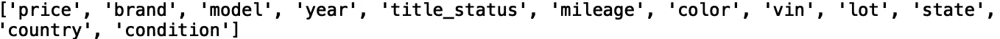
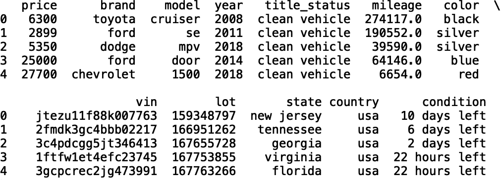
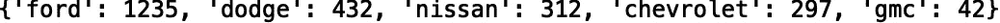
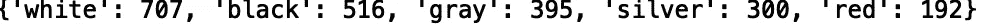
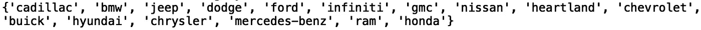
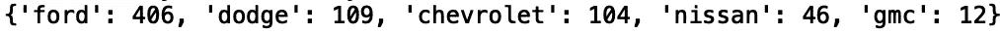
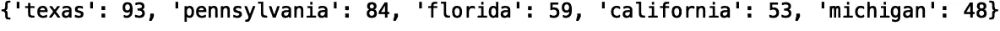
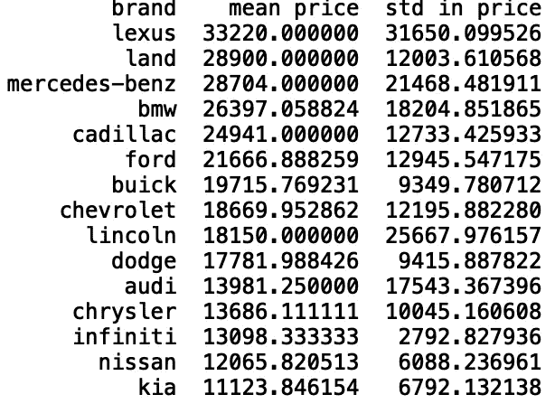
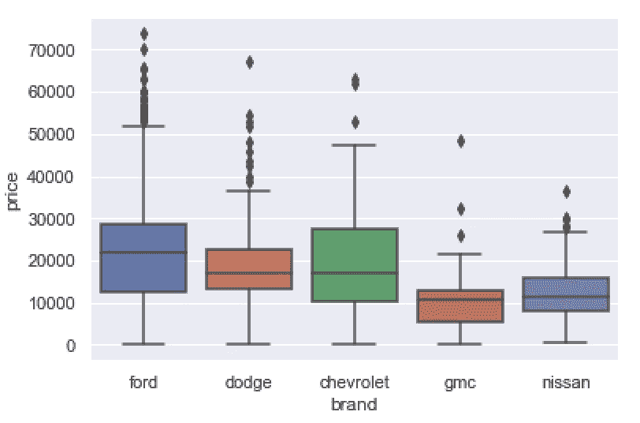
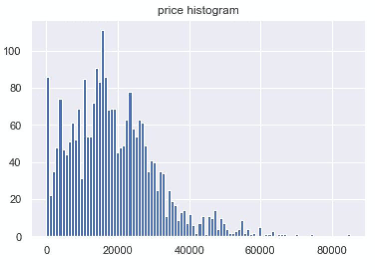

# 探索美国汽车数据集

> 原文：<https://towardsdatascience.com/exploring-the-us-cars-dataset-dbcebf954e4a?source=collection_archive---------42----------------------->

## 美国汽车数据集的探索性数据分析


[来源](https://www.pexels.com/photo/red-car-usa-america-57409/)

*美国汽车数据集*包含来自北美汽车在线拍卖的零散数据。它包含了在美国销售的 28 个汽车品牌的信息。在本帖中，我们将对*美国汽车数据集*进行探索性数据分析。数据可以在[这里](https://www.kaggle.com/doaaalsenani/usa-cers-dataset)找到。

我们开始吧！

首先，让我们导入熊猫库

```
import pandas as pd
```

接下来，让我们移除熊猫数据框的默认显示限制:

```
pd.set_option('display.max_columns', None)
```

现在，让我们将数据读入数据框:

```
df = pd.read_csv("USA_cars_datasets.csv")
```

让我们打印数据中的列列表:

```
print(list(df.columns))
```



我们还可以看看数据中的行数:

```
print("Number of rows: ", len(df))
```


接下来，让我们打印前五行数据:

```
print(df.head())
```



我们可以看到有几个分类列。让我们定义一个将数据框、列名和限制作为输入的函数。当被调用时，它打印分类值的字典以及它们出现的频率:

```
from collections import Counter
def return_counter(data_frame, column_name, limit):
  print(dict(Counter(data_frame[column_name]
  .values).most_common(limit)))
```

让我们将函数应用于“品牌”列，并将结果限制为五个最常见的值:

```
return_counter(df, 'brand', 5)
```



如我们所见，我们有 1235 辆福特，432 辆道奇，312 辆尼桑，297 辆雪佛兰和 42 辆通用汽车。

让我们将函数应用于“颜色”列:

```
return_counter(df, 'color', 5)
```



现在，让我们看看白色汽车的品牌:

```
df_d1 = df[df['color'] =='white']
print(set(df_d1['brand']))
```



我们还可以看看最常见的白色汽车品牌:

```
print(dict(Counter(df_d1['brand']).most_common(5)))
```



我们看到大多数白色汽车是福特、道奇和雪佛兰。

我们还可以看看销售白色汽车最常见的州:

```
print(dict(Counter(df_d1['state']).most_common(5)))
```



接下来，从像“持续时间”这样的数字列中生成汇总统计数据会很有用。让我们定义一个采用数据框、分类列和数字列的函数。每个类别的数字列的平均值和标准偏差存储在数据框中，并且数据框根据平均值以降序排序。如果您想要快速查看特定类别对于特定数字列是否具有更高或更低的平均值和/或标准偏差值，这将非常有用。

```
def return_statistics(data_frame, categorical_column, numerical_column):
    mean = []
    std = []
    field = []
    for i in set(list(data_frame[categorical_column].values)):
        new_data = data_frame[data_frame[categorical_column] == i]
        field.append(i)
        mean.append(new_data[numerical_column].mean())
        std.append(new_data[numerical_column].std())
    df = pd.DataFrame({'{}'.format(categorical_column): field, 'mean {}'.format(numerical_column): mean, 'std in {}'.format(numerical_column): std})
    df.sort_values('mean {}'.format(numerical_column), inplace = True, ascending = False)
    df.dropna(inplace = True)
    return df
```

让我们用分类列“品牌”和数字列“价格”来调用我们的函数:

```
stats = return_statistics(df, 'brand', 'price')
print(stats.head(15))
```



接下来，我们将使用箱线图来显示基于最小值、最大值、中值、第一个四分位数和第三个四分位数的数值分布。

与汇总统计函数类似，此函数采用数据框、分类列和数值列，并根据限制显示最常见类别的箱线图:

```
import matplotlib.pyplot as plt
def get_boxplot_of_categories(data_frame, categorical_column, numerical_column, limit):
    import seaborn as sns
    from collections import Counter
    keys = []
    for i in dict(Counter(df[categorical_column].values).most_common(limit)):
        keys.append(i)
    print(keys)
    df_new = df[df[categorical_column].isin(keys)]
    sns.set()
    sns.boxplot(x = df_new[categorical_column], y = df_new[numerical_column])
    plt.show()
```

让我们为 5 个最常见的“品牌”类别中的“价格”生成箱线图:

```
get_boxplot_of_categories(df, 'listed_in', 'duration', 5)
```



最后，让我们定义一个函数，它将数据框和数字列作为输入，并显示一个直方图:

```
def get_histogram(data_frame, numerical_column):
    df_new = data_frame
    df_new[numerical_column].hist(bins=100)
    plt.title('{} histogram'.format(numerical_column))
    plt.show()
```

让我们用数据框调用函数，并从“价格”生成一个直方图:

```
get_histogram(df, 'price')
```



我就讲到这里，但是请随意处理数据并自己编码。

# 结论

总之，在这篇文章中，我们介绍了几种分析美国汽车数据集的方法。这包括定义生成汇总统计数据的函数，比如平均值、标准差和分类值的计数。我们还定义了用箱线图和直方图可视化数据的函数。我希望这篇文章有用/有趣。这篇文章的代码可以在 [GitHub](https://github.com/spierre91/medium_code/blob/master/exploratory_data_analysis/eda_us_cars.py) 上找到。感谢您的阅读！