# 通过文本分析探索拉面的世界！

> 原文：<https://towardsdatascience.com/exploring-the-world-of-ramen-through-text-analytics-1131280c4c6b?source=collection_archive---------33----------------------->

## 我对拉面评级网站上的评论做了一袋文字分析，以了解世界是如何消费方便面的，并决定自己尝试一种新的品种！

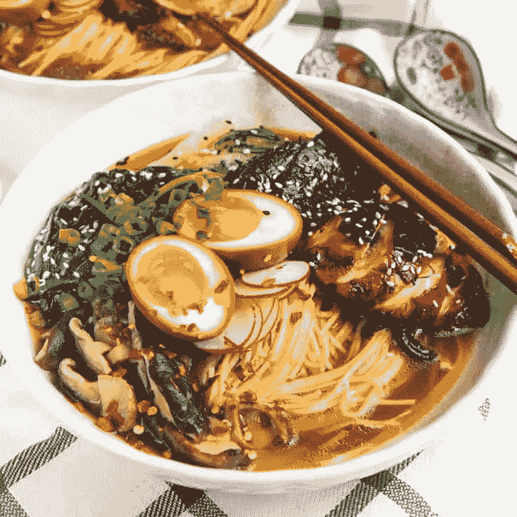

鸡肉拉面(@ [The Flavor Bender](https://www.theflavorbender.com/easy-homemade-chicken-ramen/) ) [1]

根据 [Madator 网络](https://matadornetwork.com/read/instant-noodle-flavors/)【2】，拉面这个词已经和便宜的方便面联系在一起，主要是那些手头拮据的人(大学生)可能在一天中的奇数时间食用。这种看法已经演变成了全国各地正宗小酒馆供应的一道菜，并且是 Instagram 等社交媒体上帖子的热门主题！

我在❤探索新的食物——尤其是亚洲美食。大胆的口味和辣味击中了我的家。戴夫·张的《网飞秀》 [*丑陋的美味*](https://www.youtube.com/watch?v=pN_XItALHmM) 促使我追寻我的好奇心，尝试来自世界各个角落的美食！我真的很喜欢吃拉面，我已经在不同的餐馆尝试过几种不同的拉面，乌龙面知道它对我的影响——我被它震撼了。

这篇文章讲述了我如何利用我有限的文本分析技能和好奇的味蕾来了解拉面的世界，并决定尝试一种新的品种！享受🍜

## 数据收集和准备

我发现了一个[数据集](https://www.kaggle.com/residentmario/ramen-ratings)，其中包含了一位铁杆拉面爱好者——拉面评分者对来自世界各地的 2500 多种方便面的评论。该数据集是“大列表”(评论)的导出，转换为 CSV 格式。

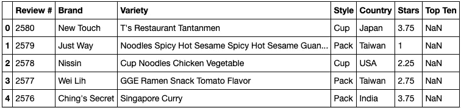

拉面在熊猫数据框中查看数据集

大多数栏目都是不言自明的，星级栏目是 1-5 级，前十名表明该拉面品种是否进入了本网站年度拉面排名前十名。

# 问题 1:全世界最受欢迎的拉面主题是什么？

这个数据集包含了大约 38 个不同国家的拉面信息。我想知道世界各地是如何看待即食拉面的，每个国家都流行什么口味。

我的方法是在包含拉面描述的列上应用一个[单词包](https://machinelearningmastery.com/gentle-introduction-bag-words-model/)分析，通过将它分成单字母词、双字母词和三字母词( [n 字母词](https://en.wikipedia.org/wiki/N-gram))。

## 步骤 1:生成 n 元语法

我利用 Scikit-Learn 的 CountVectorizer API 来生成单词包。我定义了一个函数，它从“Variety”列中提取单词集，并计算每个 n-gram 的出现次数。

我在 Variety 列上应用了这个函数，用 NLTK 的默认[停用词](https://gist.github.com/sebleier/554280)列表生成了 unigrams。

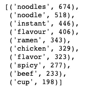

带有标准停用词的流行单字

最常见的单词是“面条”、“速食”和“风味”。因为这个分析的主要主题是方便面，我假设大多数品种将包含这些词。因此，这些也可以被认为是停用词。

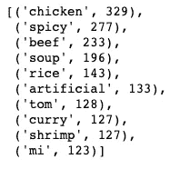

带有修改的停用词的流行单字

我创建了一个包含这些拉面停用词的附加列表，并将其附加到 NLTK 的停用词中。我用修改过的停止词执行了函数，产生了左边的结果，看起来好多了！

## 步骤 2:连接 n 元语法

上面的函数调用“get_top_n_gram”，它在上一步中定义为返回一个单词包，并创建一个数据框，其中包含包含给定单词的单词、频率、星星的平均值和中值。

我使用这个函数来生成每个国家的 unigrams、bigrams 和 trigrams，并将这三者连接起来。我把串接的数据帧按频率降序排序，假设最上面的词就是主题。

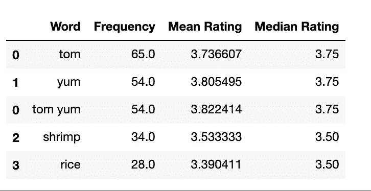

来自泰国的品种——流行词汇

这些是我在泰国的拉面品种上运行这个函数的结果。最常见的词是“*汤姆*”，它本身作为一个主题没有意义。不过接下来是'*冬阴汤*'，很好吃的泰式汤！在这种情况下，选择顶部的单词将会失败。

## 步骤 3:提取我们的主题

我定义了一个函数，如果一个词在一个更大的 n 元语法中出现的次数超过了一个定义的次数阈值，那么这个函数**就会丢弃这个词。需要一个阈值来判断一个单词的计数( *tom: 65* )是否主要是因为它是另一个 ngram 中的一个单词的一部分( *tom yum: 54* )。**

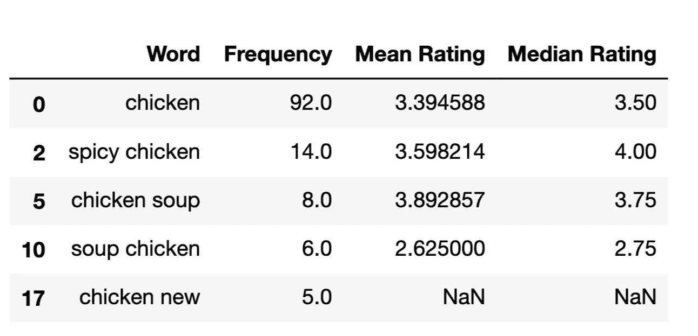

来自美国的品种——包含“鸡肉”的流行词汇

在这个例子中，最热门的词(*鸡* **:** *92* )是最受欢迎的主题，并且它出现的次数明显多于相应的二元模型(*辣鸡:14* )。保守的门槛仍然会保持'*鸡*'作为最受欢迎的主题！

现在我们对我们的功能感到满意，让我们看看世界各地最受欢迎的拉面主题是什么。这是每个国家排名前三的单词/主题！

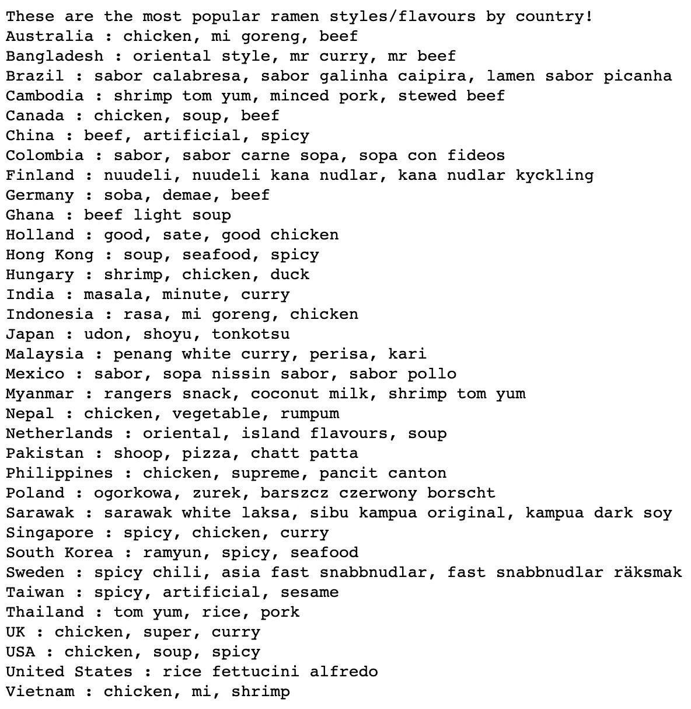

## 第四步:视觉化！

Choropleth 地图是可视化地理数据的一种很好的方式，Plotly 是构建它们的一个方便的 python 库！我是跟着[这篇](/how-to-create-a-plotly-visualization-and-embed-it-on-websites-517c1a78568b)中的文章入门的。

我利用 PyCountry 的 country API 的 get 方法为每一行添加了[字母 ISO alpha 代码](https://en.wikipedia.org/wiki/ISO_3166-1_alpha-3)，这是通过 Plotly 生成 choropleth 地图所必需的。然而，这一步需要一些额外的数据清理。“USA”和“United States”对应于同一个国家，但是只有一个品种是“United States”的一部分，而所有其他品种都以“USA”作为他们的国家，所以我决定去掉“USA ”,保留“USA”。

在世界国家数据框架上运行 ISO 函数后的结果

我在函数中实现的 try-catch 逻辑捕获了额外的数据清理机会。为了从 PyCountry 获得 ISO 代码，我必须使用每个国家的官方名称。荷兰要改荷兰，韩国要改大韩民国，等等。沙捞越是马来西亚的一个州，所以为了这个可视化的目的，我把它去掉了。

一个描述世界如何吃拉面的互动情节剧

该地图本质上是交互式的。你可以在一个国家上空盘旋，了解他们是如何消费拉面的！如果你从移动设备上观看，倾斜屏幕将有助于导航地图。悬停包含关于国家的顶级主题、该主题的中值评级和国家的前三个主题的信息。

*鸡肉*是西方世界最受欢迎的风味。我是说，谁不喜欢🐔？大多数拉丁美洲国家的共同点是 S *opa* ，在西班牙语中是汤的意思。日本有乌龙面，我尝过这种品种，因为日本大多数拉面店里都有供应。韩国 *Ramyun* 应该是由*农神*公司生产的一种辛辣的拉面。我并不惊讶马萨拉是印度最受欢迎的主题。Maggi Masala 2 分钟方便面在印度各地被充满爱心的社会各阶层消费，几十年来它一直是流行文化的标志。这款产品在亚马逊和美国大多数南亚杂货店都有售，我强烈推荐你试试这款！

这张图也显示了流行食物影响邻国烹饪的模式。冬阴肉是一道泰国菜，是泰国最受欢迎的方便面，然而 T2 虾冬阴肉在邻国柬埔寨也是最受欢迎的。另一个例子是 *Mi Goreng* (印度尼西亚面条)从印度尼西亚到澳大利亚的旅行是他们第二受欢迎的主题。对我来说很有趣的是，食物是如何跨越国界的，并且是一个国家文化的一部分，不管它来自哪里。

在所有这些选择中，我最感兴趣的是探索一辆好的**日本乌龙面**、一辆**印尼米高伦**和一辆**韩国 Ramyun** 。然而，我想知道什么样的拉面是世界上评价最高的，也想尝尝。让我们来了解一下！

# **问题 2:评价最高的一种拉面是什么？**

我扫描了所有的数据，并按照与上面相同的步骤(除了可视化部分)来生成主题以及关于每个主题的一些统计数据。我决定将丢弃单词的阈值降低到 10%,因为在扫描整个数据集时，包含其他 n 元语法中存在的单词的 n 元语法的排列明显更高。最后，为了得到一个现实的主题，我剔除了频率小于 10 的单词。

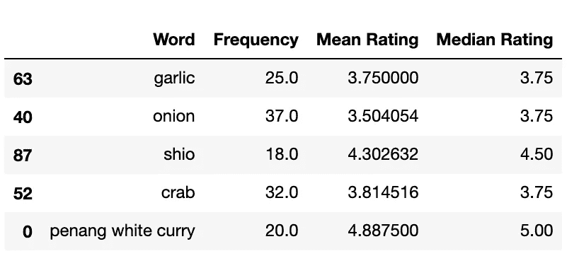

主题数据集中的随机样本

这是上一步中生成的主题示例。为了得到最高评级的主题，我按照中值评级降序排列了这些数据，然后选择了前 20 个词。

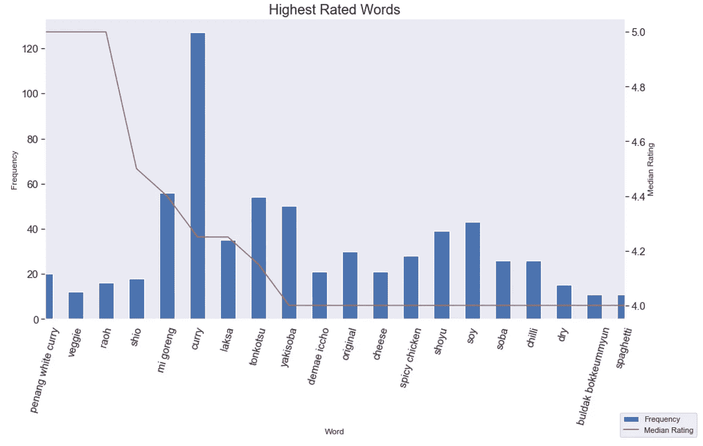

槟城白咖喱，蔬菜和 raoh 有一个完美的中值评级，但它们的品种数低于 20。印度尼西亚的 Mi Goreng 和日本的 Tonkotsu 的频率在 60 左右，评分分别在 4.4 和 4.2 左右！现在我有了一个受欢迎和高评价的拉面品种的想法，最后一个难题在于关于品牌的信息。选择什么品牌才是正确的？品牌的知名度也能保证质量吗？

# 问题三:什么拉面品牌最好？

为了回答这个问题，我使用了 Pandas GroupBy 方法和两个聚合(多样性计数和星级中位数),并按降序对结果进行排序。这些是可视化的结果

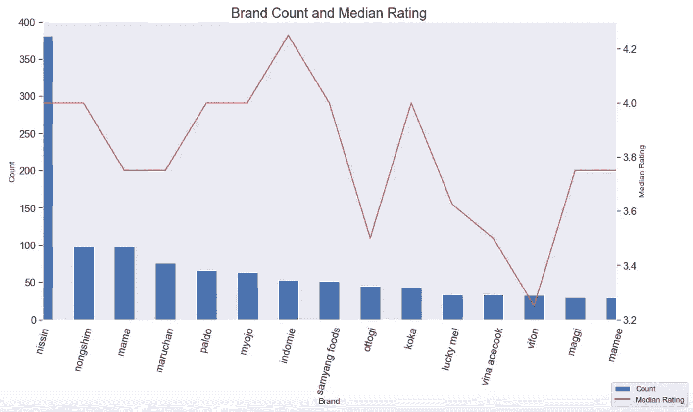

日清是迄今为止最受欢迎的拉面品牌，拥有超过 350 种拉面，平均评分略低于 4.0。营多面和妙条的平均评分分别为 4.0 qnd 4.2，略高于日清！然而，它们生产的品种是日清生产的三分之一。

拉面评估师有一个年度十大排行榜。我创建了一个新的数据框架，其中包括了前十名中挑选的品种。

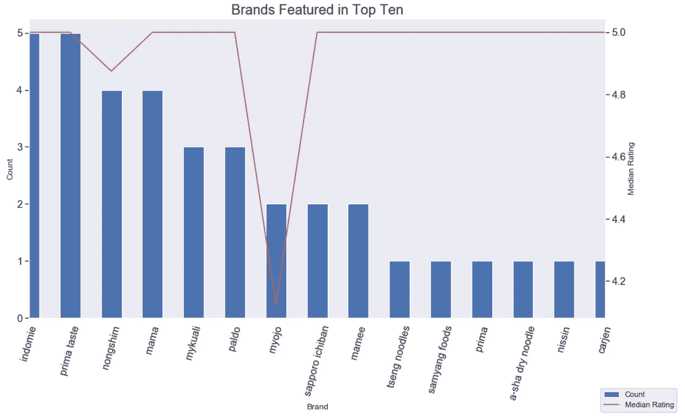

拉面评分者的十大品种品牌

营多面在十大榜单中出现了 5 次，而日清只出现了一次。尽管品味是高度主观的，因人而异，但我觉得还是值得看看鉴赏家的推荐！因此，我会把它作为尝试一种新的拉面的一个稍微重要，但不是必不可少的先决条件，列入十大名单。

# **结论:挑选品种**

做决定不是我的专长。我很高兴我可以利用数据对生活中最具挑战性的问题做出明智的决定，比如我下一步想吃什么拉面。我的决策标准是:

1.  流行/有趣的主题
2.  知名品牌
3.  进入拉面评分者的前 10 名名单(可选)

我入围了几种风格的拉面:**米果仁，拉姆云和槟城白咖喱**。我决定从其中评价最高的一种开始，那就是*槟城咖喱*面。

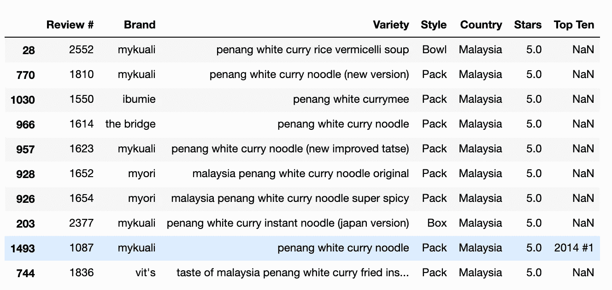

槟城白咖喱品种拉面

我选择了马来西亚的‘*麦考利的槟城白咖喱面‘*。槟榔屿白咖喱是评价最高的品种，而 MyKuali 是一个评价很高的品牌，三次出现在十大榜单中。这很符合我的决策标准！

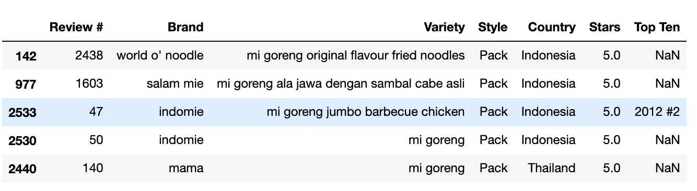

米果仁各式拉面

对于米粉来说，这个决定很简单，我选择了“*营多面米粉巨型烤鸡*”。营多面是一个受欢迎和高评级的品牌，烤鸡听起来很好吃，这个品种在 2012 年排名第二！不用动脑筋。

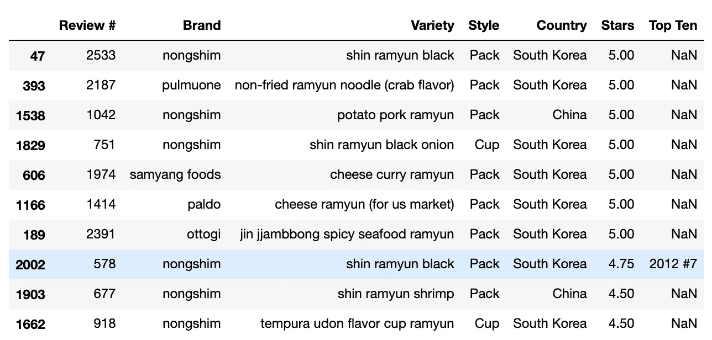

拉姆云品种拉面

拉姆恩是个艰难的选择。我在'*帕尔多的芝士 Ramyun* ' (1166)和'*农神的辛 Ramyun Black* '之间很矛盾。我想先试试 Nongshim，因为它是一个受欢迎的品牌，尽管它的评级略低，但它还是名列前十。

首先，我在[亚马逊](https://www.amazon.com/MyKuali-Penang-White-Curry-Noodle/dp/B00NKN9OUG/ref=sr_1_1?crid=3ODVYJ6QLAALT&dchild=1&keywords=penang+white+curry+noodle&qid=1588536120&sprefix=penang%2Caps%2C293&sr=8-1)上点了槟城白咖喱面，我一定会在 YouTube 上发布一个反应视频！在练习我的分析技巧的同时，了解速食拉面的世界是如此有趣。这是我的 [git 库](https://github.com/kartikd1/Ramen)的链接。

## 参考资料:

[1]迪尼。[简易自制鸡肉拉面](https://www.theflavorbender.com/easy-homemade-chicken-ramen/)。(2019).风味弯曲机

[2]梅尔策，马修。12 种方便面口味你只能从亚洲运来，排名。(2019).Madator 网络