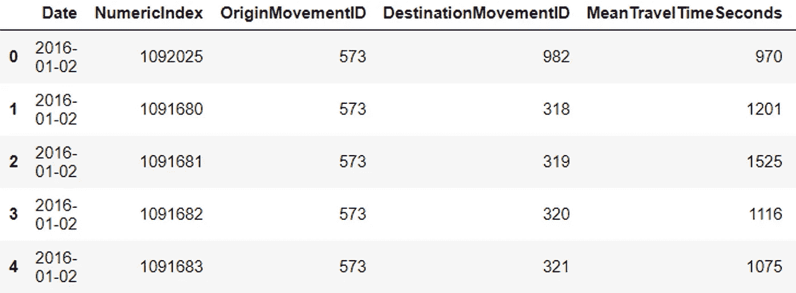
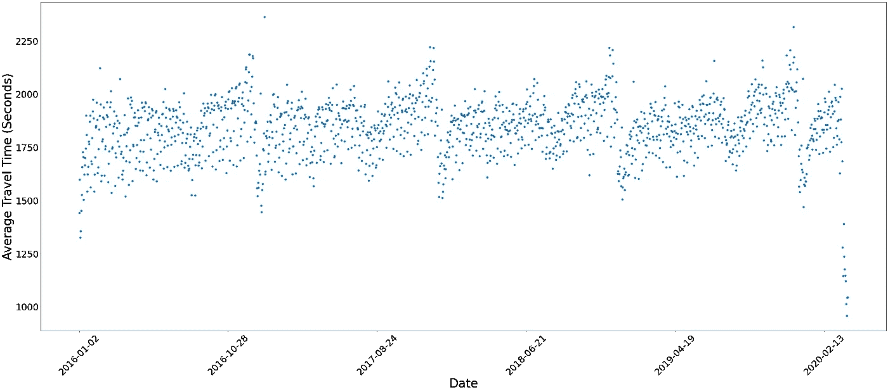
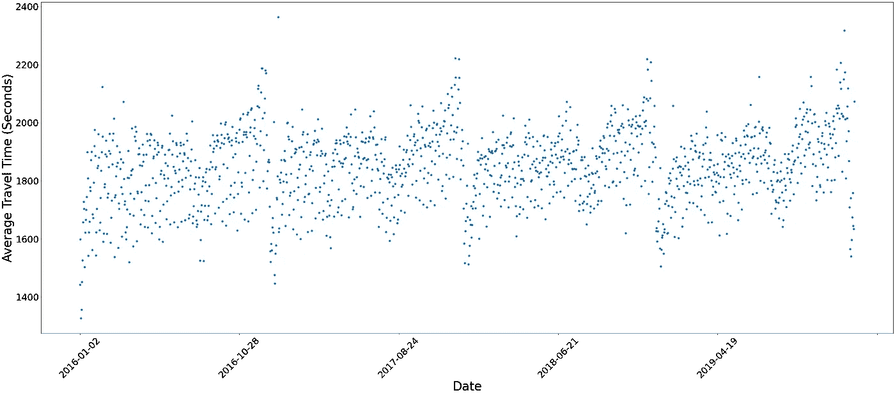
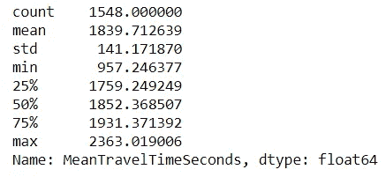
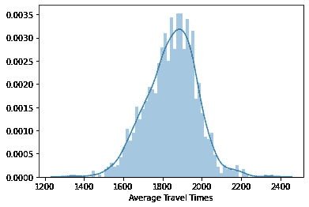
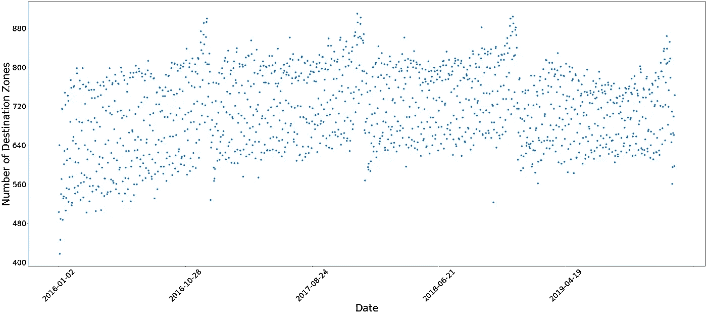
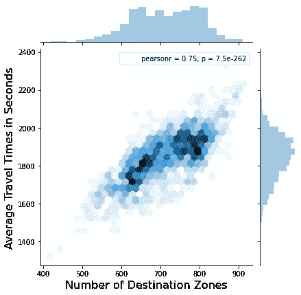
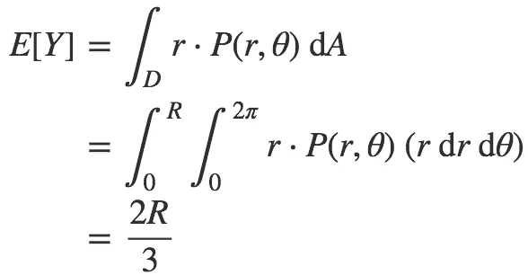
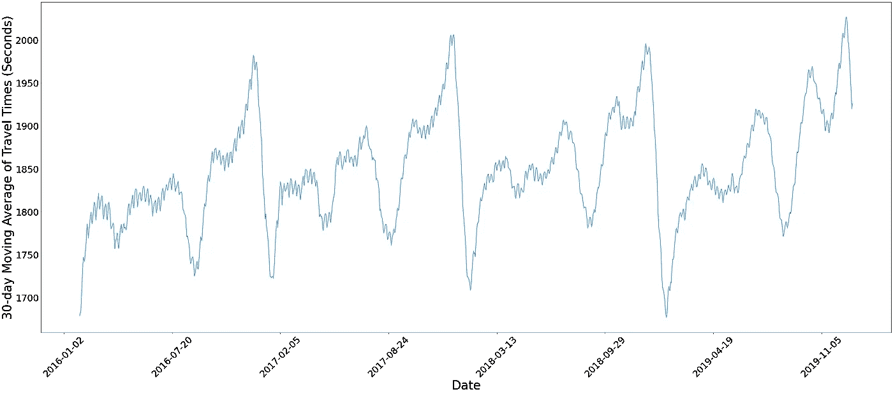
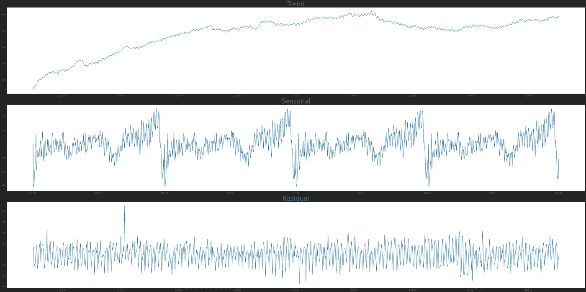

# 探索时间序列优步运动数据

> 原文：<https://towardsdatascience.com/exploring-time-series-uber-movement-data-2a74f53178dc?source=collection_archive---------33----------------------->


伦敦经济学院图书馆在 [Unsplash](https://unsplash.com?utm_source=medium&utm_medium=referral) 上拍摄的照片。在 https://unsplash.com/photos/yzrdcOgEs6c[有售](https://unsplash.com/photos/yzrdcOgEs6c)

优步运动允许用户选择出发地和目的地区域，以查看司机在给定的一天或时间间隔内在全球多个城市从 A 到 B 的平均、下限和上限行驶时间。

在本文中，我将深入研究这些数据的样子及其一些特征，讨论其中的一些问题，并开始讨论如何从时间序列预测的角度来看待这些数据。

不幸的是，如果你想自己下载数据，优步只提供最长 3 个月的横截面数据。

幸运的是，在之前的一篇[帖子](/how-i-built-time-series-data-out-of-cross-sectional-uber-travel-times-data-e0de5013ace2)中，我详细介绍了我是如何从他们网站上可下载的数据中创建时间序列数据的，所以如果您对从中生成时间序列数据感兴趣，可以查看一下。

好了，聊够了…让我们打开 csv 文件！

# 创建每个日期的时间旅行值

让我们看看伦敦市的数据集。



df.head()。由我来算。

我们的数据集范围从 2016 年 1 月 2 日到 2020 年 3 月 31 日，由数十万或数百万行组成(伦敦有 100 多万行)，其中每个日期包含许多平均旅行时间(从出发地到目的地的每次旅行一个时间)。因此，我们必须首先平均所有的平均旅行时间。

```
# Plot average travel time per date
avg_times = df.groupby('Date')['MeanTravelTimeSeconds'].mean()
```

现在我们有了一个 Series 对象，它包含每个日期的一个值，本质上是将“date”列作为我们的索引。

我们开始策划吧。



以秒为单位的平均旅行时间(包括 2020 年)。由我来算。

我们马上看到了一个重复的模式，在第三季度末大幅下降，然后突然上升，然后在每年年底再次下降。

我们还可以看到 2020 年 2 月之后出现非常陡峭和非典型的下降。这就是新冠肺炎·疫情的效果。因此，出于本文的目的，我们将在我们的 avg_times 系列中添加一个“[:-90]”，忽略 2019 年之后的所有值。

```
# Excluding values after 2019 (ignoring COVID-19 impact)
avg_times = avg_times[:-90]
```



以秒为单位的平均行程时间(不包括 2020 年)。由我来算。

那更好(好像什么都没发生)。

我们来看几个统计数据。

```
avg_times.describe()
```



汇总统计数据。由我来算。

从伦敦最中心的区域到任何其他区域平均需要 1840 秒或 30 分钟。

我们可以看到，我们的最大值(2363 秒或 39 分钟)比最小值(957 秒或 16 分钟)离平均值的标准偏差更小，这意味着我们的数据是左偏的，或者较长的行程比较短的行程更集中。

为了证实这一点，我们绘制了一个直方图。

```
ax = sns.distplot(avg_times, bins=65)
ax.set(xlabel='Average Travel Times')
```



直方图和核密度估计器(KDE)。由我来算。

这可能是由于市中心交通拥挤和/或更多的人前往远离起点的区域，而不是短途旅行。

那么旅行的次数是多少？它们可能会对旅行时间的行为产生影响。

```
trip_count = df.groupby('Date')['MeanTravelTimeSeconds'].count()
```



目标区域的数量。由我来算。

这两幅图看起来非常相似。有了这个，我们就承认出行次数可以代表一个城市的整体交通状况。更多的汽车意味着更多的交通，更多的交通意味着更长的旅行时间。

这两者之间似乎存在线性关系:

```
sns.jointplot(x=daily_trip_count, y=avg_travel_times, kind='hex')
```



联合阴谋。由我来算。

需要注意的是，上面的散点图并不严格代表*出行次数*，而是代表**在某一天有足够的出行次数让优步能够匿名化他们的数据**的区域数量。然而，我们会不精确地互换使用目的地区域的数量和行程的数量。

# 将伦敦比作一张唱片

城市中目的地区域的地理分布面临着重大挑战。

为了让优步的司机到达远离市中心的目的地，他们必须通过中间的一些区域，为各自的道路交通做出贡献。

应对数据中这种限制的一个想法是进行某种地理空间加权，其中可以对行程持续时间和从目的地到出发地的距离之间的内在联系所产生的差异进行归一化。

一种有趣的方法可能是使用整个城市中出行的地理空间概率密度。

想象一个 2D 圆盘。如果你向圆盘表面投掷无限数量的飞镖，随机飞镖和圆盘中心之间的平均距离或预期距离是多少？

这个距离，类似于我们在一个随机的目的地区域和原点之间的距离，描述为



来源: [Namit Chatuverdi](https://medium.com/@chaturv3di/solving-problems-step-by-step-5a4d019f4486)

其中 E[Y]是从随机投掷的镖或点到圆盘中心的距离的期望值(或平均值)。

在他的[文章](https://medium.com/@chaturv3di/solving-problems-step-by-step-5a4d019f4486)中，Namit Chaturvedi 巧妙地解释了方程式背后的逻辑，但对我们来说重要的是，我们的旅行时间散点图的轮廓不是 100%准确，因为它没有捕捉旅行距离的影响。

因此，以某种方式将上述等式应用于我们的数据，以找出如何对不同的起点-目的地对进行加权，可能会使距离对我们的平均旅行时间的影响标准化。

但这是另一个话题了。

对我们来说，旅行时间是所有旅行持续时间的简单算术平均值，无论距离远近。

# 时间序列呢？

让我们远离可怕的二重积分，回到我们漂亮的图表上来。

再来看 30 日均线。

```
rolling_mean = avg_times.rolling(window=30).mean().plot()
```



行程时间的 30 天移动平均值(秒)。由我来算。

现在，我们的数据中包含的模式或**季节性**更加清晰可辨。

如果我们想要对数据建模并预测未来值，手头有哪些选择？

我们的数据有季节性，但年度季节性是我们唯一能观察到的吗？说到城市交通，假设人类也有每周一次的习惯似乎是合理的。并非每天都是一样的，但人们通常会为每周的流动性做计划。

让我们使用 statsmodels Python 包将时间序列分解为趋势、季节性和残差。

```
from statsmodels.tsa.seasonal import seasonal_decomposedecomposition = seasonal_decompose(avg_times, model='additive', period=365)
trend    = decomposition.trend
seasonal = decomposition.seasonal
residual = decomposition.resid
```



时间序列的趋势、季节性和残差分解。由我来算。

我们使用 365 天的时间来确定年度趋势和季节性，并使用**加法模型**，因为我们不相信方差会随着水平(或均值)而增加。这是*的一个*指示，表明我们的数据是**平稳的**，也就是说，不存在异方差，这由残差的分布图来证明。我们必须通过运行一个增强的 Dickey-Fuller 测试来检查平稳性。

# 预测优步旅行时间

预测模型将在以后的文章中讨论，但是我们需要注意的是不同的模型处理不同的时间序列。

有些模型即使有季节性项，也只能捕捉一个季节性(如 SARIMAX)。其他人甚至能够捕捉多个非整数季节性(如 TBATS)。当然，除了提及机器学习方法，如 LSTM(长短期记忆)神经网络或其变体。

下一次，我们将应用其中一个模型，解释为什么选择它而不是其他模型，并验证它在不同城市的表现。