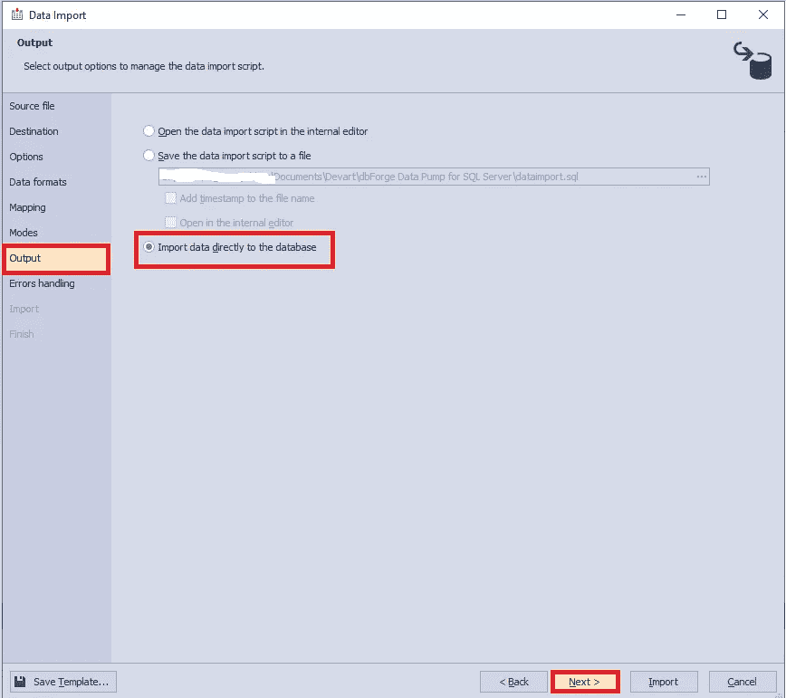

# 导出和导入 JSON 数据

> 原文：<https://towardsdatascience.com/exporting-and-importing-json-data-fc1753808349?source=collection_archive---------30----------------------->

## 这篇文章揭示了关于如何在 SQL Server 数据库中执行数据导出和导入的有价值的信息。

图片来自 [Piqsels](https://www.piqsels.com/en/public-domain-photo-jfmcv) (CC0)

在前面的文章中，我们研究了 [SQL 数据库设计](/sql-database-design-basics-with-example-8dcce4b0c687)的基本规则，为一个招聘服务创建了一个数据库模式图，并用关于雇员的测试数据填充了新创建的数据库。

Img.1 .招聘服务的数据库结构图

该数据库包含以下实体:

*   雇员
*   公司
*   位置
*   项目
*   技能

这一次，让我们考虑通过导出和导入将数据从一个 SQL Server 数据库传输到另一个数据库的方法。当客户机数据库的管理系统的版本比数据源的版本旧时，这就很方便了。也就是说，当无法使用备份副本或只有一部分数据需要传输时，因为所有数据都太重了。

# 将数据从 SQL Server 导出到 JSON 表

首先，[db forge Studio for SQL Server](https://www.devart.com/dbforge/sql/studio/)以及 dbForge Data Pump 中提供了数据导出功能。当使用外部源数据填充 SQL 数据库和在系统之间迁移数据时，[数据泵](https://www.devart.com/dbforge/sql/data-pump/)是一个插件，总是很有帮助。

让我们首先考虑它在 SSMS 的应用。

首先，让我们执行数据导出。

为此，在 [SSMS](https://docs.microsoft.com/en-us/sql/ssms/download-sql-server-management-studio-ssms?view=sql-server-2017) 中，右击你需要的数据库，在下拉菜单中选择 Data Pump\ Export Data…命令:

Img.2 .使用数据泵导出 SQL 数据

然后将出现“导出设置”窗口。在“导出格式”选项卡上，您可以选择不同的格式。在我们的例子中，我们选择 JSON 格式来传输数据并将其导入到另一个数据库中。然后，让我们按下“下一步”按钮:

Img.3 .设置“导出格式”选项卡

接下来，在“Source”选项卡上，您需要选择导出所需的表。在这种情况下，我们选择所有用户表，然后按“下一步”按钮:

Img.4 .设置“源”选项卡

接下来，在“数据格式”选项卡上，您需要在“列”选项卡上选择所需的列，并在“格式”选项卡上设置数据格式。在本例中，我们选择所有列，并保留“格式”的默认设置。然后，按下“下一步”按钮:

Img.5 .设置“数据格式”选项卡

在“输出设置”选项卡上，我们需要配置导出数据的输出参数。这里，我们保留默认设置，并单击“下一步”按钮:

Img.6 .“输出设置”选项卡

在“导出的行”选项卡上，您可以配置导出的行数，这取决于您是需要导出所有行还是只导出它们的某一部分。在这种情况下，我们保留默认设置，也就是说，我们将导出行。现在按下“下一步”按钮:

Img.7 .设置“导出的行”选项卡

接下来，在“错误处理”选项卡上，您可以指定导出期间运行时错误输出的设置。保留默认设置。请注意，为了以后使用，您可以通过单击左下角的“保存模板…”按钮将所有指定的设置保存为模板。现在，您应该按“导出”按钮开始数据导出:

Img.8 .设置“错误处理”选项卡

运行导出时，您可以在“导出”选项卡上查看数据提取过程。

完成后，您将看到“完成”选项卡，您可以通过按“完成”按钮关闭窗口，或者通过按“打开结果文件夹…”按钮立即转到包含生成文件的文件夹:

Img.9 .数据导出的结果

最后，您可以看到 JSON 文件中包含生成的 SQL 数据库数据的文件夹:

Img.10 .包含结果数据文件的文件夹

让我们打开 dbo_Employee 文件的内容:

img . 11 . dbo _ Employee 文件的内容

综上所述，我们将新数据库的数据导出到 JSON 格式的文件中。

请注意，在两种类型的数据库管理系统之间交换数据时，导出会很有用。

用 Excel 导出数据也很方便，可以为分析师提供一些数据进行研究。

# 将 JSON 数据导入 SQL Server 数据库

现在，让我们将结果数据复制到必要的服务器，并在那里恢复 JobEmpl2 数据库。

为此，我们需要使用以下脚本创建一个新的数据库 JobEmpl2，其模式与 JobEmpl 相同:

可以通过多种方式获得该脚本。例如，使用 SQL Server 的[比较包](https://www.devart.com/dbforge/sql/compare-bundle/)工具。

右键单击它，并在下拉菜单中选择数据泵“导入数据…”命令:

Img.12 .数据泵中的数据导入命令

与导出类似，在“源文件”选项卡上，选择 JSON 格式和文件本身。然后按下“下一步”按钮:

Img.13 .设置“源文件”选项卡

在“Destination”选项卡上，选择 JobEmpl2 数据库的 dbo 模式中的现有 Employee 表，然后按“Next”:

Img.14 .设置“目的地”标签

接下来，在“选项”选项卡上，您可以设置编码并查看插入数据的外观。保留默认设置，然后按“下一步”键:

Img.15 .设置“选项”选项卡

在“数据格式”选项卡上，您可以配置插入数据的格式。这里，我们保留默认值，并按下“下一步”按钮:

Img.16 .设置“数据格式”选项卡

在“映射”选项卡上，您可以配置源和目标字段的映射。让我们让一切保持原样，然后按“下一步”按钮:

Img.17 .设置“映射”选项卡

接下来，在“模式”选项卡上，您可以设置数据导入模式。在我们的例子中，我们通过大容量插入来添加数据，而不删除现有数据。然后，按“下一步”:

Img.18 .设置“模式”选项卡

在“输出”选项卡上，您可以为要导入的数据配置目标位置。在这种情况下，选择将数据直接导入数据库，然后单击“下一步”:

Img.19 .设置“输出”选项卡

此后，在“错误处理”选项卡上，您可以在导入过程中配置运行时错误的输出。您也可以点击左下角的“保存模板…”按钮，将之前的设置保存为模板。我们保留默认设置，并按“导入”按钮开始导入:

Img.20 .设置“错误处理”标签

在导入过程中，在“导入”选项卡上，您可以跟踪执行进度。导入完成后，结果会显示在“完成”选项卡上。按“完成”按钮关闭窗口:

Img.21 .数据导入结果

查询目标数据库时，可以确保数据已成功导入到 Employee 表中:

Img.22 .将数据导入到员工表中

同样，您可以将剩余的文件导入到相应的表中。

您可以借助于 [SSMS](https://docs.microsoft.com/en-us/sql/ssms/download-sql-server-management-studio-ssms?view=sql-server-2017) 的标准功能，通过右击所需的数据库并在下拉菜单中选择相应的命令来执行数据导出和导入:

Img.23 .使用标准 SSMS 工具进行数据导出和导入

# 结论

简而言之，数据导出和导入不仅允许在数据库之间移动数据，以方便的形式为后续处理提供数据，还允许将部分必要的数据导入所需的数据库。

在下一部分中，我们将研究如何在创建的数据库中进行对象和数据搜索。

*原载于 2020 年 7 月 23 日*[*【https://blog.devart.com】*](https://blog.devart.com/export-and-import-json-data-via-dbforge-data-pump-for-sql-server.html)*。*