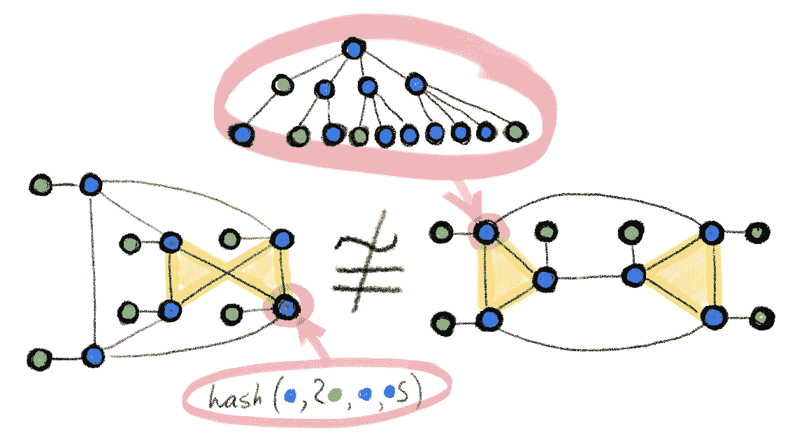
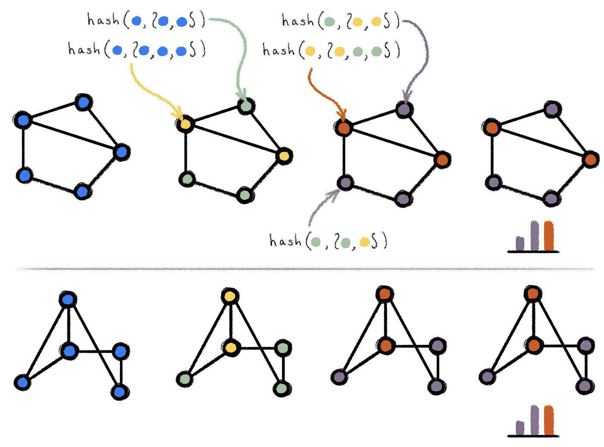
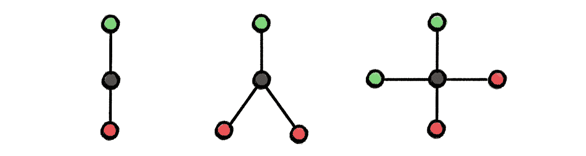

# 图形神经网络的表达能力和 Weisfeiler-Lehman 检验

> 原文：<https://towardsdatascience.com/expressive-power-of-graph-neural-networks-and-the-weisefeiler-lehman-test-b883db3c7c49?source=collection_archive---------4----------------------->

## 图形神经网络有多强大？

## 你有没有一种感觉，图形上的深度学习是一组有时有效的启发式方法，但没有人知道为什么？在这篇文章中，我将讨论图形同构问题，Weisfeiler-Lehman 启发式图形同构测试，以及如何使用它来分析图形神经网络的表达能力。

*这是关于图形神经网络表达能力的三篇系列文章中的第一篇。在* [*第二部分*](/beyond-weisfeiler-lehman-using-substructures-for-provably-expressive-graph-neural-networks-d476ad665fa3) *中，我讨论了如何脱离 Weisfeiler-Lehman 层次结构，在* [*第三部分*](/beyond-weisfeiler-lehman-approximate-isomorphisms-and-metric-embeddings-f7b816b75751) *中，我提出了为什么重新审视整个图同构框架可能是个好主意。*

传统的前馈网络(多层感知器)是众所周知的通用逼近器:它们能够以任何期望的精度逼近任何平滑函数。对于最近才出现的图形神经网络，其表示特性还不太为人所知。在实验中经常观察到，图形神经网络在一些数据集上表现出色，但同时在另一些数据集上表现令人失望。为了找到这种行为的根源，我们必须回答这个问题:图形神经网络有多强大？

挑战之一是应用中遇到的图是连续和离散结构的组合(分别是节点和边特征和连通性)，因此这个问题可以以不同的方式提出。一个可能的公式是图形神经网络是否可以区分不同类型的图形结构。这是图论中的一个经典问题，称为*图同构* *问题*，旨在确定两个图是否拓扑等价[1]。两个同构的图具有相同的连通性，不同之处仅在于它们的节点排列不同。

有点令人惊讶的是，图同构问题的确切复杂性类别是未知的。不知道在[多项式时间](https://en.wikipedia.org/wiki/Polynomial_time)内可解，也不知道[NP-完全](https://en.wikipedia.org/wiki/NP-complete)，有时会归结为一个特殊的“ [GI 类](https://en.wikipedia.org/wiki/Graph_isomorphism_problem#Complexity_class_GI)”[2]。

魏斯费勒-雷曼检验。[Boris Weisfeiler](https://en.wikipedia.org/wiki/Boris_Weisfeiler)和[Andrey Lehman](/a-forgotten-story-of-soviet-ai-4af5daaf9cdf)【3】在 1968 年的开创性论文中提出了一种高效的启发式算法，现在被称为 *Weisfeiler-Lehman (WL)测试*，最初被认为是图同构问题的多项式时间解决方案【4】。一年后发现一个反例；然而，从概率意义上来说，WL 检验似乎适用于几乎所有的图[5]。

在两个同构图上执行 Weisfeiler-Lehman 测试的例子。方括号表示多重集。该算法在颜色不变后停止，并产生一个输出(颜色直方图)。两个图的相等输出表明它们可能是同构的。

WL 测试基于迭代图重新着色[6](“颜色”在图论中是指一个离散的节点标签)，从相同颜色的所有节点开始。在每一步中，该算法将节点及其邻域的颜色聚合起来表示为多重集[7]，并将聚合的颜色多重集散列成独特的新颜色。算法在达到稳定的颜色时停止。如果在这一点上两个图的着色不同，那么这两个图就被认为是非同构的。然而，如果着色相同，那么这两个图可能(但不一定)是同构的。换句话说，WL 测试是图同构的一个必要但不充分的条件。存在着不同质的图，WL 测试产生相同的颜色，因此认为它们“可能是同构的”；据说在这种情况下测试会失败。下图显示了一个这样的例子:

WL 图同构判定失败的两个不同构的图，从它产生的相同着色可以明显看出。在化学中，这些图表代表了两种不同化合物的分子结构，十氢萘(左)和双环戊基(右)。图改编自[14]。

**图同构网络。**徐克玉路【9】和【10】(至少在两年前，托马斯·基普夫在他的[博客文章](http://tkipf.github.io/graph-convolutional-networks/)中注意到**)WL 测试与图消息传递神经网络有惊人的相似之处【8】，一种在图上进行类似卷积运算的方法。在消息传递层，每个节点的特征通过聚集邻居的特征来更新。聚合和更新操作的选择是至关重要的:只有多重集内射函数使它等价于 WL 算法。文献中使用的聚合器的一些流行选择，如最大值或平均值，实际上没有 WL 强大，并且不能区分非常简单的图形结构:**

****

**不能用 max 区分但可以用 mean 聚合器区分(第一和第二)和既不能用 max 也不能用 mean 区分(第一和第三)的图结构的例子。原因是以这种方式从黑色节点的邻居聚集的特征将是相同的。图改编自[9]。**

**徐提出了一种使消息传递神经网络等价于算法的聚集和更新函数，称之为图同构网络。这是标准消息传递神经网络所能达到的最强大的功能。但不仅仅是一个新的架构，主要的影响是在一个简单的环境中阐述了表现力的问题，这可能与图论中的一个经典问题有关。这个想法已经激发了多部后续作品。**

**魏斯费勒-雷曼层级。扩展徐和 Morris 结果的一个方向是使用更强大的图同构测试。由拉斯洛·巴拜提出的 *k-WL 测试*是 Weisfeiler-Lehman 算法的高阶扩展，它作用于 *k* 元组而不是单个节点。除了等价的 1-WL 和 2-WL 测试之外，( *k* +1)-WL 严格强于 *k* -WL，对于任何 *k* ≥2，即存在这样的图的例子，其中 *k* -WL 失败，( *k* +1)-WL 成功，但反之则不然。*k*——WL 因此是一个层次结构或日益强大的图同构测试，有时被称为 Weisfeiler-Lehman 层次结构[10]。**

**有可能设计出遵循 *k* -WL 测试的图形神经网络，从而比消息传递架构更强大。第一个这样的建筑， *k* -GNN，就是由莫里斯提出的。传统的消息传递神经网络和这种高阶 gnn 之间的关键区别在于，它们是*非局部*的，因为 *k* -WL 算法对*k*-节点元组进行操作。这对算法的实现及其计算和存储复杂性都有重要的影响: *k* -GNNs 需要𝒪( *nᵏ* 内存。作为降低复杂性的一种方式，Morris 设计了一个本地版本的 *k* -GNNs，它基于本地邻居的聚合，但是表达能力不如 *k* -WL。**

**有些不同的高阶图架构是由 Haggai Maron 提出的，2019 年 9 月我有幸参加了他在魏茨曼研究所的博士答辩。Maron 基于 k 阶张量[12]定义了一类不变图网络(IGN ),并证明了它们与 k 阶 T21-WL 一样强大。IGNs 是从*k*-WL【10】的不同变体中派生出来的，与 *k* -GNNs 相比，在复杂性方面更有优势。特别是，3-WL 等效 IGN“仅”具有二次复杂度，这可能是唯一实际有用的图形神经网络架构，严格来说比消息传递更强大，但与前者的线性复杂度仍相去甚远[16]。**

**从理论的角度来看，可证明强大的图形神经网络的工作提供了一个严格的数学框架，可以帮助解释和比较不同的算法。已经有多个后续工作使用来自图论和分布式局部算法的方法扩展了这些结果[14]。**

**然而，从实践的角度来看，这些新架构几乎没有显著的影响:例如，最新的基准测试[15]表明，最近证明强大的算法实际上不如旧技术。这在机器学习中并不罕见，理论和实践之间往往存在很大差距。一种解释可能是基准本身的缺陷。但更深刻的原因可能是，更好的表达能力不一定提供更好的概括(有时正好相反)，而且，图同构模型可能无法正确捕捉特定应用程序中图相似性的实际概念——我将在下一篇文章中讨论这一点。可以肯定的是，这一系列的工作对于搭建通往其他学科的桥梁和带来之前没有在图形深度学习领域使用的方法是非常富有成效的[17]。**

**[1]即在两个图的节点之间存在保边双射。**

**[2]图同构因此可能是一个[NP-中间](https://en.wikipedia.org/wiki/NP-intermediate)复杂性类。对于一些特殊的图族(如树、平面图或最大度有界的图)，存在多项式时间算法。**

**[3] B. Weisfeiler，A. Lehman，将图简化为标准形式以及其中出现的代数(1968)。信息技术 2(9):12–16。[英文翻译](https://www.iti.zcu.cz/wl2018/pdf/wl_paper_translation.pdf)和[俄文原版](https://www.iti.zcu.cz/wl2018/pdf/wl_paper_orig.pdf)，其中包含一个不寻常的西里尔符号形式的双关语(операция„ы)，指的是三年前与[同名的苏联大片](https://en.wikipedia.org/wiki/Operation_Y_and_Shurik%27s_Other_Adventures)。参见这篇[博文](https://davidbieber.com/post/2019-05-10-weisfeiler-lehman-isomorphism-test/#:~:text=The%20core%20idea%20of%20the,used%20to%20check%20for%20isomorphism.)中的一个流行论述。Lehman 有时也被拼写为“Leman”，然而，考虑到这个姓氏的日耳曼起源，我更喜欢更准确的前一个变体。**

**[4] I .波诺马伦科，[魏斯费勒·雷曼的原文](https://www.iti.zcu.cz/wl2018/wlpaper.html)。提供了这篇经典论文的历史背景。他指出这项工作的动机来自化学应用。**

**[5] L. Babai 等人[随机图同构](https://pdfs.semanticscholar.org/114e/a414b025a68d641efad9b74295a5625b9e7e.pdf?_ga=2.67290641.1827801715.1592846909-1172292721.1591164305) (1980)。暹罗计算机杂志 9(3):628–635。**

**[6]weis feiler 和 Lehman 的原始论文实际上描述了 2-WL 变体，然而它等价于 1-WL，也称为颜色细化算法。作为历史记录，这样的算法以前在计算化学中是已知的，参见例如 H. L. Morgan。化学结构的独特机器描述的生成——化学文摘服务处(1965 年)开发的技术。化学博士。医生。5(2):107–113，这是在化学中广泛使用的摩根分子指纹的基础。**

**[7]多重集是一个集合，其中相同的元素可能出现多次，但元素的顺序无关紧要。**

**[8] J. Gilmer 等人，[量子化学的神经信息传递](https://arxiv.org/abs/1704.01212) (2017)。继续。ICML。**

**[9] K. Xu et al. [图神经网络到底有多强大？](https://arxiv.org/abs/1810.00826) (2019)。继续。ICLR。**

**[10]WL 检验存在几种变体，它们具有不同的计算和理论属性，术语也相当混乱:建议读者清楚地理解不同作者所说的“ *k* -WL”到底是什么意思。一些作者，例如 Sato 和 Maron，区分了 WL 和“民俗”WL (FWL)测试，这两种测试的主要区别在于颜色细化步骤。 *k* -FWL 测试等价于( *k* +1)-WL。Morris 使用的 set *k* -WL 算法是另一种变体，它具有更低的存储复杂度，但严格弱于 *k* -WL。**

**[11] C. Morris 等人 [Weisfeiler 和 Leman go neural:高阶图神经网络](https://aaai.org/ojs/index.php/AAAI/article/view/4384/4262) (2019)。继续。AAAI。**

**[12] H. Maron 等人[不变和等变图网络](https://arxiv.org/abs/1812.09902) (2019)。继续。ICLR。**

**[13] H. Maron 等人[可证明强大的图形神经网络](https://arxiv.org/abs/1905.11136) (2019)。继续。神经炎。参见作者的一篇[博文。](http://irregulardeep.org/How-expressive-are-Invariant-Graph-Networks-(2-2)/)**

**[14] R. Sato，[关于图形神经网络表达能力的调查](https://arxiv.org/abs/2003.04078) (2020)。arXiv: 2003.04078。提供了一个非常全面的审查不同的 WL 测试和等效的图形神经网络架构，以及链接到分布式计算算法。**

**[15] V. P. Dwivedi 等人[标杆图神经网络](https://arxiv.org/abs/2003.00982) (2020)。arXiv: 2003.00982。**

**[16]更准确地说，消息传递的复杂性是边数的线性关系，而不是节点数的线性关系。在稀疏图中，这大致相同。在稠密图中，边的数量可以是𝒪( *n* 。出于这个原因，Maron 认为他的体系结构对密集图形是有用的。**

**[17]准确地说，WL 形式主义对机器学习界来说并不陌生。N. Shervashidze 和 K. M. Borgwardt 的开创性论文《图上的快速子树核》( 2009 年)。继续。据我所知，NIPS 是最近深度神经网络复兴之前第一个使用这种结构的，比本文讨论的工作早了近十年。**

**感谢迈赫迪·巴赫里、卢卡·贝利、乔治·布里萨斯、法布里奇奥·弗拉斯卡、费伦茨·胡萨尔、谢尔盖·伊万诺夫、伊曼纽·罗西和大卫·西尔弗帮助校对和编辑这篇文章，并感谢卡斯滕·博格瓦特指出了与 WL 内核的关系。承蒙 [*刘止庸*](https://medium.com/@zhiyongliu) *提供本帖的* [*中文翻译*](https://www.infoq.cn/article/mOL8kKbTaXr4t6YTwkgU) *。关于图形深度学习的其他文章，请参见我的* [*博客*](https://towardsdatascience.com/graph-deep-learning/home) *关于走向数据科学，* [*订阅*](https://michael-bronstein.medium.com/subscribe) *我的帖子和* [*YouTube 频道*](https://www.youtube.com/c/MichaelBronsteinGDL) *，获取* [*中等会员*](https://michael-bronstein.medium.com/membership) *，或者关注我的*[*Twitter【*](https://twitter.com/mmbronstein)**