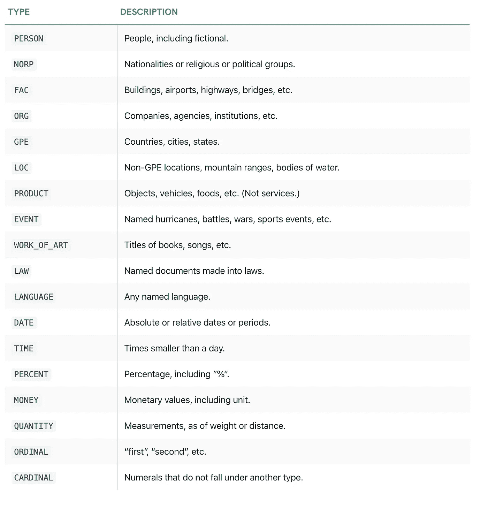
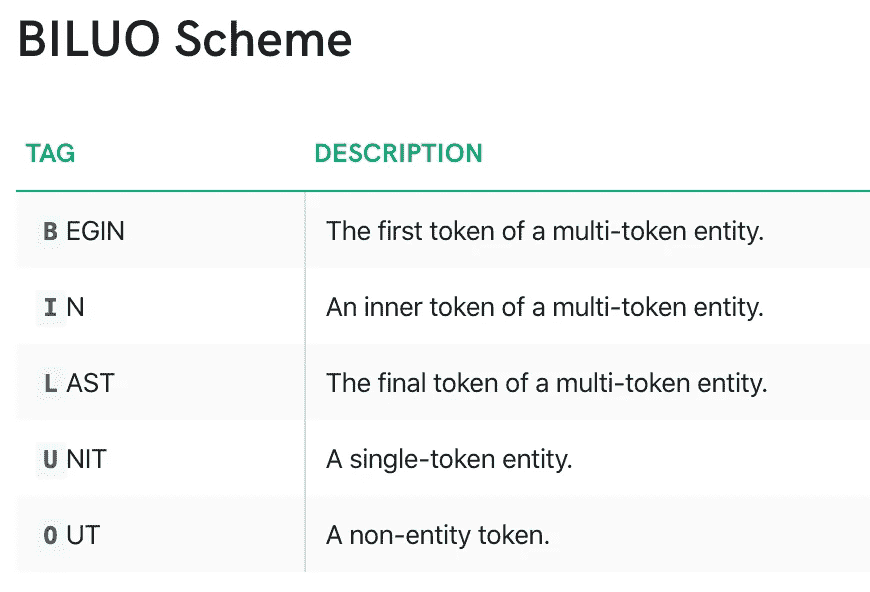
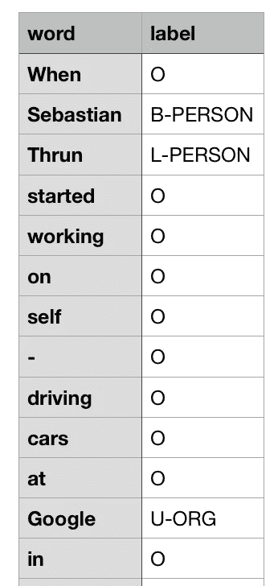

# 扩展命名实体识别器(NER ),用空格标记新实体

> 原文：<https://towardsdatascience.com/extend-named-entity-recogniser-ner-to-label-new-entities-with-spacy-339ee5979044?source=collection_archive---------10----------------------->

单词的标签顺序-简洁明了

图 1:彩色编码的识别实体

这篇文章假设读者对从文本中提取实体有一些概念，并希望进一步了解新的自定义实体识别存在哪些先进的技术，以及如何使用它们。然而，如果你是第一次接触 NER 问题，那么请在这里阅读。

话虽如此，这篇文章的目的是描述使用来自 [spaCy](https://spacy.io/models/en) 的预训练自然语言处理(NLP)核心模型来学习识别新实体。来自 spacy 的现有核心 NLP 模型被训练以识别各种实体，如图 2 所示。

图 spaCy 核心模型识别的现有实体([来源](https://spacy.io/api/annotation#named-entities))

尽管如此，用户可能想要构建自己的实体来解决问题需求。在这种情况下，先前存在的实体表现得不够充分，因此，需要训练 NLP 模型来完成这项工作。感谢 [spaCy](https://spacy.io/usage/spacy-101) 的文档和预训练模型，这并不是很困难。

如果你不想进一步阅读，而是想学习如何使用它，那么请到这个 jupyter [笔记本](https://github.com/prem2017/new-entity-labelling/blob/master/new_entity_labelling.ipynb) [-](https://github.com/prem2017/new-entity-labelling/blob/master/new_entity_labelling.ipynb)-) 它是独立的。无论如何，我也建议浏览一下。

## 数据预处理

像任何需要输入和输出来学习的监督学习算法一样，类似地，这里——输入是**文本**，输出根据 [**【罗比】**](https://spacy.io/api/annotation#biluo) 进行编码，如图 3 所示。虽然存在不同的方案，但是， [Ratinov 和 Roth](https://www.aclweb.org/anthology/W09-1119/) 表明最小 Begin，in，Out ( [**IOB**](https://spacy.io/api/annotation#iob) )方案比明确标记边界标记的**罗比**方案更难学习。IOB 编码的一个例子是由 [spaCy](https://github.com/explosion/spaCy/blob/master/examples/training/train_new_entity_type.py) 提供的，我发现它与提供的参数一致。因此，从这里开始，任何注释方案的提及都将是罗比。

图 3: [罗比](https://spacy.io/api/annotation#biluo)方案

下图显示了罗比编码实体的一个简短示例。

图 4:用 BILOU 方案编码的实体

用罗比方案编码有三种可能的方法。**方法之一**是创建一个 spaCy [**doc**](https://spacy.io/api/doc) 格式的文本字符串，并将从 doc 中提取的令牌保存在一个文本文件中，用换行符隔开。然后根据罗比方案标记每个令牌。人们可以创建自己的令牌并标记它，但可能会降低性能——稍后将详细介绍。以下是如何标记您的数据，供以后在 NER 培训中使用。

上面的片段使生活更容易注释，但这不能直接输入到学习的空间模型中。尽管如此，spaCy 提供的另一个模块 [**GoldParse**](https://spacy.io/api/goldparse/) 解析模型接受的保存格式。使用下面的代码片段从保存的文件中读取数据，并将其解析成模型可以接受的形式。

**另一种**方式是使用每个实体/标签的偏移索引，即实体的开始和结束(即实体的开始、内部和最后部分组合在一起)的索引与标签一起提供，例如:

第三个类似于第一个，除了，这里我们可以修复我们自己的令牌并标记它们，而不是用 NLP 模型生成令牌然后标记它们。虽然这也可以工作，但是，在我的实验中，我发现这大大降低了性能。然而，你可以这样做:

## 培养

在对数据进行预处理并为训练做好准备后，我们需要在模型 **NER** 管道中进一步添加新实体的词汇表。核心空间模型有三条流水线:**标记器**、**解析器**和 **NER** 。此外，我们需要禁用标记器和解析器管道，因为我们将只训练 **NER** 管道，尽管可以同时训练所有其他管道。点击了解更多[。](https://github.com/explosion/spaCy/tree/master/examples/training)

在这里，为了训练，dropout 被指定为 0.0-故意过度拟合模型，并表明它可以学习识别所有的新实体。

**推论**

来自训练模型的结果:

spaCy 还提供了一种生成彩色编码的[实体](https://spacy.io/usage/visualizers#ent)(如图 1 所示)的方法，可以使用以下代码片段在网络浏览器或笔记本上查看:

**注意事项**

这里提供的训练新实体的过程可能看起来有点简单，但是，它有一个警告。在训练时，新训练的模型可能会忘记识别旧实体，因此，强烈建议将一些文本与来自先前训练的实体的实体混合，除非旧实体对于问题的解决方案不是必需的。其次，学习更多具体的 T21 实体可能比学习一个一般化的实体更好。

**结论**

我们看到，开始学习新的实体并不难，但是需要尝试不同的注释技术，并选择最适合给定问题的方法。

**补充说明**

*   这篇文章是 spaCy [在这里](https://github.com/explosion/spaCy/blob/master/examples/training/train_new_entity_type.py)提供的例子的进一步扩展。
*   在这个 jupyter [笔记本](https://github.com/prem2017/new-entity-labelling/blob/master/new_entity_labelling.ipynb)中可以访问整个代码块。自述文件还包含如何安装空间库以及在安装和加载预训练模型期间调试错误问题。
*   阅读由 [Akbik 等人](https://alanakbik.github.io/papers/coling2018.pdf)撰写的这篇论文，它应该有助于理解序列标记背后的算法，即多个单词实体。