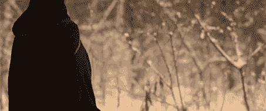
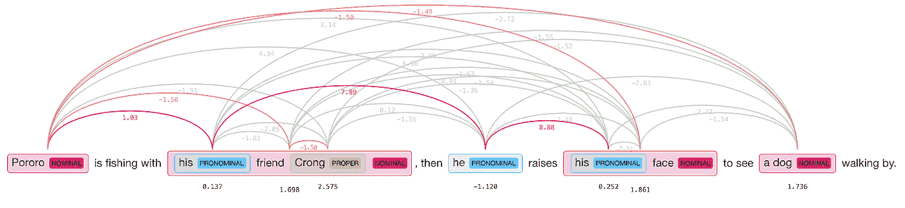
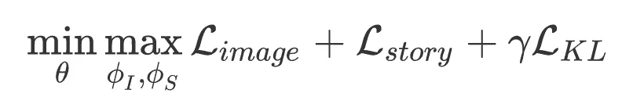
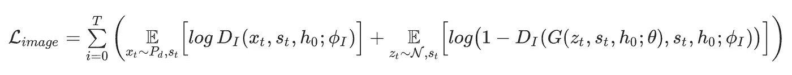
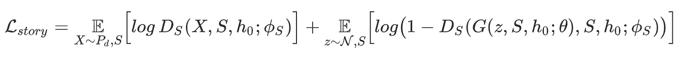
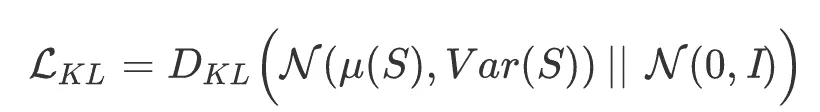
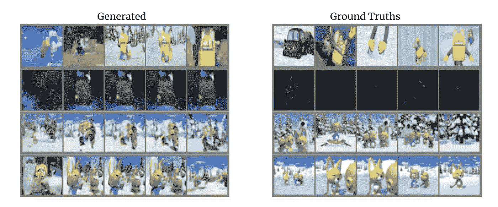
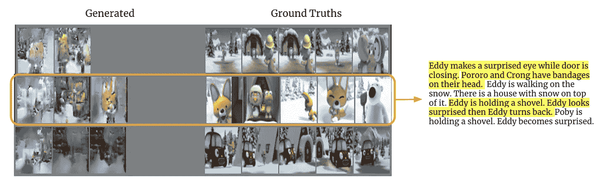

# 扩展的故事可视化

> 原文：<https://towardsdatascience.com/extended-story-visualization-f320bcad4c16?source=collection_archive---------54----------------------->

## 从非结构化文本生成视频的关键帧序列方法。

直到今天，视频生成中的许多方法主要关注运动一致性，而不是所生成视频的长期上下文。换句话说，模型被训练以提高每一帧相对于先前帧的平滑度。

视频生成示例。C. Vondrick，H. Pirsiavash，A. Torralba，NIPS 2016

虽然这已经产生了良好的结果，但如果我们预见到机器会创造出更多考虑到上下文的相关视觉内容，这将成为一项重要的任务。或者，可以将该任务分为两个步骤，首先创建能够生成特定初始目标帧的模型，以便以可视方式讲述一个故事，然后使用一个聚焦于运动的模块，该模块可以在一个关键帧接一个关键帧的插值中说明故事的每一部分。

> *因为我们都爱新内容😍！*

这种关键帧式的生成是由[【1】](https://arxiv.org/abs/1812.02784)提出的一个比较新的任务，名称为*故事可视化*。其中任务被视为序列条件生成问题，使用故事嵌入作为生成器的隐藏状态的先验，并为故事中给出的每个单独的句子创建新的图像。这种方法显示了显著的良好结果，其中它实现了考虑给定书面故事的字符和背景分布的上下文感知生成，然而，它展示了每个生成的图像与给定句子配对的局限性。

星球大战的混搭

因此，在长期视频生成的目标中，我们认为提出该方法的扩展是相关的，在该方法中，模型将接收非结构化文本条目，然后能够选择相关特征来生成说明故事的最佳数量的图像。

# 模型概述

段落到图像序列模型(P2iSeq)。

如上图所示，与 StoryGAN 相似，该模型包含一个具有两个鉴别器(用于局部一致性的图像鉴别器和用于全局一致性的故事鉴别器)的顺序生成对抗网络(GAN)。对于生成，它接收来自 DistilBERT 预训练编码器的编码故事作为第一隐藏向量( *h_0* )，以及由从标准正态分布中采样的随机向量和来自提取摘要器选择的句子的嵌入合成的一组堆叠向量。在训练时，生成器在两个独立的循环中更新，第一个考虑图像鉴别器的输出，第二个考虑关于故事鉴别器的输出。

在所提出的架构的情况下，关键贡献依赖于选择性模块的实现，该模块能够选择故事的最相关特征，以避免图像生成中的重复，并保持整个故事的上下文，以及能够处理来自生成器的可变长度故事和固定长度地面真相的网络。

**故事蒸馏编码器**

对于故事编码器模块，我们考虑使用 Google 的 BERT。BERT 是在维基百科语料库上预先训练的一堆变形金刚。它有两种尺寸，BERT base 和 BERT large。基本模型有 12 个变压器层，大型模型有 24 个。然而，BERT 模型太大，并且需要太多的训练和推理资源。经过深思熟虑，我们选择在我们的故事编码器中使用 DistilBERT。DistilBERT 是 BERT 的缩小版。通过使用 DistilBERT，我们将 BERT 模型的大小减少了 40%，同时保留了 97%的语言理解能力，并且速度提高了 60%。这是通过在预培训阶段利用知识提炼来实现的。知识提炼是一种压缩技术，在这种技术中，一个紧凑的模型，即学生，被训练来再现一个更大的模型，即教师或模型集合的行为。

我们首先采用预训练的 DistilBERT 模型，并在 Pororo-SV 数据集的文本上训练(微调)它。我们这样做是为了改进为数据集中的句子生成的编码(即它知道 Pororo 是一个名字)。接下来，我们使用这个模型对数据集中的故事进行编码。然后，文本编码被传递给递归生成器。我们还添加了一个线性层，将来自 DistilBERT 的 768 维向量嵌入映射到一个 228 维向量，分别对应于均值和方差的两个 124 维向量。此外，嵌入内容被堆叠到一个独热编码向量中，该向量表示故事中出现的角色，以帮助模型在生成过程中识别它们。

## 摘录摘要

这种摘要方法受到了[【3】](https://arxiv.org/abs/1906.04165)的启发，它利用句子的相似性，删除那些信息已经由文本中的其他部分表示的句子。该过程始于对人称代词的神经共指解析，其中每次找到指代时，模型用其对应的名词代词替换该指代。为了解决这个解析问题，使用基于[【23】](https://arxiv.org/abs/1606.01323)的预训练神经模型，然后将解析的句子输入到前述的 DistilBERT 编码器，以返回各自的嵌入。然后对解析的嵌入进行聚类，汇总器输出更接近每个聚类质心的嵌入，生成的聚类的比例是在实验中调整的超参数。

共指权重可视化。(*图片取自 [HuggingFace 公司](https://hugginface.co/neuralcoref)演示。)

# 培养

为了在端到端管道中训练生成器和两个鉴别器，我们使用两个独立的循环，第一个循环允许生成的图像和文本输入之间的局部一致性，第二个循环用于全局一致性，其中在计算损失时，它考虑了符合故事和书面故事本身的生成图像集。总体优化目标描述如下:

总最小最大损失函数

其中 *θ* 、ϕ_I 和ϕ_S 分别是发生器、图像鉴别器和故事鉴别器网络的参数。

## 图像鉴别器

本质上，对于与图像损失相对应的更新，我们使用二进制交叉熵损失，该损失总结了鉴别器相对于相应故事上生成的和地面真实图像的输出。为了允许在鉴别器中同时评估图像分布及其与输入故事句子的相关性，它将卷积层的编码原始图像输出与句子和故事嵌入连接起来，以确定它是否来自生成器。

图像损失函数

## 故事鉴别器

类似于图像鉴别器，计算的故事损失也利用来自故事鉴别器输出的二进制交叉熵损失，但是不是单独考虑每个图像-句子嵌入对，而是堆叠和平均每个与故事相关的向量组，然后馈送到鉴别器中。

故事损失函数

由于地面实况和生成的图像故事的长度不一定相同的事实，该过程实施起来特别具有挑战性。该鉴别器的主要思想是评估故事嵌入的平均信息在基本事实和生成的样本之间保持相同，即使它们具有不同的长度。

对于优化目标的最后一项，我们利用故事嵌入分布和正态标准分布之间的 Kulback-Liebler 散度惩罚来避免图像生成过程中的模式崩溃问题。

惩罚 KL 散度损失函数

# 实验

## 固定长度生成

在我们的第一个实验中，我们实现了一个 DistilBERT story 编码器，以验证它是否能为生成器提供足够的上下文，从而使输出图像有意义。我们注意到，随着训练的进行，生成的图像变得更加清晰，更有意义。在大多数生成的序列中，我们看到 DistilBERT 嵌入传递了足够的上下文信息，以准确识别输入故事中出现的角色以及它们相对于彼此和场景中其他对象的确切位置。下面描述了一个这样的序列，其中模型在它们的正确位置生成所有字符，但是它不能检测到床应该在生成的分布中。

P2iSeq 生成了与地面实况对应的上下文分布相匹配的视觉故事。

此外，场景的颜色分布以及背景环境(室外/室内)通常由模型很好地说明，如下例所示。

## **汇总生成**

与 StoryGAN 基线相比，一旦我们在固定长度图像生成实验中取得了相当好的结果，我们就继续在提取文本摘要器模块提出的可变长度方法中设置实验管道。这给优化问题增加了更高水平的复杂性，GAN 训练变得更加不稳定，并使鉴别器的工作更容易，因为生成器更难创建用较少数量的图像覆盖完整故事信息的插值图像分布。

带有句子选择的摘要图像生成示例。

如上图所示，该模型能够根据背景(即，在第一幅图像中，即使所选的句子中没有一个提到雪的背景)和故事人物选择来识别潜在的分布；因为总结者选择了描述故事中最相关的特征，但是图像分辨率在实现这个目标时受到了损害。

# 结论

StoryGAN 的方法记录在[1]中，具有解决故事可视化问题的可靠框架，能够从给定的书面故事中识别关键特征。虽然提取摘要器提取相关句子以视觉方式讲述故事，但它仍然无法达到可靠的图像质量。这种方法能够学习 Pororo 数据集的底层上下文分布，但是需要额外的信息来导出位于完整图像序列的每一帧之间的图像空间。在整个实验中，相对于故事鉴别器，生成器表现为较慢的学习者，因为在摘要过程中，它需要推断图像到图像的分布，同时内插或试图创建在较少数量的图像中显示相同数量的信息的图像。

在训练过程中要调整的另一个复杂参数是提取模块的总结句子的比率。因此，我们认为向句子选择过程添加软放松将是一种有趣的方式，有助于模型在训练时识别要生成的正确句子量，因为它会在为给定故事生成不正确数量的图像时反向传播错误。

欲了解更多型号详情，请查看完整的[附录](https://jorgeviz.me/extended-story-visualization-with-cond-gans.html#appendix)。

# 相关著作

其他几个与故事可视化相关的任务是从预先收集的训练集中检索故事图像，而不是生成图像[15]，这是一种用于卡通生成的“剪切和粘贴”技术[8]。故事可视化的相反任务是视觉讲故事，其中输出是描述图像输入序列的段落。对于视觉讲故事任务，使用文本生成模型或强化学习[11，14，10]。

[1]沈，刘，程，吴，卡尔逊，高，李，甘。用于故事可视化的顺序条件 GAN。CVPR，2019。
【2】米尔扎 b 徐 d 沃德-法利 s 奥泽尔 a y 本吉奥 I 古德菲勒 j 普热-阿巴迪。生成性对抗网络。NIPS，2014。
【3】j .肖蒙德 t .沃尔夫诉桑，l .出道。蒸馏伯特，伯特的蒸馏版本:更小，更快，更便宜，更轻。NIPS，2019。
[4] S .蔡 b .张 k .金，m .许良英。PororoQA:用于故事理解的卡通视频系列数据集。NIPS，2016。
[5] X .严 l .洛格斯瓦兰 b .席勒 h .李 s .里德 z .阿卡塔。生成对立文本到图像合成。ICML，2016。
[6]d·米勒。利用 BERT 在课堂上摘录文本摘要。CoRR，2019。
[7]蔡洪祥、白振聪、戴耀文、唐振光。人类动作序列的深度视频生成、预测和完成。arXiv 预印本 arXiv:1711.08682，2018
[8] T. Gupta，D. Schwenk，a .法尔哈迪，D. Hoiem，A. Kembhavi。想象一下！从剧本到作品到视频。ECCV，2018。
[9]何、莱赫曼、马里诺、莫里和西加尔。使用整体属性控制的概率视频生成。arXiv 预印本 arXiv:1803.08085，2018。
[10]黄，甘，切利克·伊尔马兹，吴，王，何。等级结构强化。主题连贯的视觉故事生成学习。arXiv 预印本 arXiv:1805.08191，2018
【11】t .-h . k .黄，f .费拉罗，N. Mostafazadeh，I .米斯拉，a .阿格拉瓦尔，j .德夫林，r .吉希克，x .何，p .柯利，d .巴特拉，等《视觉叙事》。在 NAACL，2016。
[12]p . Isola，J.-Y. Zhu，T. Zhou 和 A. A. Efros。基于条件对抗网络的图像到图像翻译。CVPR，2017。
[13]y . Li，M. R. Min，D. Shen，D. Carlson 和 L. Carin。从文本生成视频。AAAI，2018。
[14] X .梁，z .胡，h .张，c .甘，和 E. P .邢。视觉段落生成的过渡 gan。arXiv 预印本 arXiv:1703.07022，2017。
[15]拉维、王、、西加尔、和卡帕迪亚。给我看一个故事:走向连贯的神经故事插图。在 2018 年的 CVPR。
[16]s . Tulyakov、m-y Liu、X. Yang 和 J. Kautz。MoCoGAN:分解视频生成的运动和内容。CVPR，2018。
[17]c . von drick、H. Pirsiavash 和 A. Torralba。用场景动态生成视频。在 NIPS，2016。
[18]x . Yan、J. Yang、K. Sohn 和 H. Lee。Attribute2image:从视觉属性生成条件图像。2016 年在 ECCV。
[19]j .-y . Zhu、T. Park、P. Isola 和 A. A. Efros。使用循环一致对抗网络的不成对图像到图像翻译。ICCV，2017。
[20]s . Sharma、D. Suhubdy、V. Michalski、S. E. Kahou 和 Y. Bengio。使用对话改进文本到图像的生成。arXiv 预印本 arXiv:1802.08216，2018。
[21]c . von drick、H. Pirsiavash 和 A. Torralba。用场景动态生成视频。在 NIPS，2016。
【22】d·米勒。利用 BERT 在课堂上摘录文本摘要。arXiv:1906.04165。
[23]K·克拉克·c·曼宁。通过学习实体级分布式表示提高共指消解。在 ACL 2016 中。