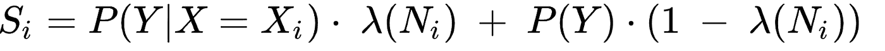
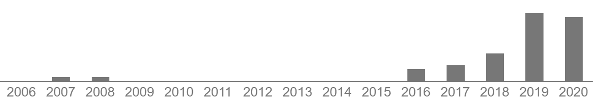
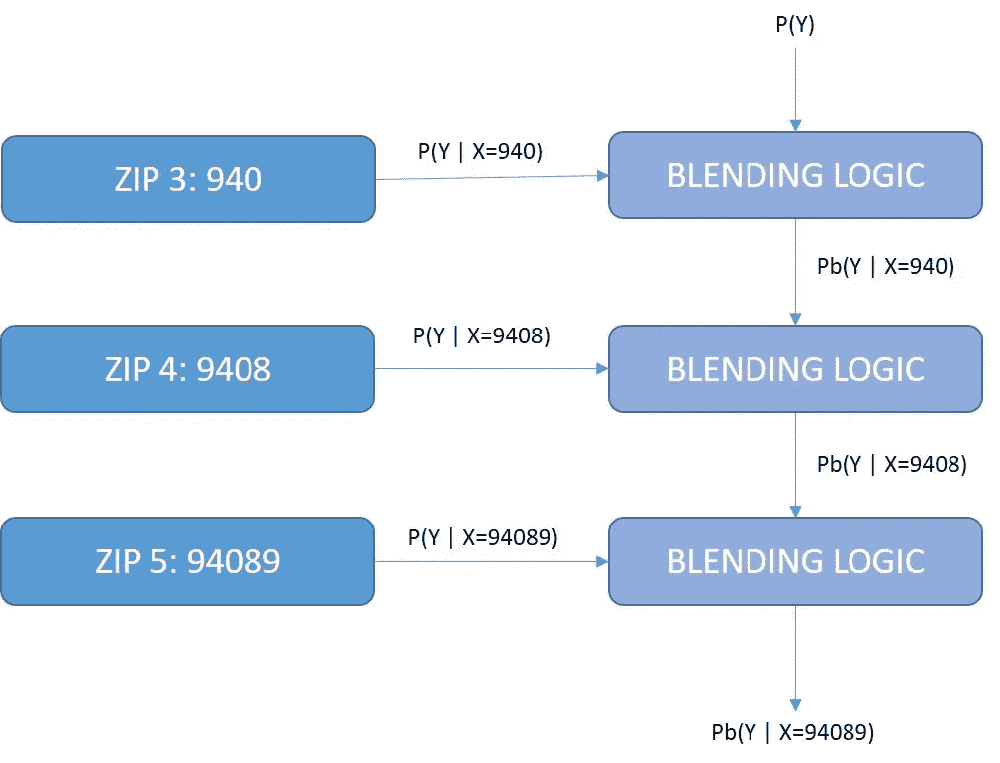

# 扩展目标编码

> 原文：<https://towardsdatascience.com/extending-target-encoding-443aa9414cae?source=collection_archive---------27----------------------->

## [入门](https://towardsdatascience.com/tagged/getting-started)

## 当分类变量具有层次结构时，利用目标编码

由[毛罗·吉利](https://unsplash.com/@maurogigliphoto?utm_source=medium&utm_medium=referral)在 [Unsplash](https://unsplash.com?utm_source=medium&utm_medium=referral) 上拍摄的照片

在这个千年之初，当我的头发黑了很多的时候，我写了一篇名字相当长的小文章，题为“ [*分类和预测问题*](https://dl.acm.org/doi/abs/10.1145/507533.507538) 中高基数分类属性的预处理方案”。这是一篇直截了当的文章，我决定写这篇文章，因为实际需要一种方法来处理难以插入机器学习(ML)模型的数据类型。当时，我正在研究 ML 模型，以检测欺诈性的电子商务交易。因此，我处理的是非常“稀疏”的分类变量，比如邮政编码、IP 地址或 SKU。我找不到一种简单的方法来“预处理”这样的变量，除了传统的[一键编码](https://www.kaggle.com/dansbecker/using-categorical-data-with-one-hot-encoding)，它不能很好地适应处理数百甚至数千个唯一值的情况。当时流行的一种决策树方法，R. Quinlan 的 [C5.0 算法](https://en.wikipedia.org/wiki/C4.5_algorithm)，提供了将单个值集合组合在一起的能力，作为树生成过程的一部分。然而，C5.0 是一种专有算法，因此没有公开用于提出他们称为“离散值子集”的方法。

因此，我想出了自己的非常实用的方法。给定变量的值，我用目标的期望值替换了原始的分类值。这是一种奇特的说法，对于二进制分类问题，我使用了当输入变量 **X** 取值， *Xi 时，在训练数据中观察到的真实目标 *Y* 的比例。然而，该方法也可以很好地扩展到回归问题和多类分类问题。只需将输入替换为当 ***X*** *=Xi* 时目标的*平均值*即可，对于回归模型，或者使用 *N-1* 概率编码用于 *N* 类分类问题。就是这样，或者说几乎是这样，你的棘手的分类变量很容易变成一个更加柔和、信息量更大的连续变量。*

让事情变得复杂的是，在处理基数非常高的输入变量时，许多值可能只有相对较小的样本量。因此，简单地相信目标的统计可能意味着麻烦(即*过拟合*麻烦)。为此，我查阅了一些文献，并采用了一种平滑方法，即将目标的估计值与目标的先验概率(或基线)混合起来。混合由取决于样本大小的参数控制。样本越大，估计值越倾向于给定的目标值***×= Xi*；样本越小，估计值就越倾向于目标的总体基线。**

混合公式:作者图片

上面的公式描述了一种实现“混合”的方式，其中 Ni 是针对 ***X*** *=Xi，*的样本大小，并且λ函数是样本大小的某个单调递增函数。

这篇文章发表在第二份出版物上，ACM SIGKDD 探索时事通讯，这让我非常满意。尽管如此，在那之后，除了作者，似乎没有人注意到它(同行评议文章长尾的命运)。但是随着时间的推移，数据科学在过去的 5 年里达到了第三波兴趣，我注意到一些人向我咨询关于这篇文章的问题。然后，感谢[谷歌学术](https://scholar.google.com/)，我意识到突然之间，这篇文章被其他作者在 ML 文学中引用了——当然，不是大量的引用。尽管如此，在它出版近 20 年后，还是有一些人在读它！

每年的引用量。作者截图，[谷歌学术](https://scholar.google.com/)提供数据

再深入一点，我发现人们已经在 [Python](https://contrib.scikit-learn.org/category_encoders/targetencoder.html) 包中实现了该算法，甚至 [H20](http://docs.h2o.ai/h2o/latest-stable/h2o-docs/data-munging/target-encoding.html) 似乎也支持这种类型的转换。人们甚至给它起了一个名字，实际上是几个名字，比如"**目标编码**"或者"**影响编码**"——这听起来肯定比"*一个针对…的预处理方案要好。*”。

无论如何，我很高兴我写的东西最终对一些人有所帮助。在此期间，我自己也一直在各种用例中使用这个方法，并分享给我的同行和同事。我还回顾了引用我 2001 年文章的一些工作，以了解在什么背景下引用了先前的工作，发现:

*   由 [Yandex](https://yandex.com/) 开发的名为 [CATBOOST](https://catboost.ai/) 的开源 ML 算法利用目标统计来表示分类变量，但提供了一种平滑和避免过度拟合的替代方法。
*   所提出的目标依赖编码被许多作者认为是处理高基数分类变量的基本方法，包括在库恩和约翰逊最近出版的题为“ [*特征工程和选择*](http://www.feat.engineering/#) 的书中
*   各种应用数据科学论文(在[社交媒体](http://www.gidas.at/publications/Ming%20et%20al%202016%20A%20contextualized%20and%20personalized%20model.pdf)、[电商](https://arxiv.org/pdf/1907.09844.pdf)、[信用评分](https://www.researchgate.net/profile/Marcin_Chlebus/publication/340924091_NOVEL_MULTILAYER_STACKING_FRAMEWORK_WITH_WEIGHTED_ENSEMBLE_APPROACH_FOR_MULTICLASS_CREDIT_SCORING_PROBLEM_APPLICATION_Novel_multilayer_stacking_framework_with_weighted_ensemble_approach_for_multiclass/links/5ea4670945851553faaece08/NOVEL-MULTILAYER-STACKING-FRAMEWORK-WITH-WEIGHTED-ENSEMBLE-APPROACH-FOR-MULTICLASS-CREDIT-SCORING-PROBLEM-APPLICATION-Novel-multilayer-stacking-framework-with-weighted-ensemble-approach-for-multiclass.pdf)等。)参考这篇文章，因为这是他们选择的处理分类变量的方法。

虽然我很惊讶地发现了这么多关于使用目标相关编码的参考资料，但我注意到我能够阅读的论文中，无论是各种开源实现，似乎都没有利用论文中提出的一个重要建议:对具有隐式**层次结构**的分类变量的应用。这是描述简单事物的另一个有趣的名字，即高基数分类变量有一种自然的方式以逻辑方式将值“分组”。在 ML 应用中有许多这种变量的例子:

*   邮政编码:当然，在美国，邮政编码不是随机分配给各个地区的。类似的邮政编码通常覆盖邻近或附近的地区。因此，如果我们考虑所有的邮政编码都以相同的 4 位数字开始(ZIP4)，我们将把相邻的编码组合在一起，我们也可以使用 ZIP3。
*   **IP 地址**:虽然有潜在的 **4，294，967，296 个**不同的 IP 地址(由于保留块的原因，实际数量要小一些)，但是它们被设计成一个内置的层次结构:ZZZ.YYY.XXX.NNN，通常它们被保留在连续的块中。因此，我们也可以利用他们的自然分组结构。
*   **行业代码**:[NAICS 系统](https://www.census.gov/eos/www/naics/)为业务类型提供了非常详细的 6 位分类方案，这在各种类型的 ML 应用中非常有用。虽然唯一代码的数量巨大，但 NAICS 代码也是分等级的。NAICS5、NAICS4 直到 NAICS2 代表越来越广泛的业务类别(例如，NAICS2 = 51 表示出版商，而 22 表示公用事业)。

还有许多其他分类变量的例子，它们可以很容易地“累积”到更低的粒度级别，并在模型中使用。然而，这里的要点不是简单地通过使用层次结构“降低”唯一值的数量来减少基数；使用目标编码变得更加有趣…

分层目标编码方案。作者图片

前面我提到了“混合”公式，它控制着“值统计量”(即当 ***X*** *=Xi* 时的目标统计量)和目标的先验概率之间的权重。我们使用目标的无条件先验概率，只是因为我们假设当*P(Y |****X****= Xi)*因样本量小而不可靠时，没有更好的替代方案。然而，当我们有一个可以利用的层次结构时，我们可以查看“父组”的目标统计数据因此，如果邮政编码为 94089 的样本量太小，我们可以将邮政编码为 9409x 的所有记录的目标统计数据考虑在内，这将有望提供更可靠的估计，如果没有，那么考虑 940xx 怎么样？目标编码方法的这种分层版本提供了几个优点:

1.  **可变的、数据驱动的粒度**:回到邮政编码案例，我们可以观察到我们数据集中的一些邮政编码有大量的数据，而其他的则很少。人们可能会考虑 ZIP4 或甚至 ZIP3 聚合来处理许多稀疏的 ZIP5 代码；然而，对于那些人口高度密集的邮政编码来说，这会造成不必要的信息模糊。使用建议的方法，聚合级别实际上是可变的-高频值将使用特定于其值的目标统计数据，而其他值将与其他相关(按层次)代码分组，从而使用更广泛的组统计数据。
2.  **更高的区分度**:根据其标准公式，目标编码可能会产生一个连续变量(实际上是一个离散化的连续变量)，对于该变量，相对大量的情况被映射到目标的先验概率，这是一个“中性”值。对于数值分布高度偏斜或长尾的分类变量来说尤其如此。这是因为低频值的目标估计值将向同一个数字(即目标的先验概率)加权。然而，当我们有一个可用于分类变量的层次结构时，使用这种变化，我们将最终得到一个更加分布式的表示，因为每个稀疏值将与一个潜在不同的目标估计值混合。

在快速发展的数据科学世界中，极其复杂和强大的新算法吞噬着大量的计算能力，这似乎是主导趋势，发明和创造性特征工程的艺术和科学似乎越来越不相关。我经常遇到在线材料或 ML 模型，我看到这些模型是由热情但初级的数据科学家构建的，他们花最少的努力来创建“更好的预测器”——*算法会找出答案*，这是普遍的想法。不要担心为你的模型创建复杂的、领域驱动的预测器——将原始数据交给算法，理想的内部表示将通过学习来创建。事实上，深度学习已经表明，当输入数据具有时空结构时，这是非常正确的——神经网络模型确实创建了非常“深度”的空间特征和抽象。但不幸的是，并不是所有的数据都是由图像、声音、视频组成的。或者，并不总是如此，我们有无数的数据点可以用来训练这些类型的模型。因此，在许多情况下，我仍然相信一个模型的性能可以很大程度上依赖于它的创造者在从原始数据中制造“好的预测器”方面的精明。但是，我以前被证明是错的。

因此，最后，感谢所有发现我 2001 年长篇论文的人，不要忘记查看第 4 节，其中解释了目标编码的层次版本——在某些用例中，绝对值得。