# 扩展 R 中的基本 SIR 模型

> 原文：<https://towardsdatascience.com/extending-the-basic-sir-model-b6b32b833d76?source=collection_archive---------10----------------------->

## 人口更替、疫苗接种和免疫力下降的原因

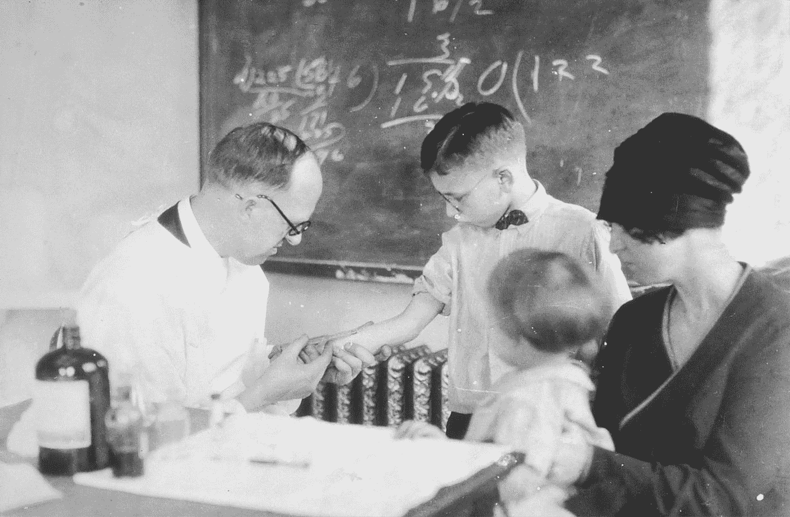

[国家癌症研究所](https://unsplash.com/@nci?utm_source=medium&utm_medium=referral)在 [Unsplash](https://unsplash.com?utm_source=medium&utm_medium=referral) 上拍摄的照片

C 房室模型是一种建模方法，将人群分为不同的“房室”，代表他们的疾病状态和其他可能的特征。这里，数学方程用于模拟不同隔间之间的转换。

## SIR 模型

SIR 模型构成了传染病建模的基础。这是一个分室模型，其中个体属于三个分室中的一个:

*   易感者
*   已感染(一)
*   恢复(R)

这是一个**基于人口的模型**，在这个意义上，每个隔间都模拟了该隔间中平均个体的行为。当然，这是对现实生活场景的过度简化，但实际上有可能在此基础上构建更复杂的模型。

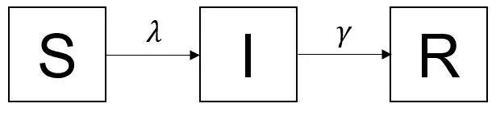

## SIR 模型的假设是什么？

*   同质群体:同一舱室中的个体受到相同的危害
*   混合良好的人群:所有易感人群都有相同的感染风险
*   永久免疫:从疾病中康复的个体是永久免疫的

最后一个假设导致观察到 SIR 模型适用于在模拟期间种群不变且免疫稳定的情况。

这些假设为我们提供了以下一组微分方程:

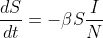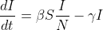

其中 S、I 和 R 分别代表每个隔室中易感、感染和康复个体的数量，N=S+I+R

γ是回收率。β是感染率，即单位时间内继发感染的平均数量。

**基本再现 Number(R₀)**

基本再生数是在完全易感人群中由单一感染病例引起的二次感染的平均数。

对于 SIR 模型，它可以计算为:

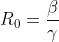

***有效再现数量***

如果易感人群随时间变化，最好使用有效再生数。它是在流行病的给定时间点从感染病例**产生的继发性病例的平均数量。**

***感染之力***

它是个体在单位时间内感染的风险。简单来说，就是作用于易感个体，使其变为感染者的力量。它随时间而变化。在疫情开始时，由于感染者不多，感染的力量会很小，但随着疫情的发展，感染的力量也会增加。

它可以表示为:

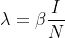

现在，我们可以在上面考虑的等式中代入该表达式，以获得:

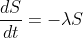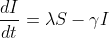

这个模型可以考虑两种情况:

(a)具有常数λ的 SIR 模型

(b)具有变化λ的 SIR 模型

在下面的案例中，我们假设在疫情开始时，只有一个被感染的个体，还没有人康复。

## 基本模型的扩展

这里考虑扩展有:

*   种群周转
*   接种疫苗
*   免疫力下降

这些因子在人群中被称为易感性的**修饰因子。**

## 模拟人口流动

在许多情况下，获得免疫力的人将被完全易感的新生儿取代。因此，考虑简单的 SIR 模型是不现实的。有必要考虑人口的出生和死亡。为简单起见，疾病引起的死亡率被忽略。

这些假设是:

*   每个隔室中的每个个体经历相同的背景死亡率
*   *b* 是新生儿进入易感区间的速率

该扩展将包括出生率 *b* 和死亡率μ，这给出了以下微分方程:

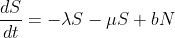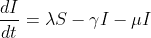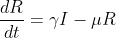

## 模拟疫苗接种效果

设 p 为接种了完全有效疫苗的人口比例。这将反映在初始条件中，因为回收舱中将有一定比例的个体。

等式将给出如下:

在 *t=0* 的初始条件为 *S=(1-p)(N-1)* ， *I=1* ， *R=p(N-1)*

***临界接种阈值***

不是每个人都需要接种疫苗来预防疫情。这是因为一种叫做群体免疫的现象。当群体中有足够的免疫力来阻断传播时，群体免疫据说就实现了。

因此，需要接种疫苗的人口比例(p)可以计算为

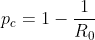

## 模拟免疫力减弱

人们从感染中恢复后可能会获得免疫力，但这种免疫力不会永远持续下去。所以，这些人又变得敏感了。这里，σ是衰减率。

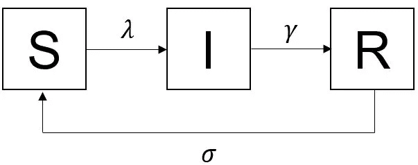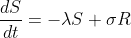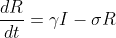

## R 中的 SIR 模型

R 中的 **deSolve** 包包含了求解一阶常微分方程组(‘ODE’)的初值问题的函数。 **ggplot2** 包提供了可视化功能。

***简单先生模型***

最初，我们考虑一个简单的 SIR 模型，具有不同的传染力(λ)。

假设人口规模为 1000000，在流行病开始时，只有一个受感染的个体。还有，传染者平均每 2 天传染一个人，传染 5 天。

所以在这里，β=1/2 day⁻ =0.5 day⁻，γ=1/5 day⁻ =0.2 day⁻

感兴趣的时间段是每天间隔 100 天。

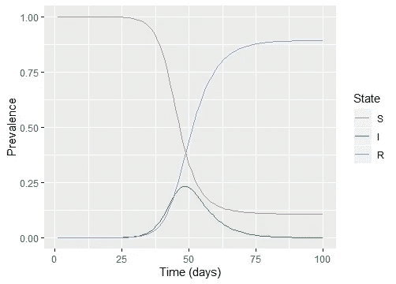

感染在 48 天左右达到高峰。

***SIR 模型扩展为***

假设人口规模随时间保持不变，即 10⁶,so *b* =μ。背景死亡率是根据人类平均寿命计算的，比如说 70 岁。所以，μ=1/70 year⁻，b=1/70 year⁻。还有，β=0.4*365 year⁻，γ=0.2*365 year⁻。

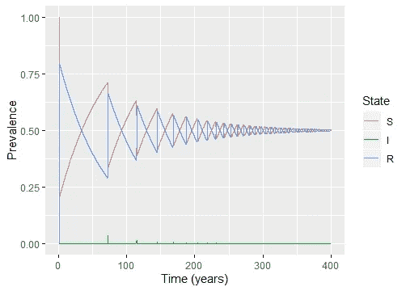

易感人群的患病率曲线有高峰，其间有很长的低谷。我们还观察到，当易感人群达到最大值时，感染达到峰值。

***接种疫苗的影响***

假设 40%的人口接种了疫情疫苗。假设γ=0.1 day⁻，β=0.4 day⁻。该模型运行时间为 3 年。

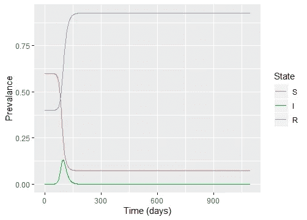

40%疫苗覆盖率的患病率图

我们从上面的图中观察到，即使有 40%的人接种了疫苗，仍有约 12.5%的人感染了这种流行病。

在这种情况下，临界疫苗接种阈值为 0.75。因此，75%的人口需要接种疫苗来预防这种流行病。

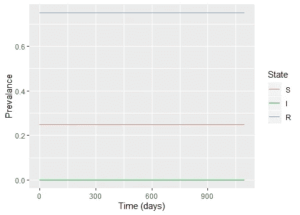

75%疫苗覆盖率的流行率图

从上面的图中我们观察到流行病没有发生。

***免疫力减弱***

假设γ=0.2 day⁻，β=0.4 day⁻，递减率，平均免疫期取 10 年，σ=1/10 year⁻。该模型每天运行 50 年。

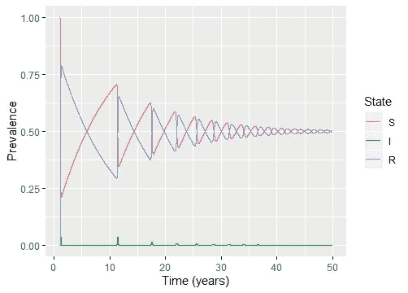

流行率曲线看起来类似于人口流动的情况。虽然在人口更替的情况下，新的易感者的来源是出生，但在这种情况下，来源是失去免疫力的个人。

结合所有这些机制，它可以帮助解决决策者提出的关于接种疫苗的人口比例、接种频率等问题。这些真实世界的情况需要更复杂的模型，但是潜在的动力是相同的。

在下一篇文章中，我们将看到如何在 SIR 模型中模拟干预的效果:)

*参考文献*

*   Soetaert，K. E .，Petzoldt，t .，& Setzer，R. W. (2010 年)。解 R 中的微分方程:包 deSolve。*统计软件杂志*， *33* 。
*   https://www . coursera . org/specializations/infectious-disease-modeling