# 广泛的 EDA 和对客户订阅(应用程序)的预测分析。

> 原文：<https://towardsdatascience.com/extensive-eda-and-prediction-on-customers-subscription-on-an-application-analysis-2d7b0daff6aa?source=collection_archive---------70----------------------->

## 本文解释了应用于预测客户是否订阅应用程序的高级功能的各种数据科学方面。

我们有一个数据集，其中包含有关用户的详细信息，并显示特定用户是否注册了该应用程序的高级版本。我们将使用这个数据集来确定数据集中隐藏的各种见解，并使用这个数据集来建立一些机器学习模型。

让我们从导入数据集开始这个过程。

```
import pandas as pd
df=pd.read_csv("customer application subscription.csv")
df.head()
```

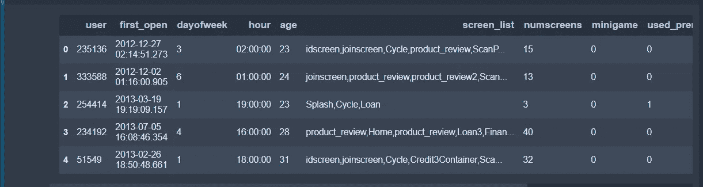

数据集的前五条记录

在加载数据集之后，我们现在要写一些行来了解数据集的总体情况。

```
print("\t\t\tDataset Statistics")
print("Number of variables:-",len(df.columns))
print("Number of observations:-",df.shape[0])
print("Missing Values:-",df.isna().sum().sum())
print("Missing Values %:-",round(df.isna().sum().sum()/df.shape[0]*100,3))
print("Duplicate rows:-",df[df.duplicated(keep="first")].shape[0])
print("Duplicate rows%:-",round(df[df.duplicated(keep="first")].shape[0]/df.shape[0]*100,3))
print("Variable types:-")
a=pd.crosstab(df.dtypes,columns="Count")
for i in pd.crosstab(df.dtypes,columns="Count").index:
    print("\t",str(i).split()[0],a.loc[i][0])
```

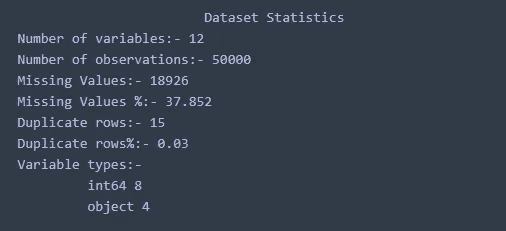

关于数据集的信息。

如果我们查看数据集，我们会发现缺失值只出现在**登记日期**列的**中。**因为在 50000 个条目中只有 0.03%的重复行，所以我们不会删除它们，因为这不是必需的。

现在我们将把 **first_open** 列转换成 datetime 格式，因为它是 object 类型。 **first_open** 列指定首次登录 app 的日期和时间。

```
df["first_open"]=pd.to_datetime(df["first_open"])
df['first_open_date'] = [d.date() for d in df['first_open']]
df['first_open_time'] = [d.time() for d in df['first_open']]
df=df.drop("first_open",axis=1)
```

由于我们已经从 **first_open** 列中获取了日期和时间，所以我们可以看到在日期内首次使用 app 的趋势。

```
a=pd.crosstab(index=df["first_open_date"],columns="count")
from datetime import datetime, timedelta
import matplotlib.pyplot as plt
import seaborn as sns
sns.set_style('darkgrid')
import numpy as np
%matplotlib inline
x =  np.arange(datetime(2012,11,23), datetime(2013,7,10), timedelta(days=1)).astype(datetime)
y = a["count"]
y_mean = [a["count"].mean()]*len(x)
fig,ax = plt.subplots(figsize=(17,12))
ax.set_xlabel("Month",fontsize=20)
ax.set_ylabel("Count",fontsize=20)
ax.tick_params(labelsize=15, labelrotation = 20, color ="k")
data_line = ax.plot(x,y, label='Data')
mean_line = ax.plot(x,y_mean, label='Mean', linestyle='--')
legend = ax.legend(loc='upper right')
plt.show()
```

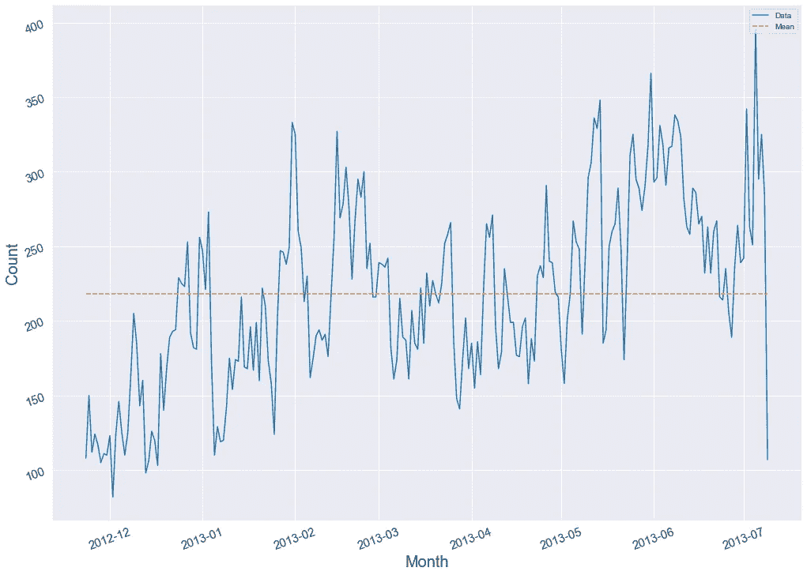

首次使用该应用程序的趋势

正如我们从图表中看到的，应用程序的使用波动很大。这可以得出结论，原因可能直接涉及到应用程序，如应用程序的推广等。而不是外部因素，因为它不会有太大的影响。

现在我们将从 **dayofweek** 专栏中看到一些见解。我们不会关注 **first_open_time** ，因为从那里找不到任何见解。

```
import seaborn as sns
sns.set_style('darkgrid')
ct=pd.crosstab(df["dayofweek"],columns="Count")
stacked = ct.stack().reset_index().rename(columns={0:'value'})
g=sns.barplot(x=stacked.dayofweek, y=stacked.value)
plt.title("Count of On which day user logon")
```

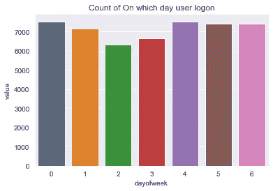

这里，在 dayofweek 中，唯一值解释了以下内容:

*   1:星期一
*   2:星期二
*   3:星期三
*   4:周四
*   5:星期五
*   6:星期六
*   0:周日

该图解释了应用程序的最小使用量在星期二，最大使用量在星期四。

现在让我们分析一下**小时**列

```
ct=pd.crosstab(df["hour"],columns="Count")
plt.figure(figsize=(12,12))
plt.tick_params(labelsize=15, labelrotation = 90, color ="k")
stacked = ct.stack().reset_index().rename(columns={0:'value'})
g=sns.barplot(x=stacked.hour, y=stacked.value)
```

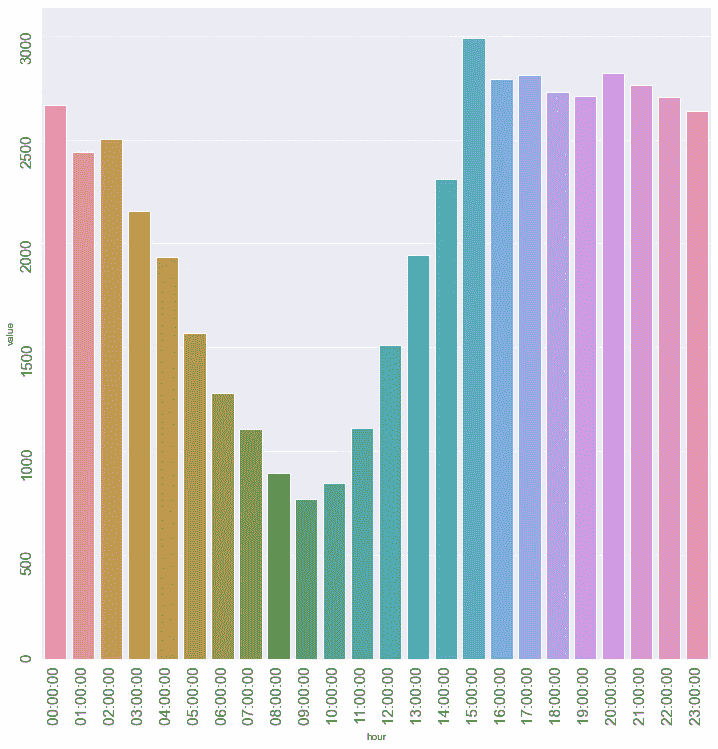

超过 24 小时的应用程序使用情况

正如我们在这张图表中看到的，用户在上午 9 点左右使用应用较少，而在下午 3 点左右使用最多。

再来看**年龄**一栏。

```
df["age"].describe()
```

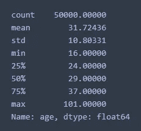

基本概念**年龄**栏目

```
plt.hist(df["age"],edgecolor="black",bins=7)
plt.show()
```

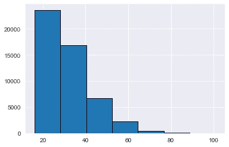

**年龄直方图**列

这表明 75%的用户年龄在 37 岁以下。这意味着制造商和公司应该迎合需求，把 37 岁以下的人作为目标受众。

其他列有:- **screen_list** :描述客户看到的屏幕， **numscreens** :用户观看的屏幕数量， **minigame** :如果客户玩了应用程序中包含的迷你游戏，则 1 else 0， **used_premium_feature** :如果用户使用了应用程序的高级功能，则 1 else 0， **enrolled** :如果用户购买了高级功能，则 1 else 0，

**我们现在将分析上面的列**

```
groupedvalues=df.groupby('dayofweek')["numscreens","minigame","used_premium_feature","enrolled","liked"].sum().reset_index()
attributes=list(groupedvalues.columns)[1:]
att=attributes[1:]
for i in att:
    print(i)
    sns.countplot(df[i])
    plt.show()
```

**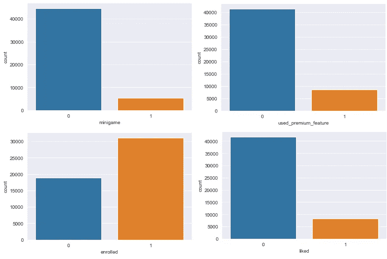**

**基于 **dayofweek** 列，让我们看看其他列的行为:**

```
for i in attributes:
    print(i)
    sns.barplot(x="dayofweek",y=i,data=groupedvalues)
    plt.show()
```

**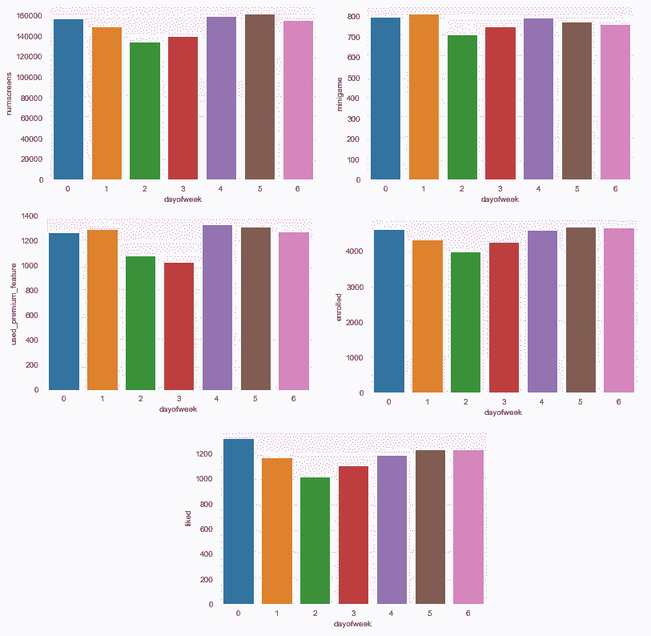**

****星期几**对比其他栏目**

**基于**小时**列，让我们看看其他列的行为**

```
for i in attributes:
    print(i)
    plt.figure(figsize=(12,12))
    plt.tick_params(labelsize=15, labelrotation = 90, color ="k")
    sns.barplot(x="hour",y=i,data=groupedvalues2)
    plt.show()
```

**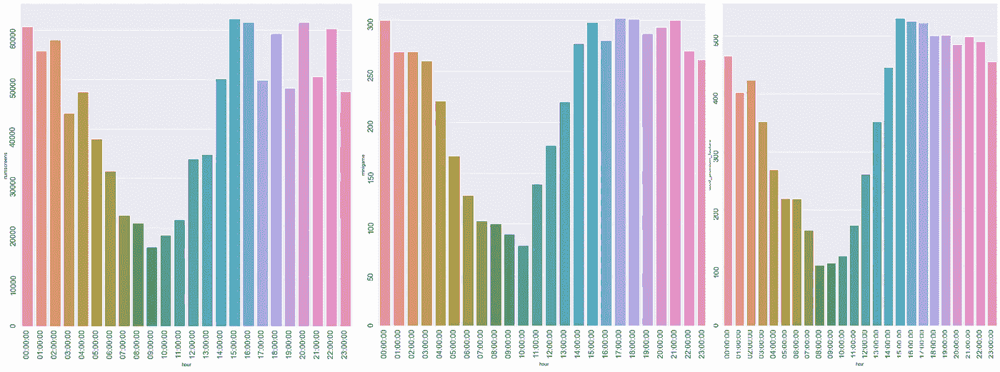****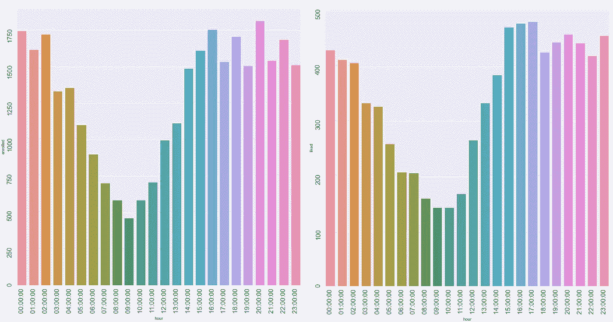**

****小时** vs 其他栏目**

**通过这些图表，我们可以肯定地分析用户在白天的不活动性，因为大多数用户不得不执行其他任务，而不是使用这个应用程序。这可以进一步意味着可以在应用程序上执行的所有促销活动可以在下午完成，因为大多数用户在这个时间是活跃的。**

**让我们根据年龄来分析应用程序的使用情况。由于在 50000 条记录中有许多独特的年龄，我们将使用基于“年龄组”的可视化其他列的方法。**

```
groupedvalues3=df.groupby(pd.cut(df['age'], np.arange(15, 106, 10)))["numscreens","minigame","used_premium_feature","enrolled","liked"].sum().reset_index()
for i in attributes:
    print(i)
    plt.figure(figsize=(12,12))
    plt.tick_params(labelrotation = 45)
    sns.barplot(x="age",y=i,data=groupedvalues3)
    plt.show()
```

**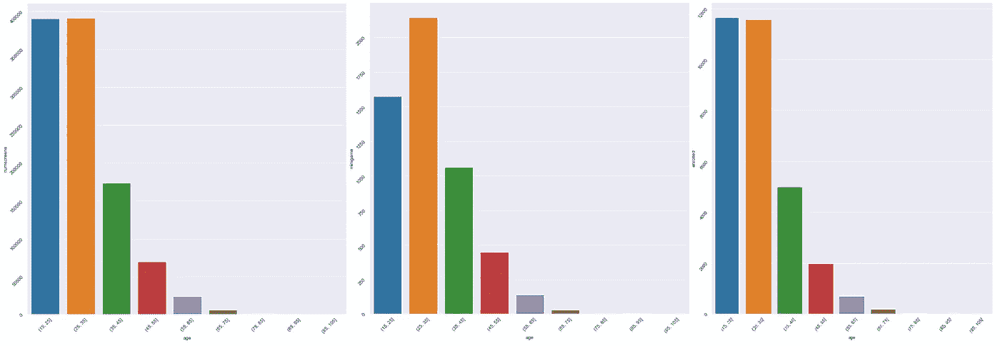****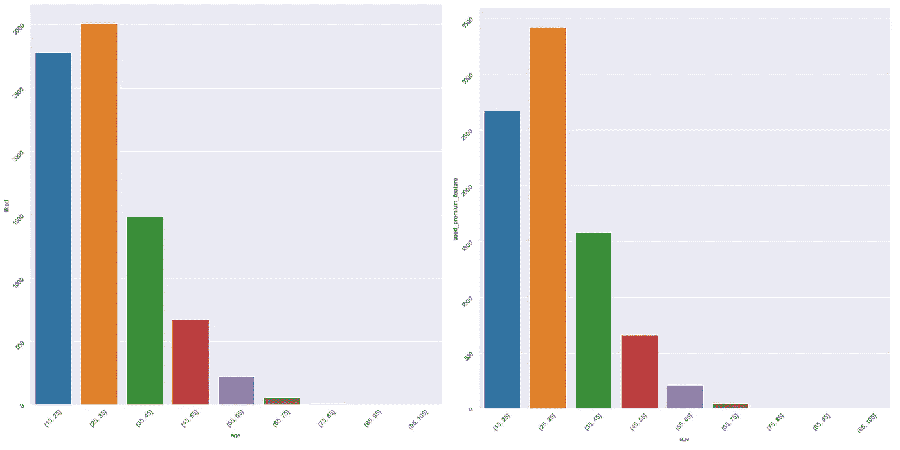**

****年龄组** vs 其他栏目**

**在这些图表中，我们可以分析出，尽管 75%的观众年龄在 37 岁以下，但最活跃的年龄组在 15-35 岁之间。**

**由于我们执行了 EDA，我们将继续进行特性选择。**

**寻找各种特征之间的相关性:**

```
for i in df.index:
    x = df.at[i , 'hour']
    y = x[0:3]
    df.at[i , 'hour'] = y
df["hour"]=df["hour"].astype('int64')
import seaborn as sns
df2 = df.drop(['user',  'enrolled_date'], axis = 1)
sns.heatmap(df2.corr(), annot = True)
```

**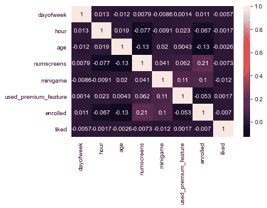**

**各种特征之间的相关性**

```
df3 = df2.drop(['enrolled'], axis = 1)
plt.figure(figsize=(8,8))
sns.barplot(x=df3.corrwith(df2.enrolled).index,y=df3.corrwith(df2.enrolled))
plt.tick_params(labelsize=15, labelrotation = 45)
```

**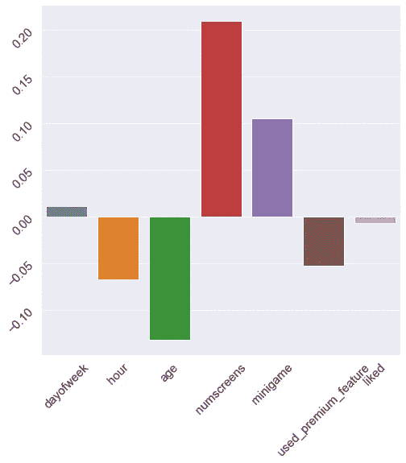**

**关于**登记的**列的各种特征之间的相关性**

**上图显示小时、年龄、迷你游戏(负相关)、numscreens、迷你游戏(正相关)可以考虑建模。**

**在所有这些分析之后，我们将返回我们的数据框架，以便找到用户注册应用程序所花费的总时间。**

```
df=pd.read_csv('data.csv')
df["first_open"]=pd.to_datetime(df["first_open"])
df["enrolled_date"]=pd.to_datetime(df["enrolled_date"])
df['time_to_enrolled']=(df.enrolled_date - df.first_open).astype('timedelta64[h]')
import matplotlib.pyplot as plt
plt.figure(figsize=(6,6))
plt.hist(df['time_to_enrolled'].dropna(), range = (0,100))
plt.show()
```

**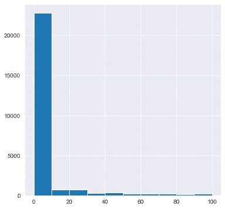**

**注册高级功能所需时间的直观表示。**

**正如我们在此直方图中看到的，50 小时前的详细信息是好的，因为其他信息是异常值，会影响模型，因此我们认为客户已注册为 0。**

```
df.loc[df.time_to_enrolled > 50, 'enrolled'] = 0
```

****屏幕列表**可能是一个非常有用的列，因为它可以用于建模目的。但是这个列是一个字符串。因此，为了使用它，我们需要对这个列进行编码，这将花费很多时间，因为它必须处理大约 50000 个字符串。**

**在继续之前，我们需要另一个包，即“mlxtend”包。为了安装它，请在 cmd/Anaconda 提示符下使用以下命令行:-**

```
pip install mlxtend
```

**在这之后写下下面几行:**

```
for i in range(len(df["screen_list"])):
    df["screen_list"][i]=df["screen_list"][i].split(',')
from mlxtend.preprocessing import TransactionEncoder 
transactionEncoder = TransactionEncoder()
txnn=transactionEncoder.fit(df["screen_list"]).transform(df["screen_list"])
dfnn=pd.DataFrame(txnn,columns=transactionEncoder.columns_)
df=df.join(dfnn, how="outer")
from sklearn.preprocessing import LabelEncoder
le=LabelEncoder()
l=list(transactionEncoder.columns_)
for i in l:
    try:
        df[i]=le.fit_transform(df[i])
    except:
        pass
```

**由此，我们将转换数据集，并仅选择模型所需的那些特征，如上所述。**

```
a1=df[["hour","age","numscreens","used_premium_feature","minigame"]]
for i in df.index:
    x = a1.at[i , 'hour']
    y = x[0:3]
    a1.at[i , 'hour'] = y
a1["hour"]=a1["hour"].astype('int64')
a2=df[transactionEncoder.columns_]
a1=a1.join(a2, how="outer")
X=a1
Y=df["enrolled"]
from sklearn.model_selection import train_test_split
xtrain,xtest,ytrain,ytest=train_test_split(X,Y,test_size=0.3,random_state=42)
```

**现在我们的数据要通过模型。让我们尝试通过各种 ML 模型来传递我们的模型。**

1.  **逻辑回归:**

```
from sklearn.linear_model import LogisticRegression
le=LogisticRegression(random_state = 42, penalty = 'l1')
le.fit(xtrain,ytrain)
le.score(xtest,ytest)
```

**运行代码后，我们得到以下分数:**

```
0.868
```

**我们从这个数据集中得到了一个令人印象深刻的分数。让我们从训练集中检查是否存在过度拟合的情况。**

```
le.score(xtrain,ytrain)
```

**运行代码后，我们得到以下分数:-**

```
0.8619428571428571
```

**似乎不存在过度拟合的情况**

**2.决策树分类器
我们将使用 GridSearchCV 进行超参数调优**

```
from sklearn.tree import DecisionTreeClassifier
from sklearn import metrics
from sklearn.model_selection import GridSearchCV
tuned_parameters = [{'criterion': ['gini','entropy'],
'max_depth': range(2,10)}]
clf_tree = DecisionTreeClassifier()
clf = GridSearchCV(clf_tree,
tuned_parameters,
cv=10,
scoring='roc_auc')
clf.fit(xtrain, ytrain )
```

**要查找参数:-**

```
clf.best_params_
```

**这是我们得到的。**

```
{'criterion': 'entropy', 'max_depth': 7}
```

**所以我们会用它来找到分数。**

```
clf_tree2 = DecisionTreeClassifier(criterion = 'entropy',
max_depth = 7 )
clf_tree2.fit( xtrain, ytrain )
tree_predict2 = clf_tree2.predict( xtest )
metrics.roc_auc_score( ytest, tree_predict2 ) 
```

**收到以下分数:**

```
0.8662688484194627
```

**同样，我们也可以使用其他 ML 模型。这是我的第一篇文章，非常感谢您的宝贵反馈。谢谢，祝编码愉快！**

**笔记本链接:-[https://github . com/luv 8860/Projects/blob/master/Customer % 20 application % 20 subscription . ipynb](https://github.com/luv8860/Projects/blob/master/Customer%20application%20subscription.ipynb)**

**数据集链接:-**

**[https://github . com/luv 8860/Projects/blob/master/customer % 20 application % 20 subscription . CSV](https://github.com/luv8860/Projects/blob/master/customer%20application%20subscription.csv)**