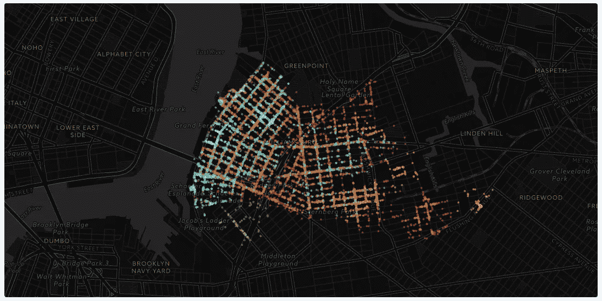
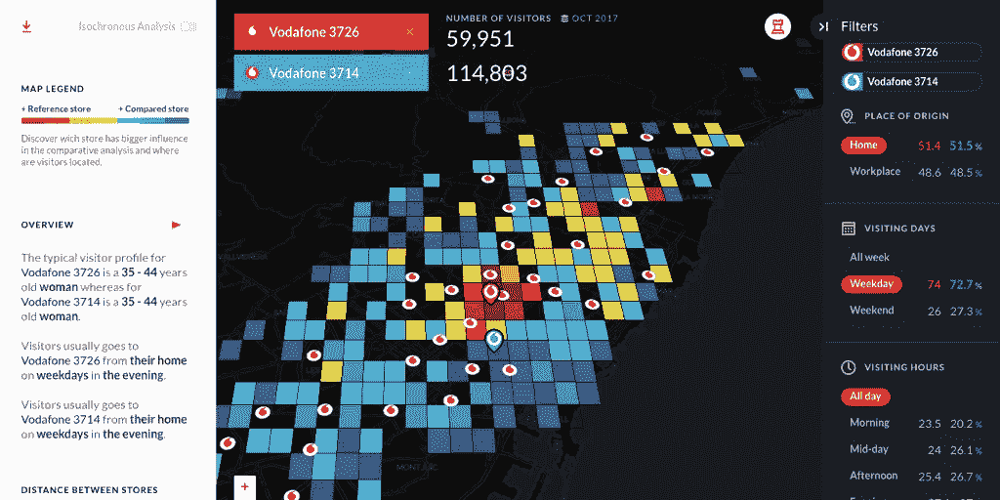
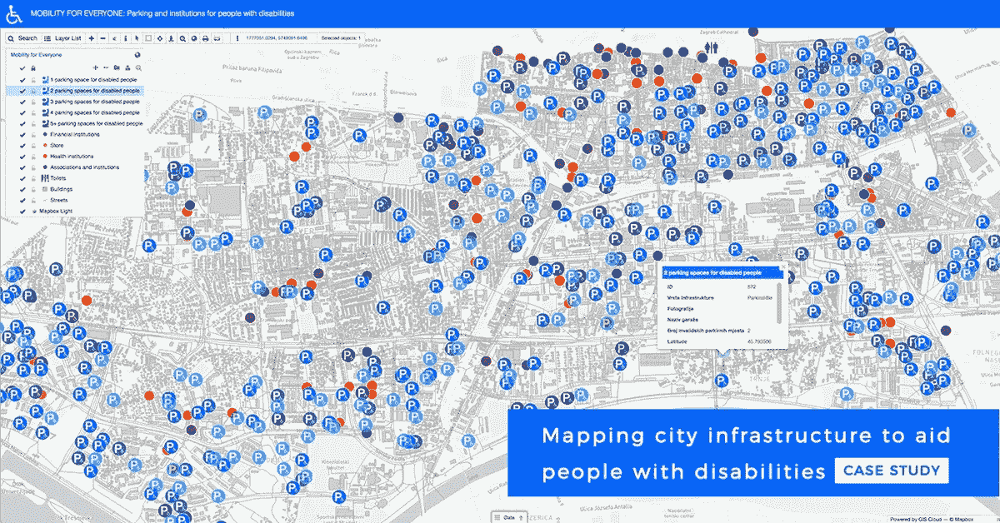
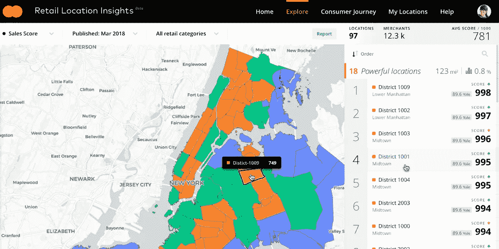
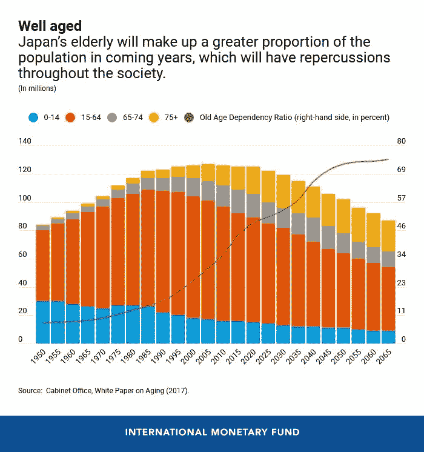
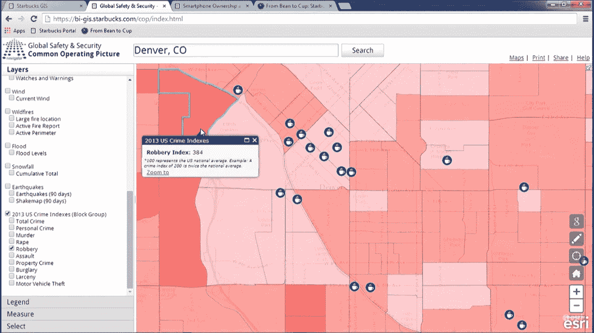
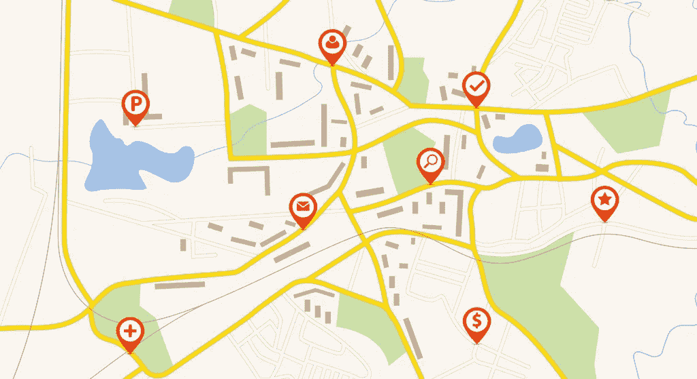

# 外部地理空间数据:类型和用例

> 原文：<https://towardsdatascience.com/external-geospatial-data-types-and-use-cases-7131e9a1ee24?source=collection_archive---------16----------------------->

## 不同地理空间数据流、其类型和使用案例的详细回顾

来源:Kepler.gl

> *“你有没有一些外部数据源，我们可以添加到我们的分析中？”*

我们的客户提出这样的问题对我们来说并不罕见或陌生。

# 什么是外部数据？

内部数据主要是在组织的生态系统中生成的信息，包括客户交易数据、人力资源数据等。

一个单一的数据来源可能并不总能捕捉到全貌。外部地理空间数据流是指可以从其他组织公开托管的数据门户中找到和收集的数据(交易数据、人口统计数据等)。

与特定地理位置周围的人的富裕程度、人口统计、生活方式和移动模式相关的数据属于替代数据，除了与公司相关的数据(如 CRM 信息)之外，这些数据还有助于组织更好地了解他们的客户。

外部数据是*衍生的*数据，不易获取。然而，如今世界上的顶级组织正在利用外部数据来获得更深入、更新的见解，以保持领先地位。

根据 B2B 研究公司 [Clutch](https://clutch.co/) 的调查，公司在收集和分析数据时最常关注的是他们的组织内部数据(70%的时间)。

如果你是:

*   一家零售公司询问“我们如何找到 X 处人们的收入数据，以用于他们的扩张目的”或
*   一家保险公司询问“我们如何准确定位易受自然灾害影响的区域，以集中我们的营销策略？”或者
*   一家食品配送公司或一家餐馆公司询问“我们能否使用天气数据来预测降雨，以便更好地应对需求下降？”

这是给你的博客。我们意识到了外部数据所包含的价值，因此集思广益，研究这些外部数据如何为在混乱多变的现实世界中运营的各种行业所用。

来源:沃达丰

> 了解商业与空间的关系，了解事情在哪里发生，为什么会发生，以及未来会在哪里发生以及如何发生，将成为未来规划的重要工具

# 外部数据的示例

下面，我们将讨论外部数据源的不同例子及其用例。

# 人类流动性

人类的流动性在揭示人类行为模式和个人习惯方面发挥着巨大的作用。在物理空间中，人的移动性主要是指人的运动轨迹。人体移动数据的数据源主要是 GPS 数据、手机发射塔数据、WiFi 数据。

人的移动性有助于洞察移动的空间分布、用户角色的创建、公共交通的使用、可步行性水平以及一个地区的污染排放。

通过绘制停车点地图改善残疾人的行动能力[【来源】](https://www.giscloud.com/blog/mapping-handicap-parking-and-other-assets-to-improve-the-mobility-of-people-with-disabilities-case-study/)

# 类型

各种人员流动数据的分离如下:

*   **原始数据:**设备经纬度
*   **活动相关**:参观人数
*   **家和工作:**居民和工人数量。

人员流动可以从两个方面帮助组织:

1.  **周围人口/平均客流量**:跟踪实时客流量有助于清楚了解一天内一个地区的平均预期人口。
2.  **公路/铁路连接**:这给出了一个特定地区人口通常如何流动的概念。这可以显示特定区域的道路密度或铁路连通性。

# 用例

组织经常利用的人员移动数据的一个有趣用例是使用实时人员流量数据在正确的位置放置广告牌。

人员流动数据也被用来管理微观流动的涌入。例如，在纳什维尔大都市，市政官员正在将地理空间数据与移动数据相结合，以更好地了解车辆的集中程度，然后将固定车辆重新分配到居民生活的区域，而不是让更多的车辆上路。[ [来源](https://www.govloop.com/scooters-begone-or-be-regulated-with-gis/)

[KeyMe](https://www.key.me/) ，一家致力于使用机器人技术革新锁匠行业的技术公司，使用实时步行交通模型进行选址。由于利用了位置数据，新安装的信息亭群组的平均收入比之前安装的信息亭增加了 52%*。*

# *经济/金融数据*

*地理空间分析在银行业中扮演着非常重要的角色，尤其是对于金融服务提供商而言。银行的内部数据与地理空间数据相结合，提供了帮助他们扩展业务以及更好地服务客户的见解。*

*经济发展水平是许多企业扩张活动的指标。人们的收入和富裕程度(即购买力)有助于公司确定应该向特定地区的居民提供哪些品牌或商品。*

*万事达卡有助于组织更好地了解不同地区的消费趋势。该解决方案提供了对总月销售额、平均门票大小、交易总数、性能稳定性和随时间增长的性能的洞察。[ [来源](https://carto.com/blog/carto-mastercard-partnering-location-intelligence-solution/)*

**

*万事达卡的零售位置洞察[【来源】](https://carto.com/blog/carto-mastercard-partnering-location-intelligence-solution/)*

# *类型*

*富裕程度和收入水平可以通过以下参数得出:*

1.  ***基础设施**:一个区域内建筑的平均面积或居住在特定周边的人口数量。*
2.  ***兴趣点:**给定客户可以进入的区域中的自动取款机、商店、餐馆、综合商店的数量*
3.  ***竞争优势:**业务活动和发展可以被跟踪，从而让你深入了解你当前客户群中的竞争对手是谁。*

*房产贷款是根据周围商业房产价值的信息进行评估的，并且对贷款偿还的风险和概率有很好的了解。*

*星巴克利用这些因素来规划他们的下一个商店位置。您可以在此阅读更多信息:*

* [## 使用位置数据的场地规划

### 星巴克如何使用地理信息系统来规划他们的下一个商店位置

medium.com](https://medium.com/locale-ai/site-planning-using-location-data-ae7814973521) 

# 用例

利用不同地区的富裕程度和收入水平，企业还可以确定他们应该扩展的领域。在肯尼亚，移动网络运营商正在与银行合作，创建通过移动货币交付的数字金融服务。[ [来源](https://i2ifacility.org/system/documents/files/000/000/030/original/i2i_brief_7_applications_of_GIS_data_by_FSPs.pdf?1509778566)

这里有一个简短的视频，旨在了解金融数据和地理空间数据在一起使用时如何帮助银行业的日常活动。

# 人口统计数据

人口统计数据帮助我们描述和量化一个地区的人口特征。它可以在空间上突出显示有助于回答战略性业务问题的模式。

分析一个地区的人口统计数据有助于我们找到一些挑战性问题的答案，比如——一个地方的人口年龄有多大？一个地方的人口受教育程度如何？人口是如何随着时间变化的？

# 类型

突出一个地方的人口统计的两个主要因素如下:

1.**年龄/性别:**有助于了解属于特定年龄/性别群体的人口百分比。

2.**居住人口:**给出居住在特定区域的估计人数。

国际货币基金组织的信息图显示了日本人口的变化[【来源】](https://www.imf.org/en/News/Articles/2020/02/10/na021020-japan-demographic-shift-opens-door-to-reforms)

# 用例

任何数据驱动的营销策略的最终成功都取决于组织收集正确数据的能力，以及他们如何利用人口统计和位置数据的组合。酒店和旅游等行业严重依赖于人口趋势。

酒店公司可以识别出对旅游服务需求最大的国家。这有助于他们将营销预算投入到这些地区的消费者中[ [来源]](https://datafloq.com/read/location-demographic-data-essential-role-marketing/6395)

[。id](https://home.id.com.au/) 是一家专注于经济、人口和人口预测的公司，该公司帮助学校规划者放大并确定未来十年学龄儿童增长的郊区。这有助于学校规划者根据当地人口的平均年龄战略性地确定学校类型(游戏学校、高中等)。

Orbital Insights 与联合国开发计划署[的](https://www.undp.org/content/undp/en/home.html)[阿拉伯人类发展报告](http://www.arab-hdr.org/)团队合作，致力于消除贫困和减少不平等，主要关注埃及开罗的贫民窟居民。

位置数据(来自智能手机的聚合位置数据)与贫民窟边界数据相结合，提供了关于设备聚合行为的见解，进而提供了关于居住在该边界内的人口的信息。

# 环境/天气数据

QGIS 分析。[ [来源](https://www.youtube.com/watch?v=5QBBCN3j3RA&t=409s)

天气/环境数据在房地产、物流、送餐和共享经济等行业中发挥着战略作用。天气/环境数据与内部数据相结合，可以提供帮助组织为其业务采取适当措施的模式。

食品科技公司 Deliveroo 利用天气数据及其内部数据来处理极端天气条件下的需求波动。他们让自己为任何条件的变化做好准备，即使只是一毫米的雨。[【来源](https://www.computerworld.com/article/3427628/how-deliveroo-uses-data-to-deliver-food-whatever-the-weather.html)

> 天气是美国经济中最大的外部波动因素，每年造成超过 5500 亿美元的收入损失和多达 76，000 个工作岗位的流失。

天气灾害风险指数等参数在房地产行业中起着非常重要的作用。高风险区域的房产通常会升值。

在共享经济(优步/Airbnb)中，对服务的需求会随着天气条件的突然变化(突然下雨、狂风暴雨)而波动。价格也会飙升，以满足现有的需求，并分别平衡司机和乘客的需求和供应。

# 类型

卫星图像是根据一天中可以使用它们的时间以及它们最佳运行所需的适当条件进行分类的。它们有以下三种类型:

*   **可见:**可见卫星图像只有在白天才能看到，因为云层会反射太阳光。它们对预测雷雨云的形成很有用，因为在雷达探测到雷雨云之前，云就可以通过白色识别出来。
*   **红外线:**红外线卫星图像相对于可见光卫星图像的一个优势是它们在白天和晚上都可以被看到。使用红外图像可以探测到雾天和低云。
*   水汽:水汽卫星显示了大气中的水分含量。它们被广泛用于预测哪里可能会有暴雨。

# 用例

我们在[现场](http://locale.ai/)喜欢的一个有趣的卫星数据是夜灯——这是一个地区经济增长和发展的良好代表。美国国家航空和宇宙航行局拍摄了夜灯，每天测量非常细微的区域的夜间活动。如果你想分析不同城市的发展速度，或者你应该扩展到哪个城市，nightlights 是一个强大的数据源。

高质量的卫星图像正被广泛用于预测作物产量和土地覆盖分类。不仅如此，卫星图像还用于遥感，帮助组织在农业服务、小额信贷服务和离网能源传输方面更好地服务于农村地区。卫星图像还被用于灾后损失评估。使用变化检测(事前和事后)的基于对象的图像分类是获得损害评估的快速方法。

在商业空间，卫星图像被用于许多目的。一个有趣的用例是如何通过计算停车场中停放的汽车数量来预测零售店的盈利能力[ [来源](https://emerj.com/ai-sector-overviews/ai-applications-for-satellite-imagery-and-data/)

# 兴趣点

兴趣点是一个专用的地理实体，如礼拜场所、遗址或公司办公室。POI 数据最常用于评估位置和分析公众的行为趋势。企业也可以用它来监控网站的位置和竞争对手的一些营销策略。

组织使用位置智能进行选址，以确定具有市场潜力的区域。通过跟踪他们感兴趣领域的过去和现在的活动，公司可以决定哪些商店是盈利的，哪些商店的市场份额相对较少。

兴趣点有最通用的用例。旅游机构可以使用它们来突出显示城市内外的景点和活动，大学可以使用它们来为学生和游客定位校园位置，或者个人可以在谷歌地图中设置自己的兴趣点，如“工作”或“家”，以便于导航。

# 用例

Orbital Insights platform GO 通过在单个加油站的粒度级别跟踪天然气需求，帮助推动加油站的选址。不仅如此，关于兴趣点的数据也可用于物流优化。

[Esri](http://esri.com/) 帮助物流公司进行路线规划，方法是增加路线上的配送数量，并将车队引导至沿途有加油站的路线。

*

# *来源*

*这里有几个来源可以找到各种类型的外部数据。您可以在互联网上找到许多其他外部开放数据来源。*

1.  *【https://bit.ly/2HGFzUX】人口流动数据:*
2.  ***金融/经济数据**:[https://data.worldbank.org](https://data.worldbank.org/)*
3.  ***人口统计数据**:[https://data.gov.in/keywords/population](https://data.gov.in/keywords/population)*
4.  ***环境数据**:[https://www.data.gov/weather/](https://www.data.gov/weather/)*
5.  ***兴趣点数据**:[http://www.poi-factory.com/](http://www.poi-factory.com/)*

*不同数据源与地理空间数据的结合正帮助组织找到一些复杂问题的解决方案，并做出数据驱动的决策。这听起来可能令人吃惊，但一些看似没有影响的因素可能有助于弥合差距，也有助于扩大组织的业务。*

*如果你想深入研究，可以查看我们的[网站](https://www.locale.ai/)或者在 [LinkedIn](https://www.linkedin.com/in/aditi-sinha-6b774ba9/) 或 [Twitter 上与 Aditi Sinha 取得联系。](https://twitter.com/aditi1002)*