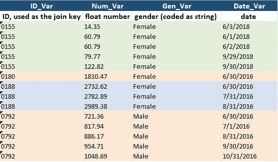
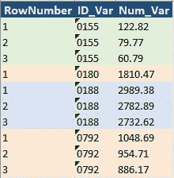
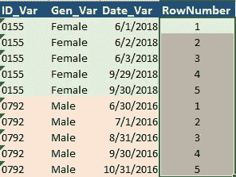
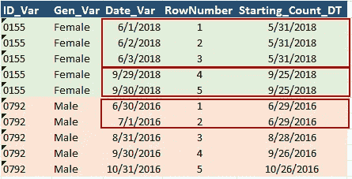
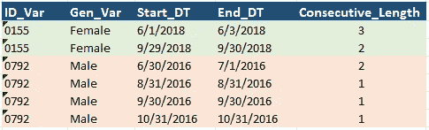
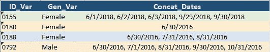

# 每个数据科学家都应该知道的额外 4 个 SQL 技巧

> 原文：<https://towardsdatascience.com/extra-4-sql-tricks-every-data-scientist-should-know-d3ed7cd7bc6c?source=collection_archive---------3----------------------->

## 充分利用 SQL 加快分析工作的第 2 部分

在我之前的博客[每个数据科学家都应该知道的 6 个 SQL 技巧](/6-sql-tricks-every-data-scientist-should-know-f84be499aea5)中，我讨论了在我作为数据科学家的日常工作中最有用的 SQL 功能。这个博客是这个迷你系列的第 2 部分，我将继续分享我的 SQL 技巧来帮助你提高你的分析/报告效率。

今天，我们将使用一个新的玩具表，如下所示，包含多种数据类型，出于演示目的，该练习将在 MS SQL server 2017 中实现。

玩具数据表(带有变量定义)

1.  **ROW_NUMBER()返回行的子集**

SQL 中的 ROW_NUMBER()函数为结果的每一行创建一个唯一的递增整数值。这一列值被认为是一个**伪** - **列**，因为它本身并不存在于我们的数据表中，因此，结果是按照 ORDER BY 子句中分析师确定的顺序返回的。

有了这个伪列，我们可以使用一个简单的查询来解决“前 N 名”的问题，下面演示了如何为每个 ID 选择 Num_Var 值最高的前 3 条记录，

下面是返回的子集(当然，您可以从输出中删除列 RowNumber)，

输出:Num_Var 值最高的前 3 条记录

我注意到，尽管只有一行，ID 0180 和其他 ID(多于 3 行)一样被正确返回。因此，不需要额外注意原始数据是否有足够的行数用于指定的数量 N。直白！

******更新 2022:你也可以在这里看这篇文章的视频版，***

**2。用 ROW_NUMBER()(高级)**计算连续天数

知道了 ROW_NUMBER()的概念，您一定在想时间序列中的另一个可能的应用，在这里我们计算感兴趣的事件持续的连续时间。

我什么意思？好吧，让我们把玩具数据看作是登录我们网站的顾客。客户 ID 0155 在 06/01、06/02 和 06/03(即连续 3 天)登录，然后分别在 09/29 和 09/30 连续登录了 2 次。从视觉上看，如果日期没有排序，我们进行计算就没那么简单了。SQL 查询有什么帮助？

一种直观的方法是首先使用 ROW_NUMBER()在每个客户 ID 中分配按日期排序的行号。因为整数行号恰好也是递增 1，所以连续天数就是最后一个日期和第一个日期之间的差！不幸的是，它不会工作，因为它会给我们一个 5，而不是 3 和 2(对于客户 0155)。

这就引出了关于 ROW_NUMBER()函数的一个重要注意事项:**它没有间隙！**它为每个分区创建一个始终从 1 开始递增的值，而我们的数据有间隙(例如，06/03 和 09/29 不是连续的)。因此，简单地应用 ROW_NUMBER()并不能得到我们想要的输出。我们需要一些调整，以下是方法，

***步骤 1:*** 创建 RowNumber (order by date ASC)

这为我们提供了这个临时输出，为了便于参考，我们将其标记为***output _ table _ with _ row number***，

临时输出:按日期排列的行号

***第二步***:Date _ Var row number 对连续的天数(即具有相同计数起点的日期)进行分组

而这里的返回，标注为***output _ table _ with _ grouping _ var***，

临时输出:创建分组变量

现在，不要纠结于这个派生变量 ***的值，因为它毫无意义。它只是一个分组变量，基本上是告诉 SQL 这些行是连续的(即递增 1)。***

***第三步*** :计算按 Starting_Count_DT 分组的长度(连续天数)

这是我们的最终输出！

输出:连续天数

把所有东西放在一起，

唷，问题解决了！如果您第一次没有得到它，不要担心，您可以将它放入您的数据科学代码片段库，并在需要时随时引用。当你在下一次大型科技公司的数据科学家职位面试中遇到这个问题时，不要惊讶😄

**3。用声明保持干燥**

正如我们刚刚看到的，前面的查询是一个相当复杂的查询，包含两个嵌套的子查询。这些子查询增加了读取和调试代码的复杂性，如果我们将代码传递给其他队友，他们很可能不知道这个查询在做什么。

现在，WITH 子句(也称为子查询分解)可以解决问题了！让我们看看如何重写上面的查询，使它更容易理解，

这里，(1)通过利用 WITH 子句，我们将嵌套查询分解成两个单独的临时视图，以提高代码可读性；(2)对多个查询之间的关系没有要求，这意味着它们可以是独立的或相关的(如在我们的例子中)。

WITH 子句的另一个有用场景是当 WITH 查询被多次引用时。不需要一次又一次地重复编写相同的子查询(即[the DRY/not Repeat Yourself principle](https://en.wikipedia.org/wiki/Don%27t_repeat_yourself))，我们可以在前面引入，在后面重用。

**4。串联以重新格式化您的数据结构**

接下来，我们的下一个任务是为我们的内部利益相关者创建一个汇总报告，显示每个客户登录的日期。这将是多对多信息的聚合。还观察到 ID_Var 和 Gen_Var 都包含跨行的重复值，因此为了使其适合人类阅读，我们立即想到 MS SQL 2017 中的 STRING_AGG()函数，

这段代码片段产生了，

输出:日期串联

正如我们所看到的，(1)通过简单地指定 ORDER BY 语句(例如，ID 0155)，可以对级联列表中的元素进行排序；(2)尽管 STRING_AGG()函数更常用于字符串连接，但它也适用于其他数据类型(例如，我们示例中的日期和数字变量)。

现在，关于这个聚合功能的几个 ***标注*** :

(1)虽然在各大 SQL 数据库中都有，但具体的函数名称各不相同。在 Oracle/PLSQL (11g)中是 **LISTAGG()** ，在 MySQL 和 IBM Netezza 中是 **GROUP_CONCAT()** ，在 MS SQL server 2017 和 PostgresSQL 中是 **STRING_AGG()** 。

(2)除了使数据视图更简单之外，我发现它在我们需要将数据提取到 R 或 Python 中进行深入分析的场景中也很有用(顺便说一下，如果您还没有这样做，请查看我以前的文章[中关于将数据从 SQL 数据库提取到 Python 的技巧](/6-sql-tricks-every-data-scientist-should-know-f84be499aea5))。我们可以先将具有不同值的字段连接到每个 ID 的一行中，以减少数据大小，然后用 R 或 Python 解析这个字段，而不是像大多数列那样传输整个原始数据表。在这种连接中，空值将被排除，因此，我们不必担心在这一点上丢失值的处理。

这就是你要的——4 个额外的数据分析 SQL 技巧！我希望你觉得这个迷你系列鼓舞人心，并喜欢阅读它像我写它一样。和往常一样，所有的代码片段和玩具数据都可以在我的 Github 中找到[😀](https://github.com/YiLi225/SQL_Python_R)

***想要更多数据科学和编程技巧？使用*** [***我的链接***](https://yilistats.medium.com/membership) ***注册 Medium，获得我所有内容的全部访问权限。***

***还订阅我新创建的 YouTube 频道*** [***【数据谈吉】***](https://www.youtube.com/channel/UCbGx9Om38Ywlqi0x8RljNdw)

***这个迷你系列的第一部，***

* [## 每个数据科学家都应该知道的 6 个 SQL 技巧

### 提高分析效率的 SQL 技巧

towardsdatascience.com](/6-sql-tricks-every-data-scientist-should-know-f84be499aea5)*