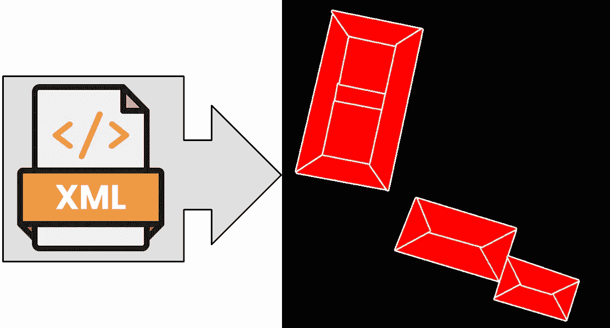
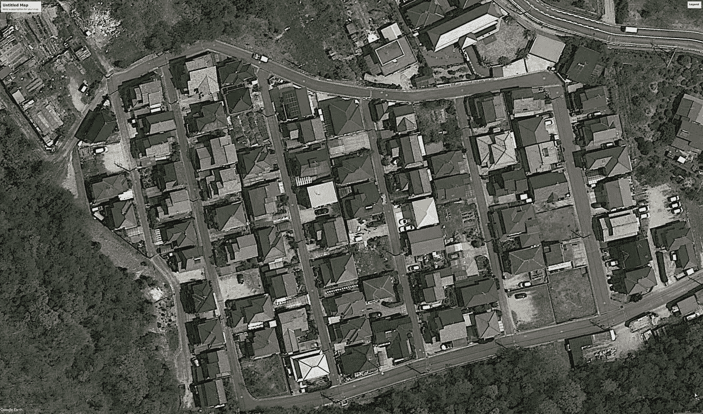
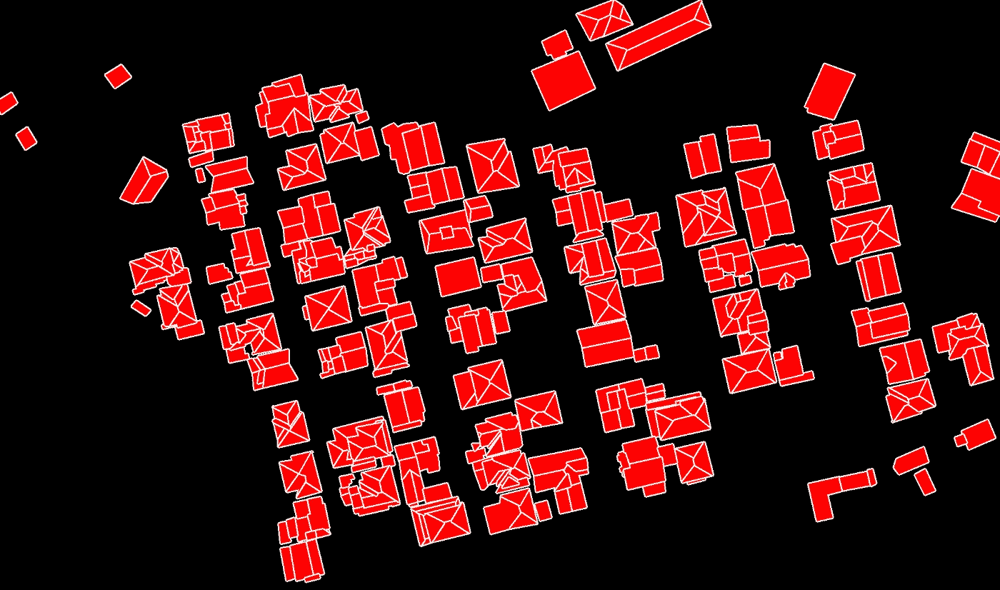

# 用 Python 将 CVAT XML 文件中的注释提取到掩码文件中

> 原文：<https://towardsdatascience.com/extract-annotations-from-cvat-xml-file-into-mask-files-in-python-bb69749c4dc9?source=collection_archive---------14----------------------->

## 一种从 CVAT XML 中获取掩码文件的方法

[计算机视觉标注工具(CVAT)](https://github.com/opencv/cvat) 是众所周知的图像标注工具。数据贴标机的工作结果可以导入 XML 文件。这个 XML 文件包含关于标记的所有必要信息。然而，对于图像分割任务，必须具有图像文件(JPEG、GIF、PNG 等)形式的遮罩。).换句话说，有了 CVAT XML 文件中的标记坐标，您需要绘制相应的遮罩。



图片由 Oleksii Sheremet 用 [Adobe Photoshop](https://www.adobe.com/ru/products/photoshop.html) 制作

如果数据标注器处理图像的分辨率高于训练所用的分辨率，那么任务将变得更加复杂。有必要考虑图像压缩因子对 XML 文件中呈现的提示点的数值的影响。

所有提取注释的代码都是作为 Python 中的脚本实现的。lxml 库用于解析 xml。它是处理 XML 和 HTML 标记的快速灵活的解决方案。 [lxml](https://lxml.de/) 包支持 XPath 和 XSLT，包括一个用于 SAX 的 API 和一个与 C 模块兼容的 API。

[tqdm](https://tqdm.github.io/) 包作为进度条来说明大量文件的处理。

让我们仔细看看。导入库:

```
import os
import cv2
import argparse
import shutil
import numpy as np
from lxml import etree
from tqdm import tqdm
```

一个用于创建新目录和递归删除现有目录内容的有用函数:

```
def dir_create(path):
    if (os.path.exists(path)) and (os.listdir(path) != []):
        shutil.rmtree(path)
        os.makedirs(path) if not os.path.exists(path):
        os.makedirs(path)
```

正在讨论的脚本的参数是以下数据:具有输入图像的目录、具有 XML 格式的 CVAT 注释的输入文件、用于输出掩码的目录以及图像的比例因子。从命令行解析参数的函数:

```
def parse_args():
    parser = argparse.ArgumentParser(
        fromfile_prefix_chars='@',
        description='Convert CVAT XML annotations to contours'
    )parser.add_argument(
        '--image-dir', metavar='DIRECTORY', required=True,
        help='directory with input images'
    )parser.add_argument(
        '--cvat-xml', metavar='FILE', required=True,
        help='input file with CVAT annotation in xml format'
    )parser.add_argument(
        '--output-dir', metavar='DIRECTORY', required=True,
        help='directory for output masks'
    )parser.add_argument(
        '--scale-factor', type=float, default=1.0,
        help='choose scale factor for images'
    )return parser.parse_args()
```

为了理解提取函数是如何工作的，让我们仔细看看 CVAT XML 文件的这一部分:

```
<image id="7" name="7.jpg" width="4800" height="2831">
    <polygon label="roofs" occluded="0" points="2388.11,2069.80;2313.80,2089.10;2297.46,2080.21;2285.57,2043.80;2339.07,2031.17;2336.10,2018.54;2428.23,2060.89">
    </polygon>
    <polygon label="roofs" occluded="0" points="1431.35,1161.11;1353.11,1179.63;1366.25,1229.79;1398.80,1219.94;1396.11,1210.08;1437.91,1194.26">
    </polygon>
    <polygon label="roofs" occluded="0" points="1344.81,1673.28;1270.10,1619.40;1213.00,1697.00">
    </polygon>
    <polygon label="roofs" occluded="0" points="1498.35,939.31;1573.30,923.19;1586.74,985.00;1509.10,1002.32">
    </polygon>
...
```

首先，需要在 XML 文件中找到与当前处理的图像相对应的区域。最简单的方法是通过文件名(例子中的*7.jpg*)。接下来，您需要找到标记'*多边形*或'*框*，并从中提取必要的数据(在本例中，屋顶是基于多边形标记的)。您可以使用以下函数从 CVAT XML 获取标记结果:

```
def parse_anno_file(cvat_xml, image_name):
    root = etree.parse(cvat_xml).getroot()
    anno = []image_name_attr = ".//image[[@name](http://twitter.com/name)='{}']".format(image_name)for image_tag in root.iterfind(image_name_attr):
        image = {}
        for key, value in image_tag.items():
            image[key] = value
        image['shapes'] = []
        for poly_tag in image_tag.iter('polygon'):
            polygon = {'type': 'polygon'}
            for key, value in poly_tag.items():
                polygon[key] = value
            image['shapes'].append(polygon)
        for box_tag in image_tag.iter('box'):
            box = {'type': 'box'}
            for key, value in box_tag.items():
                box[key] = value
            box['points'] = "{0},{1};{2},{1};{2},{3};{0},{3}".format(
                box['xtl'], box['ytl'], box['xbr'], box['ybr'])
            image['shapes'].append(box)
        image['shapes'].sort(key=lambda x: int(x.get('z_order', 0)))
        anno.append(image)
    return anno
```

接下来，我们需要创建掩码文件。用白色画蒙版多边形的边，用红色画里面的内容(如上图所示)。以下函数允许您这样做:

```
def create_mask_file(width, height, bitness, background, shapes, scale_factor):
    mask = np.full((height, width, bitness // 8), background, dtype=np.uint8)
    for shape in shapes:
        points = [tuple(map(float, p.split(','))) for p in shape['points'].split(';')]
        points = np.array([(int(p[0]), int(p[1])) for p in points])
        points = points*scale_factor
        points = points.astype(int)
        mask = cv2.drawContours(mask, [points], -1, color=(255, 255, 255), thickness=5)
        mask = cv2.fillPoly(mask, [points], color=(0, 0, 255))
    return mask
```

最后，主要功能是:

```
def main():
    args = parse_args()
    dir_create(args.output_dir)
    img_list = [f for f in os.listdir(args.image_dir) if os.path.isfile(os.path.join(args.image_dir, f))]
    mask_bitness = 24
    for img in tqdm(img_list, desc='Writing contours:'):
        img_path = os.path.join(args.image_dir, img)
        anno = parse_anno_file(args.cvat_xml, img)
        background = []
        is_first_image = True
        for image in anno:
            if is_first_image:
                current_image = cv2.imread(img_path)
                height, width, _ = current_image.shape
                background = np.zeros((height, width, 3), np.uint8)
                is_first_image = False
            output_path = os.path.join(args.output_dir, img.split('.')[0] + '.png')
            background = create_mask_file(width,
                                          height,
                                          mask_bitness,
                                          background,
                                          image['shapes'],
                                          args.scale_factor)
        cv2.imwrite(output_path, background)
```

当我们对 python 解释器执行 file as 命令时，我们必须添加以下结构:

```
if __name__ == "__main__":
    main()
```

仅此而已。要运行该脚本，您应该运行以下命令(如果在标记后不调整图像大小，则默认情况下缩放因子为 1):

```
python script_name.py --image-dir original_images_dir --cvat-xml cvat.xml --output-dir masks_dir --scale-factor 0.4
```

原始图像示例:



图片由 Oleksii Sheremet 使用 [Google Earth](https://www.google.com.ua/intl/en/earth/) 创建

作为脚本结果获得的掩码:



图片由 Oleksii Sheremet 使用 [OpenCV](https://opencv.org/) 库创建

**结论**

所考虑的方法允许从包含在 CVAT XML 中的数据获得更复杂的掩码文件。根据顶点的数量，可以提取单个多边形或用不同的颜色高亮显示多边形。此外，稍加修改后，所考虑的脚本将允许根据标记轮廓从原始图像中切割多边形截面。

**参考文献**

[计算机视觉标注工具(CVAT)](https://github.com/opencv/cvat)

[lxml —用 Python 实现 xml 和 HTML](https://lxml.de/)

[OpenCV](https://opencv.org/)

[如何运行您的 Python 脚本](https://realpython.com/run-python-scripts/)