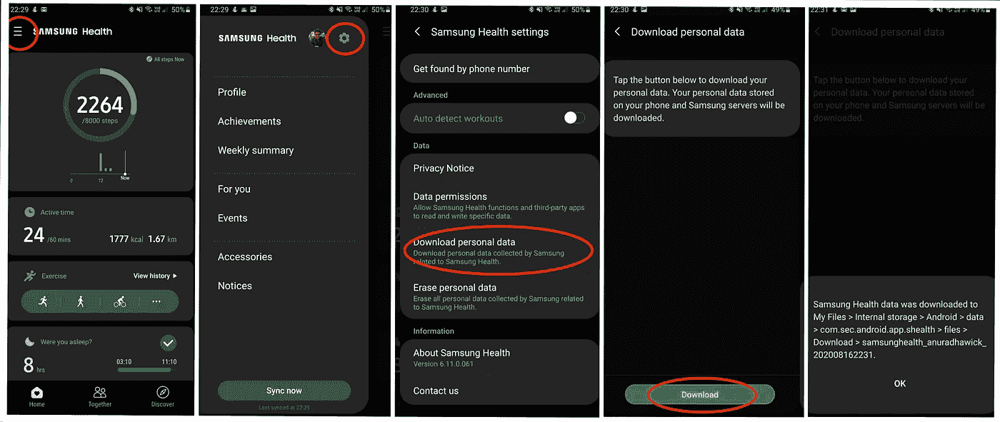
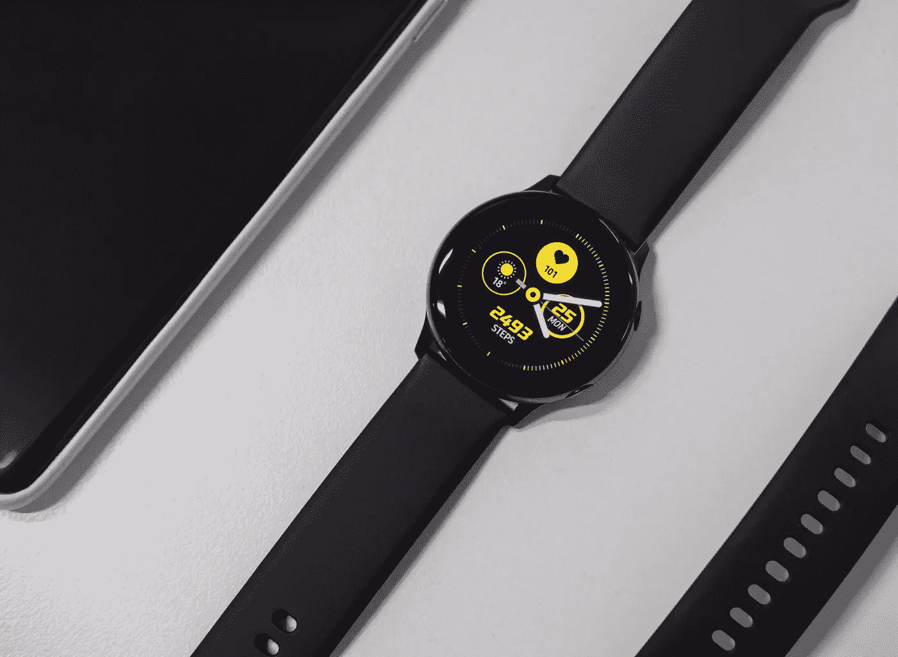
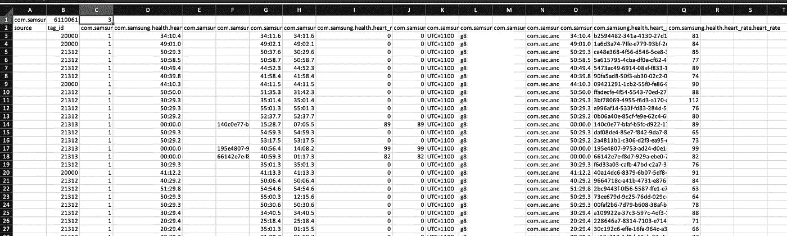
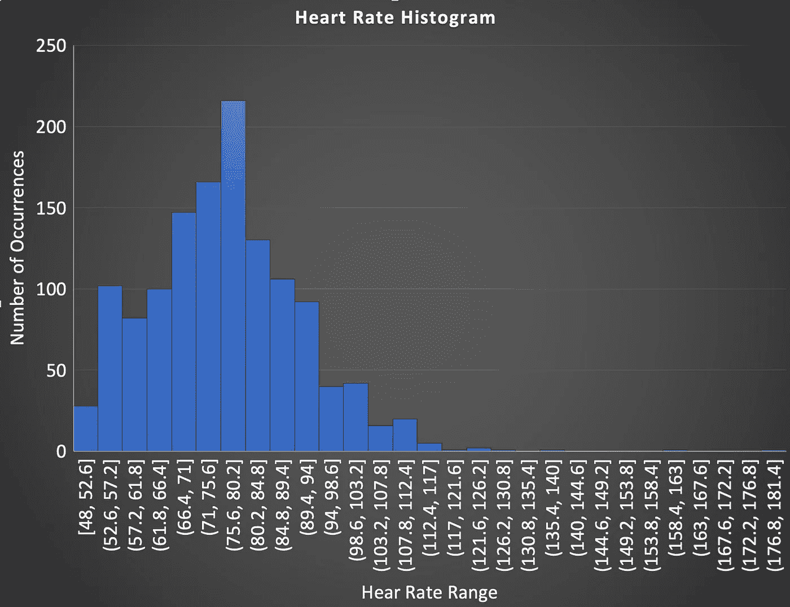
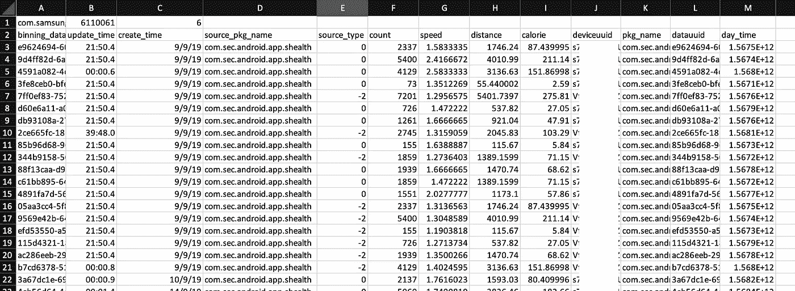
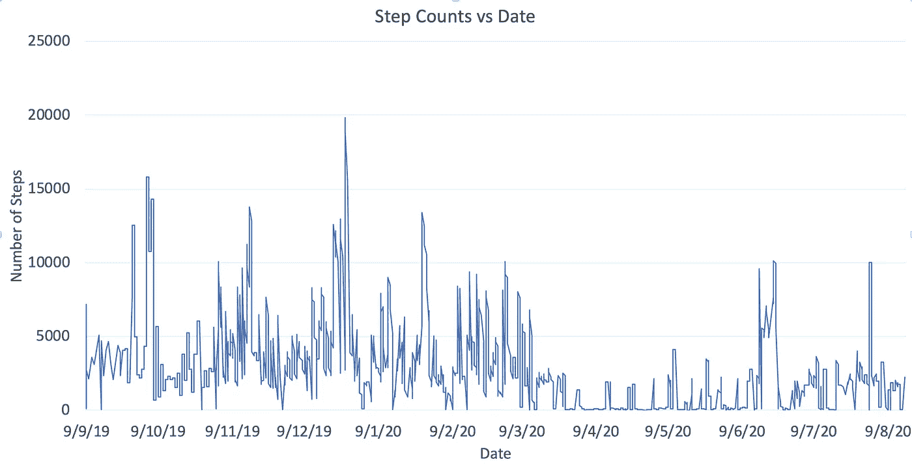
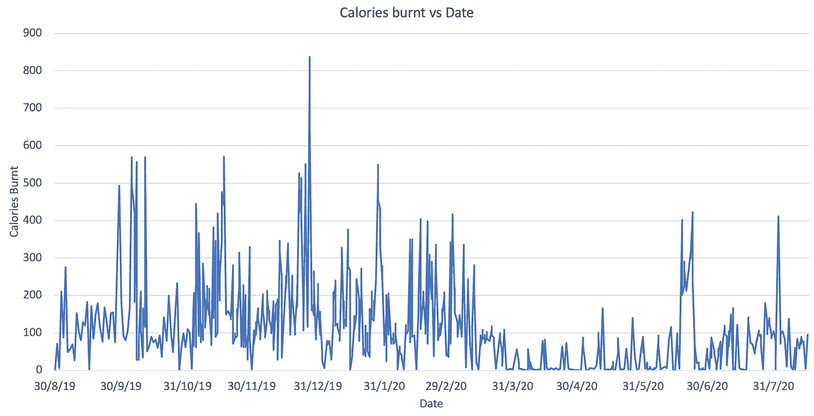
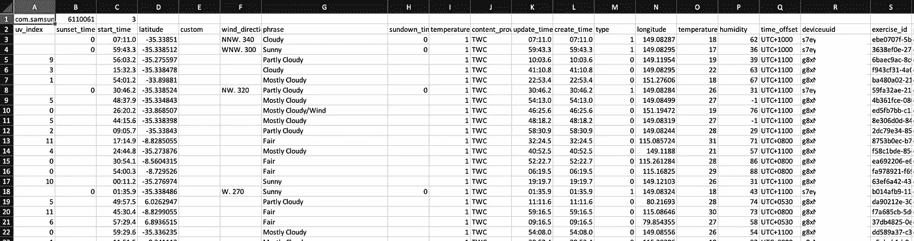

# 从您的三星设备中提取健康数据

> 原文：<https://towardsdatascience.com/extract-health-data-from-your-samsung-96b8a2e31978?source=collection_archive---------4----------------------->

## 从 Samsung Health 导出和解释健康数据

每次你把手机放在口袋里的时候，健康数据都会被收集。无论是苹果还是安卓，这些手机都配有计步器，可以计算你的步数。因此，记录了健康数据。这些数据可能是一个简单的机器学习或其他一些与健康数据相关的项目的免费数据集市。它是你的，可以免费使用！。让我们看看如何从三星 S-Health 应用程序中导出数据。

# 从手机导出

三星健康应用程序提供数据下载功能。

*   打开健康应用程序
*   打开左侧面板—单击设置轮
*   找到**【下载个人资料】**按钮
*   按照说明(你需要登录)点击**下载**
*   您将看到查找您的健康数据的位置



导出健康数据的步骤

这可能是最容易做到的事情。但是，理解数据有点复杂。让我们浏览每个文件及其内容，以了解三星健康应用程序如何存储数据。

# 导出的数据

您将看到下面一组包含数据的文件。您将看到导出时间戳，而不是`T`。在**文件**文件夹中，您会看到个人资料图片。在名为 **jsons** 的文件夹中，可以找到 **CSV** 文件中引用的数据的 **JSON** 对象(在本文中我就不说 JSON 了)。请注意，CSV 文件的数据列还将包含包扩展名 **com.samsung.health** 。然而，为了文本的简单，当我解释 CSV 文件的内容时，我将忽略它。

```
**com.samsung.health.device_profile.T.csv  com.samsung.shealth.preferences.T.csv  com.samsung.health.floors_climbed.T.csv  com.samsung.shealth.report.T.csv  com.samsung.health.food_info.T.csv  com.samsung.shealth.rewards.T.csv  com.samsung.health.height.T.csv  com.samsung.shealth.sleep.T.csv  com.samsung.health.sleep_stage.T.csv  com.samsung.shealth.social.leaderboard.T.csv  com.samsung.health.user_profile.T.csv  com.samsung.shealth.social.public_challenge.T.csv  com.samsung.health.water_intake.T.csv  com.samsung.shealth.social.public_challenge.detail.T.csv  com.samsung.health.weight.T.csv  com.samsung.shealth.social.public_challenge.extra.T.csv  com.samsung.shealth.activity.day_summary.T.csv  com.samsung.shealth.social.public_challenge.history.T.csv  com.samsung.shealth.activity.goal.T.csv  com.samsung.shealth.social.public_challenge.leaderboard.T.csv  com.samsung.shealth.activity_level.T.csv  com.samsung.shealth.social.service_status.T.csv  com.samsung.shealth.best_records.T.csv  com.samsung.shealth.stand_day_summary.T.csv  com.samsung.shealth.breathing.T.csv  com.samsung.shealth.step_daily_trend.T.csv  com.samsung.shealth.caloric_balance_goal.T.csv  com.samsung.shealth.stress.T.csv  com.samsung.shealth.calories_burned.details.T.csv  com.samsung.shealth.stress.histogram.T.csv  com.samsung.shealth.exercise.T.csv  com.samsung.shealth.tracker.heart_rate.T.csv  com.samsung.shealth.exercise.weather.T.csv  com.samsung.shealth.tracker.pedometer_day_summary.T.csv  com.samsung.shealth.food_frequent.T.csv  com.samsung.shealth.tracker.pedometer_event.T.csv  com.samsung.shealth.food_goal.T.csv  com.samsung.shealth.tracker.pedometer_recommendation.T.csv  com.samsung.shealth.goal.T.csv  com.samsung.shealth.tracker.pedometer_step_count.T.csv  com.samsung.shealth.goal_history.T.csv  com.samsung.shealth.insight.milestones.T.csv  com.samsung.shealth.permission.T.csv  
jsons
files**
```

# 来自传感器的健康数据



照片由[埃米利奥·西塞罗](https://unsplash.com/@emilianocicero?utm_source=unsplash&utm_medium=referral&utm_content=creditCopyText)在 [Unsplash](https://unsplash.com/s/photos/samsung-watch?utm_source=unsplash&utm_medium=referral&utm_content=creditCopyText) 上拍摄

这些文件包含来自传感器的数据，包括来自 Galaxy Watch 和手机本身的心率数据和步数。从**计步器**和**加速度计**传感器收集步数。心率是通过手表中的 **PPG(光电容积描记图)**传感器来测量的。对于这些数据，您必须查看以下文件。

## 心率数据

心率数据包含在以下文件中。

```
**com.samsung.shealth.tracker.heart_rate.T.csv**
```

该文件中的重要信息是**更新时间**和**心率**栏。您还可以找到最小值和最大值以及显示录制结束的**结束时间**。



心率信息

出于好奇，我绘制了一张我的心率直方图，看看我的心脏是如何工作的。我的心率似乎在 65-80bp 之间，谷歌搜索的结果是“成年人的正常静息心率在每分钟 60-100 次之间”。我猜直方图是有道理的。当我买手表时，我最关心的一件事就是记录我的心率。因为，通常在医生那里，我有高于平均水平的心率和惊慌失措的人的血压。如果你想了解更多关于医生的情况，请点击这里阅读。



听力比率直方图

## 步进跟踪器数据


[钱德尔 R](https://unsplash.com/@chanderr?utm_source=unsplash&utm_medium=referral&utm_content=creditCopyText) 在 [Unsplash](https://unsplash.com/s/photos/runner?utm_source=unsplash&utm_medium=referral&utm_content=creditCopyText) 上拍照

以下文件中提供了步进跟踪器数据；

```
**com.samsung.shealth.step_daily_trend.202008162231.csv
com.samsung.shealth.tracker.pedometer_step_count.202008162231.csv
com.samsung.shealth.tracker.pedometer_day_summary.202008162231.csv**
```



每日摘要

在**步数每日趋势**中，您将看到计步数、消耗的卡路里、行走距离和速度的每日数值。但是，在**计步器 _ 步数 _ 计数**中，您会找到所有步数信息，包括跑步步数、步行步数。基本上，这个文件包含计步器跟踪信息。在最后一个文件(**计步器 _ 日 _ 摘要**)中，你可以找到每天的步数摘要。这对于大多数任务来说已经足够了。

我们试着对这些数据做一些简单的分析。



步骤计数与日期

上面的观察结果与澳大利亚的季节变化有点一致。在六月到十二月期间，我们有寒冷的温度。从 12 月到 6 月，我们有更好的跑步天气。然而，新冠肺炎在四月和五月开始在坎培拉演出，因此活动量很低。然而，在六月，我和我的妻子散步并试图恢复身材，这样我们就可以在周年纪念日的时候出去吃很多东西。

步数并不是衡量活动的通用指标。一个人可以在健身房锻炼，不用计算步数，但却燃烧了大量脂肪。这种活动通常使用心率传感器通过卡路里来测量。然而，正如你在下面看到的，我的卡路里数和步数多少有些关联(X 轴有一点偏差，但很接近)。这是因为我唯一喜欢的锻炼是跑步或慢跑。



燃烧的卡路里与日期

有趣的东西是可见的。在我跑步的日子里，我没走多少步。相比之下，在步行的日子里，我走了 10000 多步。我想知道，是我走路的时候累了，还是跑步的步数没有计入每天的步数。不过，我将在另一篇文章中对此进行研究。

# 其他信息

还有更多信息，包括体重和碳水化合物摄入量。为此，您必须手动记录它们。然而，在下面的文件中有一些有见地的数据。

```
**com.samsung.shealth.exercise.weather.T.csv**
```



锻炼天气数据

然而，为了使用这个文件，您必须将它与**练习**文件结合起来。那是另一篇文章！

我希望这篇文章能对你最常丢弃的数据产生有用的结果。快乐阅读！