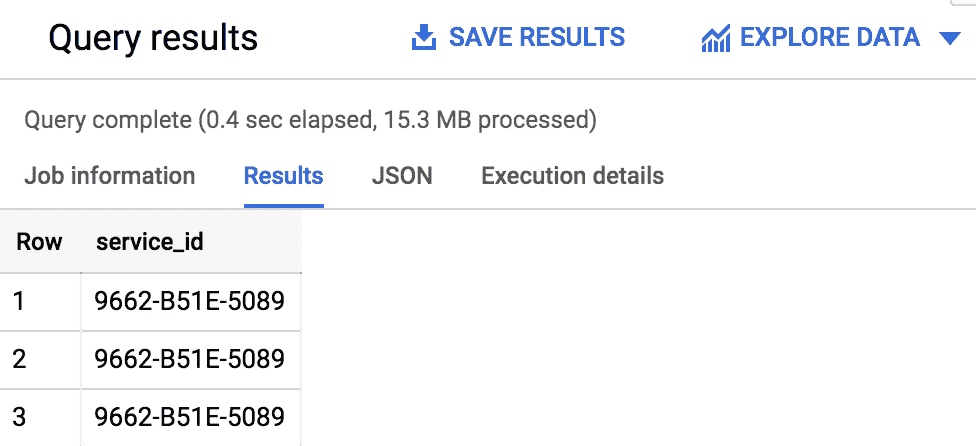
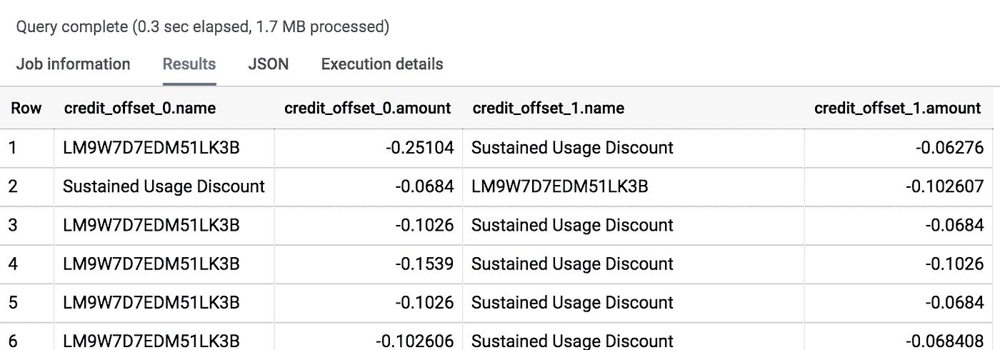
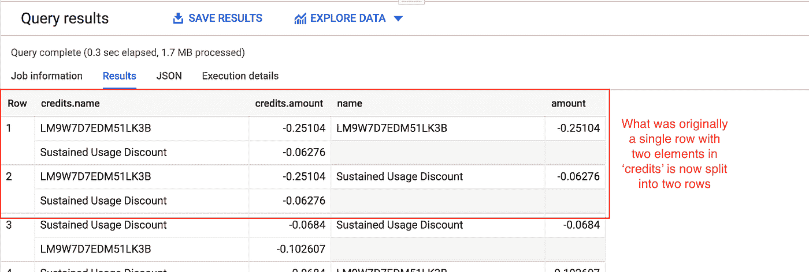
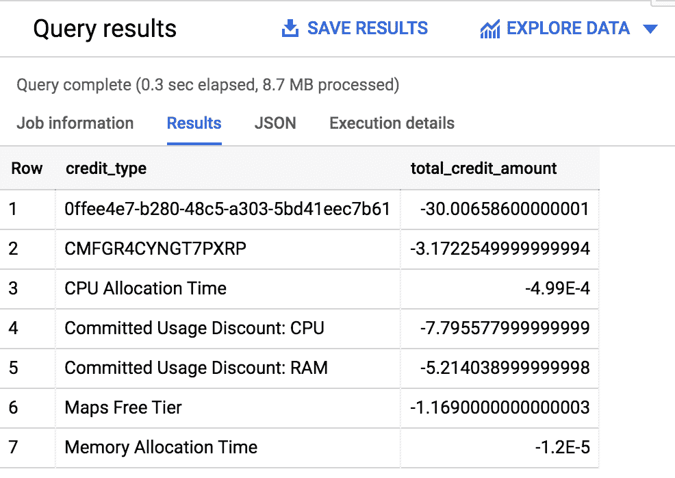
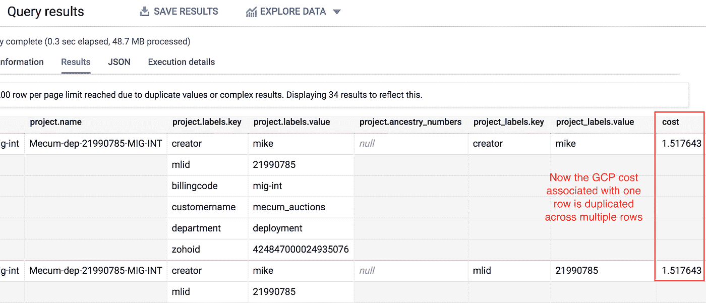
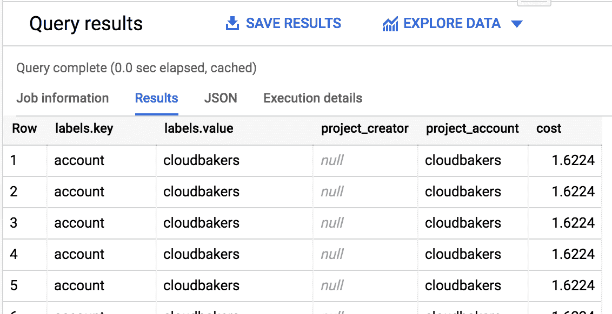

# 在 BigQuery 中提取嵌套结构而不交叉连接数据

> 原文：<https://towardsdatascience.com/extract-nested-structs-without-cross-joining-data-in-bigquery-7212b075c542?source=collection_archive---------14----------------------->

## 分享一个不太常见但非常有用的 BigQuery 标准 SQL 语法的例子

作为一名专注于数据和分析领域的谷歌云顾问，我花了很多时间在 BigQuery 上，这是谷歌云的 Pb 级数据仓库即服务，在很大程度上，我喜欢它。它非常强大，没有基础设施管理，并且具有各种内置的分析和人工智能功能。

但是，由于其列式数据存储的性质，BigQuery SQL 语法有时使用起来并不直观。Google 推荐的查询性能和成本优化的最佳实践是对您的数据进行反规范化，或者换句话说，使用专门的数据类型(如数组和键值存储)将分散在多个表中的数据合并到一个表中。

查询非规范化数据可能比大规模连接数据更高效，但如果你习惯于在规范化的表中处理数据，查询数据就没那么容易了，这是我加入 [Cloudbakers](https://www.cloudbakers.com/) 之前的经验。因此，在本文中，我将使用一个与 [BigQuery billing export](https://cloud.google.com/billing/docs/how-to/export-data-bigquery) 结构相同的模拟 GCP 计费数据集，介绍 BigQuery 中常见和不常见的非规范化数据结构的查询语法。

基本的**结构**或键值字段非常简单，因为您可以简单地使用点符号来选择子字段:

```
-- service is a STRUCT field and id is one of its keys
SELECT service.id AS service_id
FROM   `gcp-sandbox.gcp_billing_demo.gcp_billing_export`
LIMIT  1000
```



查询结果:使用点符号展平的键值对

当处理数组或**重复的**字段时，事情变得稍微复杂一点。您可以使用数组索引选择数组的单个组件，如果元素的顺序是预先确定的或者无关紧要，这将非常有用(您可以从下面的前两行结果中看到，在这种情况下，顺序不是预先确定的)。

```
SELECT credits[OFFSET(0)] as credit_offset_0,
       credits[OFFSET(1)] AS credit_offset_1
FROM   `gcp-sandbox.gcp_billing_demo.gcp_billing_export`
WHERE  ARRAY_LENGTH(credits) > 1
```



查询结果:按索引选择的数组元素

您还可以选择使用所谓的**相关交叉连接**来扁平化数据。这将接受任何重复的字段，对其进行透视，以便数组中的每个元素都是一个新行，然后将该新的表格数据与原始表连接，为原始重复字段中的每个元素创建一个具有重复行的扁平模式。

```
SELECT billing.credits,
       c.*
FROM   `gcp-sandbox.gcp_billing_demo.gcp_billing_export` billing,
       UNNEST(credits) c
WHERE  ARRAY_LENGTH(credits) > 1
```



查询结果:由相关交叉连接展平的数组

如果您需要展平数据并基于数组中包含的数据计算聚合值或指标，这将非常有用-例如，如果您需要计算 2019 年 12 月开具发票的 GCP 消费的每种信用类型的总信用额，您将使用以下查询:

```
SELECT   c.name        AS credit_type,
         SUM(c.amount) AS total_credit_amount
FROM     `gcp-sandbox.gcp_billing_demo.gcp_billing_export` billing,
         UNNEST(credits) c
WHERE    billing.invoice.month = '201912'
GROUP BY credit_type
ORDER BY credit_type
```



查询结果:由相关交叉连接展平并聚集的数组

但是，如果您只是需要对数组数据进行透视，以便它可以被另一个系统使用或导出到 Excel 或 Google Sheets 等电子表格软件中，该怎么办呢？同样，由于其列式数据存储的性质，BigQuery 不容易支持类似于 [Pandas 库的 unstack 方法](https://pandas.pydata.org/pandas-docs/stable/reference/api/pandas.DataFrame.unstack.html)的语法。

作为一个具体的例子，让我们以 BigQuery billing 导出中四个重复字段中的两个为例:

*   项目标签
*   资源标签

如果您还不熟悉这个概念，**项目**和**资源标签**允许您作为一个组织将业务概念和流程应用于 GCP 计算资源。因为应用于您的计算资源的标签会传播到您的计费数据，所以如果您正确且一致地设置标签，您可以按不同的环境、组织部门或计划来分解您的 GCP 成本消耗。您还可以启动一些流程，如向各个部门退款。

长话短说，标签是或应该是你的 GCP 成本管理战略的一个重要方面。这使得 BigQuery billing 导出中的项目标签和资源标签都位于重复的 struct 对象的字段中，或者说是作为键-值对的数组写入表中，这更加令人沮丧。

如果在这种情况下对项目标签进行相关交叉连接，因为成本字段并不包含在项目标签数组中，而信用成本与信用数组中的特定信用类型相关联，所以展平项目标签数据会导致成本字段在每个项目标签中重复一次。如果在资源标签上进行相关交叉连接，情况也是如此。

```
SELECT project,
       project_labels,
       cost
FROM   `gcp-sandbox.gcp_billing_demo.gcp_billing_export` billing,
       unnest(project.labels) project_labels
WHERE  cost > 1
```



查询结果:非数组值重复

如果您尝试在这种情况下进行分组和求和，您的 GCP 成本可能会比实际成本高得多，这取决于您对每个项目应用了多少标签。如果您的表中每一行都有一个唯一的标识符，您可以使用它来连接一个除了一个标签之外过滤掉所有标签的扁平数组，并且可以重复这样做来集成每个不同的项目标签。但是计费数据导出没有唯一的行标识符，所以这不是一个真正的选项。那么你能做什么呢？

所有的希望都没有失去，这要感谢来自 Google Cloud 的 Lak Lakshmanan 的这篇文章，它探索了 BigQuery 中一些强大的查询模式。我强烈建议您阅读整篇文章，但特别是有一个组件我发现有助于解决上述计费问题，那就是应用[表达式子查询](https://cloud.google.com/bigquery/docs/reference/standard-sql/expression_subqueries)来解包 BigQuery 表中的嵌套结构对象。您可以在下面的示例中看到如何使用此查询语法拆分项目标签数据，从而创建可以在 BigQuery 或其他数据分析系统中轻松处理的表格结果:

```
SELECT project.labels,
       (
           SELECT value
           FROM   UNNEST(project.labels)
           WHERE  KEY='creator') AS project_creator,
       (
           SELECT value
           FROM   UNNEST(project.labels)
           WHERE  KEY='account') AS project_account,
       cost
FROM   `gcp-sandbox-213315.gcp_billing_demo.gcp_billing_export`
WHERE  array_length(project.labels) > 0
AND    cost > 1
```



查询结果:使用表达式子查询将嵌套的键值“拆分”到表格数据中

这就是我今天的全部内容——尽管我今天提出的查询不一定非常复杂，但我发现它们很有用(尤其是表达式子查询),希望您也能如此。