# 用 Python & R 从数据帧中提取行/列

> 原文：<https://towardsdatascience.com/extract-rows-columns-from-a-dataframe-in-python-r-678e5b6743d6?source=collection_archive---------0----------------------->

## 这里有一个简单的 Python 和 R 数据帧操作的备忘单，以防你像我一样对混合两种语言的命令感到不安。


伊丽莎白·凯在 [Unsplash](https://unsplash.com?utm_source=medium&utm_medium=referral) 上的照片

我已经和数据打交道很长时间了。然而，我有时仍然需要谷歌“如何在 Python/R 中从数据帧中提取行/列？”当我从一种语言环境转换到另一种语言环境时。

我很确定我已经这样做了上千次了，但是似乎我的大脑拒绝将这些命令储存在记忆中。

如果你需要同时使用 **R** 和 **Python** 进行数据操作，你一定知道我的感受。

因此，我想在本文中总结一下 **R** 和 **Python** 在从数据框中提取行/列时的用法，并为需要的人制作一个简单的备忘单图片。

注意，为了并排比较命令行，我将只使用 **Python** 中的 **Pandas** 和 **R** 中的基本函数。有些综合库，比如‘dplyr’就不在考虑之列。我正尽力使文章简短。

我们开始吧。

## 要使用的玩具数据集。

我们将在整篇文章中使用阿伦艾弗森的游戏统计数据玩具数据集。数据帧的尺寸和标题如下所示。

```
# R
dim(df)
head(df)
```

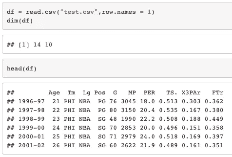

r 输出 1

```
# Python
df.shape
df.head()
```

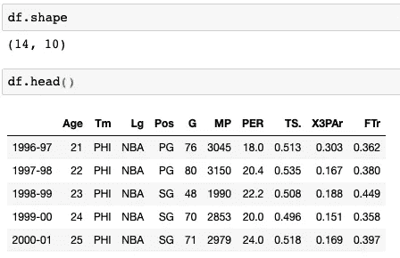

Python 输出 1

## 按位置提取行/列。

首先，让我们用 R 和 Python 从数据框中提取行。在 R 中是通过简单的索引来完成的，但是在 Python 中是通过**来完成的。iloc** 。让我们看看下面的例子。

```
# R
## Extract the third row
df[3,]## Extract the first three rows
df[1:3,]
### or ###
df[c(1,2,3),]
```

这产生了，

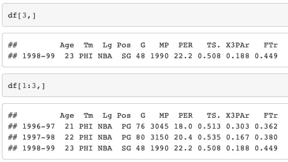

r 输出 2

```
# Python
## Extract the third row
df.iloc[2]
### or ###
df.iloc[2,]
### or ###
df.iloc[2,:]## Extract the first three rows
df.iloc[:3]
### or ###
df.iloc[0:3]
### or ###
df.iloc[0:3,:]
```

这产生了，

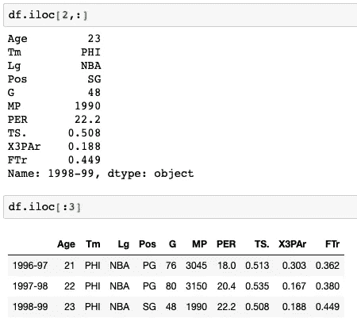

Python 输出 2

请注意，在从数据框中提取单行的示例中，R 中的输出仍然是数据框格式，但是 Python 中的输出是熊猫系列格式。这是 R 和 Python 在从数据框中提取单个行时的本质区别。

类似地，我们可以从数据框中提取列。

```
# R
## Extract the 5th column
df[,5]## Extract the first 5 columns
df[,1:5]
```

这产生了，

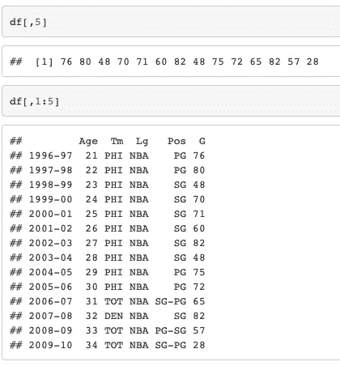

r 输出 3

```
# Python
## Extract the 5th column
df.iloc[:,4]## Extract the first 5 columns
df.iloc[:,:5]
### or ###
df.iloc[:,0:5]
```

这产生了，

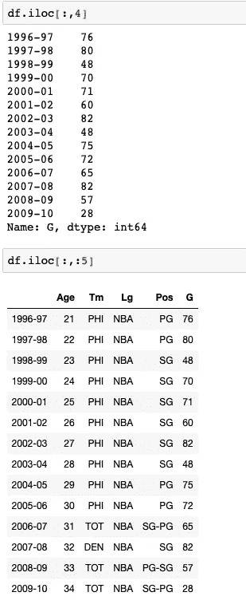

Python 输出 3

提取列时，我们必须将冒号和逗号放在方括号内的行位置，这与提取行有很大的不同。

## 按索引或条件提取行/列。

在我们的数据集中，数据框的行索引和列索引分别是 NBA 赛季和艾弗森的统计数据。我们可以使用它们从数据框中提取特定的行/列。

例如，我们对 1999-2000 年这个季节感兴趣。

```
# R
## Extract 1999-2000 season.
df["1999-00",]## Extract 1999-2000 and 2001-2002 seasons.
df[c("1999-00","2000-01"),]
```

这产生了，

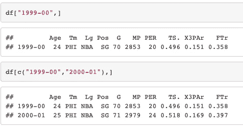

r 输出 4

```
# Python
## Extract 1999-2000 season.
df.loc["1999-00"]## Extract 1999-2000 and 2001-2002 seasons.
df.loc[["1999-00","2000-01"]]
```

这产生了，

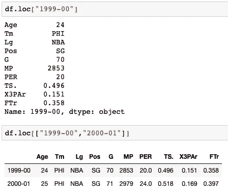

Python 输出 4

请再次注意，在 Python 中，如果我们只提取一行/列，输出是 Pandas Series 格式，但是如果我们提取多行/列，它将是 Pandas DataFrame 格式。

当我们只对列的子集感兴趣时，我们也可以添加列索引。

```
# R
## Extract Iverson's team and minutes played in the 1999-2000 season.
df["1999-00",c("Tm","MP")]
```

这产生了，

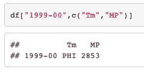

r 输出 5

```
# Python
## Extract Iverson's team and minutes played in the 1999-2000 season.
df.loc["1999-00",["Tm","MP"]]
```

这产生了，

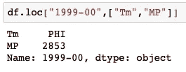

Python 输出 5

除了通过索引提取行/列，我们还可以根据条件进行子集化。比如我们想提取艾弗森上场时间超过 3000 分钟的赛季。

```
# R
## Extract MP over 3k
df[df$MP > 3000,] ## the comma cannot be omitted
```

这产生了，

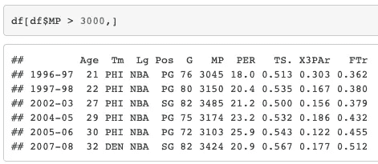

r 输出 6

```
# Python
## Extract MP over 3k
df.loc[df.MP > 3000,:] ## both the comma and colon can be omitted
```

这产生了，

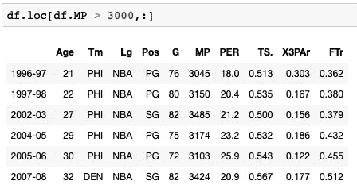

Python 输出 6

当然，更复杂的条件可以传递给方括号，它只需要一个 True/False 列表，其长度为数据帧的行号。

比如我们要提取艾弗森真实投篮命中率(TS%)超过 50%，上场时间超过 3000 分钟，位置(Pos)不是得分后卫(SG)就是控卫(PG)的赛季。

```
# R
## Extract rows with TS.> 50%, MP > 3000 and Pos is SG/PG### define condition as cond_
cond_ = (df$TS. > 0.5) & (df$MP > 3000) & (df$Pos %in% c("SG","PG"))
df[cond_,]
```

这产生了，

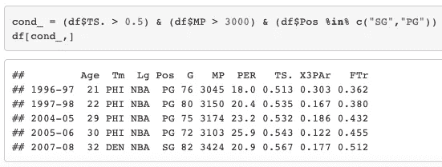

r 输出 7

```
# Python
## Extract rows with TS.> 50%, MP> 3000 and Pos is SG/PG### define condition as cond_
cond_ = (df["TS."] > 0.5) & (df["MP"] > 3000) & (df["Pos"].isin(["SG","PG"]))df.loc[cond_,:] ## both the comma and colon can be omitted
```

这产生了，

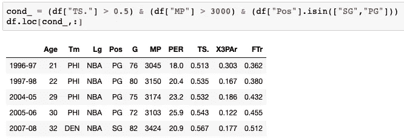

Python 输出 7

我们可以在“cond_”位置应用任何类型的布尔值。

## 备忘单图像。

这是一个备忘单，我希望当你像我一样同时使用 Python 和 R 时，它能节省你的时间。

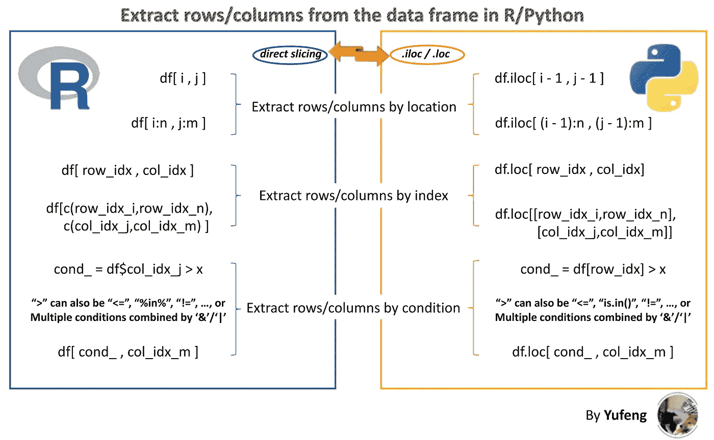

Cheatsheet by [俞峰](https://medium.com/@jianan.jay.lin)

就是这样！对 R/Pandas 中的表切片的简单总结。希望有帮助！

感谢您的阅读！如果你喜欢这篇文章，请在 [**上关注我的**](https://medium.com/@jianan.jay.lin) 。以下是我之前在**数据科学**发表的一些文章:

[](/pheatmap-draws-pretty-heatmaps-483dab9a3cc) [## Pheatmap 绘制了漂亮的热图

### 一个关于如何在 r 中用 pheatmap 生成漂亮的热图的教程。

towardsdatascience.com](/pheatmap-draws-pretty-heatmaps-483dab9a3cc) [](/present-the-feature-importance-of-the-random-forest-classifier-99bb042be4cc) [## 给出了随机森林分类器的特征重要性

### 如何建立一个随机森林分类器，提取特征重要性，并漂亮地呈现出来。

towardsdatascience.com](/present-the-feature-importance-of-the-random-forest-classifier-99bb042be4cc) [](/end-to-end-project-of-game-prediction-based-on-lebrons-stats-using-three-machine-learning-models-38c20f49af5f) [## 使用三种机器学习模型基于勒布朗数据的端到端游戏预测方案

### 综合指导一个二元分类问题使用三个不同的分类器，包括逻辑…

towardsdatascience.com](/end-to-end-project-of-game-prediction-based-on-lebrons-stats-using-three-machine-learning-models-38c20f49af5f) 

照片由[科迪板](https://unsplash.com/@codypboard?utm_source=medium&utm_medium=referral)在 [Unsplash](https://unsplash.com?utm_source=medium&utm_medium=referral) 上拍摄