# 提取、转换、加载(ETL) — AWS 粘合

> 原文：<https://towardsdatascience.com/extract-transform-load-etl-aws-glue-edd383218cfd?source=collection_archive---------15----------------------->

## 了解如何在 Spark 中对新的 Corona 病毒数据集使用 AWS Glue 进行 ETL 操作


AWS Glue 是一个完全托管的、无服务器的 ETL 服务，可用于为数据分析目的准备和加载数据。该服务可用于对数据进行编目、清理、丰富，并在不同的数据存储之间可靠地移动数据。在本文中，我将解释我们如何使用 AWS Glue 在 Spark 中对新的 Corona 病毒数据集执行 ETL 操作。

本文将涵盖以下主题:

*   粘合组件。
*   完成教程作者胶水火花工作。
*   从 S3 自动气象站提取数据。
*   使用 Spark 转换数据。
*   将转换后的数据以拼花格式存储回 S3。

# 粘合组件

简而言之，AWS 胶水包含以下重要成分:

*   **数据源和数据目标:**作为输入提供的数据存储称为数据源，存储转换数据的数据存储称为数据目标。
*   **数据目录:**数据目录是 AWS Glue 的中央元数据存储库，在一个地区的所有服务之间共享。这个目录包含表定义、作业定义和其他控制信息，用于管理您的 AWS Glue 环境。
*   **爬虫和分类器:**爬虫是从数据存储中检索数据模式的程序(s3)。Crawler 使用自定义或内置分类器来识别数据格式，并填充目录中的元数据表。
*   **数据库和表:**每次成功的爬虫运行都会在数据目录中填充一个数据库表。目录中的数据库是一组相关联的表。每个表只有数据的元数据信息，如列名、数据类型定义、分区信息，而实际数据保留在数据存储中。在 ETL 作业运行中，源和目标使用数据库中的一个或多个表。
*   **作业和触发器:**执行 ETL 任务的实际业务逻辑。作业由转换脚本、数据源和数据目标组成。我们可以用 python 或 pyspark 来定义我们的工作。作业运行由触发器启动，这些触发器可以由事件计划或触发。

我留下了一些组件，因为它们不在本文的讨论范围之内。关于 AWS Glue 的详细研究，你可以访问官方的[开发者指南](https://docs.aws.amazon.com/glue/latest/dg/what-is-glue.html)。

# 在 AWS Glue 上使用 PySpark 的 ETL

现在我们已经了解了 Glue 的不同组成部分，我们现在可以开始讨论如何在 AWS 中创作 Glue 作业，并执行实际的提取、转换和加载(ETL)操作。

## 新型冠状病毒数据集:

数据集是从 [Kaggle 数据集](https://www.kaggle.com/sudalairajkumar/novel-corona-virus-2019-dataset)中获得的。我正在使用的版本最后更新于 2020 年 5 月 2 日。该数据集中的主文件是`covid_19_data.csv`,数据集的详细描述如下。

*   Sno —序列号
*   观察日期—观察的日期，以年/月/日为单位
*   省/州-观察的省或州(缺少时可以为空)
*   国家/地区—观察国
*   上次更新时间—以 UTC 表示的给定省份或国家/地区的行更新时间。(未标准化，因此请在使用前清洁)
*   已确认——截至该日期的累计已确认病例数
*   死亡——截至该日期的累计死亡人数
*   已恢复—截至该日期已恢复案例的累计数量

## 1)设置我们的数据存储:

作为开发端到端 ETL 工作的第一步，我们将首先设置我们的数据存储。转到 yout s3 控制台，并在那里创建一个存储桶。我们将使用以下分区方案在 bucket 中上传数据集文件:

```
s3://bucket-name/dataset/year=<year>/month=<month>/day=<day>/hour=<hour>/
```

现在我们正在处理单个文件，所以你可以手动创建分区和上传文件，但如果处理大量文件，你可以使用我的 [FTP 文件摄取代码](/datalake-file-ingestion-from-ftp-to-aws-s3-253022ae54d4)，我在我的上一篇文章中解释为你做这项工作。在使用 AWS Athena 时，以这种方式对数据进行分区有助于查询优化。

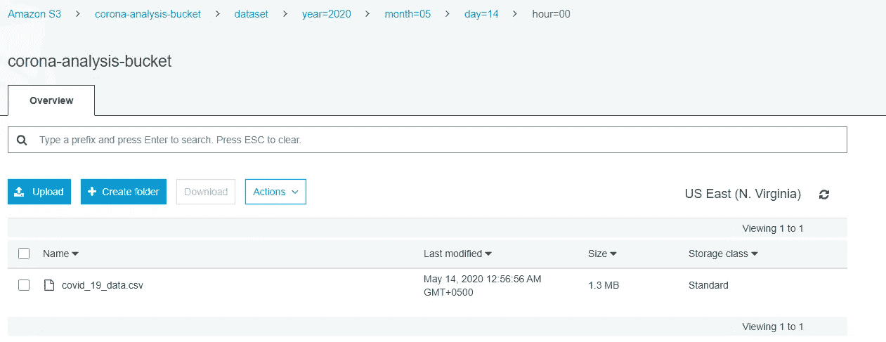

## 2)创建 AWS 粘合角色

创建一个 Glue 角色，允许 Glue 访问不同的 AWS 资源，例如 s3。转到 IAM 控制台，添加一个新角色，并将 *AWSGlueServiceRole* 策略附加到该角色。此策略包含访问 Glue、CloudWatch、EC2、S3 和 IAM 的权限。有关如何为 Glue 设置 IAM 角色的更多细节，请考虑下面的[链接](https://docs.aws.amazon.com/glue/latest/dg/getting-started-access.html)。

## 3)设置爬虫来编目数据

执行以下步骤来添加 crawler:

*   在左侧菜单中，单击数据库并添加一个数据库。

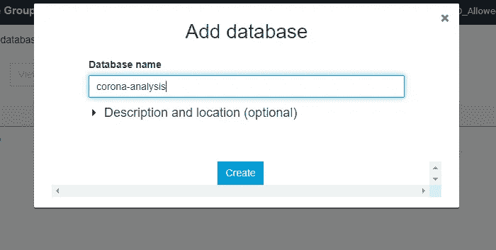

*   现在去爬虫和一个新的爬虫

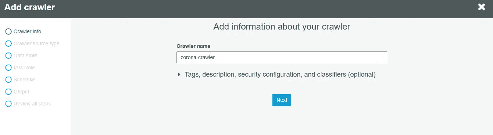

*   选择数据存储

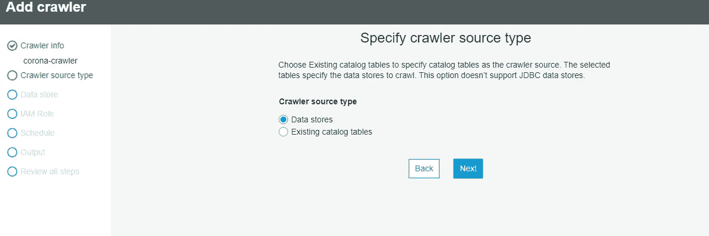

*   提供 s3 存储桶路径

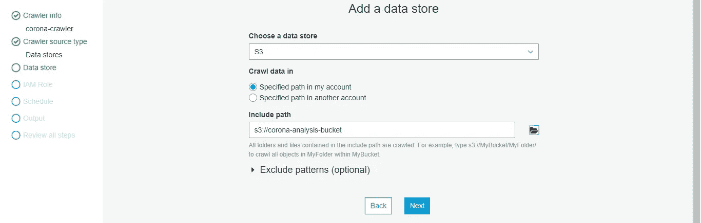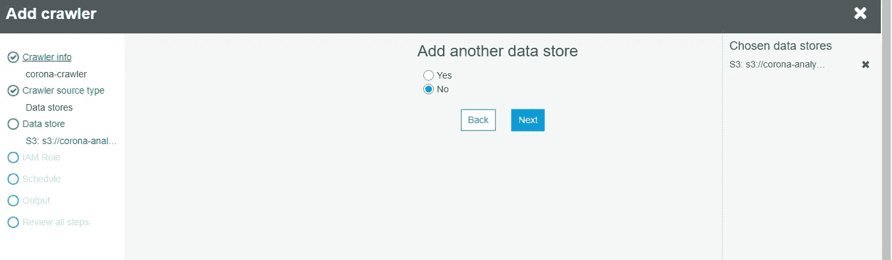

*   选择粘合角色

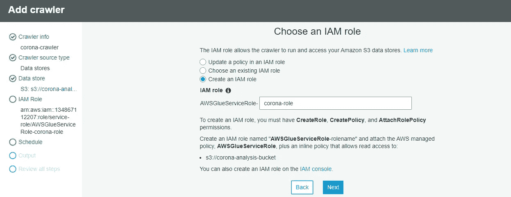

*   设置按需运行的频率

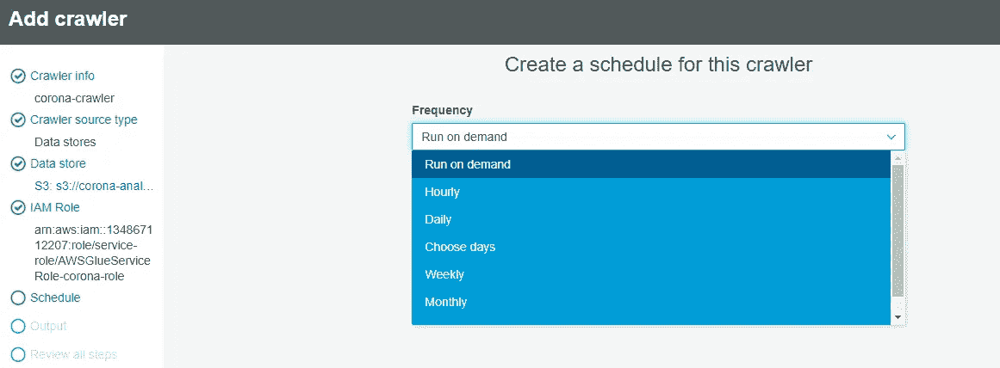

*   选择数据库

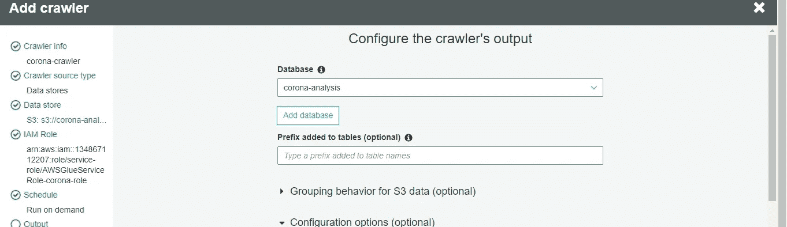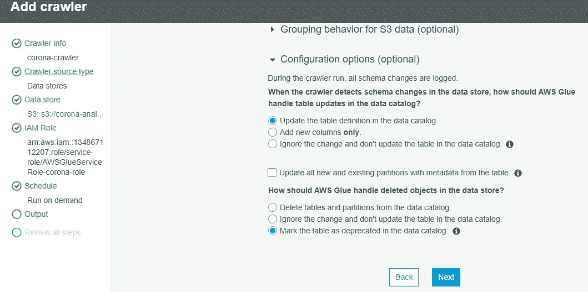

*   最后检查并单击“完成”

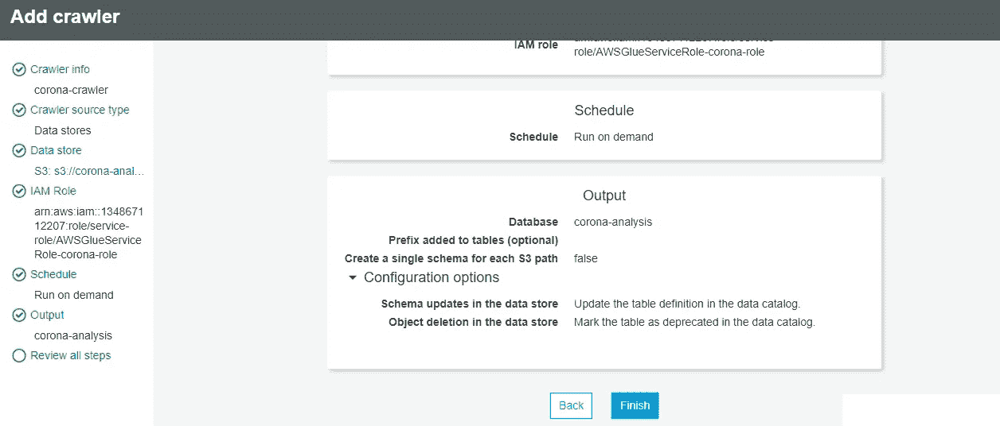

*   现在，您的爬虫已经创建好了。单击“运行 Crawler”对数据集进行编目

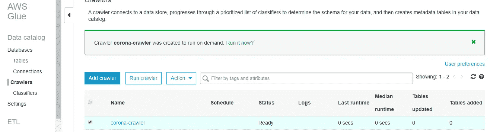

*   Crawler 可能需要一些时间来对数据进行分类。成功运行后，必须在指定的数据库中创建表

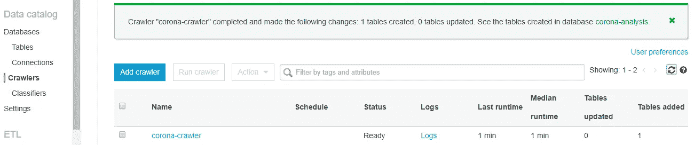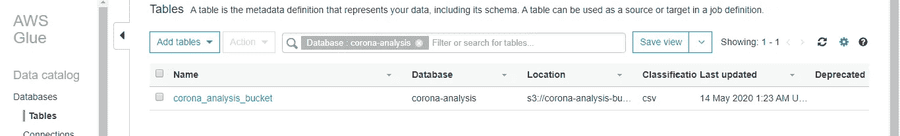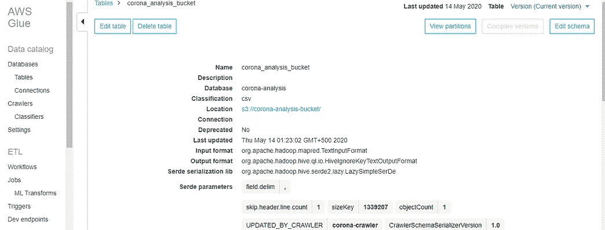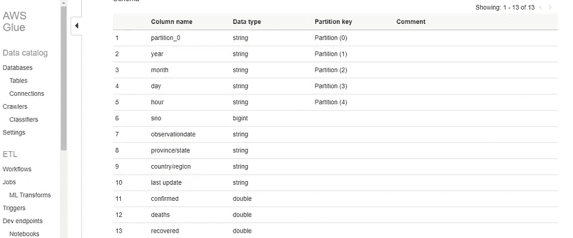

## 4)为 ETL 工作添加胶合工作

既然我们已经编目了我们的数据集，现在我们可以开始添加一个粘合工作，它将在我们的数据集上完成 ETL 工作。

*   在左侧菜单中，单击“作业”并添加一个新作业。Glue 可以自动生成一个 python 或 pyspark 脚本，我们可以用它来执行 ETL 操作。然而，在我们的例子中，我们将提供一个新的脚本。

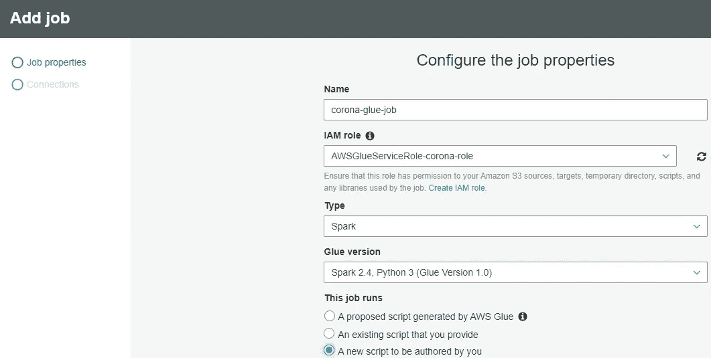

*   按如下方式设置作业属性

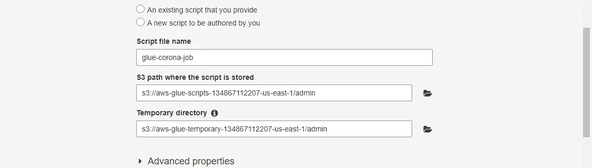

*   将以下内容保留为默认值

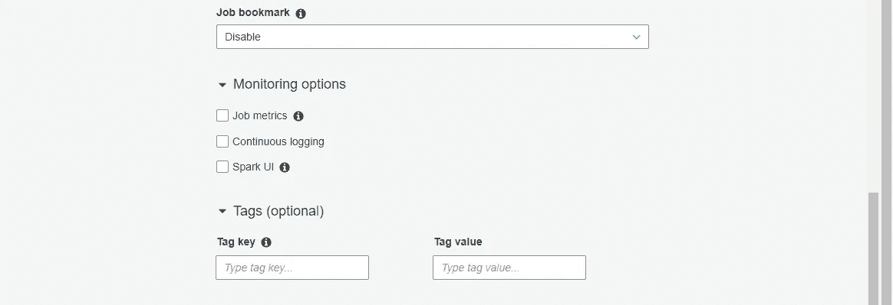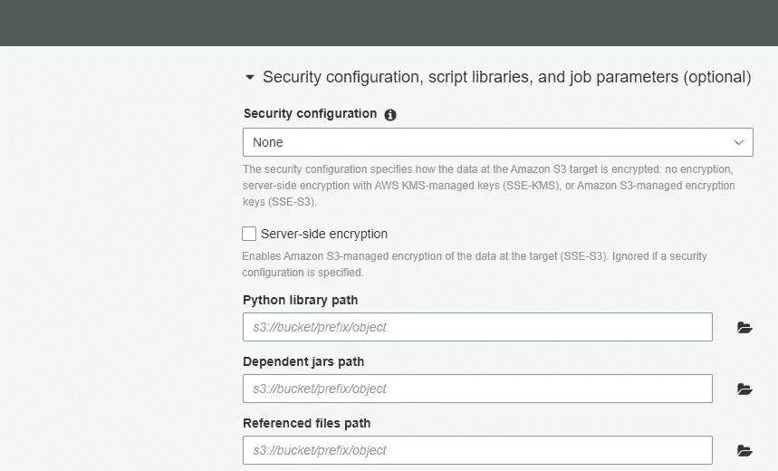

*   将最大容量设置为 2，作业超时设置为 40 分钟。您设置的 dpu 数量(最大容量)越高，您将承担的成本就越多。

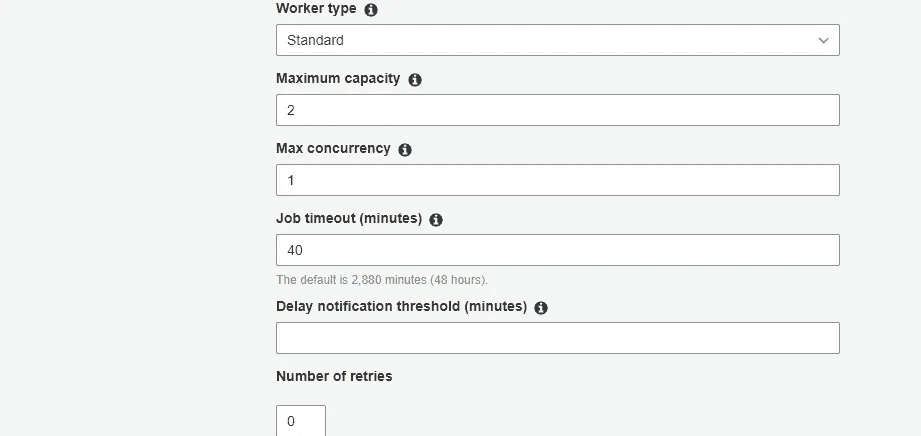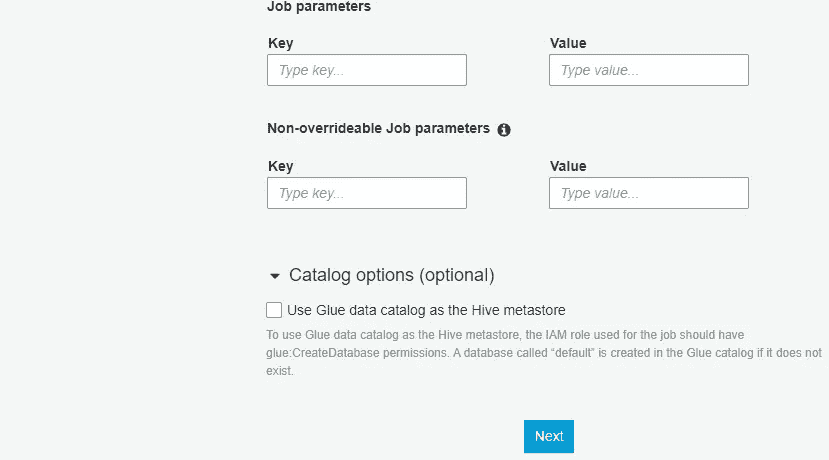

*   因为我们没有连接到任何 RDBMS，所以我们不必设置任何连接。单击“保存作业并编辑脚本”。

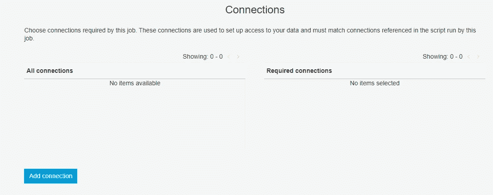

*   我们将看到以下屏幕。将我的 [GitHub 库](https://github.com/furqanshahid85-python/AWS-Glue-Pyspark-ETL-Job)中的代码复制粘贴到下面的编辑器中，点击保存。现在，单击“运行作业”按钮。


*   根据工作的不同，执行作业可能需要一段时间(在本例中为 15 到 30 分钟)。到目前为止，胶合作业有至少 10 分钟的冷启动时间，之后作业开始执行。

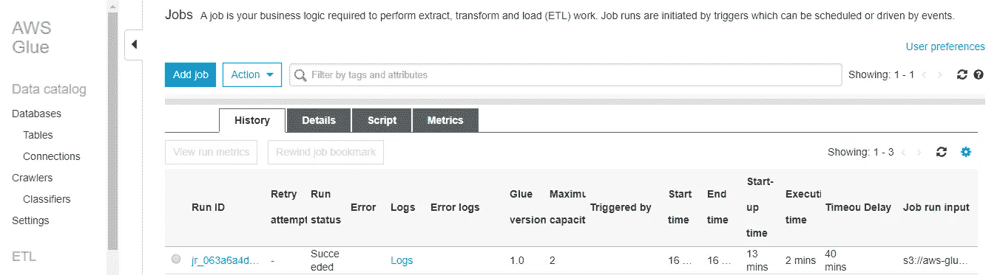

*   如果作业执行成功，您将在胶合作业中指定的目标桶中获得拼花格式的聚合结果。

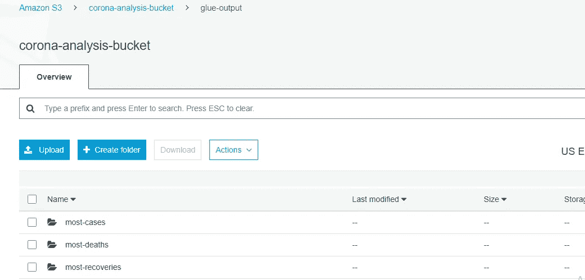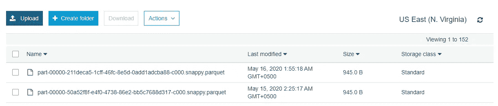

# 了解 Spark 工作

如果您遵循了上面提到的所有步骤，那么您应该可以通过 AWS Glue 成功执行 ETL 作业。在这一节中，我将深入研究执行实际 ETL 操作的 Spark 代码。

## 胶水和火花导入和参数

在最顶端，我们有必要的胶水和火花进口。

导入后，我们有几个参数设置。这包括获取作业名、设置 spark 和 glue 上下文、初始化作业、定义目录数据库和表名以及 s3 输出路径。

## 提取

ETL 操作的“提取”部分除了连接到某个数据存储并从中获取数据之外什么也不做。代码的提取部分执行以下操作:

*   使用粘附目录中的创建粘附动态框架。已经提供了目录数据库和表名。
*   创建动态帧后，我们使用 **toDF()** 方法将其转换为 Spark 数据帧。转换为 spark 数据帧将允许我们使用所有的 spark 转换和动作。

## 改变

在 ETL 操作的“转换”部分，我们对数据应用不同的转换。代码的转换部分执行以下操作:

*   首先，我们在 spark 中使用 **drop()** 方法删除“最后更新”列(没有特殊原因)。
*   然后使用 spark 中的 **dropna()** 方法删除任何包含 4 个以上空字段的行。
*   然后，我们使用 spark 中的 **fillna()** 方法，用自定义值“na_province_state”填充“province/state”列中缺少的值。
*   接下来，我们对数据集执行聚合。已经执行了 3 个不同的聚合。我们检查一个国家/地区的哪个省/州有最多的病例、最多的死亡和最多的康复。这是通过使用 **groupBy()** 方法将记录按**省/州和国家/地区**列分组，使用 **max()** 方法将记录与 **max(已确认)、max(死亡)和 max(已恢复)**列聚合，然后使用 **orderBy()** 方法将它们按降序排序来完成的。
*   最后，我们使用 **fromDF()** 方法将数据帧转换回 Glue DynamicFrame，并将结果保存在 S3 中。它接受三个参数 dataframe、glue 上下文和结果 DynamicFrame 的名称。

## **加载**

在 ETL 操作的加载部分，我们将转换后的数据存储到一些持久存储中，比如 s3。代码的加载部分执行以下操作:

我们使用 DynamicFrame()的 **from_options()** 方法将结果保存到 s3。该方法采用以下参数:

*   **frame** :我们要写的 DynamicFrame。
*   **connection_type** :我们正在写入的目标数据存储，在本例中是 s3。
*   **connection_options** :这里我们指定目标 s3 路径和数据格式(本例中为 parquet)来保存数据。
*   **transformation_ctx** :可选的转换上下文。

所有 3 个聚合结果都以拼花格式保存在目标路径上。

# 摘要

在本文中，我们学习了如何使用 AWS Glue 在 Spark 中进行 ETL 操作。我们学习了如何设置数据源和数据目标，创建爬虫来编目 s3 上的数据，并编写 Glue Spark 作业来执行提取、转换和加载(ETL)操作。

完整的 spark 代码可以在我的 GitHub 资源库中找到:

[](https://github.com/furqanshahid85-python/AWS-Glue-Pyspark-ETL-Job) [## furqanshahid 85-python/AWS-Glue-Pyspark-ETL-Job

### 该模块对 noval corona 病毒数据集进行统计分析。具体实施如下…

github.com](https://github.com/furqanshahid85-python/AWS-Glue-Pyspark-ETL-Job) 

感谢你阅读❤.