# 利用 Tesseract 和 OpenCV 从 RAOB 软件生成的图像中提取空气稳定指数数据

> 原文：<https://towardsdatascience.com/extracting-air-stability-index-data-from-image-generated-by-raob-software-using-tesseract-and-92eece2d4439?source=collection_archive---------61----------------------->

## 如何正确裁剪图像以提高立方体性能的说明

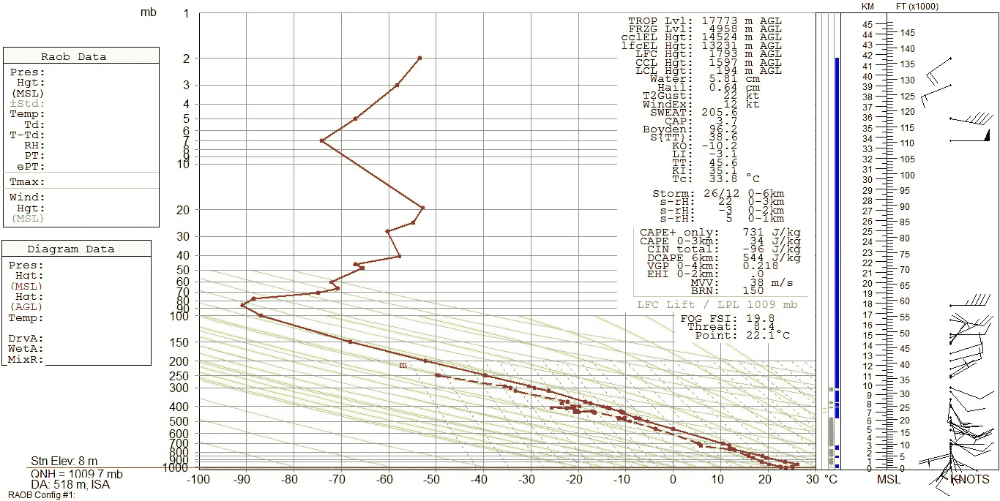

作者图片

# 动机

RAOB 探空仪是气象学家处理高空数据的主要软件。气象学家用它来绘制当地的大气分布图，并获得当地大气的稳定指数，以帮助他们预测天气。大多数情况下，我们需要大量处理这些指数数据，例如，在 30 年内对其进行平均以获得正常值，在地图上绘制(来自多个地方的指数)。**问题是，这些指标出现在当地大气剖面图旁边的**图像中。所以，你需要**记下每一张 RAOB 图像**中的每一个索引，然后才能处理它。这是一项非常平凡和令人疲惫的任务。我们需要一个工具来从图像中自动提取这些索引。

# 宇宙魔方来了

[安东](https://unsplash.com/@uniqueton?utm_source=medium&utm_medium=referral)在 [Unsplash](https://unsplash.com?utm_source=medium&utm_medium=referral) 上拍照

宇宙魔方是一种光学字符识别工具。使用**是将图像**中的文本数据提取到文本文件或你需要的任何东西中。你可以在这里找到它。让我们安装并测试它。让我们看看它的性能是否与下图相符。

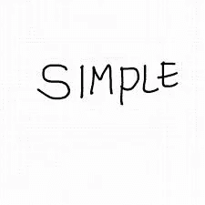

这是结果

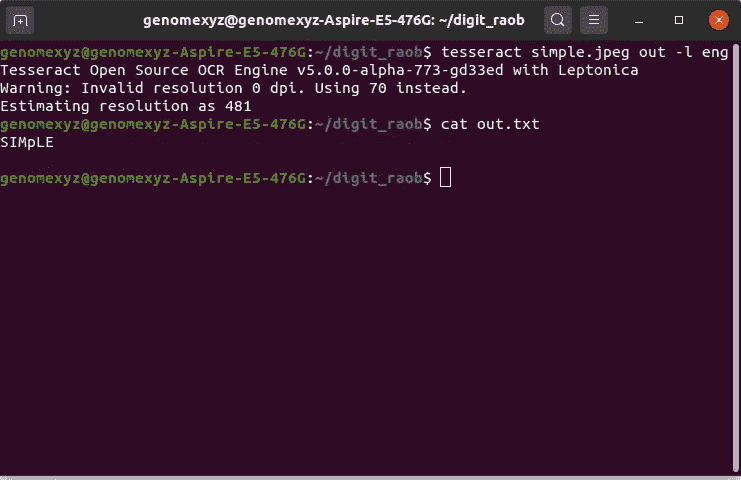

结果很完美！让我们看看它是否能处理真实的 RAOB 图像。我们将使用这个样本图像。

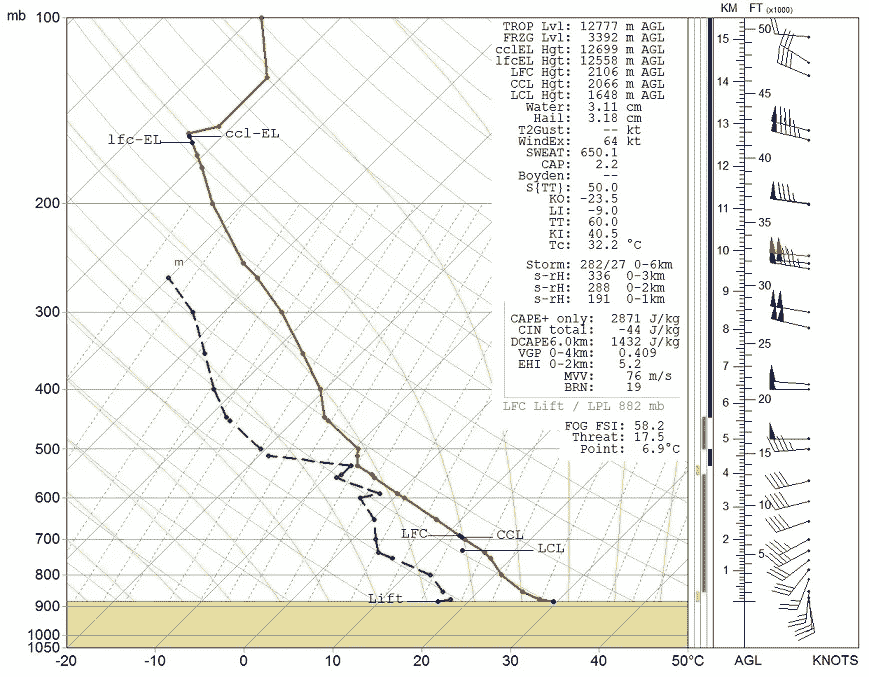

作者图片

结果是

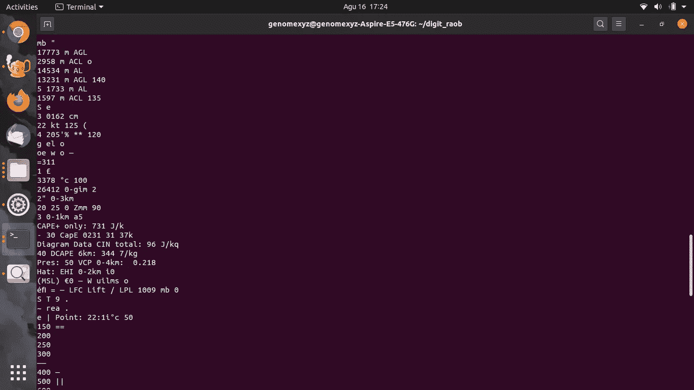

因为它的源图像不是结构化的文本图像，所以很明显这里提取的字符串的结果是混乱的。我们不能把它用于我们的计划。此外，这里有一些被 tesseract 错误识别的字符，并且几乎所有我们想要提取的索引字符串都没有被提取。

**每个目标检测/识别算法总是定义其感兴趣区域(RoI)** 。如果它的 ROI 是混乱的，那么它被错误识别的可能性就更大。让我们通过使用 tesseract 包装库来看看它的 RoI，这里我们将使用`pytesseract`。这是代码

结果是

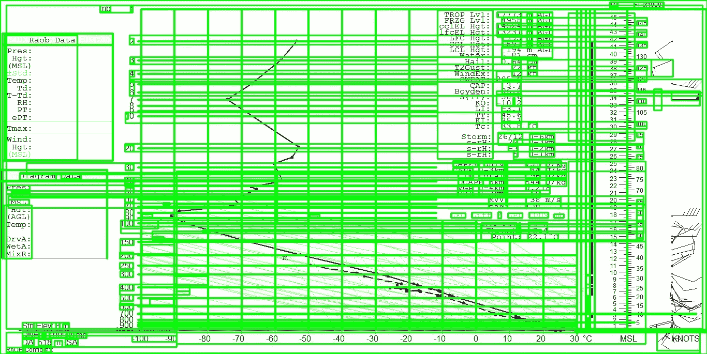

看，它的投资回报率非常混乱。有一些图像不是一个角色，但却成为 RoI-ed。我们要提取的只是这里的这一段(下面红框中的那一段)。

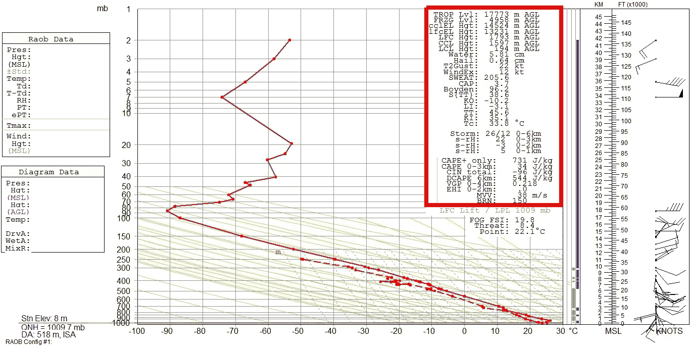

我的猜测是宇宙魔方的性能变得很差是因为在原来的 RAOB 图像中有许多“干扰”。让我们看看，如果我们裁剪图像，只留下下面的索引部分。

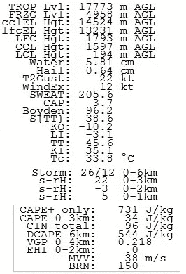

让我们用这张图片来看看宇宙魔方的投资回报率。

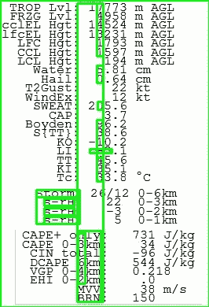

我们从这张图片中得到的字符串是

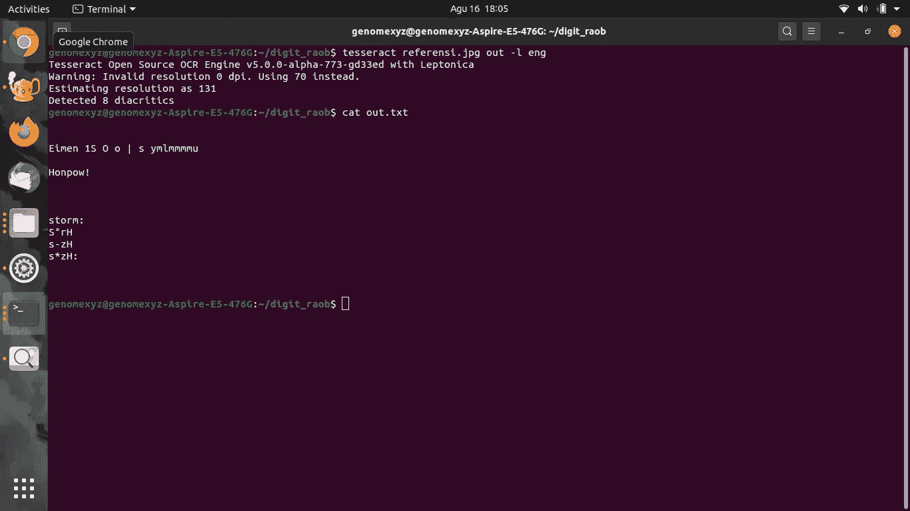

还是穷。让我们裁剪图像，只留下一个包含 1 个索引的字符串。

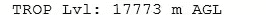

运行宇宙魔方，结果是

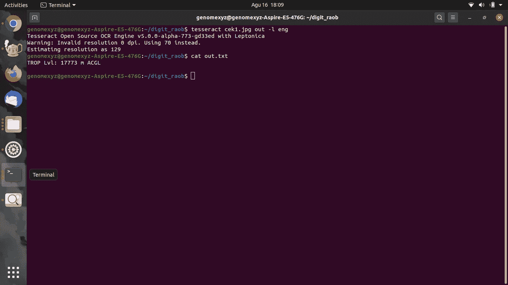

当不再有“干扰”时，它终于完美地提取了索引。所以现在**我们需要自动裁剪原始图像，只留下每个现有索引**的索引字符串。我们做了一个硬代码来自动裁剪图像，但是当图像有微小的变化时，我们必须重新校准代码。让我们做一个更优雅的解决方案。我们将使用相似性度量算法。我们必须提供一个字符串索引的图像样本，并将其与整个原始图像进行匹配，以找到索引字符串的位置。

# OpenCV 拯救世界

实际上，我们从一开始就已经使用 OpenCV 来读取图像文件。现在，我们将使用 OpenCV 函数`matchTemplate()`来匹配我们裁剪的字符串索引，以找到索引值的位置。**找到位置后，扩展它的裁剪区域以包含索引值，然后裁剪它并将其提供给宇宙魔方，这样它就可以提取索引值**。例如，我们想用这个图像模板提取对流层顶的数据。

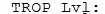

在我们找到它的位置后

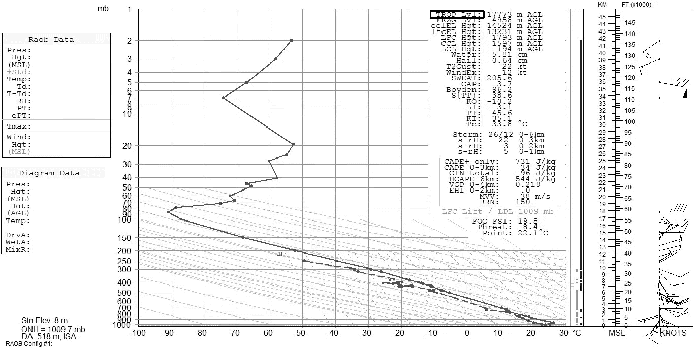

扩大种植的“面积”

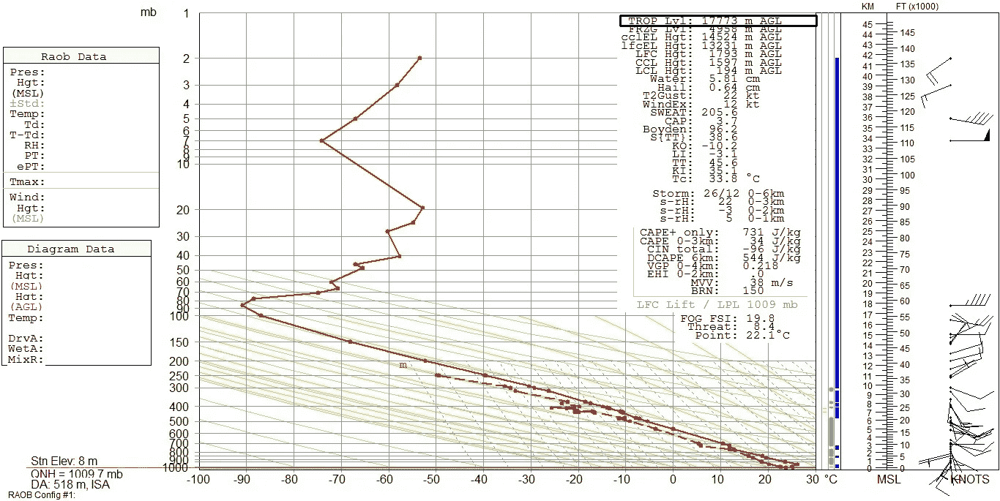

把它输入宇宙魔方，我们就得到了数据。哦，不！我不知道为什么，但是在我们裁剪图像后**宇宙魔方不能识别任何字符。可能是因为裁剪图像部分的区域太窄。那为什么之前的裁剪被宇宙魔方成功识别？不知道，那张图片是我用 pinta**手动裁剪**的。**

根据这个猜测，我们添加了一个大的白色画布作为裁剪图像的背景。

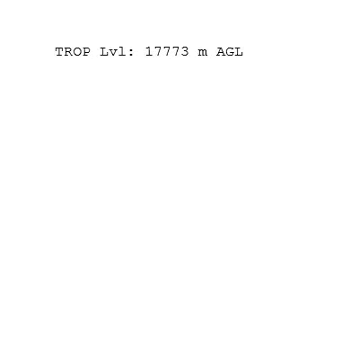

让我们用宇宙魔方提取这个图像，结果是

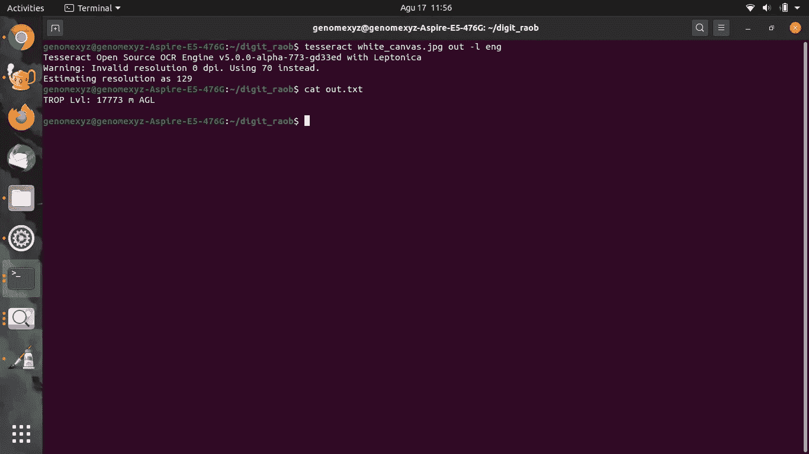

字符串被完全识别。这是我们将用来自动提取 RAOB 图像中的索引数据的算法。对于这个任务，我们将使用`pytesseract`来提取 RAOB 图像。

# 从 RAOB 图像中提取索引

这里是提取 RAOB 图像中的索引的完整代码

在`extract_str()`中，我添加了一些代码来清理一些被宇宙魔方错误识别的字符。

让我们用我们的原始图像来试试这个代码。

结果是

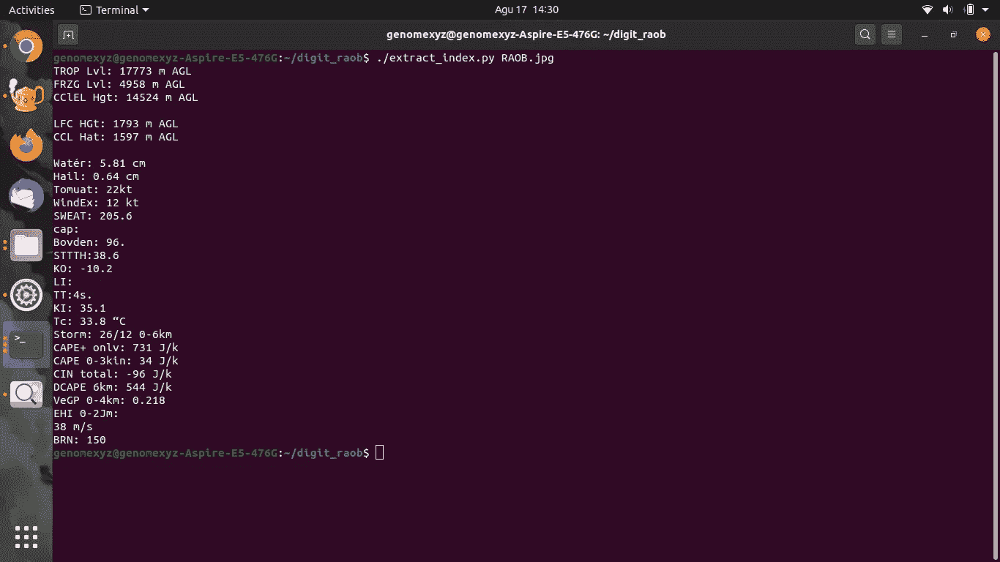

很少有错误识别的字符，并且一些索引没有被检测到。总的来说**这比我们的第一次尝试**要好。

让我们试着用同样的图片，但是不同的是我截屏了 RAOB 的显示，而不是使用从 RAOB 生成的图像。

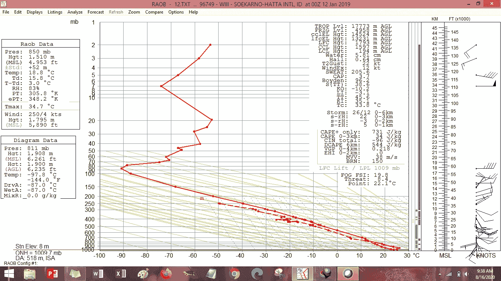

作者图片

结果是

一样。因此，我们的代码足够持久，可以提取 RAOB 图像中的索引，尽管图像中有细微的差异。[此处](https://github.com/genomexyz/raob_tesseract)本帖中我们实验的完整资源库。

# 收场白

这是我们第一次尝试从图像中提取字符。这远非完美。嗯，也许下次我会用 CNN，用 RAOB 使用的字体训练它。另一篇文章再见。

# 参考

[http://opencv-python-tutro als . readthe docs . io/en/latest/py _ tutorials/py _ img proc/py _ template _ matching/py _ template _ matching . html](http://opencv-python-tutroals.readthedocs.io/en/latest/py_tutorials/py_imgproc/py_template_matching/py_template_matching.html)2020 年 8 月 16 日访问