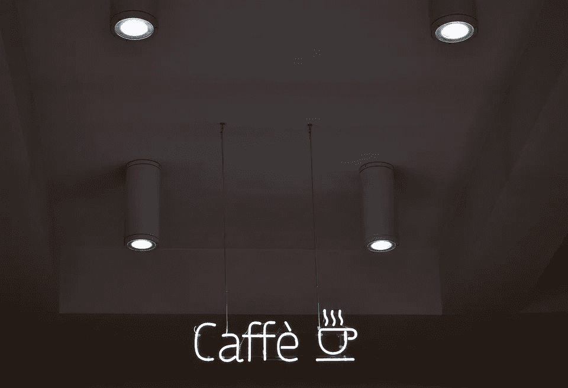

# 提取 OpenCV 人脸检测 DNN 模型的系数

> 原文：<https://towardsdatascience.com/extracting-coefficients-of-opencv-face-detection-dnn-model-7f3d944898b9?source=collection_archive---------34----------------------->

图片来自 pixabay.com

最新的 OpenCV 包括一个深度神经网络(DNN)模块，它带有一个很好的预先训练的人脸检测卷积神经网络(CNN)。与 Haar 等传统模型相比，新模型提高了人脸检测性能。用于训练新模型的框架是 Caffe。然而，一些人试图在其他地方使用这种预先训练好的模型时遇到了困难，例如在英特尔的神经计算棒上运行它，将其转换为其他框架中的模型等。原因主要是自模型被训练以来，Caffe 发生了相当大的变化，使得预训练的模型与最新的 Caffe 版本不兼容。在这篇文章中，我将向您展示一种快速简单的方法，通过提取所有预先训练的神经网络系数，将模型移植到最新的 Caffe 中。

基本想法是两个步骤:

1.提取 OpenCV DNN 人脸检测器中所有神经网络层的系数。

2.使用最新的 Caffe 创建新的神经网络，将提取的系数插入其中，并保存新模型。

使用下面的脚本可以完成步骤 1。

在 pickle 文件中卸载每个网络的参数

在上面的脚本中，`opencv_face_detector.prototxt`是模型配置文件，`opencv_face_detector_model.caffemodel`是带有训练系数的实际模型文件。详细解释可以在 [OpenCV 的官方 Github repo](https://github.com/opencv/opencv/tree/master/samples/dnn/face_detector) 中找到。

使用下面的脚本可以完成第 2 步。

将参数加载到新咖啡馆

一旦您使用新的咖啡馆保存了模型，它现在就与新的咖啡馆兼容了。

我希望这个小技巧对你们有帮助😄。