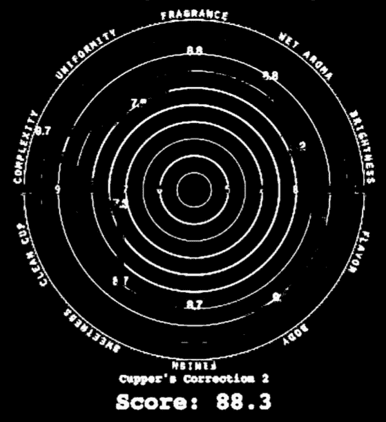
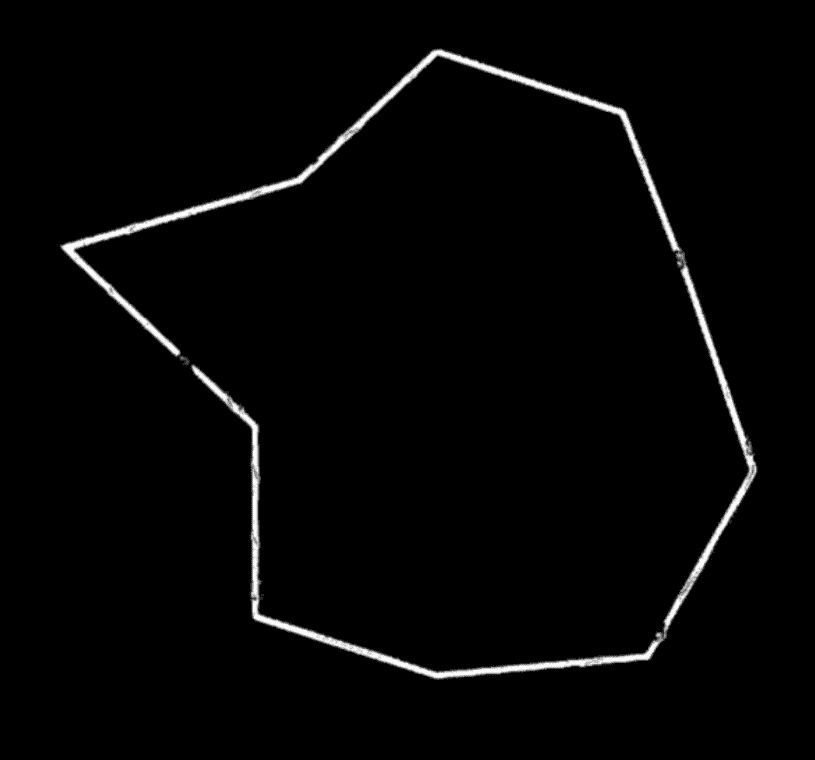
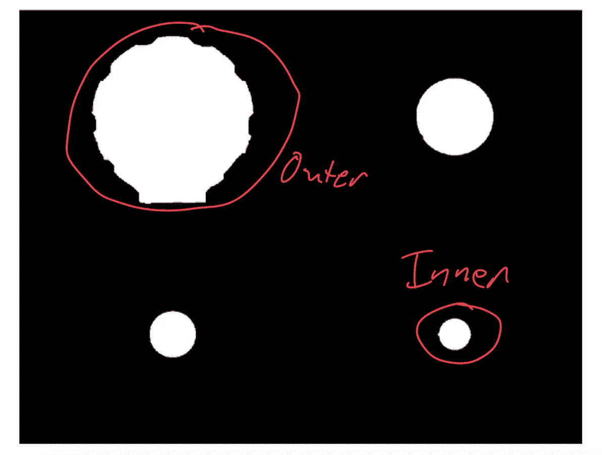
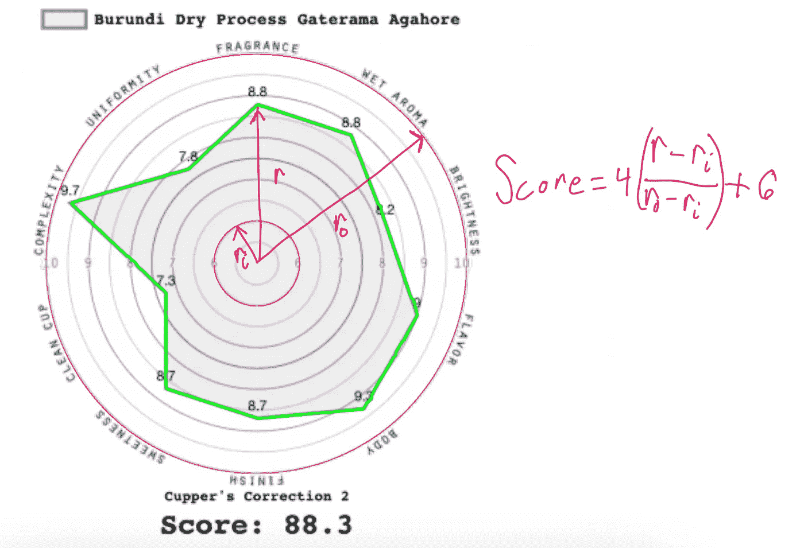
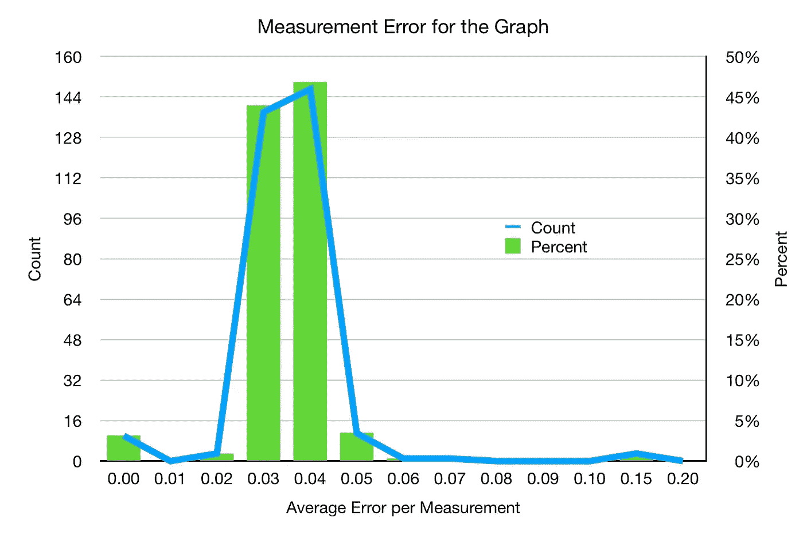

# 从蜘蛛图中提取数据

> 原文：<https://towardsdatascience.com/extracting-data-from-a-spider-graph-99dd12abda4c?source=collection_archive---------44----------------------->

## 当原始数据只存在于图表中时

通常，当人们发表研究时，他们不会分享原始数据集。通常，这些数据集具有更严格的访问权限。我以前遇到过这个问题，我想重新组织一些数据，所以我做了一个半手工的过程来从[发布的图表](https://link.medium.com/WJr00fkhlab)中提取数据。这个问题出现在一个更复杂的图形上，即蜘蛛图。

咖啡分数显示为一个蜘蛛图。我想从一个有 300 多个咖啡得分的数据集中提取，但是所有的数据都在一个蜘蛛图中。这个数据集是以前由[Sweet Maria’s](https://www.sweetmarias.com)出售的所有咖啡的档案，我通常从他们那里购买我的绿咖啡。他们没有将数据保存在数据库中，我对挖掘这些数据很感兴趣。与编写代码从图表中提取数据相比，我可以用更少的时间手动输入数据，但是我担心会感到无聊和出错。

我在这里解释了如何提取数据并测量每个指标的潜在错误率。我能够得到非常精确的数字，误差在 0.05 以内，所以 8 分的误差在 0.6%左右。

来自[https://www . sweet marias . com/Burundi-dry-process-gate Rama-aga hore-6431 . html](https://www.sweetmarias.com/burundi-dry-process-gaterama-agahore-6431.html)经他们同意

# 方法学

我拿起图像，把它编入一个 16 色的小色图。这使得蓝色的数据行很容易分割出来。然后图中的其他线是相似的灰色，我可以把它们分开。我还确保对所有图像使用相同的颜色图，以减少因颜色轻微变化而产生的误差。

作者提供的图片

从环中，我标记了阈值处理后的所有对象。对于每个对象，我填充了对象(在应用了形态学闭合操作之后)，并计算了圆的面积。我还确定了该对象是否包含所有对象的整体质心。然后我通过在一个范围(最小尺寸，最大尺寸)内找到那些物体的最大和最小，找到了内环(分数 6 级)和外环(分数 10 级)。

作者提供的图片

使用形态学闭合操作以及随后的骨架操作来稍微修改刻划线。结果是，对于高频点(或大的过渡)，该点被稍微平滑，这引入了一些误差。

在这里，我用粉紫色的环和绿色的线标出分数。对于内部和外部对象，使用最佳拟合圆霍夫变换来制作环。

作者图片

利用每个分数的已知程度位置，我使用上面的简单等式来计算每个分数。

# 数据误差

我计算出总分，并用手记录下了每张唱片的纸杯校正。我计算总分，并将其与我已经手动提取的总分进行比较。该差值除以 10 个指标，如下所示:

作者图片

大多数误差低于 0.1 甚至 0.05，这意味着误差在四舍五入到 1 位有效数字后很可能不会出现。

图像处理工具对于业余爱好类型的任务非常有用，对于从事艺术的人来说，这是一项非常直接的任务。我很高兴我花时间制作了这个提取工具，而不是手动提取数据，因为这更能激发智力，而不一定能节省时间。

如果你愿意，可以在 Twitter 和 YouTube 上关注我，我会在那里发布不同机器上的浓缩咖啡视频和浓缩咖啡相关的东西。你也可以在 [LinkedIn](https://www.linkedin.com/in/robert-mckeon-aloe-01581595?source=post_page---------------------------) 上找到我。

# 我的进一步阅读:

[咖啡豆脱气](/coffee-bean-degassing-d747c8a9d4c9)

[解构咖啡:分割烘焙、研磨和分层以获得更好的浓缩咖啡](/deconstructed-coffee-split-roasting-grinding-and-layering-for-better-espresso-fd408c1ac535)

[浓缩咖啡的预浸:更好的浓缩咖啡的视觉提示](/pre-infusion-for-espresso-visual-cues-for-better-espresso-c23b2542152e)

[咖啡的形状](/the-shape-of-coffee-fa87d3a67752)

[搅拌还是旋转:更好的浓缩咖啡体验](https://towardsdatascience.com/p/8cf623ea27ef)

[香辣浓缩咖啡:热磨，冷捣以获得更好的咖啡](/spicy-espresso-grind-hot-tamp-cold-36bb547211ef)

[断续浓缩咖啡:提升浓缩咖啡](/overthinking-life/staccato-espresso-leveling-up-espresso-70b68144f94)

[用纸质过滤器改进浓缩咖啡](/the-impact-of-paper-filters-on-espresso-cfaf6e047456)

[浓缩咖啡中咖啡溶解度的初步研究](/coffee-solubility-in-espresso-an-initial-study-88f78a432e2c)

[断奏捣固:不用筛子改进浓缩咖啡](/staccato-tamping-improving-espresso-without-a-sifter-b22de5db28f6)

[浓缩咖啡模拟:计算机模型的第一步](https://towardsdatascience.com/@rmckeon/espresso-simulation-first-steps-in-computer-models-56e06fc9a13c)

[压力脉动带来更好的浓缩咖啡](/pressure-pulsing-for-better-espresso-62f09362211d)

[咖啡数据表](https://towardsdatascience.com/@rmckeon/coffee-data-sheet-d95fd241e7f6)

[被盗浓缩咖啡机的故事](https://towardsdatascience.com/overthinking-life/the-tale-of-a-stolen-espresso-machine-6cc24d2d21a3)

[浓缩咖啡过滤器分析](/espresso-filters-an-analysis-7672899ce4c0)

[便携式浓缩咖啡:指南](https://towardsdatascience.com/overthinking-life/portable-espresso-a-guide-5fb32185621)