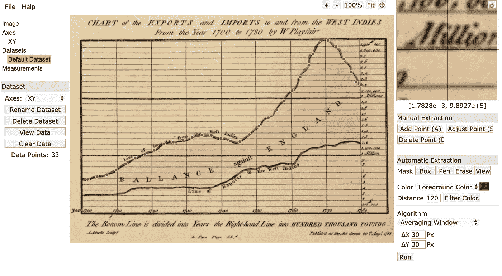
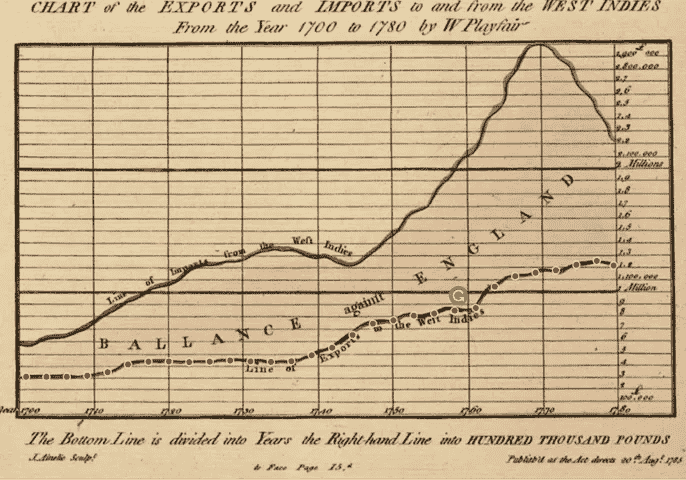

# 从科学论文或图像中提取(数字化)数据

> 原文：<https://towardsdatascience.com/extracting-digitising-data-from-plots-in-scientific-papers-or-images-6e098cb887aa?source=collection_archive---------16----------------------->


西印度群岛进出口图表(1700-1780)——w . play fair。来源: [WikiCommons](https://upload.wikimedia.org/wikipedia/commons/f/f6/1786_Playfair_-_4_Export_%26_Import_to_and_from_the_West_Indies_from_the_year_1700_to_1780.jpg)

我们经常看到感兴趣的图形，并希望将数据应用到我们自己的兴趣和设计中。这种情况经常发生在学术界，在学术界，研究需要与科学期刊和数据可视化中已经存在的研究进行比较，在数据可视化中，历史数据可以被建立和改进(通过添加新的数据/设计)。

## 我们如何提取数据

从图像中提取数据称为数字化。这是将模拟数字转换成量化的数字(数值)格式，用于操作和分析。

最简单的过程是定义一个图中的数据范围，并计算其中一条绘制线上的点的值。为此我们可以利用*[*【WPD】*](https://github.com/ankitrohatgi/WebPlotDigitizer)**。***

## *webplot 数字化仪的使用案例*

*这可以与从 2D (X-Y)图到条形图，三元和极坐标图的绘图范围。WPD 基于网络的本质意味着它可以在一系列操作系统甚至在线界面上运行。您可以在以下网址获得此信息:*

```
*[https://automeris.io/WebPlotDigitizer/](https://automeris.io/WebPlotDigitizer/)*
```

*在这篇文章中，我们举了一个数字来说明在 1700 年到 1780 年间从西印度群岛的贸易中进口和出口的利润。这是 W. Playfair 手绘的可爱图形。在下面的部分中，我们描述了数字化图形的过程，然后用 python 提供了几个提取数据的快速绘图。*

## *数字化过程*

*使用 WPD 软件，一般的数字化过程相对简单。算法功能隐藏在后台，用户只需在界面上更改少量“点击”参数。这一过程概述如下:*

1.  *点击`file` > `Load Image` > `select the type of plot`并上传您的图像。*
2.  *对于`x-y`图，选择您的边界。首先是*最小已知 x 值*，然后是*最大已知 x 值*，接着是*最小和最大已知 y 值**
3.  *输入已知点的值，并选择是否使用了`log`秤(您可以在按下确认按钮后添加额外的配置点。)*
4.  *调整设置，如`mask`(选择要探索的区域)、`foreground`(线条)和`background`颜色，以及`pixel sampling`间隔—注意，有时像素采样间隔内较大的平均区域会产生更好的结果(在示例中使用了 30 个像素)。*
5.  *点击算法框内的`run`。*

*这将产生如下所示的选择。*

**

*WebPlotDigitizer 在线界面的屏幕截图。*

## *数据管理*

*最后，我们可以提取生成的逗号分隔文件(CSV)用于在另一个程序(如 JS、Python、R …)中绘图。python 中使用 pandas 的一个快速示例如下:*

******

***左**:选择出口线。**中间**:进口和出口的折线图。**右侧**:显示两个值之间差异的堆积面积图。*

## ***结论***

*webplot 数字化仪是非常简单的使用程序，有许多实际应用。它的 HTML 和 javascript 特性使它既能在线运行，也能在大多数流行的操作系统上运行。最后，从出版物中提取数据的能力(尤其是原始数据丢失的出版物)使其成为现代科学家的无价工具。*