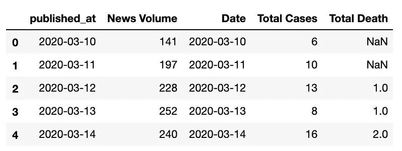
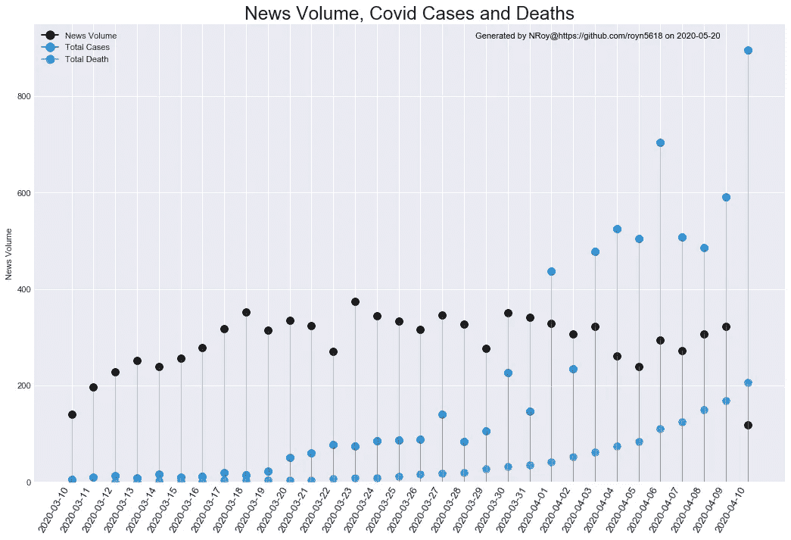
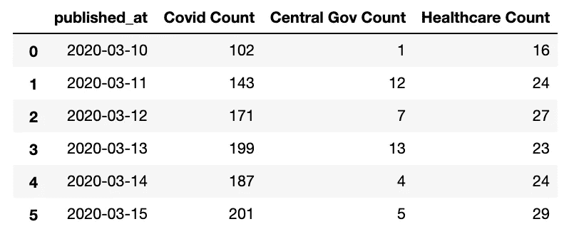
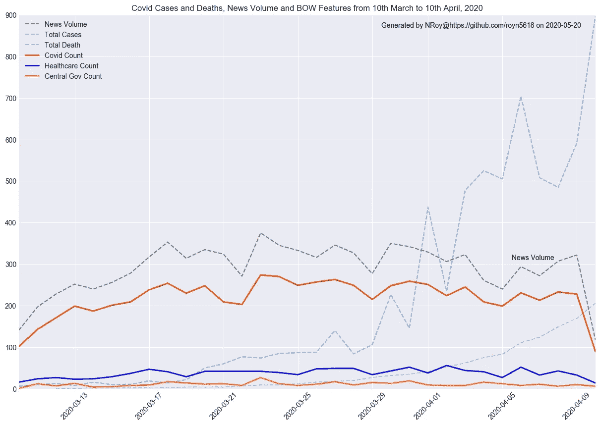
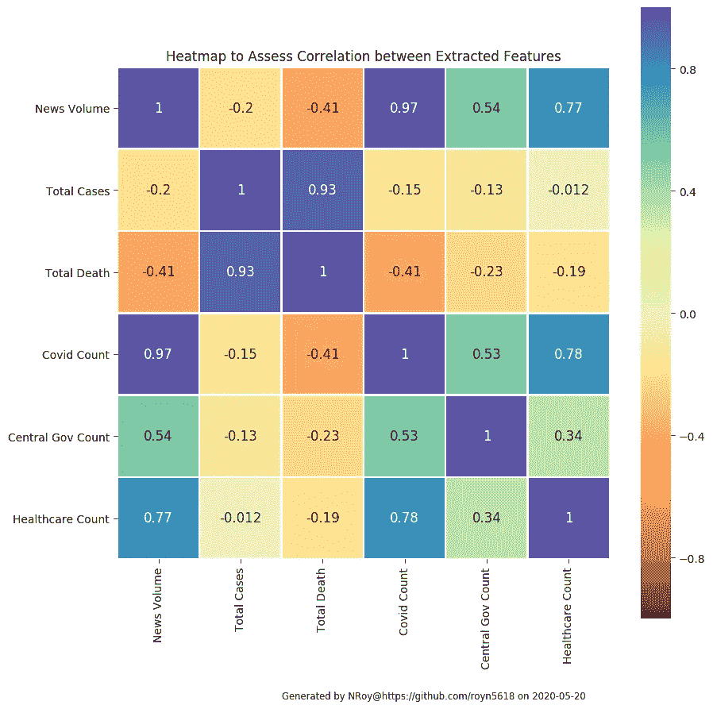
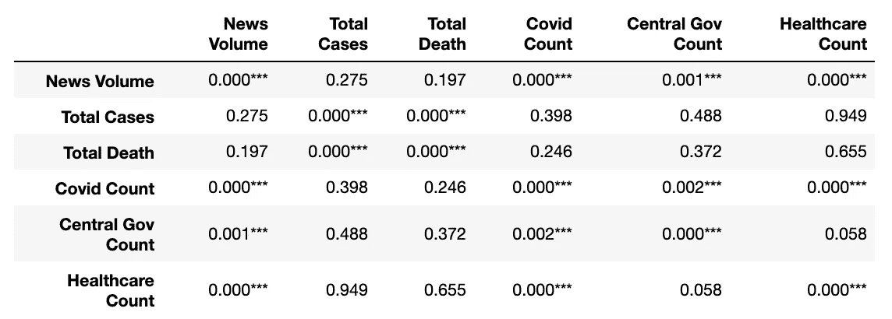

# 从 Covid 的新闻中提取特征:时间序列文本数据建模的简单词袋方法|新冠肺炎文章 2

> 原文：<https://towardsdatascience.com/extracting-features-from-covids-news-a-simple-bag-of-words-approach-for-time-series-text-data-bffe59de76a1?source=collection_archive---------52----------------------->

## [新冠肺炎文字分析](https://towardsdatascience.com/tagged/covid-19-text-analysis)

***编者注:*** [*走向数据科学*](http://towardsdatascience.com/) *是一份以研究数据科学和机器学习为主的中型刊物。我们不是健康专家或流行病学家，本文的观点不应被解释为专业建议。想了解更多关于疫情冠状病毒的信息，可以点击* [*这里*](https://www.who.int/emergencies/diseases/novel-coronavirus-2019/situation-reports) *。*

这是我之前博客的续篇，在那里我探索了出现在印度媒体与新冠肺炎相关的新闻文章中的词汇。在本文中，我对文本进行了进一步的探索，并尝试使用词袋(BoW)方法在从文本中提取的特征之间建立显著的相关性。

# 关于数据源:

*   **新闻文章数据:**新闻文章是用 [**NewsAPI 的**](https://newsapi.org/) **开发者计划刮出来的。**日期范围为**2020 年 3 月 10 日至 4 月 10 日**对于本文，数据集每月增长。
*   **Covid 病例数据:** [维基百科关于新冠肺炎·疫情在印度的文章](https://en.wikipedia.org/wiki/COVID-19_pandemic_in_India)

# 关于资料准备和基础探索:

在我之前的博客中记录了这个关于新冠肺炎数据的系列。它使用传统的记号化、词条化和清理过程，使用 [nltk](http://www.nltk.org/) 和 [Stanford CoreNLP](https://nlp.stanford.edu/) 。

[](/exploring-news-about-covid-19-in-indian-media-nlp-wordcloud-covid-19-article-1-2bcbb127dfb3) [## 探索印度媒体中关于新冠肺炎的新闻| NLP| Wordcloud |新冠肺炎文章 1

### 新冠肺炎改变了全球流行语。在本文中，我研究了我的印度新闻文章数据集，内容是关于…

towardsdatascience.com](/exploring-news-about-covid-19-in-indian-media-nlp-wordcloud-covid-19-article-1-2bcbb127dfb3) 

# 背景:我到底想在这里实现什么？

这也是对所产生的时间序列数据的试验性研究，该数据仅由 30 个数据点组成。我的目标是提取诸如每日新闻量、与医疗保健、新冠肺炎和中央政府相关的每日令牌量等特征，并评估它们与 Covid 病例计数之间是否存在任何强相关性。

# **入门:**

## 1.设置时间序列数据集:

我从维基百科的 excel 文件中提取了 covid 病例和死亡人数数据，并将其读入我的 Jupyter 笔记本。接下来，从我以前的博客中创建的数据集，我通过分组和统计每天发布的新闻数量来提取新闻量，并将它们合并。

**代码:**

```
**import** pandas **as** pd**# Read the data in**
df_covid_stats = pd.read_excel('covid_stats.xlsx')
df = pd.read_pickle(text_data_pickle_file_path)**# Group daily and count news volume**
df_news_vol=df[['published_at','title']].groupby(by='published_at')
                                        .count().reset_index()
df_news_vol.columns = ['published_at', 'News Volume']# Merge Covid-19 stats with news volume data
df_merged = pd.merge(df_news_vol, df_covid_stats,
                     left_on='published_at', right_on='Date')
df_merged.head(5)
```

合并后的数据集如下所示:



合并数据的快照。

## 2.时间序列图:

然后，我绘制了这些点，以可视化和观察这三十天数据的模式。我不想拘泥于传统的折线图，所以下面是棒棒糖时间序列图的代码。看起来很整洁！！

**代码:**

```
**from** matplotlib.lines **import** Line2D
**import** matplotlib.pyplot **as** plt
**import** matplotlib **as** mpl
**import** seaborn **as** sns**# initializing configs**
columns = ['News Volume', 'Total Cases', 'Total Death']
colors = ['black', '#007acc', '#4db8ff']
custom_text = "Some Text"
plt.style.use('seaborn-darkgrid')
fig, ax = plt.subplots(figsize=(16,10), dpi= 80)**# Plot each column using the configs**
for i, column in enumerate(columns):
    ax.vlines(x=df_merged.index, ymin=0, ymax=df_merged[column],
              color='grey', linewidth=1, alpha=0.5)
    ax.scatter(x=df_merged.index, y=df_merged[column], s=75,
               color=colors[i])**# Setting up Title, Label, XTicks and Ylim**
ax.set_title('News Volume, Covid Cases and Deaths', 
             fontdict={'size':22})
ax.set_ylabel('News Volume')
ax.set_xticks(df_merged.index)
ax.set_xticklabels(df_merged.index.date, rotation=60, 
                   fontdict={'horizontalalignment': 'right',
                             'size':12})
ax.set_ylim(bottom=0)**# Setting up Legends** 
legend_elements = [Line2D([0], [0], marker='o', color='black',
                          label='News Volume', markersize=10),
                   Line2D([0], [0], marker='o', color='#007acc',
                          label='Total Cases', markersize=10),
                   Line2D([0], [0], marker='o', color='#4db8ff',
                          label='Total Death', markersize=10)]
ax.legend(handles=legend_elements, loc='upper left'plt.show()
```

**时间序列图:**



**观察:**

很明显，covid 病例数和死亡数在关注期内将呈指数级增长。但是，有趣和令人沮丧的是，新闻文章并没有显示出随着 covid 病例或死亡人数的变化。相反，如果你能发现，在新闻量数据中有三到五天的上升和下降周期模式。此外，在 covid 病例开始时，数量保持上升趋势，这也是一种预期行为。新闻数量随后保持一个均匀的水平，略有下降趋势，不再上升。所以，我们需要更多的数据！这有点道理，除了你可能已经注意到的异常值(我无法修复，因为我在开发计划中)，但这个图表肯定会随着时间的推移而改善。

## 3.定义单词包特征和容量

因此，在这一步中，我直观地收集了一些与 covid、医疗保健和中央政府相关的令牌作为我的 BoW 特征，并循环浏览新闻标题，以获得每个 BoW 组的每篇新闻文章的这些令牌的计数。然后，我将每天的计数进一步分组，并将它们相加，得出我的时间序列特征。

**代码:**

```
**# Bag-of-Words**
covid_words_list = ['covid-19','corona', 'coronavirus']
central_government_list = ['government', 'modi', 'pm']
healthcare_list = ['doctor', 'healthcare', 'vaccine', 'cure',  
                   'hospital', 'test', 'testing']**# Iteration Function**
def token_counts(x, words_list):
    title_tokens = x[0]
    if len(words_list) == 1:
        return title_tokens.count(words_list[0])
    elif len(words_list) >1 :
        return sum([title_tokens
                    .count(each_word) for each_word in words_list])
    else:
        raise Exception("Recheck Wordlist")**# Applying lambda function to apply token_counts() on each row** df['Covid Count'] = df.title_cleaned.apply(lambda x: token_counts(x, 
                                                  covid_words_list))
df['Central Gov Count'] = df.title_cleaned.apply(lambda x:   
                           token_counts(x, central_government_list))
df['Healthcare Count'] = df.title_cleaned.apply(lambda x:    
                                   token_counts(x, healthcare_list))df_bow_extended = df[['Covid Count', 'Central Gov Count',   
                      'Healthcare Count','published_at']]
                      .groupby(by='published_at')
                      .sum().reset_index()
df_bow_extended
```

**分组数据:**



# 顺便说一下…

我的弓看起来很简单，不是吗？查看下面的“后续步骤”部分。我将在接下来的博客中为我的弓做一些主题建模，这些博客将会有更多的数据点和标记来实验！


[Ayo Ogunseinde](https://unsplash.com/@armedshutter?utm_source=medium&utm_medium=referral) 在 [Unsplash](https://unsplash.com?utm_source=medium&utm_medium=referral) 上拍摄的照片

## 4.连接完整的数据并绘制时间序列

接下来，我将这些特征与之前的我的时间序列数据集合并，生成了下面的时间序列图，以便直观地寻找模式。这一次，我使用普通的多线图表，以避免不必要的混乱，因为有六条线进行观察。

**代码:**

```
plt.close()**# Setting up Configs**
columns = ['News Volume','Total Cases', 'Total Death']
columns_bow = ['Covid Count', 'Healthcare Count', 
               'Central Gov Count']
colors = ['black', '#007acc', '#4db8ff']
colors_bow = ['#cc3300', '#0000e6', '#ff8533']plt.style.use('seaborn-darkgrid') 
fig, ax = plt.subplots(figsize=(15, 10), dpi=100)**# Plotting the Time-Series**
for i, column in enumerate(columns):
    ax.plot('published_at', column, '--', data=df_merged_extended,  
            color=colors[i], alpha=0.5)for i, column in enumerate(columns_bow):
    ax.plot('published_at', column, data=df_merged_extended, 
            color=colors_bow[i], linewidth=2)**# Setting up Title, XTicks, Xlim, Ylim and Legend**
plt.title('Covid Cases and Deaths, News Volume and BOW Features from 
           10th March to 10th April, 2020')
plt.xticks(rotation=45)
plt.ylim(0, 900)
plt.xlim(min(df['published_at']), max(df['published_at']))
# print(ax.get_xlim())
# print(ax.get_ylim())
plt.text(737520.5, 310, 'News Volume', size='medium', color='black')
plt.legend()plt.show()
```

**时间序列图:**



**观察:**

在这一时期，医疗保健和政府话题的参与相当一致。这一趋势并没有显示出 covid 病例和死亡人数有任何特别的变化。Covid 主题和新闻文章量如预期的那样具有良好的相关性。因此，为了证明我们的观察，让我们在下一节中获得相关性。4 月 10 日，所有 BoW 功能均下降，显示 covid 案例数最高。同样，根据我们在数据集中看到的情况，这是意料之中的，因为这似乎是异常值的影响。

## 5.使用热图评估相关性

为了进行关联，我使用了熊猫的内置[。corr()函数](https://pandas.pydata.org/pandas-docs/stable/reference/api/pandas.DataFrame.corr.html)使用皮尔逊相关系数(ρ)来测量连续特征之间的线性关系，并返回一个 NxN 矩阵，其中 N =特征数量。您还可以使用我们在下一步中讨论的 Scipy。

。corr()自动跳过了我的 *published_at* 专栏。因此，在我得到相关矩阵后，我以完整的正方形格式绘制它，因为*我喜欢完整正方形的热图*，即使我意识到冗余信息的显示。

然而，我包括了其他两种格式的代码——下面的三角形包括和不包括对角线。你可以转置并在 *mask_matrix* 上得到上面的三角形。

**代码:**

```
**# Obtain Correlation**
corr = df_merged_extended.corr()**# Set up plt**
plt.style.use('default')
plt.figure(figsize=[10,10])**# Heat-map 1 : Full Square**sns.heatmap(corr, annot=True, vmin=-1, vmax=1, center=0, 
            square=True, cmap='Spectral', annot_kws={"size": 12}, 
            linewidths=1, linecolor='white')**# Heat-map 2: Lower Triangle excluding diagonal**c=np.zeros_like(corr)
mask_matrix[np.triu_indices_from(mask_matrix)] = True
sns.heatmap(corr, annot=True, vmin=-1, vmax=1, center=0,   
            square=True, cmap='Spectral', mask = mask_matrix)**# Heat-map 3: Lower Triangle including diagonal**mask_matrix=np.zeros_like(corr)
mask_matrix[np.triu_indices_from(mask_matrix)] = True
mask_matrix = 1 - mask_matrix.T
sns.heatmap(corr, annot=True, vmin=-1, vmax=1, center=0,   
            square=True, cmap='Spectral', mask = mask_matrix)**# Set up Title and Text**
plt.title("Heatmap to Assess Correlation between Extracted  
           Features")
```

**热图**



**观察:**

有两个不同集群——

*   *总病例*和*总死亡*
*   船头特写和*新闻卷*

这些单独的特征组之间确实具有正相关性。这些集群彼此负相关。所以，我想，现在我们需要衡量相关性的可靠程度。此时，我们将我们的零假设公式化为——所有特征都是相互独立的。让我们看看下一步结果如何。

## 6.p 值和显著性评估

为了评估我们零假设的准确性，我使用了 [Scipy 的](https://docs.scipy.org/doc/scipy/reference/generated/scipy.stats.pearsonr.html) pearsonr 函数，该函数返回 Pearson 的相关系数(ρ)以及 p 值。下面是我用来评估的代码。我使用了三个级别的统计显著性评估— .01、. 02 和. 05。让我们看看下面的结果:

```
**from** scipy.stats **import** pearsonrdef assess_corr(col1, col2):
    r, p = pearsonr(col1, col2)
    return r, pdf_merged_extended.fillna(value=0, inplace=True)
df_merged_extended.set_index('published_at', inplace=True)df_stat_sig = pd.DataFrame(columns=df_merged_extended.columns,  
                           index=df_merged_extended.columns)for col1 in df_merged_extended.columns:
    for col2 in df_merged_extended.columns:
        #print("{} and {}".format(col1, col2))
        r, p = assess_corr(df_merged_extended[col1],
                           df_merged_extended[col2])
        if p < 0.01:
            df_stat_sig[col1][col2] = "{:.3f}".format(p) + "***"
        elif p < 0.02:
            df_stat_sig[col1][col2] = "{:.3f}".format(p) + "**"
        elif p < 0.05:
            df_stat_sig[col1][col2] = "{:.3f}".format(p) + "*"
        else:
            df_stat_sig[col1][col2] = "{:.3f}".format(p)df_stat_sig
```

**输出:**



**观察:**

所有弓形特征都与*新闻量* e 强相关，具有小于 0.01 的统计显著性。同*总例数*和*总死亡数。*所以我们可以拒绝*——*

*   新闻计数独立于 Covid 计数、中央政府计数和医疗保健计数
*   总病例数独立于总死亡数
*   Covid 计数独立于中央政府和医疗保健计数。

我们几乎可以拒绝医疗保健独立于中央政府的观点，尽管风险只有 5%多一点。我希望在下一篇关于这个数据集的时间序列分析的博客中，当我遍历大量数据点时，这一点会被最小化。

# **下一篇:**

万岁！我有一些积极的结果，对这个实验的进展有积极的感觉。但是你有没有注意到在弓的特征定义中真正缺乏思考？如果我做了所有的思考，那么我的代码会做什么呢？


Sherise 拍摄的照片。 on [Unsplash](https://unsplash.com?utm_source=medium&utm_medium=referral)

因此，在下一篇博客中，我将研究一些从爱尔兰新闻上收集的数据，并检查一些令牌与印度令牌有何不同。请记住，这些国家在许多方面彼此不同，这将是一项有趣的研究，以了解媒体在第一世界国家和发展中经济体中的相似或不同之处。

***我还把数据集扩展到了下个月，所以我有更多的数据可以处理。耶！！！***

此外，在即将到来的博客中，我将评估新闻的主题，并将使用这些主题中出现的术语来丰富我的博客。此外，如果代码从同一个数据集创建字典，我就不必担心匹配标记。所以，敬请期待！

# 关于新冠肺炎文章系列:

这是我用我的新冠肺炎新闻媒体数据集写的第二篇博客，将会写更多关于我的操作和实验的文章。数据集也将增长更多。如果您有兴趣了解这个数据集是如何形成的，请跟我来！这是我以前的博客。

# Github 链接到这个博客的笔记本:

[](https://github.com/royn5618/Medium_Blog_Codes/blob/master/Covid-Blog-Codes/Covid-Time-Series-Analysis-Prelim.ipynb) [## royn5618/Medium_Blog_Codes

### permalink dissolve GitHub 是超过 5000 万开发人员的家园，他们一起工作来托管和审查代码，管理…

github.com](https://github.com/royn5618/Medium_Blog_Codes/blob/master/Covid-Blog-Codes/Covid-Time-Series-Analysis-Prelim.ipynb) 

# Github 链接到该数据集上的所有笔记本:

[](https://github.com/royn5618/Medium_Blog_Codes/tree/master/Covid-Blog-Codes) [## royn5618/Medium_Blog_Codes

### 此时您不能执行该操作。您已使用另一个标签页或窗口登录。您已在另一个选项卡中注销，或者…

github.com](https://github.com/royn5618/Medium_Blog_Codes/tree/master/Covid-Blog-Codes) 

**我的链接:** [中型](https://medium.com/@nroy0110)|[LinkedIn](https://www.linkedin.com/in/nabanita-roy/)|[GitHub](https://github.com/royn5618)

***感谢光临。我希望你喜欢阅读这篇博客。***