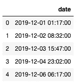
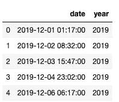
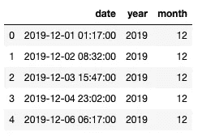
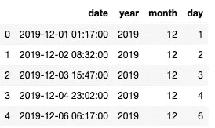
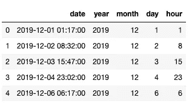
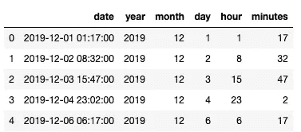
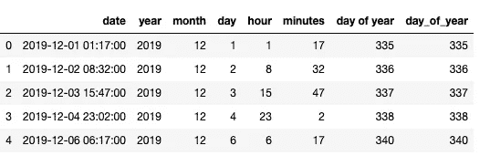
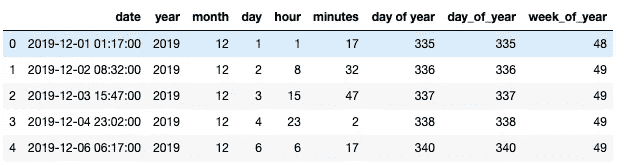
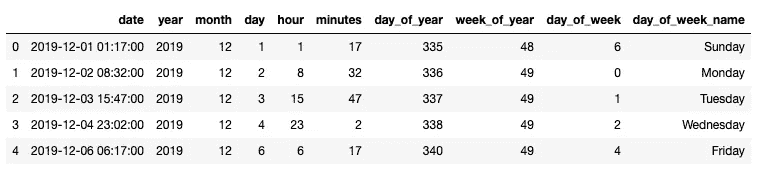
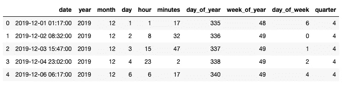

# 从日期中提取特征

> 原文：<https://towardsdatascience.com/extracting-features-from-dates-fbb7f19972fd?source=collection_archive---------36----------------------->

## 了解如何从熊猫的数据中获取有用的特征。


布鲁克·拉克在 [Unsplash](https://unsplash.com/s/photos/dates-numbers-calendar?utm_source=unsplash&utm_medium=referral&utm_content=creditCopyText) 拍摄的照片

一旦你开始使用熊猫，你会注意到日期有它们自己的数据类型。这是非常方便的，你可以用它来排序细胞根据日期和重要的时间序列分析和寻找趋势的数据。日期本身实际上传达了更多的信息，你只要看看简单的时间戳就能想到。

在本文中，您将学习如何从 pandas 的数据对象中提取所有可能的特征。每个特征类型的提取都将通过示例代码详细讨论。阅读完本文后，您将能够提取以下信息:

*   年
*   月
*   天
*   小时
*   分钟
*   一年中的某一天
*   一年中的第几周
*   星期几
*   四分之一

**padas 中的日期类型**

让我们开始在 pandas 中创建一些数据时间对象。我们可以通过下面的方式使用 pandas date_range 函数来实现。

```
import datetime
import numpy as np
import pandas as pd

dates = pd.Series(pd.date_range('2019-12-01 1:17', freq='31H15min',  periods=5))
df = pd.DataFrame(dict(date=dates))
df.head()
```



如您所见，我们创建了一个数据帧，其中有一列名为 *date* ，我们用五个不同的时间戳填充它。第一个时间戳是 2019 年 1 月 12 日凌晨 1: 17，随后的时间戳使用 freq 参数增加 31 小时 15 分钟。

这足以演示一些简单的特征提取，所以让我们开始吧。

**获取年份功能**

我们将从获得年份特性开始。这很简单，我们只需在*日期*列调用*日期.年份*。请注意，我将把结果保存为数据框中的新列。

```
df['year'] = df.date.dt.year
df.head()
```



您可以看到，所有年份功能都保存在“年份”列中，对于所有行，它都等于 2019 年。

**获取月份特征**

以类似的方式，我们现在将为每一行得到一个月。

```
df['month'] = df.date.dt.month
df.head()
```



**获取日功能**

现在让我们得到这个月中的某一天。

```
df['day'] = df.date.dt.day
df.head()
```



**获取小时功能**

现在让我们从日期开始算一个小时。

```
df['hour'] = df.date.dt.hour
df.head()
```



**获取细微特征**

让我们来看一分钟特写。

```
df['minutes'] = df.date.dt.minute
df.head()
```



**获取一年中的某一天功能**

现在让我们来看看一年中的某一天。请注意，这是一年中的第几天，不同于我们之前提取的一个月中的第几天。

```
df['day_of_year'] = df.date.dt.dayofyear
df.head()
```



**获取一年中的星期功能**

我们可以提取的另一个重要特征是一年中的星期。

```
df['day_of_year'] = df.date.dt.dayofyear
df.head()
```



**获取星期几功能**

获取星期几功能可能是我最喜欢的从数据中提取的功能，因为它允许您进行每周分析，并且许多数据都有每周模式。

```
df['day_of_week'] = df.date.dt.dayofweek
df['day_of_week_name'] = df.date.dt.weekday_name
df.head()
```



我们创建了两个列*星期几*，其中星期几用数字表示(星期一=0，星期日=6 ),以及*星期几名称*列，其中星期几用字符串形式的星期几名称表示。我喜欢两种形式都有，因为数字形式使数据为机器学习建模做好准备，当我们分析数据时，字符串形式在图形上看起来很好。

另外，请注意，当在 date 上调用 dt.weekday_name 时，它用下划线拼写，这与我们提取的其他特征不同。

**获取四分之一特征**

我们将提取的最后一个特征是一年中的一个季度。

```
df['quarter'] = df.date.dt.quarter
df.head()
```



**获得更多功能**

上面我们已经介绍了可以从熊猫日期对象中提取的基本特征。我已经把重点放在了最常见的特性上，但是还有更多的特性可以根据您的需要提取出来。

您可以查看 pandas 文档以了解更多信息，但一些附加功能包括:

*   这一天是工作日还是周末，
*   今年是不是闰年，
*   秒、微秒和纳秒
*   还有更多。

**总结**

在本文中，您已经学习了如何从 pandas 中的 date 对象获取基本特性，您可以使用这些特性进行探索性的数据分析和建模。现在是时候用在真实数据集上了，所以编码快乐！

*最初发表于 aboutdatablog.com:* [从熊猫](https://www.aboutdatablog.com/post/extracting-features-from-dates-in-pandas)，*的日期中提取特征，2020 年 3 月 16 日。*

*PS:我正在 Medium 和*[](https://www.aboutdatablog.com/)**上撰写深入浅出地解释基本数据科学概念的文章。你可以订阅我的* [***邮件列表***](https://medium.com/subscribe/@konkiewicz.m) *每次我写新文章都会收到通知。如果你还不是中等会员，你可以在这里加入*[](https://medium.com/@konkiewicz.m/membership)**。***

***下面还有一些你可能喜欢的帖子:***

**[](/what-are-lambda-functions-in-python-and-why-you-should-start-using-them-right-now-75ab85655dc6) [## python 中的 lambda 函数是什么，为什么你现在就应该开始使用它们

### 初学者在 python 和 pandas 中开始使用 lambda 函数的快速指南。

towardsdatascience.com](/what-are-lambda-functions-in-python-and-why-you-should-start-using-them-right-now-75ab85655dc6) [](/jupyter-notebook-autocompletion-f291008c66c) [## Jupyter 笔记本自动完成

### 数据科学家的最佳生产力工具，如果您还没有使用它，您应该使用它…

towardsdatascience.com](/jupyter-notebook-autocompletion-f291008c66c) [](/7-practical-pandas-tips-when-you-start-working-with-the-library-e4a9205eb443) [## 当你开始与图书馆合作时，7 个实用的熊猫提示

### 解释一些乍一看不那么明显的东西…

towardsdatascience.com](/7-practical-pandas-tips-when-you-start-working-with-the-library-e4a9205eb443)**